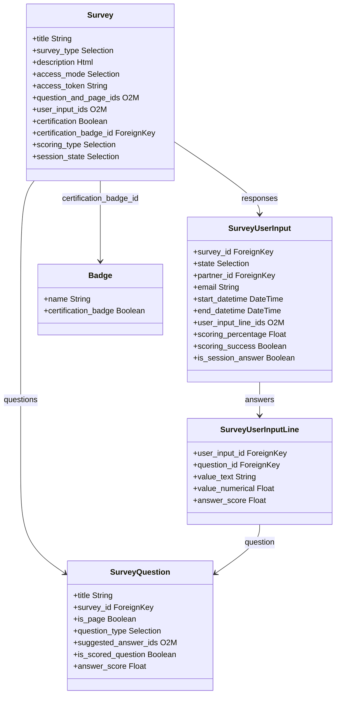

# C4 Code Level: Odoo Survey Module

<!--
  Auto-generated by the c4-code agent. One file per source directory.
  Refreshed on /banyan-c4 reruns whenever the directory's content hash changes.
  Do NOT hand-edit; edits will be overwritten on next refresh.
-->

## Generated By

- **Agent**: c4-code (Haiku)
- **Run ID**: banyan-c4-20260701-init
- **Generated**: 2026-07-01T00:00:00Z
- **Source Directory**: addons/survey
- **Content Hash**: tbd

## Overview

- **Name**: Survey Module
- **Description**: Create and manage multi-page surveys with scoring, certifications, live sessions, and CSAT integration
- **Location**: addons/survey — 31 Python files
- **Language**: Python (Odoo ORM)
- **Purpose**: Deploy surveys, collect responses, score answers, issue certifications/badges, and support live group survey sessions

## Code Elements

### Models (Core)

- **`Survey`** (`survey.survey`) — Master survey entity with pages, questions, scoring, and certification
  - **Location**: `models/survey_survey.py:16`
  - **Methods**: `_get_default_access_token()`, `default_get()`, `_compute_allowed_survey_types()`, `_compute_page_and_question_ids()`, `_compute_survey_statistic()`, `_compute_scoring_type()`, `_compute_certification()`, `_compute_session_code()`
  - **Key Fields**: `title`, `survey_type` (survey/live_session/assessment/custom), `description`, `access_mode` (public/token), `scoring_type`, `certification`, `session_state`, `user_input_ids`
  - **Visibility**: Public (trackable via `mail.thread`)
  - **Dependencies**: `survey.question`, `survey.user_input`, `gamification.badge`, `mail.thread`, `mail.activity.mixin`

- **`SurveyQuestion`** (`survey.question`) — Questions and pages within a survey
  - **Location**: `models/survey_question.py:15`
  - **Methods**: `default_get()`, `_compute_question_type()`, `_compute_is_scored_question()`, `_compute_question_ids()`, `_compute_page_id()`, `_compute_question_placeholder()`, `_compute_background_image()`
  - **Key Fields**: `title`, `description`, `question_type` (15+ types: simple_choice, multiple_choice, text_box, char_box, numerical_box, scale, date, datetime, matrix, etc.), `is_page`, `is_scored_question`, `suggested_answer_ids`, `page_id`
  - **Purpose**: Define survey structure (pages as containers, questions within pages)
  - **Dependencies**: `survey.survey`, `survey.question.answer` (via suggested_answer_ids)

- **`SurveyUserInput`** (`survey.user_input`) — Individual respondent's survey attempt/response set
  - **Location**: `models/survey_user_input.py:17`
  - **Methods**: `_compute_scoring_values()`, `_compute_scoring_success()`, `_compute_survey_time_limit_reached()`, `_compute_question_time_limit_reached()`, `_compute_attempts_info()`, `_get_session_data()`, `_fetch_from_session_question_id()`
  - **Key Fields**: `survey_id`, `state` (new/in_progress/done), `start_datetime`, `end_datetime`, `user_input_line_ids`, `scoring_percentage`, `scoring_total`, `scoring_success`, `partner_id`, `email`, `attempts_number`, `is_session_answer`
  - **Purpose**: Track individual survey attempt, responses, and scoring
  - **Dependencies**: `survey.survey`, `survey.user_input.line`, `res.partner`

- **`SurveyQuestion.Answer`** (via `suggested_answer_ids`) — Predefined answer options for choice questions
  - **Location**: `models/survey_question.py` (nested field)
  - **Purpose**: Define choices for simple_choice, multiple_choice, scale questions
  - **Key Fields**: `answer_score`, `display_sequence`

- **`SurveyUserInputLine`** (`survey.user_input.line`) — Individual answer to a survey question
  - **Location**: `models/survey_user_input.py` (via `user_input_line_ids`)
  - **Purpose**: Store respondent's answer text or selection
  - **Key Fields**: `user_input_id`, `question_id`, `answer_type`, `value_text`, `value_numerical`, `answer_score`

### Template & Management Models

- **`SurveyTemplate`** (`survey.survey.template`) — Reusable survey templates
  - **Location**: `models/survey_survey_template.py`
  - **Purpose**: Store predefined survey layouts for quick deployment
  - **Dependencies**: `survey.survey`, `survey.question`

### Gamification Integration

- **`Badge`** (`gamification.badge` extension) — Certification badges awarded on survey success
  - **Location**: `models/badge.py`
  - **Purpose**: Award gamification badges upon certification completion
  - **Dependencies**: `gamification.badge`, `survey.survey`

- **`Challenge`** (`gamification.challenge` extension) — Survey-based gamification challenges
  - **Location**: `models/challenge.py`
  - **Purpose**: Integrate survey completion into gamification challenges
  - **Dependencies**: `gamification.challenge`, `survey.survey`

### Partner & Authentication

- **`ResPartner`** (survey extension) — Track partner survey invitations and responses
  - **Location**: `models/res_partner.py`
  - **Purpose**: Store partner survey history and unsubscribe status
  - **Dependencies**: `res.partner`

- **`IrHttp`** (survey extension) — HTTP routing helpers
  - **Location**: `models/ir_http.py`
  - **Purpose**: Route survey URLs with token-based access control

### Controllers

- **`Survey`** (HTTP controller) — Main survey-facing web interface
  - **Location**: `controllers/main.py:22`
  - **Methods**:
    - `_fetch_from_access_token(survey_token, answer_token)` — Retrieve survey and user input by tokens
    - `_check_validity(survey_token, answer_token, ensure_token, check_partner)` — Validate survey access and state
    - `_get_access_data(survey_token, answer_token, ensure_token, check_partner)` — Get survey/user_input data for rendering
  - **Key Routes**: Survey form display, answer submission, results viewing
  - **Dependencies**: `survey.survey`, `survey.user_input`, `auth_signup`

- **`SurveySessionManage`** (HTTP controller) — Live session instructor interface
  - **Location**: `controllers/survey_session_manage.py`
  - **Purpose**: WebSocket/JSON routes for live session Q&A (leaderboard, text answers, chart updates)
  - **Key Routes**: Manage current question, fetch session data, track participant answers
  - **Dependencies**: `survey.survey`, `survey.user_input`

### Wizard

- **`SurveyInvite`** (`survey.invite`) — Transient wizard for bulk inviting respondents
  - **Location**: `wizard/survey_invite.py`
  - **Purpose**: Send survey invitations via email with personalized tokens
  - **Dependencies**: `survey.survey`, `res.partner`, `mail.template`

### Test Utilities

- **`common.py`** — Test base classes and fixtures
  - **Location**: `tests/common.py`
  - **Purpose**: Shared test setup for survey tests

### Test Suites

- **`test_survey.py`** — Core survey model tests
- **`test_survey_flow.py`** — End-to-end survey response flow
- **`test_survey_flow_with_conditions.py`** — Conditional questions and branching
- **`test_survey_compute_pages_questions.py`** — Page/question hierarchy tests
- **`test_survey_controller.py`** — HTTP controller and access control tests
- **`test_survey_invite.py`** — Bulk invitation and tokenization tests
- **`test_certification_flow.py`** — Certification workflow and badge issuance
- **`test_certification_badge.py`** — Badge gamification integration
- **`test_survey_randomize.py`** — Question randomization per section
- **`test_survey_results.py`** — Response aggregation and statistics
- **`test_survey_security.py`** — Token validation and access control
- **`test_survey_ui_*.py`** — Frontend rendering tests (backend, certification, feedback)
- **`test_survey_performance.py`** — Scoring and statistics computation performance

## Dependencies

### Internal (to other Odoo modules)

- **`auth_signup`** — Self-signup capability for survey respondents
- **`http_routing`** — HTTP URL routing
- **`mail`** — Email templates and thread mixins (`mail.template`, `mail.thread`, `mail.activity.mixin`)
- **`web_tour`** — Frontend tour/guidance for survey UI
- **`gamification`** — Badge and challenge management (`gamification.badge`, `gamification.challenge`)

### External (Third-Party Libraries)

- **`werkzeug`** — HTTP utilities (routing, exceptions)
- **`dateutil`** — Relative date calculations for deadlines
- **`uuid`** — Token generation for survey/response access
- **`collections`** — defaultdict for grouping operations

## Relationships

## Notes for Higher-Level Synthesis

- **Core Domain**: `Survey` and `SurveyQuestion` form the survey definition; `SurveyUserInput` + `SurveyUserInputLine` form response/scoring — consider two logical sub-components: "Survey Definition" and "Response Collection & Scoring"
- **Access Control Pattern**: Token-based access (`access_token`, `invite_token`) enables public, authenticated, and anonymous response modes — boundary code in controllers
- **Multi-Purpose Tool**: Single "survey" model supports multiple use cases (survey, assessment/quiz, certification, live session, feedback) via `survey_type` field — high complexity, consider documenting mode-specific behaviors separately
- **Scoring & Gamification**: Tightly coupled to `gamification.badge` and `gamification.challenge` — strong dependency; scoring logic is stateless (computed from predefined_question_ids)
- **Live Sessions**: `session_state`, `session_question_id`, `session_code` add real-time group survey capability — orthogonal to standard response flow, could be feature-flagged
- **Conditional Branching**: `test_survey_flow_with_conditions.py` suggests question skip/show logic — conditionals not apparent in model signatures; likely defined in survey.question via computed fields or `condition_id` FK
- **Question Type Diversity**: 15+ question_type choices suggests extensive answer handling — validation logic likely scattered across computed fields and onchange handlers
