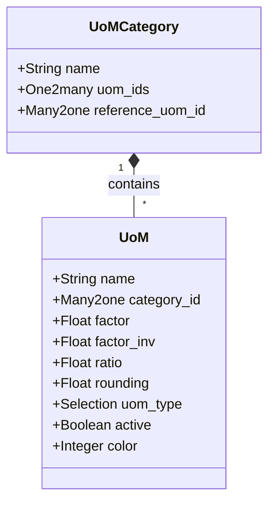

# C4 Code Level: Units of Measure (uom addon)

<!--
  Auto-generated by the c4-code agent. One file per source directory.
  Refreshed on /banyan-c4 reruns whenever the directory's content hash changes.
  Do NOT hand-edit; edits will be overwritten on next refresh.
-->

## Generated By

- **Agent**: c4-code (Haiku)
- **Run ID**: banyan-c4-20260701-init
- **Generated**: 2026-07-01T00:00:00Z
- **Source Directory**: addons/uom
- **Content Hash**: c4-code-addons-uom-init-20260701

## Overview

- **Name**: Units of Measure
- **Description**: Define and manage product units of measure with conversion factors
- **Location**: addons/uom — 7 Python files
- **Language**: Python (Odoo ORM models)
- **Purpose**: Core module for managing UoM categories and UoM conversions. Products, manufacturing, and purchasing all rely on UoM conversions to scale quantities across different measurement systems (e.g., kg ↔ lbs, hours ↔ days).

## Code Elements

### Classes / Models

- **`UoMCategory`** — Grouping for related units of measure with reference UoM enforcement
  - **Location**: `models/uom_uom.py:11`
  - **Methods**: `_onchange_uom_ids()`
  - **Key Fields**: `name`, `uom_ids`, `reference_uom_id`
  - **Constraints**: Each category must have exactly one reference UoM; all UoMs in a category convert relative to the reference
  - **Dependencies**: `uom.uom`

- **`UoM`** (Unit of Measure) — Individual unit with conversion factor and rounding precision
  - **Location**: `models/uom_uom.py:44`
  - **Methods**: 
    - `_unprotected_uom_xml_ids() → list` — List of UoMs protected from modification (`product_uom_hour`, `product_uom_dozen`)
    - `_compute_factor_inv()` — Inverse of factor (1.0 / factor)
    - `_compute_ratio()` — Normalize factor based on UoM type (reference=1, bigger=factor_inv, smaller=factor)
    - `_set_ratio()` — Set factor from ratio, converting based on UoM type
    - `_compute_color()` — Compute color index based on UoM type
    - `_onchange_uom_type()` — Force factor=1 for reference UoMs
    - `_onchange_critical_fields()` — Validate protected UoMs cannot be modified after 1 day
    - `_check_category_reference_uniqueness()` — Ensure exactly one reference UoM per category
  - **Key Fields**: 
    - `name` — Unit display name (translatable)
    - `category_id` — Belongs to UoMCategory
    - `factor` — Conversion ratio (how much bigger/smaller vs reference)
    - `factor_inv` — Inverse ratio (computed)
    - `ratio` — Combined ratio (computed, for UI)
    - `rounding` — Rounding precision (default 0.01; 1.0 for indivisible units like "piece")
    - `uom_type` — reference|bigger|smaller
    - `active` — Can be deactivated without deletion
    - `color` — Display color index
  - **SQL Constraints**: 
    - `factor_gt_zero`: factor != 0
    - `rounding_gt_zero`: rounding > 0
    - `factor_reference_is_one`: reference UoM must have factor = 1

### Functions / Methods (Top-Level)

- `_compute_factor_inv() → float`
  - **Description**: Compute inverse of conversion factor (1.0 / factor)
  - **Location**: `models/uom_uom.py:106`
  - **Visibility**: internal
  - **Dependencies**: None

- `_compute_ratio() → float`
  - **Description**: Normalize factor based on UoM type for UI display
  - **Location**: `models/uom_uom.py:111`
  - **Visibility**: internal
  - **Logic**: reference→1, bigger→factor_inv, smaller→factor

## Dependencies

### Internal

- None (pure utility module with no cross-addon dependencies within product ecosystem)

### External

- `base` — Base Odoo models (res.company, res.partner, mail tracking)
- Odoo ORM framework — models.Model, fields, api decorators

## Relationships

## Notes for Higher-Level Synthesis

- **Pure Utility**: UoM is a self-contained utility addon with no external dependencies within the product ecosystem. It is a dependency provider (product, analytic, and purchasing all depend on it).
- **Conversion Authority**: All quantity conversions in the system (product quantities, manufacturing work orders, purchasing units) go through UoM factor logic. This is a critical scaling point.
- **Protected UoMs**: Certain predefined UoMs (hour, dozen) are locked after 1 day to prevent accidental modification that could corrupt historical data.
- **Rounding Semantics**: The `rounding` field is not a UI hint—it enforces quantity granularity. A rounding of 1.0 means the unit is indivisible (e.g., "piece", "dozen"); 0.01 allows decimal quantities (e.g., kg).
- **Belongs with**: Product, Manufacturing, Purchasing (all consume UoM for quantity scaling); Timesheet (uses product_uom_hour).
