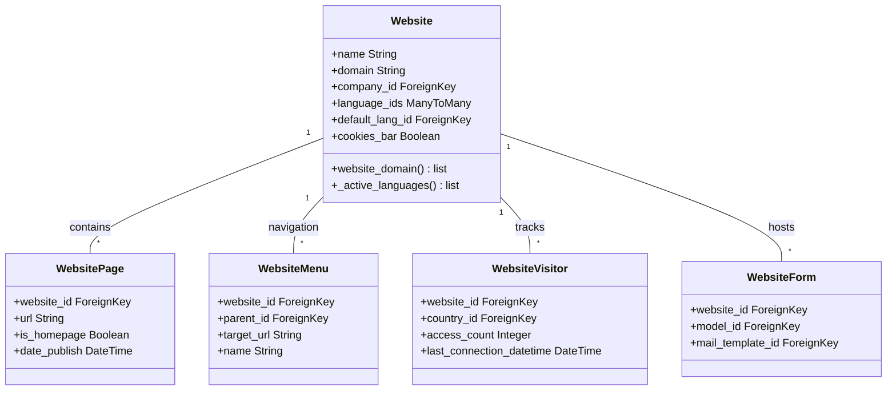

# C4 Code Level: addons/website

<!--
  Auto-generated by the c4-code agent. One file per source directory.
  Refreshed on /banyan-c4 reruns whenever the directory's content hash changes.
  Do NOT hand-edit; edits will be overwritten on next refresh.
-->

## Generated By

- **Agent**: c4-code (Haiku)
- **Run ID**: banyan-c4-20260701-init
- **Generated**: 2026-07-01T00:00:00Z
- **Source Directory**: addons/website
- **Content Hash**: f8c3e5a1b7d2e9c4

## Overview

- **Name**: Website/CMS Module
- **Description**: Multi-website support with page builder, blog, forum, eCommerce integration point, QWeb-based rendering, SEO, sitemaps, and redirect management
- **Location**: `addons/website` — 87 files, ~5200 lines
- **Language**: Python
- **Purpose**: Core Odoo website builder and CMS offering multi-website capability, page management, snippet-based content editing, visitor tracking, and content distribution

## Code Elements

### Functions / Methods

- `uninstall_hook(env)` — Cleanup hook for website module uninstallation
  - **Description**: Removes cascading records when website is uninstalled (assets, views, visitors); handles special cleanup for res.config.settings website_id field
  - **Location**: `addons/website/__init__.py:13`
  - **Visibility**: public
  - **Dependencies**: ir.asset, ir.ui.view, website, ir.model.fields

- `post_init_hook(env)` — Website initialization hook
  - **Description**: Sets up routing context on first install; loads current website and sets request.website_routing
  - **Location**: `addons/website/__init__.py:41`
  - **Visibility**: public
  - **Dependencies**: request, website

- `website_domain(website_id=False) → list` — Domain filter for website multi-tenancy
  - **Description**: Returns ORM domain filter for records belonging to a website (site-specific or global records)
  - **Location**: `addons/website/models/website.py:104`
  - **Visibility**: public
  - **Dependencies**: Self

- `_compute_domain_punycode()` — Converts domain to punycode representation
  - **Description**: Computes punycode-encoded version of domain name for internationalized domains
  - **Location**: `addons/website/models/website.py:118`
  - **Visibility**: internal
  - **Dependencies**: domain field

- `_compute_blocked_third_party_domains()` — Computes third-party domain blocklist
  - **Description**: Merges default third-party domains (Google Analytics, YouTube, etc.) with user-defined blocklist for content security
  - **Location**: `addons/website/models/website.py:142`
  - **Visibility**: internal
  - **Dependencies**: custom_blocked_third_party_domains

### Classes / Modules

- **`Website`** — Core website entity representing a website instance
  - **Location**: `addons/website/models/website.py:97`
  - **Methods**: `website_domain()`, `_active_languages()`, `_default_language()`, `_compute_domain_punycode()`, `_compute_language_count()`, `_compute_blocked_third_party_domains()`, and 30+ additional methods
  - **Inheritance**: models.Model
  - **Key Fields**: name, domain, company_id, language_ids, default_lang_id, cookies_bar, auto_redirect_lang, block_third_party_domains
  - **Dependencies**: res.lang, res.company, res.partner, ir.http, ir.attachment, ir.asset, ir.ui.view, website.page, website.menu, website.visitor

- **`WebsitePage`** — Website page entity
  - **Location**: `addons/website/models/website_page.py:1`
  - **Purpose**: Represents a published website page with URL slug, is_homepage flag, date_publish
  - **Dependencies**: ir.ui.view, website

- **`WebsiteMenu`** — Navigation menu structure
  - **Location**: `addons/website/models/website_menu.py:1`
  - **Purpose**: Hierarchical menu items for website navigation with link_id, target_url, parent_id
  - **Dependencies**: website, ir.ui.view

- **`WebsiteVisitor`** — Visitor tracking entity
  - **Location**: `addons/website/models/website_visitor.py:1`
  - **Purpose**: Anonymous visitor sessions tracking page visits, country, access count, last_connection_datetime
  - **Dependencies**: website, res.country, res.lang

- **`WebsiteForm`** — Form submission entity
  - **Location**: `addons/website/models/website_form.py:1`
  - **Purpose**: Website contact/lead form definitions with field mapping and email routing
  - **Dependencies**: website, ir.model, mail.template

- **`WebsiteRewrite`** — URL rewrite/redirect rules
  - **Location**: `addons/website/models/website_rewrite.py:1`
  - **Purpose**: SEO-friendly URL redirects with redirect_type, url_from, url_to
  - **Dependencies**: website

- **`WebsiteSnippetFilter`** — Content filtering for snippets
  - **Location**: `addons/website/models/website_snippet_filter.py:1`
  - **Purpose**: Dynamic snippet visibility based on filters (e.g., hide certain content from specific user groups)
  - **Dependencies**: website, ir.ui.view

- **`MockRequest`** — Test utility context manager
  - **Location**: `addons/website/tools.py:18`
  - **Purpose**: Creates mock HTTP request objects for testing website controllers and views
  - **Dependencies**: Mock, odoo.http, odoo.tests.common.HttpCase

### Constants / Configuration

- `DEFAULT_CDN_FILTERS` — Array of regex patterns for CDN-eligible asset paths (`addons/website/models/website.py:37`)
- `DEFAULT_WEBSITE_ENDPOINT` — IAP endpoint for website API (`https://website.api.odoo.com`, line 47)
- `DEFAULT_OLG_ENDPOINT` — OpenGraph library API endpoint (`https://olg.api.odoo.com`, line 48)
- `DEFAULT_BLOCKED_THIRD_PARTY_DOMAINS` — Newline-separated list of third-party domains (YouTube, Google, Facebook, TikTok, etc.) to block for privacy (lines 50-94)

## Dependencies

### Internal

- `addons/web` — Frontend framework, assets management, views, web_editor integration
- `addons/web_editor` — WYSIWYG editor for snippet editing
- `addons/html_editor` — HTML editing component
- `addons/http_routing` — URL routing and dispatch
- `addons/portal` — Portal mixin for frontend access control
- `addons/social_media` — Social media integration (LinkedIn, GitHub, Facebook)
- `addons/auth_signup` — User registration and signup forms
- `addons/mail` — Email and messaging (mail.template, mail.mail)
- `addons/google_recaptcha` — CAPTCHA integration for forms
- `addons/utm` — Campaign tracking parameters
- `addons/digest` — Periodic digest emails
- `base` — Core Odoo models (res.partner, res.lang, res.company, ir.model, ir.attachment, ir.ui.view)

### External

- `geoip2@^2.9.0` — IP geolocation for visitor country detection (from __manifest__.py:24)
- `lxml` — XML/HTML parsing and manipulation (etree, html modules)
- `werkzeug` — WSGI utilities (urls, exceptions.NotFound)
- `requests` — HTTP client for external API calls (IAP, OpenGraph)
- `psycopg2` — PostgreSQL adapter (database operations)
- `pytz` — Timezone support for multi-region websites
- `base64` — Image encoding for attachments

## Relationships

## Notes for Higher-Level Synthesis

- **Core website component**: This directory is the central Website/CMS module. Should logically group with website_sale, website_blog, website_forum, website_calendar modules (all extend the website base with domain-specific features).
- **Boundary code**: Controllers handle HTTP→domain translation; models implement persistence and business rules; templates (QWeb) render frontend views.
- **Multi-tenancy**: Website model is central to multi-site architecture. Mixing in website_id filters across all major models (pages, visitors, forms, menu).
- **SEO/Content Management**: website_rewrite (redirects), website_page (pages), website_menu (navigation), and sitemap generation are key for search engine optimization.
