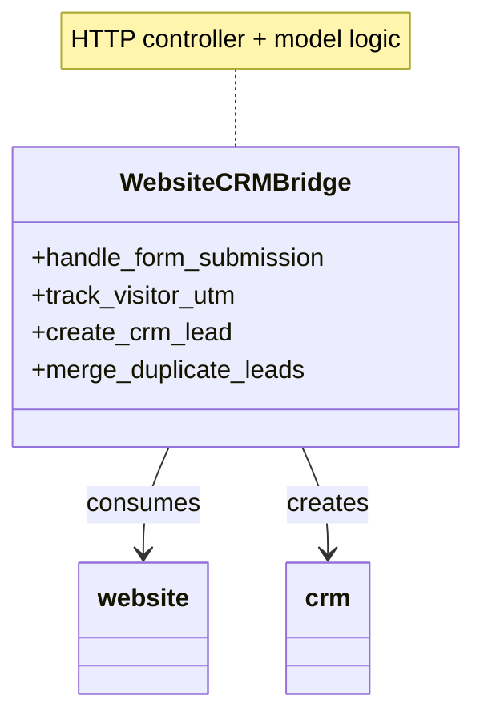

# C4 Code Level: Website CRM Contact Form Bridge

<!--
  Auto-generated by the c4-code agent. One file per source directory.
  Refreshed on /banyan-c4 reruns whenever the directory's content hash changes.
  Do NOT hand-edit; edits will be overwritten on next refresh.
-->

## Generated By

- **Agent**: c4-code (Haiku)
- **Run ID**: banyan-c4-20260701-init
- **Generated**: 2026-07-01T00:00:00Z
- **Source Directory**: addons/website_crm
- **Content Hash**: d41d8cd98f00b204e9800998ecf8427e

## Overview

- **Name**: Website CRM Contact Form Bridge
- **Description**: Bridges website forms (Contact Us, lead capture) with CRM pipeline, enabling lead creation, UTM tracking, and campaign attribution from web visits
- **Location**: addons/website_crm — 2 root files
- **Language**: Python (Odoo 18.0)
- **Purpose**: Captures web form submissions as CRM leads, tracks visitor UTM parameters and campaign attribution, validates phone/mobile fields, and merges duplicate leads from multi-source form submissions

## Code Elements

### Modules

- **`__init__.py`** — Package initialization; imports controllers and models subpackages
  - **Location**: `__init__.py:1-5`
  - **Purpose**: Makes the package importable and loads both HTTP route handlers and data models
  
- **`__manifest__.py`** — Addon metadata and dependencies
  - **Location**: `__manifest__.py:1-36`
  - **Purpose**: Declares addon name (Contact Form), version 2.1, dependencies (website, crm), data files (security, CRM lead merge templates, lead/visitor views), and WYSIWYG editor assets for form builder integration

## Dependencies

### Internal

- `controllers` (subpackage) — HTTP route handlers for form submission and lead creation
- `models` (subpackage) — CRM lead and website visitor data models, merge logic
- `website` (addon) — Website builder and form framework
- `crm` (addon) — CRM pipeline and lead management

### External

- Odoo 18.0 framework
- JavaScript editor plugins (website_crm_editor.js for WYSIWYG integration)
- Phone/mobile validation library (referenced in description but logic in models subpackage)

## Relationships

This module acts as the integration point between the public website (visitor tracking) and the internal CRM (pipeline). Form submissions trigger lead creation; visitor tracking feeds UTM context.

## Notes for Higher-Level Synthesis

- **Boundary code**: HTTP form handlers translate web submissions into CRM domain objects (lead creation)
- **Visitor tracking integration**: Captures UTM parameters and campaign context from website_visitor model
- **Lead merge logic**: Handles duplicates from multi-channel form submissions (e.g., same prospect via multiple contact forms)
- **Belongs with the CRM component**: Primary owner is CRM; secondary integration with Website
