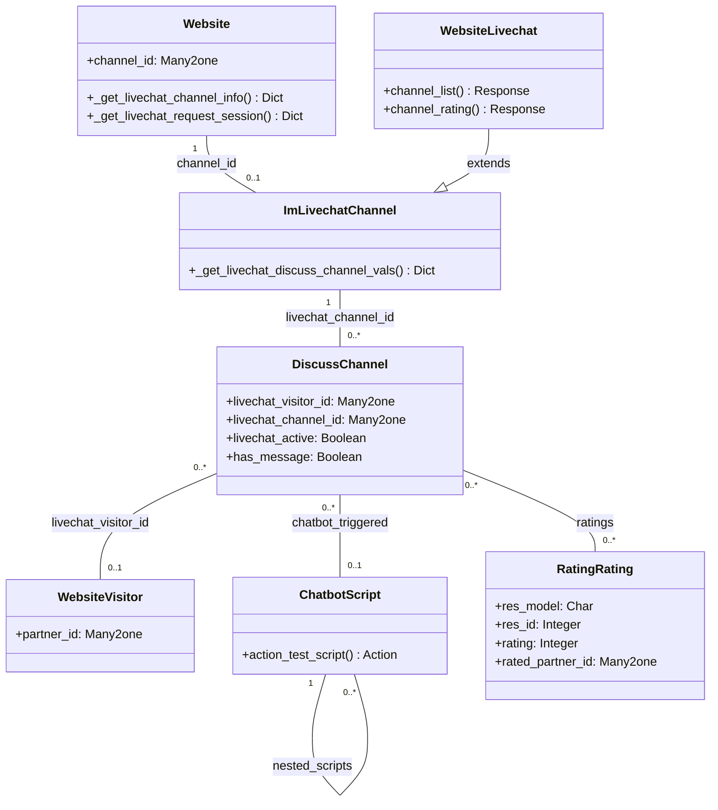

# C4 Code Level: Website Live Chat

<!--
  Auto-generated by the c4-code agent. One file per source directory.
  Refreshed on /banyan-c4 reruns whenever the directory's content hash changes.
  Do NOT hand-edit; edits will be overwritten on next refresh.
-->

## Generated By

- **Agent**: c4-code (Haiku)
- **Run ID**: banyan-c4-20260701-init
- **Generated**: 2026-07-01T00:00:00Z
- **Source Directory**: addons/website_livechat
- **Content Hash**: c7e8f2a1d3b9c4e6f1a5d2b8e4c7f0a3

## Overview

- **Name**: Website Live Chat Integration
- **Description**: Embeds im_livechat widget on website pages; routes website visitors to live chat channels with operator assignment and chatbot integration
- **Location**: addons/website_livechat — 24 files, 1270 lines
- **Language**: Python (Odoo 18.0 ORM) + JavaScript frontend
- **Purpose**: Bridge website and im_livechat; adds chatbot script automation for website visitor chat requests, operator routing, visitor tracking across channels

## Code Elements

### Classes / Models

- **`Website` (inherited)** — Website model extensions for live chat configuration
  - **Location**: `models/website.py:8`
  - **Methods**: `_get_livechat_channel_info()`, `_get_livechat_request_session()`
  - **Fields**: `channel_id` (Many2one im_livechat.channel) — which live chat channel for this website
  - **Dependencies**: im_livechat.channel, discuss.channel, website.visitor, mail.guest

- **`ImLivechatChannel` (inherited)** — Live chat channel extensions for website visitor tracking
  - **Location**: `models/im_livechat_channel.py:7`
  - **Methods**: `_get_livechat_discuss_channel_vals()` — override to link visitor and handle operator conflicts
  - **Purpose**: When visitor initiates chat, attach website.visitor record and close any pending operator-initiated chats
  - **Dependencies**: website.visitor, discuss.channel

- **`ChatbotScript` (inherited)** — Chatbot automation for website live chat
  - **Location**: `models/chatbot_script.py:7`
  - **Methods**: `action_test_script()` — render test page at `/chatbot/{id}/test`
  - **Purpose**: Allow testing chatbot responses before deploying to website
  - **Dependencies**: chatbot.script (im_livechat module)

- **`ChatbotScriptStep` (inherited)** — Step configuration in chatbot flow
  - **Location**: `models/chatbot_script_step.py`
  - **Purpose**: Define transitions, user answers, assistant responses for conversation flow
  - **Dependencies**: chatbot.script, ir.model

- **`DiscussChannel` (inherited)** — Discussion/chat channel extensions for website
  - **Location**: `models/discuss_channel.py`
  - **Methods**: Likely `_close_livechat_session()` for closing chat when visitor leaves
  - **Purpose**: Track livechat_visitor_id, livechat_active status, operator routing
  - **Dependencies**: website.visitor, im_livechat.channel

- **`WebsiteVisitor` (inherited)** — Visitor tracking extensions
  - **Location**: `models/website_visitor.py`
  - **Purpose**: Link anonymous website visitor to chat sessions
  - **Dependencies**: discuss.channel (livechat_visitor_id relation)

- **`ResConfigSettings` (inherited)** — Settings for live chat on website
  - **Location**: `models/res_config_settings.py`
  - **Purpose**: Allow admin to configure which website channel is default, routing rules
  - **Dependencies**: website, im_livechat.channel

- **`IrHttp` (inherited)** — HTTP layer extensions
  - **Location**: `models/ir_http.py`
  - **Purpose**: Inject livechat channel info into page context for website rendering
  - **Dependencies**: website model

- **`WebsiteLivechat` (controller)** — HTTP routes for public live chat UI
  - **Location**: `controllers/main.py:9`
  - **Methods**: `channel_list()`, `channel_rating()`
  - **Routes**:
    - `GET /livechat` — List all published live chat channels
    - `GET /livechat/channel/<model("im_livechat.channel"):channel>` — Channel detail with ratings (last 100, per-operator breakdown)
  - **Dependencies**: im_livechat.channel, rating.rating, discuss.channel

### Functions / API Methods

- `Website._get_livechat_channel_info() → Dict`
  - **Description**: Fetch live chat widget configuration (button text, channel name, availability) for current website
  - **Location**: `models/website.py:15`
  - **Visibility**: public (guest-accessible via @add_guest_to_context)
  - **Returns**: dict with livechat_info (available, button_text, channel_name, options)

- `Website._get_livechat_request_session() → Dict`
  - **Description**: Check if visitor has active chat request pending; return session details to auto-open chat in widget
  - **Location**: `models/website.py:29`
  - **Visibility**: internal
  - **Returns**: dict with thread_id and channel credentials for widget reconnection

- `ImLivechatChannel._get_livechat_discuss_channel_vals() → Dict|False`
  - **Description**: Prepare discuss.channel creation values; attach website visitor and close conflicting operator-initiated chats
  - **Location**: `models/im_livechat_channel.py:10`
  - **Visibility**: internal (ORM hook)
  - **Parameters**: anonymous_name (str), previous_operator_id (int), chatbot_script, user_id, country_id, lang
  - **Returns**: dict for discuss.channel.create() or False if channel cannot be created

- `ChatbotScript.action_test_script() → Dict`
  - **Description**: Open chatbot test page for manual conversation testing
  - **Location**: `models/chatbot_script.py:10`
  - **Visibility**: public (action callable from UI)
  - **Returns**: ir.actions.act_url dict pointing to /chatbot/{id}/test

- `WebsiteLivechat.channel_list() → Response`
  - **Description**: Render list of all published live chat channels for website
  - **Location**: `controllers/main.py:11`
  - **Visibility**: public (HTTP route, unauthenticated)
  - **Template**: website_livechat.channel_list_page

- `WebsiteLivechat.channel_rating() → Response`
  - **Description**: Render channel detail page with ratings histogram, per-operator stats
  - **Location**: `controllers/main.py:20`
  - **Visibility**: public (HTTP route, unauthenticated)
  - **Aggregations**: Last 100 ratings, grade distribution (great/okay/bad), per-operator percentage breakdown
  - **Template**: website_livechat.channel_rating_page

### Sub-Models (Brief)

- **`ChatbotScript`** — Conversational flow definition with trigger conditions
- **`ChatbotScriptStep`** — Individual step in chatbot conversation (answer options, next steps, keyword triggers)

## Dependencies

### Internal

- **website** — Website model inheritance; channels linked per site
- **im_livechat** — Core live chat channel, operator routing, channel member management
- **im_livechat.channel** — Live chat configuration (operators, availability hours, button settings)
- **chatbot.script** — Chatbot automation (separate module)
- **chatbot.script.step** — Chatbot step definitions
- **discuss.channel** — Chat session management (messages, members, ratings)
- **website.visitor** — Anonymous visitor tracking across sessions
- **mail.guest** — Unauthenticated guest user for chat
- **rating.rating** — Channel ratings for live chat quality feedback
- **portal** — Not directly inherited, but visitor portal access patterns

### External

- **odoo.addons.im_livechat.controllers.main.LivechatController** — Base controller for live chat routes
- **odoo.exceptions** — ValidationError, AccessError for visitor/channel mismatch
- **requests** — HTTP library for chatbot LLM calls (if using external AI)

## Relationships

## Notes for Higher-Level Synthesis

- **Boundary code**: WebsiteLivechat controller translates HTTP requests to live chat domain; _get_livechat_channel_info bridges website and im_livechat
- **Belongs with**: website, im_livechat, chatbot modules; used by crm_livechat for CRM integration
- **Visitor tracking**: Links anonymous website.visitor to discuss.channel; enables seamless chat continuation across sessions
- **Chatbot automation**: Can replace operator routing with scripted responses; allows A/B testing conversation flows
- **Portal pattern**: Visitor ratings feed public channel quality perception; ratings aggregated per operator for performance tracking
