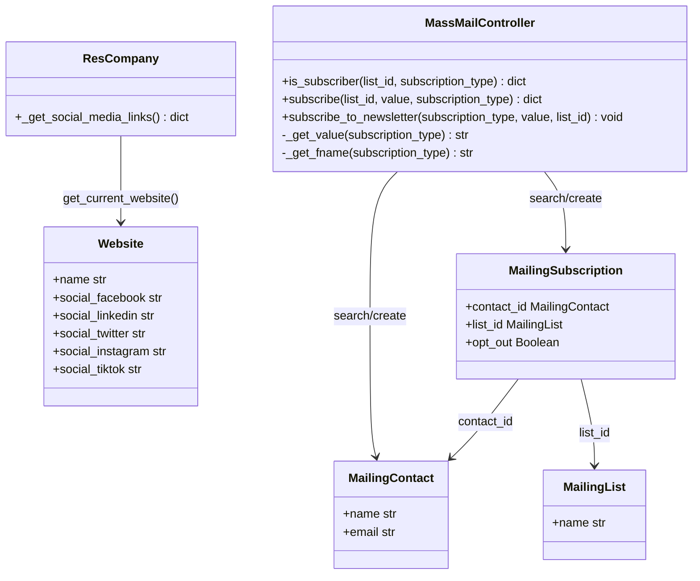

# C4 Code Level: Website Mass Mailing

<!--
  Auto-generated by the c4-code agent. One file per source directory.
  Refreshed on /banyan-c4 reruns whenever the directory's content hash changes.
  Do NOT hand-edit; edits will be overwritten on next refresh.
-->

## Generated By

- **Agent**: c4-code (Haiku)
- **Run ID**: banyan-c4-20260701-init
- **Generated**: 2026-07-01T08:46:16Z
- **Source Directory**: addons/website_mass_mailing
- **Content Hash**: sha256:a1b2c3d4e5f6a7b8c9d0e1f2a3b4c5d6

## Overview

- **Name**: Website Mass Mailing
- **Description**: Adds website newsletter subscription UI components and visitor-to-mailing-list subscription workflows
- **Location**: addons/website_mass_mailing — 9 files (core: 2 models + 1 controller, tests: 1)
- **Language**: Python 3.x (Odoo ORM + HTTP controllers)
- **Purpose**: Bridges website content with mass_mailing (Email Marketing) app; enables drop-in newsletter signup snippets and form-based subscriptions with reCAPTCHA protection

## Code Elements

### Classes / Modules

- **`MassMailController`** — Website newsletter subscription controller
  - **Location**: `controllers/main.py:9`
  - **Methods**: `is_subscriber()`, `subscribe()`, `subscribe_to_newsletter()`, `_get_value()`, `_get_fname()`
  - **Implements / Extends**: `mass_mailing.controllers.main.MassMailController`
  - **Dependencies**: `mailing.subscription`, `mailing.contact`, `mailing.list`, `ir.http`, `request.session`

- **`ResCompany`** — Extends res.company with website social media link override
  - **Location**: `models/res_company.py:7`
  - **Methods**: `_get_social_media_links()`
  - **Implements / Extends**: `res.company`
  - **Dependencies**: `website`

- **`WebsiteFormController`** — Form submission handling with mailing list subscription
  - **Location**: `controllers/website_form.py`
  - **Implements / Extends**: Implicit (website form builder integration)
  - **Dependencies**: `mailing.subscription` (implicit in form submissions)

### Functions / Methods (Key Signatures)

- `is_subscriber(list_id, subscription_type, **post) → dict`
  - **Description**: Checks if email/phone is already subscribed to a mailing list (JSON endpoint)
  - **Location**: `controllers/main.py:11`
  - **Visibility**: public (JSON HTTP route: /website_mass_mailing/is_subscriber)
  - **Dependencies**: `mailing.subscription.search_count`, `request.env.user`, `request.session`

- `subscribe(list_id, value, subscription_type, **post) → dict`
  - **Description**: Subscribes email/phone to list with reCAPTCHA verification; returns toast notification
  - **Location**: `controllers/main.py:35`
  - **Visibility**: public (JSON HTTP route: /website_mass_mailing/subscribe)
  - **Dependencies**: `ir.http._verify_request_recaptcha_token`, `subscribe_to_newsletter()`

- `subscribe_to_newsletter(subscription_type, value, list_id, fname, address_name=None) → None`
  - **Description**: Creates or updates mailing.contact and subscription record; handles email parsing
  - **Location**: `controllers/main.py:50` (static method)
  - **Visibility**: internal
  - **Dependencies**: `mailing.subscription`, `mailing.contact`, `odoo.tools.parse_contact_from_email`

- `_get_value(subscription_type) → str | None`
  - **Description**: Extracts subscriber value (email/phone) from authenticated user or session
  - **Location**: `controllers/main.py:23`
  - **Visibility**: internal
  - **Dependencies**: `request.env.user`, `request.session`

- `_get_fname(subscription_type) → str`
  - **Description**: Maps subscription type to mailing.contact field name ('email' or '')
  - **Location**: `controllers/main.py:32`
  - **Visibility**: internal
  - **Dependencies**: None (pure mapping)

- `_get_social_media_links() → dict`
  - **Description**: Overrides company social links with website-specific values
  - **Location**: `models/res_company.py:10`
  - **Visibility**: internal (inheritance hook)
  - **Dependencies**: `super()._get_social_media_links()`, `website.get_current_website()`

## Dependencies

### Internal

- **`website` addon** — Website model, current website context, website form integration
- **`mass_mailing` addon** — mailing.list, mailing.contact, mailing.subscription models
- **`google_recaptcha` addon** — reCAPTCHA token verification for spam protection

### External

- **`odoo.tools.parse_contact_from_email`** — Parses name from email (RFC 5322 format)
- **`odoo.http`** — HTTP routing and request context

## Relationships

## Notes for Higher-Level Synthesis

- **Belongs with**: `mass_mailing` component (Email Marketing app) as a website-facing UI bridge
- **Boundary layer**: `MassMailController` routes (is_subscriber, subscribe, website_form integration) are user-facing HTTP entry points for website visitors
- **Shared models**: `mailing.list` and `mailing.contact` are shared with Email Marketing backend; coordinate when refactoring contact models
- **reCAPTCHA integration**: All public subscriptions are spam-protected; failure returns danger toast
- **Session-aware**: Tracks `mass_mailing_email` / `mass_mailing_mobile` in `request.session` for persistent subscription state across page loads
- **Not pure utility**: Domain-bearing newsletter subscription workflow; part of Website Engagement / Email Marketing feature cluster
