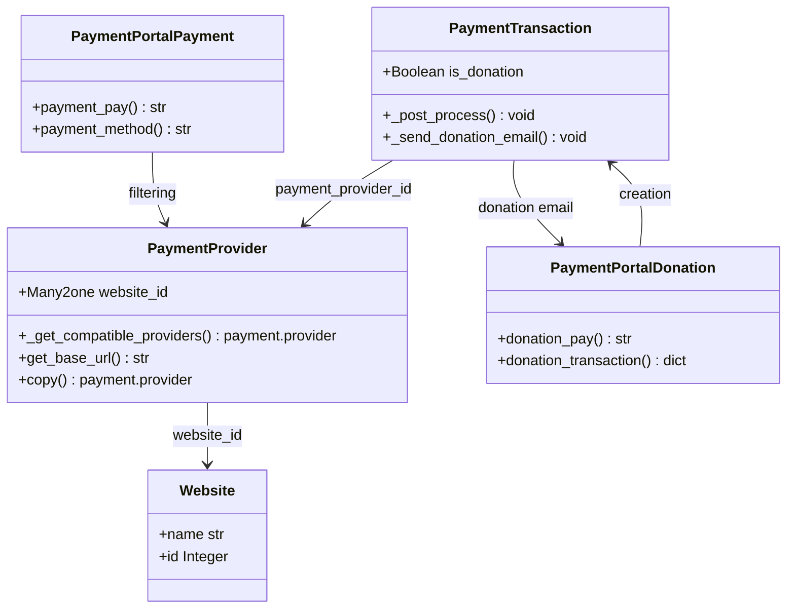

# C4 Code Level: Website Payment

<!--
  Auto-generated by the c4-code agent. One file per source directory.
  Refreshed on /banyan-c4 reruns whenever the directory's content hash changes.
  Do NOT hand-edit; edits will be overwritten on next refresh.
-->

## Generated By

- **Agent**: c4-code (Haiku)
- **Run ID**: banyan-c4-20260701-init
- **Generated**: 2026-07-01T08:46:16Z
- **Source Directory**: addons/website_payment
- **Content Hash**: sha256:d2e4f8b1c3a5d7e9f1a3c5b7d9e1f3a5

## Overview

- **Name**: Website Payment
- **Description**: Integrates multi-website payment provider selection and donation transaction handling for eCommerce portals
- **Location**: addons/website_payment — 12 files (core: 6 models + 2 controllers, tests: 2)
- **Language**: Python 3.x (Odoo ORM + HTTP controllers)
- **Purpose**: Bridges payment.provider and payment.transaction domains with website isolation; enables payment method selection per site and donation workflows with email notifications

## Code Elements

### Classes / Modules

- **`PaymentProvider`** — Extends payment.provider with website-scoped filtering
  - **Location**: `models/payment_provider.py:12`
  - **Fields**: `website_id` (Many2one, check_company=True, ondelete='restrict')
  - **Methods**: `_get_compatible_providers()`, `get_base_url()`, `copy()`
  - **Implements / Extends**: `payment.provider`
  - **Dependencies**: `website`, `payment.utils`, `payment.const.REPORT_REASONS_MAPPING`

- **`PaymentTransaction`** — Extends payment.transaction with donation flag and email workflow
  - **Location**: `models/payment_transaction.py:8`
  - **Fields**: `is_donation` (Boolean)
  - **Methods**: `_post_process()`, `_send_donation_email()`
  - **Implements / Extends**: `payment.transaction`
  - **Dependencies**: `ir.qweb`, `website_payment.mail_template_donation`, `res.company`

- **`PaymentPortal` (controllers/payment.py)** — Website-aware payment portal controller
  - **Location**: `controllers/payment.py:8`
  - **Methods**: `payment_pay()`, `payment_method()`
  - **Implements / Extends**: `account_payment.PaymentPortal`
  - **Dependencies**: `request.website`, `account_payment.PaymentPortal`

- **`PaymentPortal` (controllers/portal.py)** — Donation-specific payment handling
  - **Location**: `controllers/portal.py:14`
  - **Methods**: `donation_pay()`, `donation_transaction()`
  - **Implements / Extends**: `payment_portal.PaymentPortal`
  - **Dependencies**: `payment.utils`, `payment_portal.PaymentPortal`, `mailing.list` (implicit in partner flow)

- **`AccountPayment`** — Extends account.payment (reference model for payment link tracking)
  - **Location**: `models/account_payment.py`
  - **Implements / Extends**: `account.payment`
  - **Dependencies**: [purpose unclear from signature]

- **`ResConfigSettings`** — Configuration settings for website payment
  - **Location**: `models/res_config_settings.py`
  - **Implements / Extends**: `res.config.settings`
  - **Dependencies**: [purpose unclear from signature]

### Functions / Methods (Key Signatures)

- `_get_compatible_providers(*args, website_id=None, report=None, **kwargs) → payment.provider`
  - **Description**: Filters payment providers by website matching; overrides base method
  - **Location**: `models/payment_provider.py:22`
  - **Visibility**: public (API override)
  - **Dependencies**: `payment.utils.add_to_report`, `REPORT_REASONS_MAPPING`

- `get_base_url() → str`
  - **Description**: Returns request URL root with Punycode handling for multi-domain sites
  - **Location**: `models/payment_provider.py:49`
  - **Visibility**: public (API override)
  - **Dependencies**: `werkzeug.urls.iri_to_uri`, `request.httprequest.url_root`

- `copy(default=None) → payment.provider`
  - **Description**: Duplicates provider; clears website_id if copying for Stripe Connect onboarding
  - **Location**: `models/payment_provider.py:59`
  - **Visibility**: public (ORM override)
  - **Dependencies**: `super().copy()`, context check for stripe_connect_onboarding

- `_post_process() → None`
  - **Description**: Sends donation confirmation email for successful donation transactions
  - **Location**: `models/payment_transaction.py:13`
  - **Visibility**: internal (hook)
  - **Dependencies**: `_send_donation_email()`, `payment_id._message_log()`

- `_send_donation_email(is_internal_notification=False, comment=None, recipient_email=None) → None`
  - **Description**: Renders and sends donation confirmation/notification emails via template
  - **Location**: `models/payment_transaction.py:27`
  - **Visibility**: internal
  - **Dependencies**: `ir.qweb._render`, `mail.mail_notification_light`, `website_payment.mail_template_donation`

- `payment_pay(*args, website_id=request.website.id, **kwargs) → str`
  - **Description**: Routes to parent payment portal with current website context
  - **Location**: `controllers/payment.py:11`
  - **Visibility**: public (HTTP route)
  - **Dependencies**: `account_payment.PaymentPortal.payment_pay`

- `payment_method(website_id=request.website.id, **kwargs) → str`
  - **Description**: Routes to parent payment method selector with current website context
  - **Location**: `controllers/payment.py:16`
  - **Visibility**: public (HTTP route)
  - **Dependencies**: `account_payment.PaymentPortal.payment_method`

- `donation_pay(**kwargs) → str`
  - **Description**: Donation-specific payment form renderer; pre-fills amount, currency, donation flag
  - **Location**: `controllers/portal.py:15`
  - **Visibility**: public (HTTP route: /donation/pay)
  - **Dependencies**: `payment_portal.PaymentPortal.payment_pay`, `payment_utils.generate_access_token`

- `donation_transaction(amount, currency_id, partner_id, access_token, minimum_amount=0, **kwargs) → dict`
  - **Description**: Creates donation transaction with optional public-partner details and email notification
  - **Location**: `controllers/portal.py:37`
  - **Visibility**: public (JSON route: /donation/transaction/<minimum_amount>)
  - **Dependencies**: `request.website.user_id`, `_create_transaction()`, `payment_utils.generate_access_token`, `_update_landing_route()`

## Dependencies

### Internal

- **`website` addon** — Website model, multi-website context, site isolation
- **`account_payment` addon** — Base payment.provider and payment.transaction models
- **`payment` addon** — Payment utilities, provider compatibility logic
- **`portal` addon** — Portal controller base for user self-service pages
- **`mail` addon** — Email template rendering and delivery

### External

- **`werkzeug.urls.iri_to_uri`** — Punycode domain conversion for international domain names
- **`markupsafe.Markup`** — Safe HTML rendering in email messages
- **`json`** — Donation options serialization/deserialization
- **`odoo.tools.json.scriptsafe`** — JSON encoding safe for frontend embedding

## Relationships

## Notes for Higher-Level Synthesis

- **Belongs with**: `account_payment` component (extends payment provider/transaction models) as a website-specific bridge
- **Boundary layer**: Controllers (`payment_pay`, `payment_method`, `donation_pay`, `donation_transaction`) are HTTP entry points for portal and frontend integration
- **Shared context**: Website isolation at provider level; integrates with `website_sale` and `website` donation snippets
- **Email-driven**: Donation workflow is event-driven (`payment.transaction._post_process` hook); couples to mail templates
- **Not pure utility**: Domain-bearing payment configuration and donation processing; part of Website Sales / Payments feature cluster
