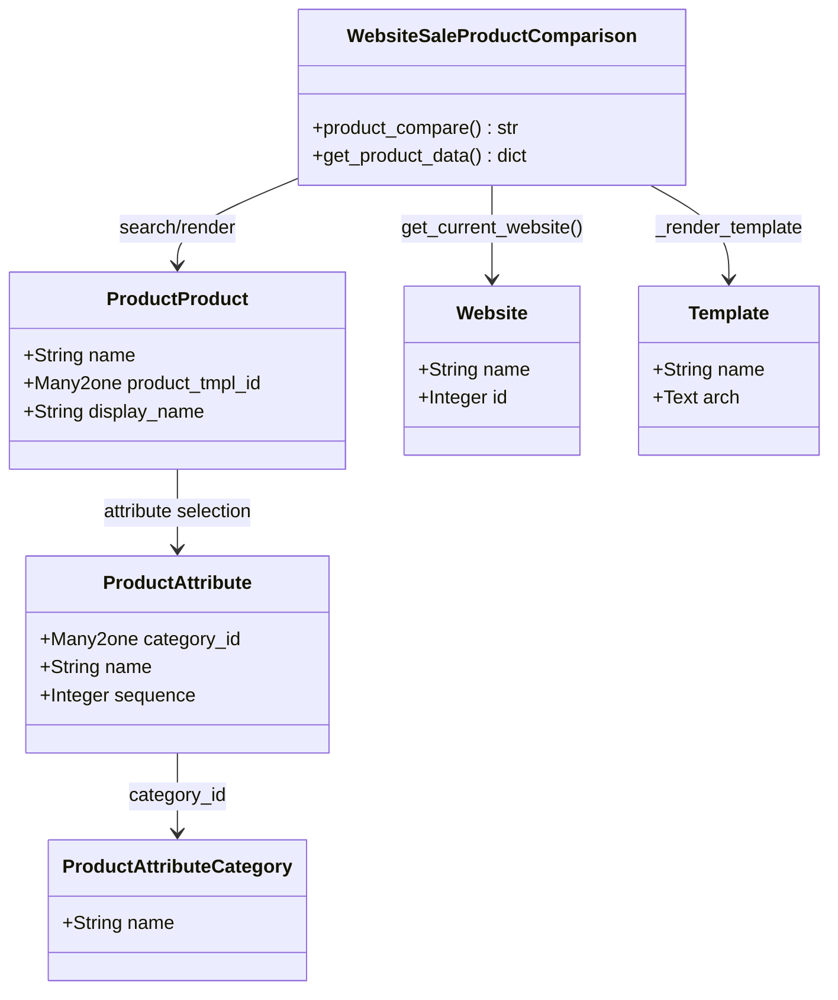

# C4 Code Level: Website Sale Comparison

<!--
  Auto-generated by the c4-code agent. One file per source directory.
  Refreshed on /banyan-c4 reruns whenever the directory's content hash changes.
  Do NOT hand-edit; edits will be overwritten on next refresh.
-->

## Generated By

- **Agent**: c4-code (Haiku)
- **Run ID**: banyan-c4-20260701-init
- **Generated**: 2026-07-01T08:46:16Z
- **Source Directory**: addons/website_sale_comparison
- **Content Hash**: sha256:f7e8d9c0b1a2c3d4e5f6a7b8c9d0e1f2

## Overview

- **Name**: Website Sale Comparison
- **Description**: Adds product attribute-based comparison table UI and session-managed product comparison lists for eCommerce
- **Location**: addons/website_sale_comparison — 11 files (core: 4 models + 1 controller, tests: 1)
- **Language**: Python 3.x (Odoo ORM + HTTP controllers)
- **Purpose**: Enables side-by-side product attribute comparison on eCommerce shop; organizes attributes by category; manages comparison list in browser session

## Code Elements

### Classes / Modules

- **`ProductAttribute`** — Extends product.attribute with eCommerce category grouping
  - **Location**: `models/product_attribute.py:6`
  - **Fields**: `category_id` (Many2one to product.attribute.category, indexed)
  - **Methods**: Implicit `_order` override
  - **Implements / Extends**: `product.attribute`
  - **Dependencies**: `product.attribute.category`

- **`ProductAttributeCategory`** — Container for attribute grouping on comparison pages
  - **Location**: `models/product_attribute_category.py`
  - **Implements / Extends**: Standalone model
  - **Dependencies**: [purpose unclear from signature]

- **`ProductProduct`** — Extends product.product (reference model for comparison data)
  - **Location**: `models/product_product.py`
  - **Implements / Extends**: `product.product`
  - **Dependencies**: [purpose unclear from signature]

- **`ProductTemplateAttributeLine`** — Extends product.template.attribute.line (reference model)
  - **Location**: `models/product_template_attribute_line.py`
  - **Implements / Extends**: `product.template.attribute.line`
  - **Dependencies**: [purpose unclear from signature]

- **`WebsiteSaleProductComparison`** — Product comparison HTTP controller
  - **Location**: `controllers/main.py:8`
  - **Methods**: `product_compare()`, `get_product_data()`
  - **Implements / Extends**: `http.Controller`
  - **Dependencies**: `product.product`, `product.attribute`, `ir.ui.view`, `website`

### Functions / Methods (Key Signatures)

- `product_compare(**post) → str`
  - **Description**: Renders side-by-side product comparison page from product IDs list
  - **Location**: `controllers/main.py:10`
  - **Visibility**: public (HTTP route: /shop/compare)
  - **Dependencies**: `product.product.search`, `request.render`, `website_sale_comparison.product_compare` template

- `get_product_data(product_ids, cookies=None) → dict`
  - **Description**: Returns rendered product cards and metadata for comparison table; manages session cookie list
  - **Location**: `controllers/main.py:25`
  - **Visibility**: public (JSON HTTP route: /shop/get_product_data)
  - **Dependencies**: `product.product.search`, `ir.ui.view._render_template`, `website_sale_comparison.product_product` template, `json.dumps`

## Dependencies

### Internal

- **`website_sale` addon** — Product, website, product attribute models; eCommerce shop routing
- **`product` addon** — product.product, product.attribute, product.template.attribute.line models
- **`website` addon** — Website context, current website retrieval, rendering templates

### External

- **`json`** — Cookie list serialization/deserialization
- **`odoo.http`** — HTTP Controller, request, route decorators

## Relationships

## Notes for Higher-Level Synthesis

- **Belongs with**: `website_sale` component (eCommerce shop integration) as a product browsing feature
- **Boundary layer**: `product_compare()` and `get_product_data()` are HTTP entry points for product comparison UI
- **Session-managed**: Product comparison list stored in browser cookies; no server-side session storage
- **Attribute-driven**: Comparison table structure determined by product.attribute categories and `display_default_code` context flag
- **Template-based**: Renders product data using `ir.ui.view._render_template` for consistent styling with shop templates
- **Not pure utility**: Domain-bearing product comparison workflow; part of eCommerce Product Browsing feature cluster
