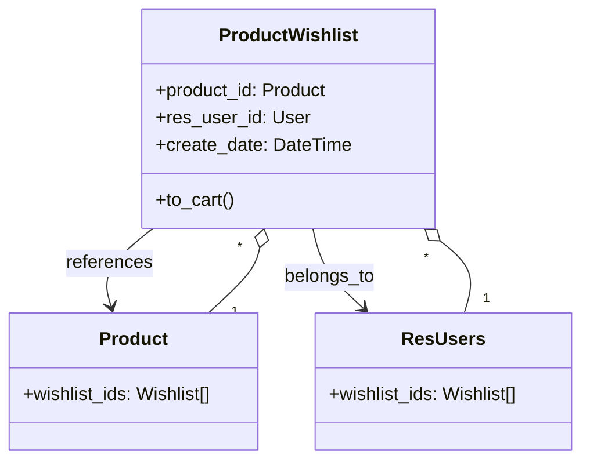

# C4 Code Level: Website eCommerce Wishlist

<!--
  Auto-generated by the c4-code agent. One file per source directory.
  Refreshed on /banyan-c4 reruns whenever the directory's content hash changes.
  Do NOT hand-edit; edits will be overwritten on next refresh.
-->

## Generated By

- **Agent**: c4-code (Haiku)
- **Run ID**: banyan-c4-20260701-init
- **Generated**: 2026-07-01T00:00:00Z
- **Source Directory**: addons/website_sale_wishlist
- **Content Hash**: d41d8cd98f00b204e9800998ecf8427e

## Overview

- **Name**: Shopper's Wishlist
- **Description**: Allows shoppers to create and maintain personalized collections of products for future purchase, with wishlist-to-cart conversion and abandoned wishlist notifications
- **Location**: addons/website_sale_wishlist — 2 root files
- **Language**: Python (Odoo 18.0)
- **Purpose**: Implements product.wishlist model as a personalization layer for eCommerce, enabling customers to save items for later, triggering reminder emails for abandoned wishlist items, and facilitating conversion to cart/sale orders

## Code Elements

### Modules

- **`__init__.py`** — Package initialization; imports models and controllers subpackages
  - **Location**: `__init__.py:1-4`
  - **Purpose**: Makes the package importable and loads wishlist data models and frontend controllers
  
- **`__manifest__.py`** — Addon metadata and frontend assets
  - **Location**: `__manifest__.py:1-28`
  - **Purpose**: Declares addon name (Shopper's Wishlist), version 1.0, dependency on website_sale, data files (security, access rules, wishlist templates/snippets), and frontend assets for wishlist UI components

## Dependencies

### Internal

- `models` (subpackage) — product.wishlist, res_users extension
- `controllers` (subpackage) — HTTP handlers for wishlist add/remove/view actions
- `website_sale` (addon) — eCommerce shop and product catalog

### External

- Odoo 18.0 framework
- Frontend JavaScript/CSS (website_sale_wishlist/static/src/*)
- Web assets for tests (website_sale_wishlist/static/tests/*)

## Relationships

Wishlist is a customer-facing personalization feature that extends the eCommerce product catalog. It stores customer-product relationships independently of the shopping cart, enabling abandoned item tracking and reminder workflows.

## Notes for Higher-Level Synthesis

- **Customer-facing feature**: Frontend controllers handle wishlist UI (add/remove/view); no backend business logic beyond CRUD
- **Personalization layer**: Extends res_users and product models to track wishlist membership
- **Abandoned item tracking**: Implies email notification flows (likely in mail module integration or separate automation)
- **Belongs with the eCommerce component**: Primary integration with website_sale; secondary with web frontend
