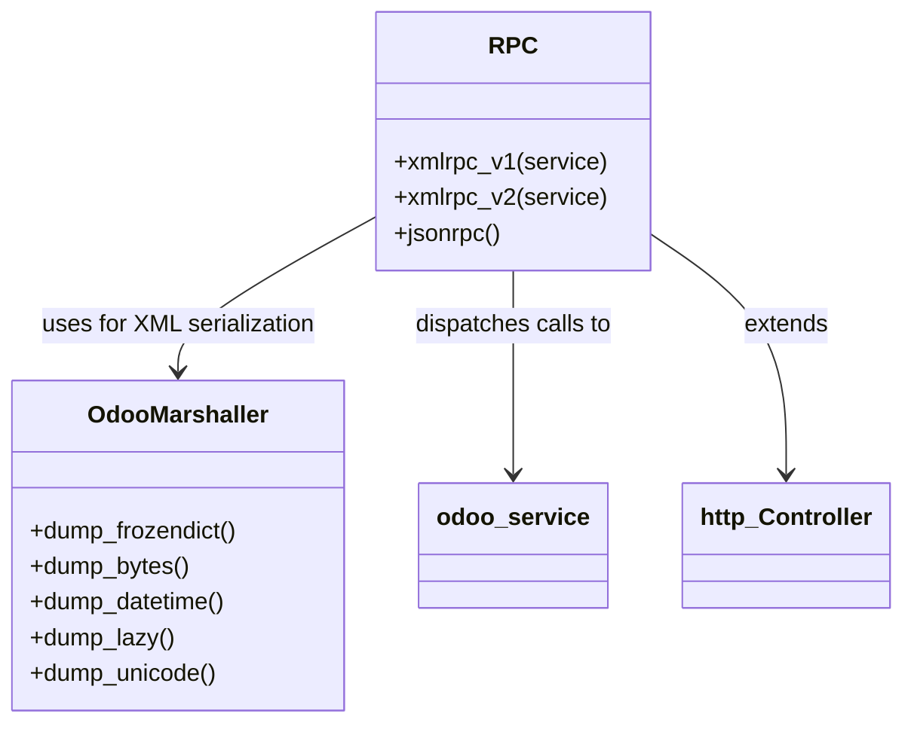

# C4 Code Level: odoo/addons/base/controllers

## Generated By

- **Agent**: c4-code (Haiku)
- **Run ID**: banyan-c4-20260701-init
- **Generated**: 2026-07-01T00:00:00Z
- **Source Directory**: odoo/addons/base/controllers/
- **Content Hash**: git-tree/banyan-c4-20260701-init

## Overview

- **Name**: Odoo Base RPC Controllers
- **Description**: HTTP boundary controllers implementing XML-RPC and JSON-RPC endpoints. Translates wire protocols to Odoo service layer calls. Handles legacy XML-RPC v1 (string fault codes), XML-RPC v2 (int fault codes), and modern JSON-RPC.
- **Location**: odoo/addons/base/controllers/ — 2 Python files (179 lines)
- **Language**: Python
- **Purpose**: Protocol boundary — maps external RPC requests to internal Odoo service dispatch

## Code Elements

### main.py

- Module entry point for controller registration (`__init__.py` imports)

### rpc.py

**Constants**
- `XMLRPC_FAULT_CODE_*` — 5 integer fault code constants for XML-RPC v2 compliance (e.g., `XMLRPC_FAULT_CODE_APPLICATION_ERROR = 1`)
- `_NON_PRINTABLE_CONTROL_CHARS` — compiled regex for sanitizing responses

**Classes**

- `OdooMarshaller(xmlrpc.client.Marshaller)` (rpc.py:71)
  - Custom XML-RPC marshaller extending stdlib Marshaller
  - 7 specialized `dump_*` methods for Odoo types: `frozendict`, `bytes`, `datetime`, `date`, `lazy`, `unicode`, `Markup`
  - Purpose: Ensures Odoo domain objects serialize correctly over XML-RPC

- `RPC(http.Controller)` (rpc.py:131)
  - HTTP boundary controller registered with Werkzeug router
  - 3 public routes:
    - `/xmlrpc/<service>` — legacy XML-RPC v1 (string fault codes)
    - `/xmlrpc/2/<service>` — compliant XML-RPC v2 (int fault codes per XML-RPC spec)
    - `/jsonrpc` — modern JSON-RPC 2.0 endpoint

**Functions**

- `xmlrpc_handle_exception_int(e)` (rpc.py:23) — Converts Odoo exceptions to integer XML-RPC faults (v2 compliant)
- `xmlrpc_handle_exception_string(e)` (rpc.py:45) — Converts Odoo exceptions to string XML-RPC faults (v1 legacy)
- `dumps(params, methodname, methodresponse, ...)` (rpc.py:90) — Wraps stdlib xmlrpc.dumps with OdooMarshaller

## Dependencies

### Internal
- `odoo.http` — Controller base class, route decorator, request context
- `odoo.exceptions` — Exception types mapped to fault codes
- `odoo.fields` — Field type references
- `odoo.tools` — Utility helpers

### External
- `xmlrpc.client` — Base marshaller and dumps function
- `markupsafe` — Markup type handling
- `datetime` — Date/time serialization
- `collections`, `re`, `sys`, `traceback` — Standard library

## Relationships

## Notes for Higher-Level Synthesis

- **Boundary code**: sole entry point for external RPC callers (Python client libs, ERPs, integrations)
- **Cross-cutting compatibility**: Maintains v1/v2 XML-RPC split for legacy client support
- **Belongs with**: `odoo/service/` (where RPC is dispatched) in a "RPC Gateway" component
- **No business logic**: thin adapter only — all logic lives in `odoo/service/model.py`
