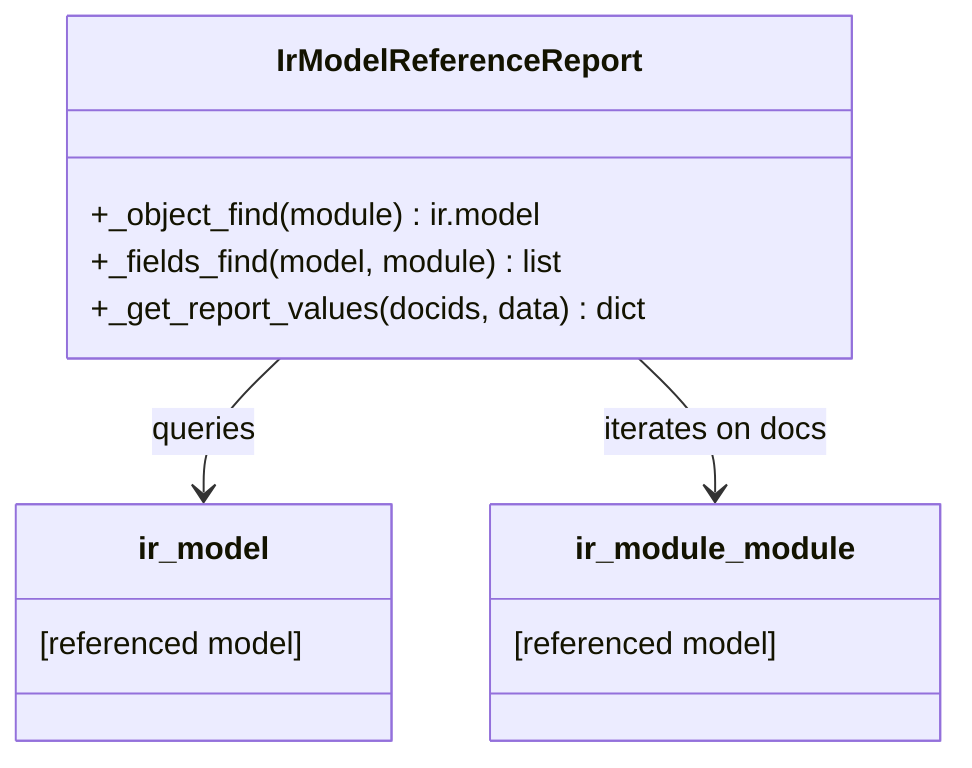

# C4 Code Level: odoo/addons/base/report

<!--
  Auto-generated by the c4-code agent. One file per source directory.
  Refreshed on /banyan-c4 reruns whenever the directory's content hash changes.
  Do NOT hand-edit; edits will be overwritten on next refresh.
-->

## Generated By

- **Agent**: c4-code (Haiku)
- **Run ID**: banyan-c4-20260701-init
- **Generated**: 2026-07-01T00:00:00Z
- **Source Directory**: odoo/addons/base/report
- **Content Hash**: a8f2c4e1d9b5f3c2e1d8a4b9c5f2e1d

## Overview

- **Name**: Base Report Templates
- **Description**: QWeb-based report definitions and controllers for Odoo 18 system documentation and reference reports
- **Location**: odoo/addons/base/report — 2 files, ~40 lines
- **Language**: Python
- **Purpose**: Provides abstract report models for generating system documentation, including the Module Reference Report for introspecting installed modules and their fields

## Code Elements

### Classes / Modules

- **`IrModelReferenceReport`** — Generates Module Reference Report via QWeb templates; introspects ir.model and ir.model.fields to emit PDF documentation
  - **Location**: `report_base_report_irmodulereference.py:7`
  - **Methods**: `_object_find(module)`, `_fields_find(model, module)`, `_get_report_values(docids, data=None)`
  - **Base Class**: `models.AbstractModel`
  - **Dependencies**: `ir.model.data`, `ir.model`, `ir.model.fields`, `ir.actions.report`

### Functions / Methods

- `_object_find(module) → ir.model`
  - **Description**: Searches ir.model.data to locate all ir.model records defined in the specified module; returns a recordset of matched models
  - **Location**: `report_base_report_irmodulereference.py:12`
  - **Visibility**: private
  - **Dependencies**: `ir.model.data`, `ir.model`

- `_fields_find(model: str, module) → list of (name, field_dict)`
  - **Description**: Retrieves all field definitions (ir.model.fields) for a given model that are part of the module; returns field metadata for report rendering
  - **Location**: `report_base_report_irmodulereference.py:18`
  - **Visibility**: private
  - **Dependencies**: `ir.model.data`, `ir.model.fields`

- `_get_report_values(docids, data=None) → dict`
  - **Description**: Report handler called by the QWeb engine; returns context dict with selected modules (docs), helper callables (findobj, findfields), and model metadata
  - **Location**: `report_base_report_irmodulereference.py:29`
  - **Visibility**: public (via @api.model)
  - **Dependencies**: `ir.actions.report`, `ir.module.module`

## Dependencies

### Internal

- `odoo/addons/base/models/ir_model.py` — Model introspection and field definitions
- `odoo/addons/base/models/ir_module.py` — Installed module registry
- `odoo/addons/base/models/ir_actions.py` — Report action definitions (QWeb engine)

### External

- None (uses only Odoo core framework: `models.AbstractModel`, `@api.model`)

## Relationships

## Notes for Higher-Level Synthesis

- **Minimal module, report-only**: Contains only one abstract model; no business logic, purely report generation
- **Belongs with system infrastructure** (reports component) — used for module documentation and admin introspection, not user-facing features
- **Pure utility** — does not depend on any domain-bearing models outside of metadata; can be isolated into a "documentation" component
