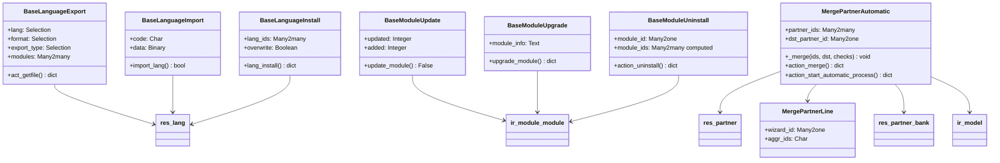

# C4 Code Level: odoo/addons/base/wizard

<!--
  Auto-generated by the c4-code agent. One file per source directory.
  Refreshed on /banyan-c4 reruns whenever the directory's content hash changes.
  Do NOT hand-edit; edits will be overwritten on next refresh.
-->

## Generated By

- **Agent**: c4-code (Haiku)
- **Run ID**: banyan-c4-20260701-init
- **Generated**: 2026-07-01T00:00:00Z
- **Source Directory**: odoo/addons/base/wizard
- **Content Hash**: f2e5c1a9d3b7e4c8f1a2d5e9c3f7b1e8

## Overview

- **Name**: Base System Wizards
- **Description**: Transient model-based wizards for system operations: language management (import/export/install), module lifecycle (update/upgrade/uninstall), and contact deduplication
- **Location**: odoo/addons/base/wizard — 8 files, ~1050 lines
- **Language**: Python
- **Purpose**: Provide interactive multi-step workflows for administrative tasks: i18n workflows, app package management, and CRM contact consolidation

## Code Elements

### Classes / Modules

- **`BaseLanguageExport`** — Export translations from installed apps or a specific model
  - **Location**: `base_export_language.py:13`
  - **Base Class**: `models.TransientModel`
  - **Methods**: `_get_languages()`, `act_getfile()`
  - **Fields**: `name`, `lang`, `format`, `export_type`, `modules`, `model_id`, `model_name`, `domain`, `data`, `state`
  - **Dependencies**: `res.lang`, `ir.module.module`, `ir.model`, `odoo.tools.translate`

- **`BaseLanguageImport`** — Import translations from uploaded CSV/PO/POT files into the system
  - **Location**: `base_import_language.py:17`
  - **Base Class**: `models.TransientModel`
  - **Methods**: `import_lang()`
  - **Fields**: `name`, `code`, `data`, `filename`, `overwrite`
  - **Dependencies**: `res.lang`, `odoo.tools.translate.TranslationImporter`, `base64`, `tempfile`

- **`BaseLanguageInstall`** — Multi-select language installer; updates translations for selected languages across all installed modules
  - **Location**: `base_language_install.py:7`
  - **Base Class**: `models.TransientModel`
  - **Methods**: `_default_lang_ids()`, `_compute_first_lang_id()`, `lang_install()`, `reload()`, `switch_lang()`
  - **Fields**: `lang_ids`, `overwrite`, `first_lang_id` (computed)
  - **Dependencies**: `res.lang`, `ir.module.module`

- **`BaseModuleUpdate`** — Scans filesystem for new/updated modules; updates module registry without triggering install/upgrade
  - **Location**: `base_module_update.py:6`
  - **Base Class**: `models.TransientModel`
  - **Methods**: `update_module()`, `action_module_open()`
  - **Fields**: `updated`, `added`, `state`
  - **Dependencies**: `ir.module.module`

- **`BaseModuleUpgrade`** — Coordinates module state transitions (to_install → installed, to_upgrade → installed); validates dependencies before upgrade
  - **Location**: `base_module_upgrade.py:9`
  - **Base Class**: `models.TransientModel`
  - **Methods**: `get_module_list()`, `_default_module_info()`, `get_view()`, `upgrade_module_cancel()`, `upgrade_module()`, `config()`
  - **Fields**: `module_info` (readonly, computed from state)
  - **Dependencies**: `ir.module.module`, `odoo.modules.registry`, `res.config`

- **`BaseModuleUninstall`** — Analyzes module dependencies and downstream impact; displays affected modules and data models before uninstall
  - **Location**: `base_module_uninstall.py:7`
  - **Base Class**: `models.TransientModel`
  - **Methods**: `_get_modules()`, `_compute_module_ids()`, `_modules_to_display()`, `_get_models()`, `_compute_model_ids()`, `_onchange_module_id()`, `action_uninstall()`
  - **Fields**: `show_all`, `module_id`, `module_ids` (computed), `model_ids` (computed)
  - **Dependencies**: `ir.module.module`, `ir.model`, `ir.model` (external IDs)

- **`MergePartnerLine`** — Transient table row for base.partner.merge.automatic.wizard; stores one candidate group for contact deduplication
  - **Location**: `base_partner_merge.py:18`
  - **Base Class**: `models.TransientModel`
  - **Fields**: `wizard_id`, `min_id`, `aggr_ids`
  - **Dependencies**: `base.partner.merge.automatic.wizard`

- **`MergePartnerAutomatic`** — Industrial-strength contact merge wizard; auto-detects duplicates, validates rules, executes multi-step consolidation
  - **Location**: `base_partner_merge.py:29`
  - **Base Class**: `models.TransientModel`
  - **Methods**: `default_get()`, `_get_fk_on()`, `_update_foreign_keys_generic()`, `_update_reference_fields_generic()`, `_update_foreign_keys()`, `_update_reference_fields()`, `_get_summable_fields()`, `_update_values()`, `_merge_bank_accounts()`, `_merge()`, `_log_merge_operation()`, `_generate_query()`, `_compute_selected_groupby()`, `_partner_use_in()`, `_get_ordered_partner()`, `_compute_models()`, `action_skip()`, `_action_next_screen()`, `_process_query()`, `action_start_manual_process()`, `action_start_automatic_process()`, `parent_migration_process_cb()`, `action_update_all_process()`, `action_merge()`
  - **Fields**: `group_by_email`, `group_by_name`, `group_by_is_company`, `group_by_vat`, `group_by_parent_id`, `state`, `number_group`, `current_line_id`, `line_ids`, `partner_ids`, `dst_partner_id`, `exclude_contact`, `exclude_journal_item`, `maximum_group`
  - **Key Dependencies**: `res.partner`, `res.partner.bank`, `ir.model`, `ir.attachment`, `mail.followers`, `mail.activity`, `mail.message`, `ir.model.data`, `calendar`, `ir.default`, `ir.model.fields`

### Functions / Methods (Summary by Class)

#### BaseLanguageExport

- `_get_languages() → list of (key, name)`
  - **Description**: Returns list of installed languages plus synthetic 'New Language' option for template export
  - **Location**: `base_export_language.py:18`
  - **Visibility**: private (model method)

- `act_getfile() → dict (ir.actions.act_window)`
  - **Description**: Generates translation file (CSV/PO/TGZ) by calling odoo.tools.translate.trans_export or trans_export_records; encodes as base64; updates wizard state to 'get' for download dialog
  - **Location**: `base_export_language.py:38`
  - **Visibility**: public (wizard button action)

#### BaseLanguageImport

- `import_lang() → bool`
  - **Description**: Decodes uploaded file, instantiates TranslationImporter, loads translations (CSV/PO), activates or creates language, optionally overwrites existing terms
  - **Location**: `base_import_language.py:31`
  - **Visibility**: public (wizard button action)

#### BaseLanguageInstall

- `_default_lang_ids() → list of lang IDs`
  - **Description**: Returns context active_ids if wizard opened from language list (for bulk install from view action); empty list otherwise
  - **Location**: `base_language_install.py:12`
  - **Visibility**: private (field default callback)

- `_compute_first_lang_id()`
  - **Description**: Extracts the first language from lang_ids for single-language mode; used to trigger UI switch-lang flow
  - **Location**: `base_language_install.py:31`
  - **Visibility**: private (computed field callback)

- `lang_install() → dict (ir.actions.act_window or ir.actions.client)`
  - **Description**: Activates selected languages, calls module._update_translations() for all installed modules with overwrite option, renders success notification or lang-switch form
  - **Location**: `base_language_install.py:36`
  - **Visibility**: public (wizard button action)

- `reload()`
  - **Description**: Client action to reload page after language installation
  - **Location**: `base_language_install.py:66`
  - **Visibility**: public

- `switch_lang() → dict (ir.actions.client tag='reload_context')`
  - **Description**: Updates user's preferred language and reloads UI context
  - **Location**: `base_language_install.py:72`
  - **Visibility**: public

#### BaseModuleUpdate

- `update_module() → False`
  - **Description**: Calls ir.module.module.update_list() to sync filesystem with registry; records count of updated and added modules; transitions state to 'done'
  - **Location**: `base_module_update.py:14`
  - **Visibility**: public

- `action_module_open() → dict (ir.actions.act_window)`
  - **Description**: Returns window action to open module.module list view (transition after update)
  - **Location**: `base_module_update.py:20`
  - **Visibility**: public

#### BaseModuleUpgrade

- `get_module_list() → ir.module.module recordset`
  - **Description**: Returns all modules in states 'to_upgrade', 'to_remove', 'to_install'; used to populate the wizard's module_info display
  - **Location**: `base_module_upgrade.py:15`
  - **Visibility**: public

- `_default_module_info() → str`
  - **Description**: Generates human-readable module list by name and state for readonly display field
  - **Location**: `base_module_upgrade.py:20`
  - **Visibility**: private

- `get_view() → dict (ORM view dict)`
  - **Description**: Customizes form view: if no modules pending, renders 'Upgrade Completed' screen with config button; otherwise standard form
  - **Location**: `base_module_upgrade.py:26`
  - **Visibility**: public (override)

- `upgrade_module_cancel() → dict (act_window_close)`
  - **Description**: Cancels pending transitions by resetting to_upgrade/to_remove back to installed, to_install back to uninstalled
  - **Location**: `base_module_upgrade.py:42`
  - **Visibility**: public

- `upgrade_module() → dict (act_window_close)`
  - **Description**: Validates unmet module dependencies via SQL, commits transaction, creates new Registry with update_module=True, resets DB cursor; blocks on dependency violations
  - **Location**: `base_module_upgrade.py:50`
  - **Visibility**: public

- `config() → dict (ir.actions.client or subaction)`
  - **Description**: Routes to res.config.next() for post-upgrade configuration wizard (e.g., company setup)
  - **Location**: `base_module_upgrade.py:73`
  - **Visibility**: public

#### BaseModuleUninstall

- `_get_modules() → ir.module.module recordset`
  - **Description**: Returns all modules that depend on the selected module (downstream_dependencies)
  - **Location**: `base_module_uninstall.py:22`
  - **Visibility**: private

- `_compute_module_ids()`
  - **Description**: Filters _get_modules() results based on show_all flag; by default shows only application-level modules (hides technical dependencies)
  - **Location**: `base_module_uninstall.py:27`
  - **Visibility**: private (computed field callback)

- `_modules_to_display(modules) → ir.module.module recordset`
  - **Description**: Default filter: returns only modules with application=True (application-level, non-technical)
  - **Location**: `base_module_uninstall.py:33`
  - **Visibility**: private

- `_get_models() → ir.model recordset`
  - **Description**: Returns all non-transient models (transient=False); used to find models that will lose definitions on module uninstall
  - **Location**: `base_module_uninstall.py:36`
  - **Visibility**: private

- `_compute_model_ids()`
  - **Description**: Identifies ir.model records whose ALL external IDs (XIDs) live in the modules being uninstalled; marks these as "lost" and will no longer exist after uninstall
  - **Location**: `base_module_uninstall.py:41`
  - **Visibility**: private (computed field callback)

- `_onchange_module_id()`
  - **Description**: Auto-enables show_all flag when selecting a technical (non-application) module, forcing full dependency tree display
  - **Location**: `base_module_uninstall.py:55`
  - **Visibility**: private

- `action_uninstall() → dict`
  - **Description**: Delegates to module_id.button_immediate_uninstall() for the actual uninstall operation
  - **Location**: `base_module_uninstall.py:61`
  - **Visibility**: public

#### MergePartnerAutomatic (Core Merge Logic)

- `_get_fk_on(table: str) → list of (table_name, column_name)`
  - **Description**: Introspects PostgreSQL schema to locate all foreign keys pointing to the given table via pg_constraint catalog
  - **Location**: `base_partner_merge.py:79`
  - **Visibility**: private
  - **Key insight**: Used to identify all related records needing re-pointing during merge

- `_update_foreign_keys_generic(model, src_records, dst_record)`
  - **Description**: Updates all many2one fields pointing to src_records to point to dst_record; handles unique constraints by skipping conflicts or deleting offending records
  - **Location**: `base_partner_merge.py:103`
  - **Visibility**: private
  - **Complexity**: Executes direct SQL UPDATE with savepoint/rollback for constraint violations

- `_update_reference_fields_generic(referenced_model, src_records, dst_record, additional_update_records=None)`
  - **Description**: Updates generic reference fields (model, res_id pairs), attachments, mail followers, activities, messages, and company-dependent m2o fallback values across the entire system
  - **Location**: `base_partner_merge.py:162`
  - **Visibility**: private
  - **Complexity**: Complex JSONB manipulation for company-dependent fields; handles cascade cleanup on constraint violations

- `_merge_bank_accounts(src_partners, dst_partner)`
  - **Description**: Consolidates bank account records; merges foreign keys/references if duplicate account numbers detected, else reassigns to destination partner
  - **Location**: `base_partner_merge.py:367`
  - **Visibility**: private

- `_merge(partner_ids, dst_partner=None, extra_checks=True)`
  - **Description**: Core merge orchestrator: validates preconditions (no parent/child, single user, email match), applies FKs/reference/value updates, merges bank accounts, logs operation, deletes sources
  - **Location**: `base_partner_merge.py:383`
  - **Visibility**: private
  - **Preconditions**: Max 3 partners, no parent-child relationships, single linked user, optional email match (Admin bypass)

- `_generate_query(fields, maximum_group=100) → str (SQL)`
  - **Description**: Constructs SELECT query to group res.partner by specified fields (email, name, vat, parent_id, is_company); applies case-insensitive/whitespace-normalized matching
  - **Location**: `base_partner_merge.py:454`
  - **Visibility**: private

- `_compute_selected_groupby() → list of field names`
  - **Description**: Scans wizard fields for group_by_* booleans; returns list of matched criteria (e.g., ['email', 'name', 'vat'])
  - **Location**: `base_partner_merge.py:498`
  - **Visibility**: private

- `_partner_use_in(aggr_ids: str, models: dict) → bool`
  - **Description**: Checks if any partner in aggr_ids is referenced by the given model/field mapping (e.g., res.users.partner_id, account.move.line.partner_id)
  - **Location**: `base_partner_merge.py:516`
  - **Visibility**: private

- `_get_ordered_partner(partner_ids) → res.partner recordset`
  - **Description**: Sorts partners by (inactive_first, create_date_desc); returns most-created, most-active partner last (merge destination)
  - **Location**: `base_partner_merge.py:527`
  - **Visibility**: private

- `_compute_models() → dict {model: field_name}`
  - **Description**: Maps exclusion criteria (exclude_contact, exclude_journal_item) to model/field pairs for filtering partner groups during merge candidate discovery
  - **Location**: `base_partner_merge.py:536`
  - **Visibility**: private

- `action_skip()`
  - **Description**: Deletes current merge line, advances wizard to next candidate
  - **Location**: `base_partner_merge.py:549`
  - **Visibility**: public

- `_action_next_screen() → dict (ir.actions.act_window)`
  - **Description**: Pops next merge line from queue, updates partner_ids/dst_partner_id/state for display; if queue empty, transitions to 'finished'
  - **Location**: `base_partner_merge.py:555`
  - **Visibility**: private

- `_process_query(query: str)`
  - **Description**: Executes raw SQL query (partner grouping), materializes line_ids, applies exclusion filters, increments number_group counter
  - **Location**: `base_partner_merge.py:589`
  - **Visibility**: private

- `action_start_manual_process()`
  - **Description**: Computes group_by criteria, generates query, processes results into merge lines, advances to first screen for manual review
  - **Location**: `base_partner_merge.py:624`
  - **Visibility**: public

- `action_start_automatic_process()`
  - **Description**: Same as manual, but automatically merges all lines without user intervention; transitions to 'finished' state
  - **Location**: `base_partner_merge.py:637`
  - **Visibility**: public

- `parent_migration_process_cb()`
  - **Description**: Specialized SQL query to fix parent-child duplicates (parent and child with same email/name); auto-merges without user review
  - **Location**: `base_partner_merge.py:661`
  - **Visibility**: private

- `action_update_all_process()`
  - **Description**: Chains parent_migration_process_cb → automatic merge by (vat, email, name); applies post-merge cleanup (is_company reset)
  - **Location**: `base_partner_merge.py:717`
  - **Visibility**: public

- `action_merge()`
  - **Description**: User-triggered merge for selected partner_ids and dst_partner_id; calls _merge(), pops current line, advances screen
  - **Location**: `base_partner_merge.py:739`
  - **Visibility**: public

## Dependencies

### Internal

- `odoo/addons/base/models/res_lang.py` — Language records, translation management
- `odoo/addons/base/models/ir_module.py` — Module state machine, lifecycle (update/install/upgrade/uninstall)
- `odoo/addons/base/models/ir_model.py` — Model registry, field definitions, external IDs
- `odoo/addons/base/models/res_partner.py` — Contact records, bank accounts, hierarchies
- `odoo/addons/base/models/res_users.py` — User-partner links, user state
- `odoo/addons/base/models/res_config.py` — Post-upgrade configuration workflows
- `odoo/addons/base/models/ir_actions.py` — Window actions, client actions, report actions
- `odoo/addons/base/models/ir_attachment.py` — Document attachments (referenced during merge)
- `odoo/addons/base/models/ir_default.py` — Company-dependent field defaults (merge logic)
- `odoo/addons/account/models/account_move_line.py` (optional, if installed) — Journal items, partner exclusion in merge
- `odoo/addons/mail/models/` (if installed) — Followers, activities, messages, merge references
- `odoo/addons/calendar/models/` (if installed) — Calendar events, merge references

### External

- `odoo.tools.translate` (core) — `trans_export`, `trans_export_records`, `TranslationImporter`; used for language export/import workflows
- `ast.literal_eval` (stdlib) — Parse stringified partner ID arrays from merge lines
- `base64` (stdlib) — Encode/decode file uploads in language export/import
- `logging` (stdlib) — Debug/info logging for merge operations
- `psycopg2` (database) — Exception handling for PostgreSQL constraint violations during FK updates
- `tempfile.TemporaryFile` (stdlib) — Temporary buffer for language file import
- `os.path.splitext` (stdlib) — Extract file extension in language import
- `itertools.chain` (stdlib) — Merge value aggregation

## Relationships

## Notes for Higher-Level Synthesis

- **Core admin wizards** — These six wizards (language + module + merge) are foundational system operations; belong together in an "Administration" or "System Workflows" component
- **Language and Module wizards** (4 classes) are **boundary code**: HTTP form dialogs that route admin intent to core models (res.lang, ir.module.module)
- **MergePartnerAutomatic** is **heavyweight logic-bearing code**: Contains complex SQL introspection, FK remapping, reference field updates, multi-table consolidation; represents a distinct "Contact Consolidation" sub-domain within admin functions
- **Merge wizard has deep dependencies** on account, mail, calendar (optional): suggests these integrations should be documented in a C4 Container diagram showing how optional addons hook into merge flow
- **Pure transient wizards**: No persistent business logic; all state lives in temporary records or is immediately persisted to target models
