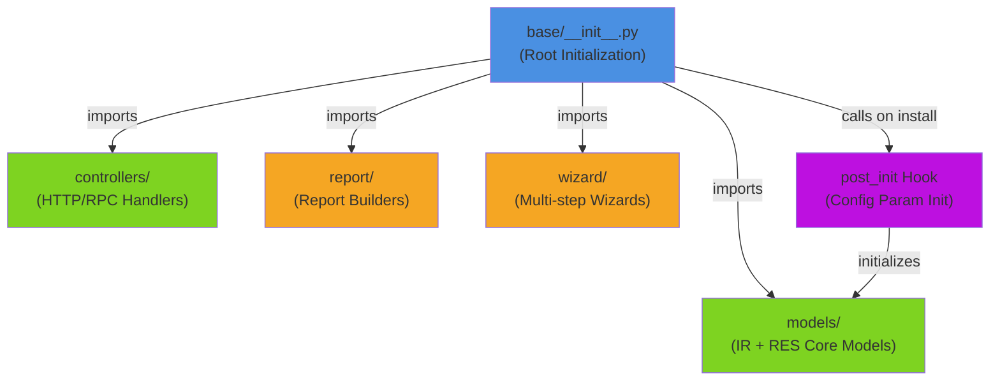

# C4 Code Level: Odoo Base Addon (Root)

<!--
  Auto-generated by the c4-code agent. One file per source directory.
  Refreshed on /banyan-c4 reruns whenever the directory's content hash changes.
  Do NOT hand-edit; edits will be overwritten on next refresh.
-->

## Generated By

- **Agent**: c4-code (Haiku)
- **Run ID**: banyan-c4-20260701-init
- **Generated**: 2026-07-01T00:00:00Z
- **Source Directory**: odoo/addons/base
- **Content Hash**: [root-level-python-files-20260701]

## Overview

- **Name**: Odoo Base Addon Root Module
- **Description**: Core initialization and configuration for Odoo's base addon — the kernel module providing fundamental models, controllers, and system infrastructure
- **Location**: `odoo/addons/base/` — 2 files (root-level), 26 lines of code
- **Language**: Python
- **Purpose**: Provides module initialization, sub-package imports (controllers, models, report, wizard), metadata declaration, and post-install hook for configuration parameter initialization

## Code Elements

### Functions / Methods

- `post_init(env: Environment) → None`
  - **Description**: Post-installation hook that reinitializes configuration parameters, forcing groups during addon setup
  - **Location**: `__init__.py:10`
  - **Visibility**: public (module-level, called by Odoo framework)
  - **Dependencies**: `ir.config_parameter` model (internal to base addon's models)

### Modules

- **`base`** (root package) — Odoo's fundamental system addon containing core models, controllers, reports, and wizards
  - **Location**: `__init__.py:1`
  - **Sub-packages imported**: `controllers`, `models`, `report`, `wizard`
  - **Initialization hook**: `post_init` (registered in manifest)
  - **Dependencies**: Odoo framework environment

### Constants / Configuration

- **Module metadata** (`__manifest__.py`) — Declares base addon properties:
  - `name`: 'Base'
  - `version`: '1.3'
  - `category`: 'Hidden'
  - `auto_install`: True (installed by default)
  - `license`: 'LGPL-3'
  - Location: `__manifest__.py:6-95`

## Dependencies

### Internal

- **`models/`** — Core IR (Infrastructure) and RES (Resources) models:
  - `ir_actions`, `ir_attachment`, `ir_autovacuum`, `ir_binary`, `ir_config_parameter`, `ir_cron`, `ir_default`, `ir_demo`, `ir_embedded_actions`, `ir_exports`, `ir_fields`, `ir_filters`, `ir_http`, `ir_logging`, `ir_mail_server`, `ir_model`, `ir_module`, `ir_profile`, `ir_qweb`, `ir_rule`, `ir_sequence`, `ir_ui_menu`, `ir_ui_view`, `ir_asset`
  - `res_bank`, `res_company`, `res_config`, `res_country`, `res_currency`, `res_device`, `res_lang`, `res_partner`, `res_users`, `res_users_deletion`, `res_users_settings`
  - Utility mixins: `avatar_mixin`, `image_mixin`, `decimal_precision`, `assetsbundle`
  - Reports: `ir_actions_report`, `report_layout`, `report_paperformat`

- **`controllers/`** — HTTP/RPC endpoint handlers:
  - `rpc` (RPC controller for API endpoints)

- **`report/`** — Report generation:
  - `report_base_report_irmodulereference` (module reference report)

- **`wizard/`** — Multi-step wizards (imported but not enumerated at root level):
  - Likely includes: module upgrade, language installation, partner merge, etc.

- **`data/`, `security/`, `views/`** — Data fixtures, access control, and UI definitions (loaded via manifest, not code imports)

### External

- **Odoo Framework** — Provides `Environment`, ORM models, decorators
  - Used for: Model definitions, controller routing, manifest hooks, field types

## Relationships

## Notes for Higher-Level Synthesis

- **Root of Core System**: This directory's root level is the entry point for the base addon. All system infrastructure (IR models, user/company management, security rules, workflows) flows through the sub-packages (models/, controllers/, report/, wizard/).
  
- **Boundary Code**: Controllers sub-package handles HTTP-to-domain translation; this root level wires up that boundary and triggers post-install configuration.

- **Policy-Bearing**: The `post_init` hook enforces that configuration parameters are reinitialized with proper group assignments during installation — a critical policy point for system setup.

- **Synthesis Hint**: The models/ sub-package should be analyzed separately at the C4-CODE level (it contains 50+ model definitions and is a major component). This root level serves as the module glue and entry point.
