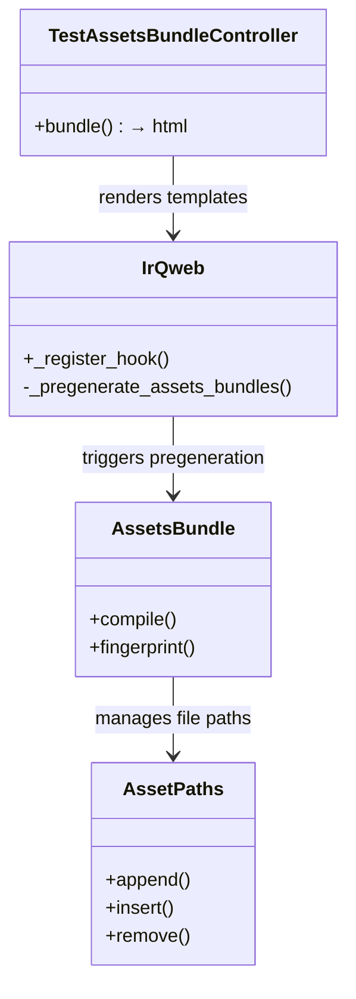

# C4 Code Level: test_assetsbundle

<!--
  Auto-generated by the c4-code agent. One file per source directory.
  Refreshed on /banyan-c4 reruns whenever the directory's content hash changes.
  Do NOT hand-edit; edits will be overwritten on next refresh.
-->

## Generated By

- **Agent**: c4-code (Haiku)
- **Run ID**: banyan-c4-20260701-init
- **Generated**: 2026-07-01T00:00:00Z
- **Source Directory**: odoo/addons/test_assetsbundle
- **Content Hash**: c3d5e7f9b1a2c4d6e8f0a1b2c3d4e5f6

## Overview

- **Name**: test_assetsbundle
- **Description**: Tests JavaScript/CSS asset bundling, minification, fingerprinting, SCSS/LESS compilation, and JS transpilation
- **Location**: odoo/addons/test_assetsbundle — 10 files, 600+ lines
- **Language**: Python
- **Purpose**: Comprehensive test suite for the assets bundle system covering path management, transpilation with Odoo module aliases, and CSS/JS error handling

## Code Elements

### Classes / Modules

- **`IrQweb`** — QWeb template extension for asset pregeneration
  - **Location**: `models/ir_qweb.py:6`
  - **Extends**: `models.AbstractModel` (_inherit = 'ir.qweb')
  - **Methods**: `_register_hook()`
  - **Dependencies**: odoo.models, odoo.tools.config

- **`TestAssetsBundleController`** — HTTP endpoint for serving bundled assets
  - **Location**: `controllers/main.py:7`
  - **Extends**: `Controller`
  - **Methods**: `bundle()`
  - **Dependencies**: odoo.http, ir.ui.view

- **`TestAddonPaths`** — Asset path list operation tests
  - **Location**: `tests/test_assetsbundle.py:32`
  - **Extends**: `TransactionCase`
  - **Methods**: `test_operations()`
  - **Dependencies**: odoo.addons.base.models.ir_asset.AssetPaths

- **`TestJsTranspiler`** — JavaScript transpilation tests
  - **Location**: `tests/test_js_transpiler.py:10`
  - **Extends**: `TransactionCase`
  - **Methods**: `test_01_alias()`, `test_02_default()`, (additional transpilation tests)
  - **Dependencies**: odoo.tools.transpile_javascript

### Functions / Methods

- `_register_hook()`
  - **Description**: Pregenerate asset bundles at module load if this test addon is installed and modules are being updated
  - **Location**: `models/ir_qweb.py:9`
  - **Visibility**: internal
  - **Dependencies**: ir.qweb._register_hook, _pregenerate_assets_bundles

- `bundle()`
  - **Description**: HTTP endpoint returning bundled test template1 as rendered HTML
  - **Location**: `controllers/main.py:8`
  - **Visibility**: public
  - **Dependencies**: ir.ui.view._render_template

- `test_operations()`
  - **Description**: Validate AssetPaths list manipulation (append, insert, remove) preserves order and deduplicates
  - **Location**: `tests/test_assetsbundle.py:33`
  - **Visibility**: public
  - **Dependencies**: ir_asset.AssetPaths

- `test_01_alias()`
  - **Description**: Verify transpiler wraps ES6 module with Odoo module alias declaration
  - **Location**: `tests/test_js_transpiler.py:13`
  - **Visibility**: public
  - **Dependencies**: transpile_javascript

- `test_02_default()`
  - **Description**: Verify transpiler handles default export flag variations (False, 0, false)
  - **Location**: `tests/test_js_transpiler.py:31`
  - **Visibility**: public
  - **Dependencies**: transpile_javascript

### Constants / Configuration

- `GETMTINE` — Alias for os.path.getmtime (used in asset modification time tracking) (`tests/test_assetsbundle.py:28`)

## Dependencies

### Internal

- `odoo.models` — AbstractModel for QWeb inheritance
- `odoo.http` — Controller and route decorators
- `odoo.tools` — config object, transpile_javascript function
- `odoo.addons.base.models` — AssetsBundle, AssetPaths, IrAsset, IrAttachment, IrQweb
- `ir.ui.view` — Template rendering
- `ir.asset` — Asset path and bundle operations

### External

- `lxml` (etree, builder) — XML/HTML parsing and construction
- `pathlib` — Path manipulation
- `base64` — Base64 encoding for asset fingerprinting
- `collections.Counter` — Frequency analysis in path tests
- `unittest.mock` — Mock, patch for asset bundle testing

## Relationships

## Notes for Higher-Level Synthesis

- Pure infrastructure/testing code — not domain-bearing
- Boundary code: HTTP endpoint (bundle()) for testing asset delivery
- Belongs with web/assets component — tests bundling system that is framework-level
- Heavy on asset path manipulation and JS transpilation testing; integration point with QWeb template engine

