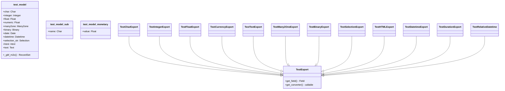

# C4 Code Level: test_converter

<!--
  Auto-generated by the c4-code agent. One file per source directory.
  Refreshed on /banyan-c4 reruns whenever the directory's content hash changes.
  Do NOT hand-edit; edits will be overwritten on next refresh.
-->

## Generated By

- **Agent**: c4-code (Haiku)
- **Run ID**: banyan-c4-20260701-init
- **Generated**: 2026-07-01T00:00:00Z
- **Source Directory**: odoo/addons/test_converter
- **Content Hash**: a3c9d8f1e6b4c7a2f9d5e8c3b1a6f4c7

## Overview

- **Name**: test_converter
- **Description**: Tests field value conversion to human-readable display format (format_value, to_display_value)
- **Location**: odoo/addons/test_converter — 6 files, ~350 lines
- **Language**: Python
- **Purpose**: Validates field conversion pipeline: Char, Integer, Float, Date, Datetime, Selection, HTML, Text, Many2one, Binary, Currency, Duration, Relative

## Code Elements

### Classes / Models

- **`test_model`** — Test fixture with all field types for converter testing
  - **Location**: `models.py:<6>`
  - **Base Class**: `odoo.models.Model`
  - **Model Name**: `test_converter.test_model`
  - **Fields**: `char`, `integer`, `float`, `numeric`, `many2one`, `binary`, `date`, `datetime`, `selection_str`, `html`, `text`
  - **Methods**: `_gbf_m2o(subs, domain)` — group_expand callback for many2one field
  - **Purpose**: Provides test data for field conversion tests

- **`test_model_sub`** — Simple child model for Many2one converter test
  - **Location**: `models.py:<37>`
  - **Base Class**: `odoo.models.Model`
  - **Model Name**: `test_converter.test_model.sub`
  - **Fields**: `name` (Char)

- **`test_model_monetary`** — Model with high-precision monetary field
  - **Location**: `models.py:<43>`
  - **Base Class**: `odoo.models.Model`
  - **Model Name**: `test_converter.monetary`
  - **Fields**: `value` (Float with digits=(16, 55))

### Functions / Methods

- `_gbf_m2o(self, subs, domain) → RecordSet`
  - **Description**: Group-expand callback for many2one field; returns all sub-records in order
  - **Location**: `models.py:<32>`
  - **Visibility**: public
  - **Dependencies**: subs._search(), subs.browse()

### Test Classes

- **`TestGBF`** — Tests group_expand (group_by_full) functionality
  - **Location**: `tests/test_gbf.py:<6>`
  - **Base Class**: `odoo.tests.common.TransactionCase`
  - **Method**: `test_group_by_full()`
  - **Purpose**: Validates many2one group_expand callback behavior in read_group

- **`TestExport`** — Base class for field conversion tests
  - **Location**: `tests/test_html.py:<14>`
  - **Base Class**: `odoo.tests.common.TransactionCase`
  - **Key Methods**: 
    - `get_field(name) → Field` — retrieves field object
    - `get_converter(name, type=None) → callable` — returns value-to-html converter function
  - **Purpose**: Shared infrastructure for all converter test cases

- **`TestCharExport`** — Tests Char field conversion (HTML escaping)
  - **Location**: `tests/test_html.py:<57>`
  - **Method**: `test_char()` — validates HTML escaping for < > characters

- **`TestIntegerExport`** — Tests Integer field conversion
  - **Location**: `tests/test_html.py:<68>`
  - **Method**: `test_integer()` — validates integer-to-string formatting

- **`TestFloatExport`** — Tests Float field conversion (locale-aware grouping)
  - **Location**: `tests/test_html.py:<76>`
  - **Methods**:
    - `test_float()` — validates thousand separator and decimal precision
    - `test_numeric()` — validates numeric type with fixed precision (2 decimals)

- **`TestCurrencyExport`** — Tests monetary field with currency formatting
  - **Location**: `tests/test_html.py:<106>`
  - **Methods**: 
    - `convert(obj, dest) → str` — converts monetary value using ir.qweb.field.monetary
    - `test_currency_post()` — tests currency symbol placed after value
    - `test_currency_pre()` — tests currency symbol placed before value
    - `test_currency_precision()` — validates precision uses currency decimal places, not field

- **`TestTextExport`** — Tests Text field conversion (newline-to-  handling)
  - **Location**: `tests/test_html.py:<167>`
  - **Method**: `test_text()` — validates newline →   and HTML escaping

- **`TestMany2OneExport`** — Tests Many2one field conversion (display_name)
  - **Location**: `tests/test_html.py:<204>`
  - **Method**: `test_many2one()` — validates HTML escaping in display_name

- **`TestBinaryExport`** — Tests Binary/Image field conversion
  - **Location**: `tests/test_html.py:<216>`
  - **Method**: `test_image()` — validates base64-to-data-uri conversion for JPEG; rejects PDF/PPTX

- **`TestSelectionExport`** — Tests Selection field conversion
  - **Location**: `tests/test_html.py:<242>`
  - **Method**: `test_selection()` — validates label rendering and HTML escaping

- **`TestHTMLExport`** — Tests HTML field conversion (pass-through)
  - **Location**: `tests/test_html.py:<249>`
  - **Method**: `test_html()` — validates HTML content is NOT escaped

- **`TestDatetimeExport`** — Tests Date/Datetime conversion (locale + timezone)
  - **Location**: `tests/test_html.py:<258>`
  - **Methods**:
    - `test_date()` — validates locale-aware date formatting (MM/DD/YYYY)
    - `test_datetime()` — validates timezone conversion (user tz: Pacific/Niue)
    - `test_custom_format()` — validates custom Babel format strings (e.g., 'MMMM d')

- **`TestDurationExport`** — Tests Duration field conversion (timedelta → human-readable)
  - **Location**: `tests/test_html.py:<297>`
  - **Methods**:
    - `test_default_unit()` — validates seconds unit
    - `test_negative()` — validates negative duration formatting
    - `test_negative_with_round()` — validates multi-unit output with rounding
    - `test_basic()` — validates hour/second unit conversion
    - `test_multiple()` — validates multi-unit expansion (1.5 hours → 1h 30m)
    - `test_negative_digital()` — validates HH:MM:SS format for negative durations

- **`TestRelativeDatetime`** — Tests Relative datetime conversion (e.g., "1 hour ago")
  - **Location**: `tests/test_html.py:<340>`
  - **Method**: `test_basic()` — validates humanized relative time in locale (fr_FR)

## Dependencies

### Internal

- None — isolated test module

### External

- `odoo.tests.common` — TransactionCase base class
- `odoo.fields` — Field type definitions
- `odoo.api` — @api.model decorator
- `odoo.tools` — html_escape, file_open, misc utilities
- `base64` — binary encoding/decoding
- `datetime` — date/time objects
- `re` — regex for whitespace normalization
- `freezegun` — time mocking

## Relationships

## Notes for Higher-Level Synthesis

- Core converter test suite — validates field → HTML rendering pipeline for all field types
- Boundary: Tests ir.qweb.field.* converter models (record_to_html, value_to_html methods)
- Belongs with web/QWeb rendering pipeline; tests front-end display contract
- Tests locale + timezone handling (user preference-aware formatting)
