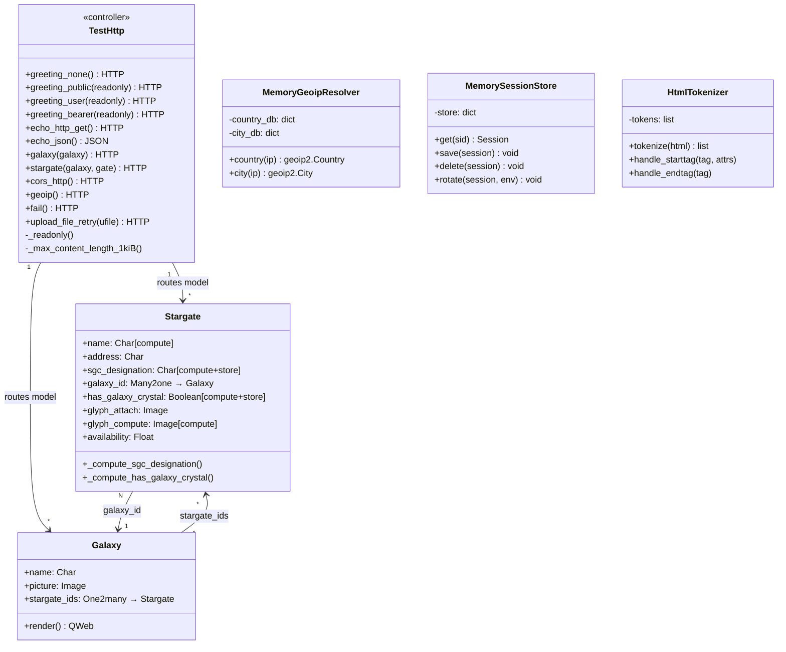

# C4 Code Level: test_http (Root)

<!--
  Auto-generated by the c4-code agent. One file per source directory.
  Refreshed on /banyan-c4 reruns whenever the directory's content hash changes.
  Do NOT hand-edit; edits will be overwritten on next refresh.
-->

## Generated By

- **Agent**: c4-code (Haiku)
- **Run ID**: banyan-c4-20260701-init
- **Generated**: 2026-07-01T00:00:00Z
- **Source Directory**: odoo/addons/test_http
- **Content Hash**: [placeholder — computed at runtime]

## Overview

- **Name**: test_http — HTTP/Werkzeug Framework Tests
- **Description**: Framework test addon for Odoo's HTTP routing, authentication, session management, CORS, static files, and error handling. Tests Werkzeug integration and request lifecycle.
- **Location**: odoo/addons/test_http — 4 files, ~700 lines (root level only; tests/ subdirectory not included)
- **Language**: Python
- **Purpose**: Provides HTTP controller endpoints and models for testing Odoo's @http.route decorator, authentication modes (none/public/user/bearer), request context, session handling, and error translation

## Code Elements

### Controllers / HTTP Endpoints

#### TestHttp (http.Controller)

- **Location**: `controllers.py:27-242`
- **Description**: Main HTTP test controller with 30+ endpoints demonstrating routing, auth modes, content types, error handling, CORS, uploads, and model routes
- **Methods** (HTTP routes):
  - **Greeting Routes** (lines 35-75):
    - `greeting_none()` → /test_http/greeting (auth='none', type='http')
    - `greeting_public(readonly)` → /test_http/greeting-public (auth='public', readonly=_readonly)
    - `greeting_user(readonly)` → /test_http/greeting-user (auth='user', readonly=_readonly)
    - `greeting_bearer(readonly)` → /test_http/greeting-bearer (auth='bearer')
    - `wsgi_environ()` → /test_http/wsgi_environ — Returns safe WSGI environ keys

  - **Echo/Reply Routes** (lines 80-110):
    - `echo_http_get(**kwargs)` → GET /test_http/echo-http-get (type='http')
    - `echo_http_post(**kwargs)` → POST /test_http/echo-http-post (csrf=False)
    - `echo_http_csrf(**kwargs)` → POST /test_http/echo-http-csrf (csrf=True)
    - `echo_http_context_lang(**kwargs)` → GET /test_http/echo-http-context-lang
    - `echo_json(**kwargs)` → POST /test_http/echo-json (type='json', csrf=False)
    - `echo_json_context(**kwargs)` → POST /test_http/echo-json-context (auth='user', readonly=True)
    - `echo_json_over_http()` → POST /test_http/echo-json-over-http — JSON via HTTP type

  - **Model Routes** (lines 115-141):
    - `galaxy(galaxy)` → /test_http/<model("test_http.galaxy"):galaxy> (auth='public', readonly=True)
    - `galaxy_set_name(galaxy, name, readonly)` → /test_http/.../setname (auth='user', max_content_length=_max_content_length_1kiB)
    - `stargate(galaxy, gate)` → /test_http/<model>/<model> — Multi-model URL parameters

  - **CORS Routes** (lines 146-156):
    - `cors_http()` → /test_http/cors_http_default (type='http', cors='*')
    - `cors_http_verbs(**kwargs)` → /test_http/cors_http_methods (methods=('GET', 'PUT'), cors='*')
    - `cors_json(**kwargs)` → /test_http/cors_json (type='json', cors='*')

  - **Database/Session Routes** (lines 161-185):
    - `ensure_db_endpoint(db)` → /test_http/ensure_db — Tests dual nodb/db setup
    - `geoip()` → /test_http/geoip — Returns GeoIP location data
    - `touch()` → /test_http/save_session — Touches session to update expiry

  - **Error Handling Routes** (lines 190-216):
    - `fail()` → /test_http/fail — Raises not_found()
    - `json_value_error()` → /test_http/json_value_error (type='json')
    - `hide_errors_decorator(error)` → /test_http/hide_errors/decorator — Uses @replace_exceptions decorator
    - `hide_errors_context_manager(error)` → /test_http/hide_errors/context-manager — Uses replace_exceptions context manager

  - **Upload & Serialization** (lines 218-242):
    - `upload_file_retry(ufile)` → POST /test_http/upload_file (csrf=False)
    - `request_attrs()` → /test_http/httprequest_attrs
    - `request_environ()` → /test_http/httprequest_environ

- **Helper Methods**:
  - `_readonly(self)` → str2bool(request.httprequest.args.get('readonly', True)) — Route parameter converter
  - `_max_content_length_1kiB(self)` → 1024 — Returns max upload size in bytes

### Models

#### Stargate (`test_http.stargate`)

- **Location**: `models.py:10-63`
- **Inherits**: mail.thread, mail.activity.mixin
- **Description**: Stargate entity with computed fields and image attachments; demonstrates stored computed fields and related images
- **Methods**:
  - `_compute_has_galaxy_crystal(self)` — Stored computed: True if galaxy == Milky Way (line 32)
  - `_compute_name(self)` — Computed name from sgc_designation if not set (line 39)
  - `_compute_sgc_designation(self)` — Generates SGC designation from galaxy + address glyphs (line 45)
  - `_compute_glyph_compute(self)` — Copies glyph_attach to glyph_compute (line 60)
- **Fields**:
  - name (Char, required, store=True, compute='_compute_name', readonly=False)
  - address (Char, required) — 6-glyph local address
  - sgc_designation (Char, store=True, computed)
  - galaxy_id (Many2one → test_http.galaxy, required)
  - has_galaxy_crystal (Boolean, store=True, computed, readonly=False)
  - glyph_attach (Image, attachment=True)
  - glyph_inline (Image, attachment=False)
  - glyph_related (Image, related='glyph_attach', max_width=128, max_height=128, store=True)
  - glyph_compute (Image, computed)
  - galaxy_picture (Image, related='galaxy_id.picture', store=False)
  - availability (Float, default=0.99, aggregator="avg")
  - last_use_date (Date)
- **SQL Constraints**: address_length — CHECK(LENGTH(address) = 6)
- **Constants**: MILKY_WAY_REGIONS, PEGASUS_REGIONS (lines 6-7)

#### Galaxy (`test_http.galaxy`)

- **Location**: `models.py:66-79`
- **Description**: Galaxy with stargates; tests image attachment and translations
- **Methods**:
  - `render(galaxy_id)` — @api.model — Renders QWeb template test_http.tmpl_galaxy (line 76)
- **Fields**:
  - name (Char, required, help='The galaxy common name.')
  - translated_name (Char, translate=True)
  - picture (Image, attachment=True, groups="base.group_user")
  - stargate_ids (One2many → test_http.stargate)

### Package Initialization

- **`__init__.py`** — Imports controllers and models
  - **Location**: `__init__.py:1-2`
  - **Imports**: from . import controllers, from . import models

### Addon Manifest

- **`__manifest__.py`** — Addon metadata
  - **Location**: `__manifest__.py:2-15`
  - **Declares**:
    - `name`: 'Test HTTP'
    - `version`: '1.0'
    - `category`: 'Hidden/Tests'
    - `depends`: ['base', 'web', 'web_tour', 'mail']
    - `installable`: True
    - `license`: 'LGPL-3'
  - **Data Files**: data.xml, ir.model.access.csv, views.xml

### Utilities

#### Utility Classes (`utils.py`)

- **MemoryGeoipResolver** (lines 32-47)
  - `__init__()` — Initializes in-memory GeoIP databases
  - `country(ip)` — Returns geoip2.models.Country for IP (raises AddressNotFoundError if not found)
  - `city(ip)` — Returns geoip2.models.City for IP
  - **Test Data**: TEST_IP_GEOIP_CITY, TEST_IP_GEOIP_COUNTRY (detailed location for 192.0.2.42 → Paris, France)

- **MemorySessionStore** (lines 49-78) — SessionStore implementation
  - `__init__()` — Initializes empty in-memory session store
  - `get(sid)` → Session — Returns existing or creates new
  - `save(session)` → None — Stores session in memory dict
  - `delete(session)` → None — Removes session
  - `delete_from_identifiers(identifiers)` → None — Removes sessions by prefix match
  - `rotate(session, env)` → None — Delegates to FilesystemSessionStore for rotation
  - `vacuum()` → None — No-op for in-memory store

- **HtmlTokenizer** (lines 81-118) — HTMLParser subclass
  - `handle_starttag(tag, attrs)` — Appends "<tag attr=value>" tokens
  - `handle_endtag(tag)` — Appends "</tag>" tokens
  - `handle_startendtag(tag, attrs)` — Appends HTML5 style tags
  - `handle_data(data)` — Appends non-whitespace data
  - `_attrs_to_str(attrs)` @classmethod — Formats attribute list
  - `tokenize(source_str)` @classmethod — Parses HTML into token list

- **Constants**:
  - TEST_IP — '192.0.2.42' (documentation-reserved IP)
  - USER_AGENT_* — Browser user agent strings (Chrome, Firefox, Android)

## Dependencies

### Internal

- `models.py` — Stargate and Galaxy models
- `controllers.py` — HTTP test routes
- `utils.py` — GeoIP/session/HTML test utilities

### External

- `odoo.http` — http.Controller, @http.route, request object
- `odoo.exceptions` — AccessError, UserError, ValidationError
- `odoo.models` — models.Model
- `odoo.fields` — Char, Text, Integer, Float, Date, Datetime, Boolean, Many2one, One2many, Image, Json
- `odoo.api` — @api.depends, @api.model
- `odoo.addons.web.controllers.utils` — ensure_db()
- `odoo.tools` — replace_exceptions, str2bool, SQL
- `werkzeug` — HTTP exceptions, framework
- `psycopg2` — PostgreSQL adapter; psycopg2.errors.SerializationFailure for retry test
- `geoip2` — GeoIP city/country databases and models
- `json` — JSON encoding/decoding
- `logging` — Logger setup

## Relationships

## Notes for Higher-Level Synthesis

- **HTTP boundary layer**: TestHttp controller is the boundary between Odoo ORM and HTTP clients — tests auth modes (none/public/user/bearer), CSRF, readonly contexts, model URL parameters, CORS headers.
- **Werkzeug integration**: Heavy use of werkzeug exceptions (@replace_exceptions), request.httprequest environ inspection, JSON/HTTP dual responses, multipart upload with retry logic (tests SerializationFailure handling).
- **Session & GeoIP infrastructure**: Utilities test session lifecycle (touch, rotate, vacuum), GeoIP location lookups, and HTML parsing for frontend test compatibility.
- **Test fixture, not domain code**: Like test_new_api, this is framework infrastructure testing — belongs with HTTP middleware and request-lifecycle layers, not business domains.
