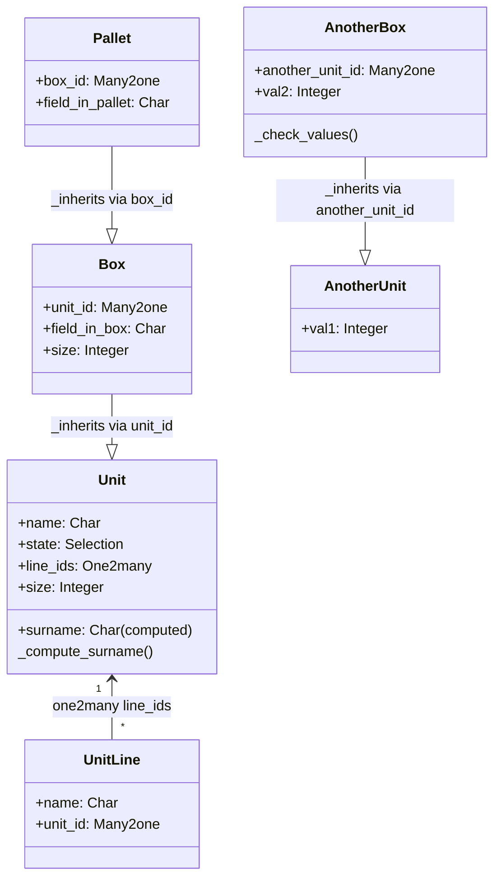

# C4 Code Level: odoo/addons/test_inherits

<!--
  Auto-generated by the c4-code agent. One file per source directory.
  Refreshed on /banyan-c4 reruns whenever the directory's content hash changes.
  Do NOT hand-edit; edits will be overwritten on next refresh.
-->

## Generated By

- **Agent**: c4-code (Haiku)
- **Run ID**: banyan-c4-20260701-init
- **Generated**: 2026-07-01T00:00:00Z
- **Source Directory**: odoo/addons/test_inherits
- **Content Hash**: 2c5a9d1e7b3f4a8c6e2d5f1a9b4c7e3d

## Overview

- **Name**: test_inherits
- **Description**: Test module for _inherits (delegation-based) inheritance
- **Location**: odoo/addons/test_inherits — 5 files, ~80 lines
- **Language**: Python
- **Purpose**: Verifies Odoo's _inherits mechanism (embedded/delegated inheritance) where child models embed parent records via Many2one fields

## Code Elements

### Classes / Modules

- **`Unit`** — Base model for delegation inheritance tests
  - **Location**: `models.py:7`
  - **Fields**: `name` (Char, required, translatable), `state` (Selection), `surname` (Computed), `line_ids` (One2many), `readonly_name` (Char, readonly), `size` (Integer)
  - **Methods**: `_compute_surname()` → depends on name field
  - **Dependencies**: odoo.models, odoo.fields, odoo.api
  - **Purpose**: Parent model to be delegated to by child models

- **`UnitLine`** — Line item model linked to Unit
  - **Location**: `models.py:24`
  - **Fields**: `name` (Char, required), `unit_id` (Many2one to Unit, required)
  - **Purpose**: Child line model demonstrating One2many relationships

- **`Box`** — First-level delegation child using _inherits
  - **Location**: `models.py:34`
  - **Fields**: `unit_id` (Many2one to Unit, required, cascade), `field_in_box` (Char), `size` (Integer redeclaration)
  - **Inheritance**: _inherits = {'test.unit': 'unit_id'}
  - **Purpose**: Tests single-level delegation inheritance; overrides size field from parent

- **`Pallet`** — Second-level delegation using _inherits
  - **Location**: `models.py:46`
  - **Fields**: `box_id` (Many2one to Box, required, cascade), `field_in_pallet` (Char)
  - **Inheritance**: _inherits = {'test.box': 'box_id'}
  - **Purpose**: Tests nested delegation chains (Pallet → Box → Unit)

- **`AnotherUnit`** — Second parent model for constraint testing
  - **Location**: `models.py:57`
  - **Fields**: `val1` (Integer, required)
  - **Purpose**: Base model for demonstrating constraint propagation in _inherits

- **`AnotherBox`** — Delegation child with constraint validation
  - **Location**: `models.py:66`
  - **Fields**: `another_unit_id` (Many2one to AnotherUnit, required, cascade), `val2` (Integer, required)
  - **Methods**: `_check_values()` → raises ValidationError if val1 != val2
  - **Inheritance**: _inherits = {'test.another_unit': 'another_unit_id'}
  - **Constraints**: Enforces val1 == val2 via @api.constrains
  - **Purpose**: Tests constraint enforcement on delegated fields from parent model

## Dependencies

### Internal

- None (isolated delegation tests)

### External

- `odoo.models` — Odoo ORM Model class
- `odoo.fields` — Field definitions (Char, Integer, Selection, One2many, Many2one, Boolean, Computed)
- `odoo.api` — Decorators (@api.depends, @api.constrains)
- `odoo.exceptions` — ValidationError for constraint violations

## Relationships

## Notes for Higher-Level Synthesis

- Delegation inheritance (\_inherits) test suite: validates embedded parent records via Many2one
- Multi-level chains: Pallet → Box → Unit demonstrates nesting
- Constraint propagation: _check_values tests that constraints on delegated parent fields work correctly
- Field shadowing: size field redeclared in Box to override parent definition
- Pure testing utility: validates _inherits mechanism and constraint behavior across delegation boundaries
