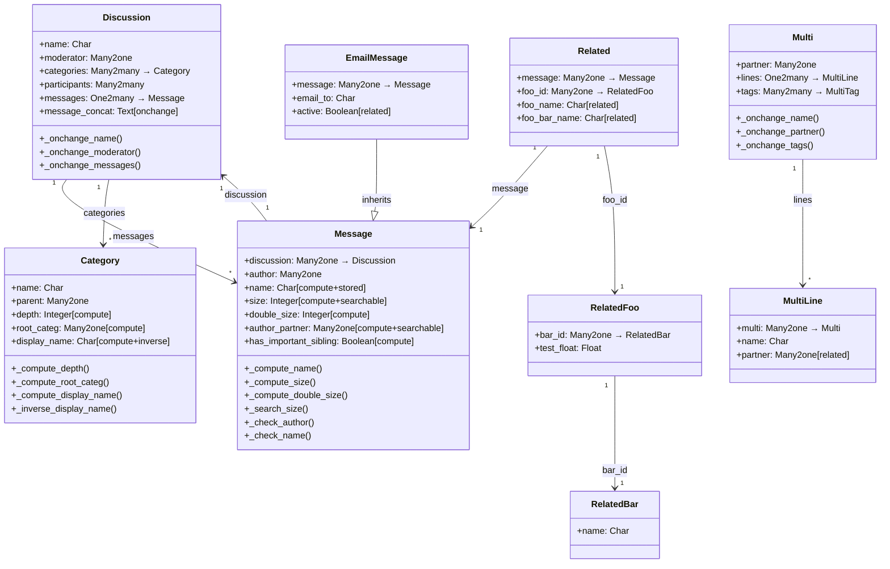

# C4 Code Level: test_new_api/models

<!--
  Auto-generated by the c4-code agent. One file per source directory.
  Refreshed on /banyan-c4 reruns whenever the directory's content hash changes.
  Do NOT hand-edit; edits will be overwritten on next refresh.
-->

## Generated By

- **Agent**: c4-code (Haiku)
- **Run ID**: banyan-c4-20260701-init
- **Generated**: 2026-07-01T00:00:00Z
- **Source Directory**: odoo/addons/test_new_api/models
- **Content Hash**: [placeholder — computed at runtime]

## Overview

- **Name**: test_new_api.models — ORM Test Models
- **Description**: Model definitions demonstrating Odoo's New API features: computed fields, stored computations, inverse functions, @depends decorators, @onchange handlers, @constrains validators, recordset operations, and relationships
- **Location**: odoo/addons/test_new_api/models — 3 files, ~600 lines
- **Language**: Python (Odoo ORM)
- **Purpose**: Provides test fixtures for ORM framework testing: computed fields, dependencies, change handlers, validation, and relational field mechanics

## Code Elements

### Classes / Models

#### Category (`test_new_api.category`)

- **Location**: `test_new_api.py:16-86`
- **Inherits**: models.Model
- **Description**: Hierarchical category model with parent-child relationships, demonstrating computed fields with recursion and inverse functions
- **Methods**:
  - `_compute_depth(self)` — Computes nesting depth from parent_path (line 60)
  - `_compute_root_categ(self)` — Walks parent chain to find root category (line 51)
  - `_compute_display_name(self)` — Recursively formats hierarchy as "Parent / Child" string (line 44)
  - `_inverse_display_name(self)` — Parses "Parent / Child" back into parent-child assignments (line 64)
  - `_search_display_name(self)` — Custom search for computed display_name field (inherited)
  - `_fetch_query(self, query, fields)` — Overrides ORM fetch to enforce access control on 'NOACCESS' records (line 80)
- **Fields**:
  - name (Char, required)
  - color (Integer)
  - parent (Many2one → self, ondelete='cascade')
  - parent_path (Char, indexed for parent_store tree structure)
  - depth (Integer, computed from parent_path)
  - root_categ (Many2one → self, computed)
  - display_name (Char, computed + inverse + search, recursive=True)
  - dummy (Char, non-stored)
  - discussions (Many2many → test_new_api.discussion)
- **Constraints**:
  - SQL: positive_color — CHECK(color >= 0)
- **Dependencies**: @api.depends('name', 'parent.display_name'), @api.depends('parent'), @api.depends('parent_path')

#### Discussion (`test_new_api.discussion`)

- **Location**: `test_new_api.py:89-136`
- **Inherits**: models.Model
- **Description**: Discusses with messages and participants, demonstrating One2many fields with custom domains and onchange cascades
- **Methods**:
  - `_domain_very_important(self)` — Returns computed domain for One2many (line 112)
  - `_onchange_name(self)` — Modifies nested messages when name matches trigger pattern (line 116)
  - `_onchange_moderator(self)` — Adds moderator to participants list on moderator change (line 130)
  - `_onchange_messages(self)` — Concatenates message bodies when messages field changes (line 134)
- **Fields**:
  - name (Char, required, help text)
  - moderator (Many2one → res.users)
  - categories (Many2many → test_new_api.category)
  - participants (Many2many → res.users, context={'active_test': False})
  - messages (One2many → test_new_api.message, copy=True)
  - message_concat (Text, populated by onchange)
  - important_messages (One2many → test_new_api.message, domain=[('important', '=', True)])
  - very_important_messages (One2many → test_new_api.message, domain=[dynamic lambda])
  - emails (One2many → test_new_api.emailmessage)
  - important_emails (One2many → test_new_api.emailmessage, domain=[('important', '=', True)])
  - history (Json, default={'delete_messages': []})
  - attributes_definition (PropertiesDefinition for message attributes)
- **Dependencies**: @api.onchange('name'), @api.onchange('moderator'), @api.onchange('messages')

#### Message (`test_new_api.message`)

- **Location**: `test_new_api.py:139-238`
- **Inherits**: models.Model
- **Description**: Discussion message with computed, stored, related, and searchable fields; demonstrates constraints on computed fields
- **Methods**:
  - `_compute_name(self)` — Stores "[Discussion] Author" format (line 177)
  - `_check_name(self)` — Validates computed name does not start with "[X]" (line 183)
  - `_compute_display_name(self)` — Computes "[Author] Discussion: Body[:80]" (line 190)
  - `_compute_size(self)` — Computes body length (line 196)
  - `_search_size(self, operator, value)` — Custom SQL search for computed size field (line 201)
  - `_compute_double_size(self)` — Computes 2x size (demonstrates dependency caching subtleties) (line 213)
  - `_compute_author_partner(self)` — Extracts partner from author.partner_id (line 226)
  - `_search_author_partner(self, operator, value)` — Model-level search for author_partner (line 231)
  - `_compute_has_important_sibling(self)` — Checks if other messages in discussion are important (line 165)
  - `_check_author(self)` — Validates author is in discussion participants (line 171)
  - `write(self, vals)` — Overrides write to force priority=5 (line 235)
- **Fields**:
  - discussion (Many2one → test_new_api.discussion, ondelete='cascade')
  - body (Text, indexed='trigram')
  - author (Many2one → res.users, default=lambda self: self.env.user)
  - name (Char, computed + stored, depends on author + discussion)
  - display_name (Char, computed, no storage)
  - size (Integer, computed + searchable via _search_size)
  - double_size (Integer, computed, depends on size)
  - discussion_name (Char, related='discussion.name', readonly=False)
  - author_partner (Many2one → res.partner, computed + searchable)
  - important (Boolean)
  - label (Char, translatable)
  - priority (Integer)
  - active (Boolean, default=True)
  - has_important_sibling (Boolean, computed)
  - attributes (Properties, definition from discussion.attributes_definition)
- **Constraints**: @api.constrains('author', 'discussion'), @api.constrains('name')
- **Dependencies**: @api.depends(...) on multiple related fields

#### EmailMessage (`test_new_api.emailmessage`)

- **Location**: `test_new_api.py:241-249`
- **Inherits**: models.Model, _inherits={'test_new_api.message': 'message'}
- **Description**: Message subclass via inheritance, demonstrating related fields with related_sudo
- **Fields**:
  - message (Many2one → test_new_api.message, required, ondelete='cascade')
  - email_to (Char)
  - active (Boolean, related='message.active', store=True, related_sudo=False)

#### DiscussionPartner (`test_new_api.partner`)

- **Location**: `test_new_api.py:252-261`
- **Description**: Simplified partner model for testing (avoids overrides from full res.partner)
- **Fields**: name (Char)

#### Multi (`test_new_api.multi`)

- **Location**: `test_new_api.py:264-290`
- **Description**: Demonstrates multiple onchange handlers in cascade modifying One2many fields
- **Methods**:
  - `_onchange_name(self)` — Updates all lines' names (line 277)
  - `_onchange_partner(self)` — Updates all lines' partners (line 282)
  - `_onchange_tags(self)` — Adds tags to all lines (line 287)
- **Fields**:
  - name (Char, related='partner.name', readonly=True)
  - partner (Many2one → res.partner)
  - lines (One2many → test_new_api.multi.line)
  - partners (One2many related='partner.child_ids')
  - tags (Many2many → test_new_api.multi.tag, domain=[...])

#### MultiLine (`test_new_api.multi.line`)

- **Location**: `test_new_api.py:293-299`
- **Fields**:
  - multi (Many2one → test_new_api.multi, ondelete='cascade')
  - name (Char)
  - partner (Many2one, related='multi.partner', store=True)

#### MultiLine2 (`test_new_api.multi.line2`)

- **Location**: `test_new_api.py:303-306`
- **Inherits**: test_new_api.multi.line
- **Description**: Child model for testing inheritance

#### MultiTag (`test_new_api.multi.tag`)

- **Location**: `test_new_api.py:309-322`
- **Methods**:
  - `_compute_display_name(self)` — Appends "!" if context has 'special_tag' flag (line 315)
- **Fields**: name (Char)
- **Dependencies**: @api.depends('name'), @api.depends_context('special_tag')

#### Edition (`test_new_api.creativework.edition`)

- **Location**: `test_new_api.py:325-333`
- **Fields**:
  - name (Char)
  - res_id (Integer, required)
  - res_model_id (Many2one → ir.model, required, ondelete='cascade')
  - res_model (Char, related='res_model_id.model', store=True, readonly=False)

#### Book (`test_new_api.creativework.book`) & Movie (`test_new_api.creativework.movie`)

- **Locations**: `test_new_api.py:335-352`
- **Description**: Creative works with polymorphic editions (use res_model domain to filter editions for specific model)
- **Fields**:
  - name (Char)
  - editions (One2many, domain=[('res_model', '=', _name)])

#### MixedModel (`test_new_api.mixed`)

- **Location**: `test_new_api.py:355-395`
- **Description**: Comprehensive field type test: Char, Text, Boolean, Integer, Float, Date, Datetime, Selection, Reference, Html, Monetary
- **Methods**:
  - `_compute_now(self)` — Non-stored computed without dependencies (line 380)
  - `_get_lang(self)` — Returns installed languages for Selection (line 386)
  - `_reference_models(self)` — Returns selectable models for Reference field (line 390)
- **Fields**:
  - foo (Char)
  - text (Text)
  - truth (Boolean)
  - count (Integer)
  - number (Float, digits=(10, 2), default=3.14)
  - number2 (Float, digits='New API Precision')
  - date (Date)
  - moment (Datetime)
  - now (Datetime, computed)
  - lang (Selection, selection='_get_lang')
  - reference (Reference, selection='_reference_models')
  - comment1-5 (Html, various sanitization options)
  - currency_id (Many2one → res.currency)
  - amount (Monetary)

#### BoolModel (`domain.bool`)

- **Location**: `test_new_api.py:397-403`
- **Description**: Tests Boolean field domain behavior
- **Fields**: bool_true, bool_false, bool_undefined (Boolean)

#### Foo (`test_new_api.foo`) & Bar (`test_new_api.bar`)

- **Locations**: `test_new_api.py:406-435`
- **Description**: Tests computed fields with search customization
- **Bar Methods**:
  - `_compute_foo(self)` — Computes foo from name search (line 427)
  - `_search_foo(self, operator, value)` — Custom search for computed foo (line 432)
- **Bar Fields**:
  - foo (Many2one → test_new_api.foo, computed + searchable)
  - value1, value2 (Integer, related to foo)
  - text1, text2 (Char, related to foo, different trim settings)

#### Related (`test_new_api.related`) & Related Chain Models

- **Locations**: `test_new_api.py:438-481`
- **Description**: Extensive related field testing: single-hop, multi-hop, related-on-related, related_sudo
- **Fields**:
  - related_name (Char, related='name', readonly=False)
  - related_related_name (Char, related='related_name', readonly=False — 2-hop)
  - message_name (Text, related='message.body', related_sudo=False)
  - foo_name (Char, related='foo_id.name', related_sudo=False)
  - foo_bar_name (Char, related='foo_id.bar_id.name', related_sudo=False — 2-hop)
  - foo_bar_sudo_id_name (Char, related='foo_bar_sudo_id.name', related_sudo=False with sudo intermediate)
  - foo_float_id (Float, related='foo_id.test_float')

#### ComputeReadonly (`test_new_api.compute.readonly`)

- **Location**: `test_new_api.py:491-499` (truncated)
- **Description**: Computed readonly field test
- **Fields**:
  - foo (Char, default='')
  - bar (Char, computed + stored, depends='foo')

### Package Initialization

- **`__init__.py`** — Imports both test model modules
  - **Location**: `__init__.py:4-5`
  - **Imports**: from . import test_new_api, from . import test_unity_read

## Dependencies

### Internal

- `test_new_api.py` — Main model definitions
- `test_unity_read.py` — Subpackage of Course, Lesson, Person, Employer, PersonAccount models

### External

- `odoo.api` — Decorators: @depends, @depends_context, @onchange, @constrains, @model
- `odoo.fields` — All field types: Char, Text, Boolean, Integer, Float, Date, Datetime, Html, Monetary, Selection, Reference, Many2one, One2many, Many2many, Properties, PropertiesDefinition, Image, Json
- `odoo.models` — Base Model class
- `odoo.exceptions` — AccessError, ValidationError
- `odoo.tools.SQL` — Raw SQL query building
- `odoo.tools.float_utils` — float_round utility
- `odoo.tools.translate` — html_translate decorator
- `logging` — Logger setup

## Relationships

## Notes for Higher-Level Synthesis

- **ORM feature testing**: This module is a comprehensive test fixture for Odoo's New API ORM features — not a user-facing domain component. Belongs with framework infrastructure, not business domains.
- **Demonstrates computed field subtleties**: Heavy use of @api.depends, stored vs. non-stored computed fields, inverse functions, custom search methods, and dependency invalidation. Valuable reference for understanding Odoo's computation/caching model.
- **Constraint & validation patterns**: Shows @api.constrains on both normal and computed fields, including validation of related data (e.g., author must be in participants).
- **Related field complexity**: Extensive testing of single-hop, multi-hop, and related-on-related fields with related_sudo flags — important for understanding Odoo's data access model in traversals.
