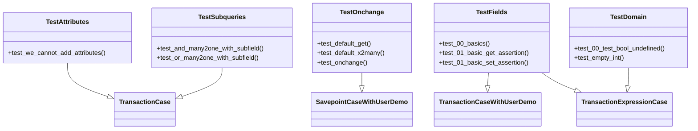

# C4 Code Level: Odoo test_new_api Tests

<!--
  Auto-generated by the c4-code agent. One file per source directory.
  Refreshed on /banyan-c4 reruns whenever the directory's content hash changes.
  Do NOT hand-edit; edits will be overwritten on next refresh.
-->

## Generated By

- **Agent**: c4-code (Haiku)
- **Run ID**: banyan-c4-20260701-init
- **Generated**: 2026-07-01T00:00:00Z
- **Source Directory**: `odoo/addons/test_new_api/tests`
- **Content Hash**: odoo-addons-test_new_api-tests

## Overview

- **Name**: ORM New-API Test Suite
- **Description**: Comprehensive test cases exercising Odoo's new ORM API features: computed fields, decorators (@depends, @onchange, @constrains), SQL constraints, prefetching, CRUD operations, domain expressions, and recordset operations.
- **Location**: `odoo/addons/test_new_api/tests` — 21 test modules, ~3500 lines
- **Language**: Python
- **Purpose**: Regression and feature testing for the ORM new-API surface, including field decorators, domain expression evaluation, UI/web integration, and translation handling.

## Code Elements

### Test Classes (Primary)

- **`TestAttributes`** — Validates attribute access restrictions on ORM records
  - **Location**: `test_attributes.py:5`
  - **Methods**: `test_we_cannot_add_attributes()`
  - **Dependencies**: `odoo.tests.common.TransactionCase`, `test_new_api` models

- **`TestOnchange`** — Tests onchange decorator and default_get behavior
  - **Location**: `test_onchange.py:17`
  - **Methods**: `test_default_get()`, `test_default_x2many()`, `test_get_field()`, `test_onchange()`, ...
  - **Dependencies**: `odoo.addons.base.tests.common.SavepointCaseWithUserDemo`, `odoo.tests.Form`, `test_new_api` models

- **`TestFields`** — Comprehensive field type testing (Char, Integer, Float, Many2one, One2many, Json, etc.)
  - **Location**: `test_new_fields.py:27`
  - **Methods**: `test_00_basics()`, `test_01_basic_get_assertion()`, `test_01_basic_set_assertion()`, `test_field_create_during_write()`, ...
  - **Implements / Extends**: `TransactionCaseWithUserDemo`, `TransactionExpressionCase`
  - **Dependencies**: `odoo.fields.Command`, `PIL.Image`, `odoo.tools.date_utils`, `odoo.exceptions` (AccessError, MissingError, UserError, ValidationError)

- **`TestSubqueries`** — Tests ORM subquery generation for relational field searches
  - **Location**: `test_search.py:7`
  - **Methods**: `test_and_many2one_with_subfield()`, `test_or_many2one_with_subfield()`, `test_not_and_many2one_with_subfield()`, ...
  - **Dependencies**: `odoo.tests.TransactionCase`, `odoo.fields.Command`

- **`TestDomain`** — Tests domain expression evaluation and boolean/integer field behavior
  - **Location**: `test_domain.py:8`
  - **Methods**: `test_00_test_bool_undefined()`, `test_empty_int()`, ...
  - **Implements / Extends**: `TransactionExpressionCase`
  - **Dependencies**: `odoo.tools.SQL`, `odoo.Command`

- **`TestMany2many`** — Tests many2many field relationships and commands
  - **Location**: `test_many2many.py` (starts ~line 1)
  - **Dependencies**: `test_new_api` models with many2many fields

- **`TestOne2many`** — Tests one2many field behavior, ondelete cascades, and related fields
  - **Location**: `test_one2many.py` (starts ~line 1)
  - **Dependencies**: `test_new_api` models with one2many fields

- **`TestProperties`** — Tests field property decorator and property field types
  - **Location**: `test_properties.py` (starts ~line 1)
  - **Dependencies**: property-decorated fields in test models

- **`TestJsonField`** — Tests JSON field serialization, defaults, and validation
  - **Location**: `test_json_field.py` (starts ~line 1)
  - **Dependencies**: `json` module, `test_new_api` models with `fields.Json`

- **`TestQwebFloat`** — Tests Qweb template rendering with float fields
  - **Location**: `test_qweb_float.py` (starts ~line 1)
  - **Dependencies**: Qweb template engine, float field formatting

- **`TestIndexedTranslation`** — Tests translation indexing and searching across translated fields
  - **Location**: `test_indexed_translation.py` (starts ~line 1)
  - **Dependencies**: `odoo.tools.translate`, search domain expressions

- **`TestRelatedTranslation`** — Tests translation of related fields through relationships
  - **Location**: `test_related_translation.py` (starts ~line 1)
  - **Dependencies**: `fields.related()`, translation infrastructure

- **`TestUI`** — Tests Form API and UI field widget interactions
  - **Location**: `test_ui.py` (starts ~line 1)
  - **Methods**: Likely tests for `odoo.tests.Form`, onchange in UI context
  - **Dependencies**: `odoo.tests.Form`, field widget definitions

- **`TestSchema`** — Tests model schema (field definitions, constraints, inheritance)
  - **Location**: `test_schema.py` (starts ~line 1)
  - **Dependencies**: ORM introspection, `_fields`, `_constraints`, `_sql_constraints`

- **`TestCompanyChecks`** — Tests company-dependent field behavior
  - **Location**: `test_company_checks.py` (starts ~line 1)
  - **Dependencies**: `company_dependent=True` fields

- **`TestUnityRead`** — Tests read aggregation and prefetching efficiency
  - **Location**: `test_unity_read.py` (starts ~line 1)
  - **Dependencies**: ORM query tracing, performance assertions

- **`TestViews`** — Tests model view definitions (form, tree, search)
  - **Location**: `test_views.py` (starts ~line 1)
  - **Dependencies**: `ir.ui.view`, XML view parsing

- **`TestWebReadGroup`** — Tests ORM read_group() method with web-layer aggregation
  - **Location**: `test_web_read_group.py` (starts ~line 1)
  - **Dependencies**: `read_group()` method, aggregation operators

- **`TestWebSave`** — Tests web-layer record save flow through form fields
  - **Location**: `test_web_save.py` (starts ~line 1)
  - **Dependencies**: `odoo.tests.Form`, field validation

- **`TestAutovacuum`** — Tests database autovacuum integration
  - **Location**: `test_autovacuum.py` (starts ~line 1)
  - **Dependencies**: Postgres autovacuum, index management

### Helper Functions (Module-level)

- `strip_prefix(prefix: str, names: List[str]) → List[str]`
  - **Description**: Removes a string prefix from a list of names, filtering to matching items
  - **Location**: `test_onchange.py:12`
  - **Visibility**: internal
  - **Dependencies**: None (pure Python)

## Dependencies

### Internal

- **`test_new_api` models and fixtures** — ORM models exercised by tests (Category, Discussion, Message, EmailMessage, Multi, Partner, etc.)
- **Base ORM infrastructure** — `odoo.models.Model`, `odoo.fields` (all field types), `odoo.api` decorators

### External

- **`odoo.tests.common`** — TransactionCase, SavepointCaseWithUserDemo, HttpCase base classes
- **`odoo.tests`** — TransactionCase, Form API, @users/@tagged decorators
- **`odoo.addons.base.tests`** — SavepointCaseWithUserDemo, TransactionExpressionCase, common test utilities
- **`odoo.fields`** — Command API for recordset operations
- **`odoo.exceptions`** — AccessError, MissingError, UserError, ValidationError exceptions
- **`odoo.tools`** — SQL, mute_logger, float_repr, date_utils (add, subtract, start_of, end_of)
- **`PIL.Image`** — Image processing for image field tests
- **`psycopg2`** — Database exception handling
- **Standard library** — json, base64, datetime, threading, unittest.mock, io, itertools

## Relationships

## Notes for Higher-Level Synthesis

- **Core ORM regression suite** — These test modules belong together in a single "ORM API Testing" component; they exercise the foundational ORM surface that all other Odoo modules depend on.
- **Fixture-based architecture** — Tests rely on a `test_new_api` addon fixture module (models and data); this addon is tightly coupled and must be synced with ORM changes.
- **No business logic** — Pure infrastructure testing; no domain-bearing features. Should map to a "Framework Testing" or "ORM Testing" component, not a business component.
