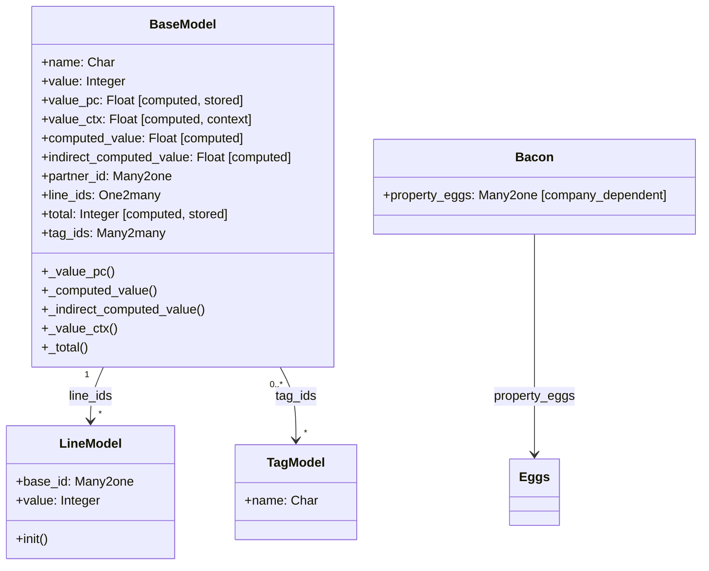

# C4 Code Level: Odoo test_performance Models

<!--
  Auto-generated by the c4-code agent. One file per source directory.
  Refreshed on /banyan-c4 reruns whenever the directory's content hash changes.
  Do NOT hand-edit; edits will be overwritten on next refresh.
-->

## Generated By

- **Agent**: c4-code (Haiku)
- **Run ID**: banyan-c4-20260701-init
- **Generated**: 2026-07-01T00:00:00Z
- **Source Directory**: `odoo/addons/test_performance/models`
- **Content Hash**: odoo-addons-test_performance-models

## Overview

- **Name**: Performance Test Fixture Models
- **Description**: Minimal ORM model definitions designed as fixtures for query-count benchmarks, exercising computed fields, relationships, and context-dependent calculations.
- **Location**: `odoo/addons/test_performance/models` — 2 files, ~80 lines
- **Language**: Python
- **Purpose**: Provide lightweight fixture models for testing ORM prefetch batching, computed field caching, and preventing N+1 query patterns in performance regression tests.

## Code Elements

### Classes / Models

- **`BaseModel`** — Performance test fixture with computed and relational fields
  - **Location**: `models.py:7`
  - **Model Name**: `test_performance.base`
  - **Fields**:
    - `name: Char` — Simple text field
    - `value: Integer(default=0)` — Base numeric value for computed fields
    - `value_pc: Float(compute="_value_pc", store=True)` — Stored computed: value/100
    - `value_ctx: Float(compute="_value_ctx")` — Context-dependent computed: reads from context['key']
    - `computed_value: Float(compute="_computed_value")` — Non-stored computed: value/100
    - `indirect_computed_value: Float(compute="_indirect_computed_value")` — Chained computed: computed_value/100
    - `partner_id: Many2one('res.partner')` — Link to external partner
    - `line_ids: One2many('test_performance.line', 'base_id')` — Child line records
    - `total: Integer(compute="_total", store=True)` — Aggregated sum of line values
    - `tag_ids: Many2many('test_performance.tag')` — Many-to-many tags
  - **Computed Methods**:
    - `_value_pc()` — Iterates records, sets value_pc = value/100 (`models.py:23`)
      - **Visibility**: internal (@api.depends('value'))
    - `_computed_value()` — Iterates records, sets computed_value = value/100 (`models.py:29`)
      - **Visibility**: internal (@api.depends('value'))
    - `_indirect_computed_value()` — Iterates records, sets indirect_computed_value = computed_value/100 (`models.py:34`)
      - **Visibility**: internal (@api.depends('computed_value'))
    - `_value_ctx()` — Context-dependent: executes SELECT 42 dummy query, reads context['key'] (`models.py:38`)
      - **Visibility**: internal (@api.depends_context('key'))
    - `_total()` — Aggregates: total = sum(line.value for line in line_ids) (`models.py:45`)
      - **Visibility**: internal (@api.depends('line_ids.value'))
  - **Dependencies**: res.partner (external), test_performance.line (internal one2many), test_performance.tag (internal many2many)

- **`LineModel`** — One2many child model for BaseModel
  - **Location**: `models.py:50`
  - **Model Name**: `test_performance.line`
  - **Fields**:
    - `base_id: Many2one('test_performance.base', required=True, ondelete='cascade')` — Parent reference
    - `value: Integer` — Numeric value aggregated by parent total
  - **Methods**:
    - `init()` — Database schema initialization; creates unique index on (base_id, value) (`models.py:57`)
      - **Purpose**: Enforces unique (base_id, value) pairs for testing corner cases
      - **Uses**: `tools.create_unique_index()`

- **`TagModel`** — Many2many reference model
  - **Location**: `models.py:62`
  - **Model Name**: `test_performance.tag`
  - **Fields**: `name: Char` — Tag display name
  - **Purpose**: Simple target for BaseModel.tag_ids many2many relationship

- **`Bacon`** — Company-dependent field fixture
  - **Location**: `models.py:69`
  - **Model Name**: `test_performance.bacon`
  - **Fields**: `property_eggs: Many2one('test_performance.eggs', company_dependent=True)` — Company-scoped reference
  - **Purpose**: Test company-dependent many2one field behavior

- **`Eggs`** — Simple reference model
  - **Location**: `models.py:77`
  - **Model Name**: `test_performance.eggs`
  - **Fields**: None declared (bare minimum model)
  - **Purpose**: Target for Bacon.property_eggs many2one

## Dependencies

### Internal

- **`test_performance.line`** — One2many child model, referenced by BaseModel.line_ids
- **`test_performance.tag`** — Many2many reference, linked via BaseModel.tag_ids
- **`test_performance.eggs`** — Simple reference for Bacon.property_eggs

### External

- **`odoo.models.Model`** — Base class for all models
- **`odoo.fields`** — Field type definitions (Char, Integer, Float, Many2one, One2many, Many2many)
- **`odoo.api`** — Decorators: @depends, @depends_context
- **`odoo.tools`** — create_unique_index() function for schema initialization
- **`res.partner` (base addon)** — External reference model for BaseModel.partner_id

## Relationships

## Notes for Higher-Level Synthesis

- **Fixture-only code** — These models exist purely to support test infrastructure; they have no business logic or domain meaning. Group with "Framework Testing / ORM Testing" component.
- **Demonstrates ORM patterns** — Intentionally exercises core ORM features: computed fields with @depends, context-dependent computations, one2many and many2many relationships, company-dependent fields, and prefetching. All patterns are realistic and applicable to real Odoo modules.
- **Minimal by design** — Fixture models are intentionally simple (few fields, no constraints beyond schema-level) to keep test execution fast while covering key ORM scenarios.
- **Direct coupling to ORM layer** — Any changes to ORM computed-field behavior, prefetching, or decorator semantics may require model updates.
