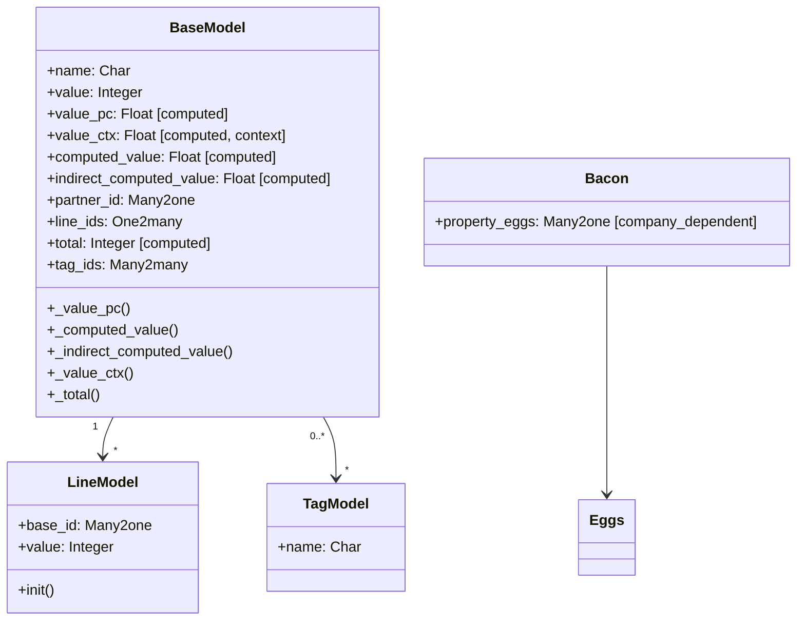

# C4 Code Level: Odoo test_performance Addon

<!--
  Auto-generated by the c4-code agent. One file per source directory.
  Refreshed on /banyan-c4 reruns whenever the directory's content hash changes.
  Do NOT hand-edit; edits will be overwritten on next refresh.
-->

## Generated By

- **Agent**: c4-code (Haiku)
- **Run ID**: banyan-c4-20260701-init
- **Generated**: 2026-07-01T00:00:00Z
- **Source Directory**: `odoo/addons/test_performance`
- **Content Hash**: odoo-addons-test_performance

## Overview

- **Name**: ORM Query Performance Regression Test Addon
- **Description**: Addon providing minimal ORM model fixtures and query-count regression tests to validate ORM performance (prefetch batching, computed field caching, N+1 query prevention).
- **Location**: `odoo/addons/test_performance` — 7 files, ~800 lines total
- **Language**: Python
- **Purpose**: Regression testing for ORM query efficiency; validates that decorators like @depends, @depends_context, and prefetching work correctly and don't cause unexpected query multiplication.

## Code Elements

### Models (in `models/models.py`)

- **`BaseModel`** — Root model for performance testing fixtures with computed fields
  - **Location**: `models/models.py:7`
  - **Fields**: 
    - `name: Char`
    - `value: Integer` (default=0)
    - `value_pc: Float` (computed @depends('value'), stored=True)
    - `value_ctx: Float` (computed @depends_context('key'))
    - `computed_value: Float` (computed @depends('value'))
    - `indirect_computed_value: Float` (computed @depends('computed_value'))
    - `partner_id: Many2one('res.partner')`
    - `line_ids: One2many('test_performance.line', 'base_id')`
    - `total: Integer` (computed @depends('line_ids.value'), stored=True)
    - `tag_ids: Many2many('test_performance.tag')`
  - **Methods**:
    - `_value_pc()` — Computes value_pc as value/100 (`models/models.py:24`)
    - `_computed_value()` — Computes computed_value as value/100 (`models/models.py:29`)
    - `_indirect_computed_value()` — Computes indirect_computed_value (`models/models.py:34`)
    - `_value_ctx()` — Context-dependent computation with explicit query (`models/models.py:39`)
    - `_total()` — Aggregates line values (`models/models.py:45`)

- **`LineModel`** — One2many child records for BaseModel
  - **Location**: `models/models.py:50`
  - **Fields**:
    - `base_id: Many2one('test_performance.base', required=True, ondelete='cascade')`
    - `value: Integer`
  - **Methods**:
    - `init()` — Creates unique constraint on (base_id, value) (`models/models.py:57`)

- **`TagModel`** — Many2many reference model
  - **Location**: `models/models.py:62`
  - **Fields**: `name: Char`

- **`Bacon`** — Model for testing company-dependent many2one field
  - **Location**: `models/models.py:69`
  - **Fields**: `property_eggs: Many2one('test_performance.eggs', company_dependent=True)`

- **`Eggs`** — Simple reference model for Bacon.property_eggs
  - **Location**: `models/models.py:77`
  - **Fields**: None (bare model)

### Test Classes (in `tests/test_performance.py`)

- **`TestPerformance`** — Query count and prefetch efficiency tests
  - **Location**: `tests/test_performance.py:16`
  - **Methods**:
    - `setUpClass()` — Creates fixture records (5 BaseModel objects with partners) (`tests/test_performance.py:18`)
    - `test_read_base()` — Validates prefetching of related fields and computed fields (users: __system__, demo) (`tests/test_performance.py:53`)
    - `test_read_base_one2many()` — Tests One2many prefetching efficiency (`tests/test_performance.py:75`)
    - ...additional tests (not fully expanded in available excerpt)
  - **Decorators**: `@users('__system__', 'demo')`, `@warmup`, `@assertQueryCount(...)`
  - **Dependencies**: SavepointCaseWithUserDemo, test fixtures (test_performance models)

### Test Classes (in `tests/test_timeit.py`)

- **Likely content** — Timing/profiling tests (not fully read; based on module name)

## Dependencies

### Internal

- **`test_performance.models`** — BaseModel, LineModel, TagModel, Bacon, Eggs fixture models
- **`test_performance.base` model** — Central fixture for query counting tests
- **`res.partner` (base addon)** — External reference for BaseModel.partner_id

### External

- **`odoo.models.Model`** — Base class for all models
- **`odoo.fields`** — Char, Integer, Float, Many2one, One2many, Many2many field types
- **`odoo.api`** — @depends, @depends_context decorators
- **`odoo.tools`** — create_unique_index() for schema initialization
- **`odoo.addons.base.tests.common.SavepointCaseWithUserDemo`** — Test base class
- **`odoo.tests.common`** — TransactionCase, @warmup, @tagged, @users decorators, query assertion helpers
- **`odoo.tools.sql`** — SQL query utilities
- **Standard library** — collections.defaultdict, logging, unittest.mock.patch

## Relationships

## Notes for Higher-Level Synthesis

- **Pure test fixture addon** — No business domain; exists solely to support ORM performance regression testing. Should map to "Framework Testing" component, not a business component.
- **Tightly coupled to ORM layer** — Models exercise core ORM features (@depends, @depends_context, computed fields, prefetching, relations). Changes to ORM may require model updates.
- **Minimal but representative** — Fixtures are intentionally minimal (5 records, simple structure) to keep test execution fast while covering key ORM patterns (computed chains, context-dependent, one2many aggregation, many2many, company-dependent fields).
- **No configuration** — Addon has no configurable behavior; purely a test utility.
