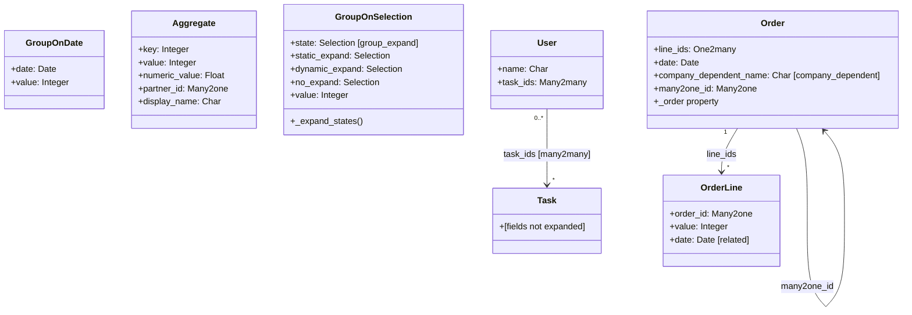

# C4 Code Level: Odoo test_read_group Addon

<!--
  Auto-generated by the c4-code agent. One file per source directory.
  Refreshed on /banyan-c4 reruns whenever the directory's content hash changes.
  Do NOT hand-edit; edits will be overwritten on next refresh.
-->

## Generated By

- **Agent**: c4-code (Haiku)
- **Run ID**: banyan-c4-20260701-init
- **Generated**: 2026-07-01T00:00:00Z
- **Source Directory**: `odoo/addons/test_read_group`
- **Content Hash**: odoo-addons-test_read_group

## Overview

- **Name**: ORM read_group() Aggregation Test Suite
- **Description**: Addon providing test models and regression test cases for ORM read_group() aggregation, covering groupby, orderby, domain filtering, lazy groupby, auto-join behavior, temporal grouping, group expansion, and m2m grouping.
- **Location**: `odoo/addons/test_read_group` — 17 test files + 1 models file, ~1200 lines
- **Language**: Python
- **Purpose**: Comprehensive testing of ORM read_group() aggregation behavior across field types, temporal dimensions, and relational configurations.

## Code Elements

### Models (in `models.py`)

- **`GroupOnDate`** — Date-based grouping test model
  - **Location**: `models.py:5`
  - **Fields**: `date: Date`, `value: Integer`

- **`BooleanAggregate`** — Boolean field aggregation with custom aggregators
  - **Location**: `models.py:13`
  - **Fields**: 
    - `key: Integer`
    - `bool_and: Boolean(aggregator='bool_and')`
    - `bool_or: Boolean(aggregator='bool_or')`
    - `bool_array: Boolean(aggregator='array_agg')`

- **`Aggregate`** — Generic aggregation test model
  - **Location**: `models.py:24`
  - **Fields**: `key: Integer`, `value: Integer`, `numeric_value: Float(digits=(4,2))`, `partner_id: Many2one('res.partner')`, `display_name: Char`

- **`GroupOnSelection`** — Selection field grouping with group_expand
  - **Location**: `models.py:41`
  - **Fields**:
    - `state: Selection([('a',"A"), ('b',"B")], group_expand='_expand_states')`
    - `static_expand: Selection(SELECTION, group_expand=True)` — Static expansion
    - `dynamic_expand: Selection(lambda self: SELECTION, group_expand=True)` — Dynamic expansion
    - `no_expand: Selection(SELECTION)` — No expansion
    - `value: Integer`
  - **Methods**:
    - `_expand_states(states, domain)` — Returns expanded state list in order (`models.py:51`)

- **`FillTemporal`** — Temporal grouping and fill test model
  - **Location**: `models.py:56`
  - **Fields**: `date: Date`, `datetime: Datetime`, `value: Integer`

- **`Order`** — Sales order model with company-dependent and relational fields
  - **Location**: `models.py:65`
  - **Fields**:
    - `line_ids: One2many('test_read_group.order.line', 'order_id')`
    - `date: Date`
    - `company_dependent_name: Char(company_dependent=True)`
    - `many2one_id: Many2one('test_read_group.order')`
  - **Methods**:
    - `_order` property — Conditional ordering based on context (`models.py:74`)

- **`OrderLine`** — Sales order line child model
  - **Location**: `models.py:81`
  - **Fields**:
    - `order_id: Many2one('test_read_group.order', ondelete='cascade')`
    - `value: Integer`
    - `date: Date(related='order_id.date')`

- **`User`** — User model with many2many task relationship
  - **Location**: `models.py:90`
  - **Fields**: `name: Char(required=True)`, `task_ids: Many2many('test_read_group.task', ...)`

- **Additional models** (Task, Category, etc. — not fully read in excerpt)

### Test Classes

- **`TestReadProgressBar`** — Tests read_progress_bar() method for progress visualization
  - **Location**: `tests/test_read_progress_bar.py:7`
  - **Methods**:
    - `test_read_progress_bar_m2m()` — Tests progress bar with many2many grouping (`tests/test_read_progress_bar.py:14`)
    - `test_week_grouping()` — Tests temporal grouping consistency between read_group and read_progress_bar (`tests/test_read_progress_bar.py:28`)
  - **Dependencies**: TransactionCase, test_read_group models

- **Test modules** (one per feature):
  - `test_auto_join.py` — Auto-join behavior in grouping
  - `test_date_range.py` — Date range temporal grouping
  - `test_empty.py` — Empty group handling
  - `test_fill_temporal.py` — Temporal fill (missing date ranges)
  - `test_groupby_week.py` — Week-based temporal grouping
  - `test_group_expand.py` — Group expansion (group_expand field decorator)
  - `test_group_operator.py` — Aggregation operator behavior (sum, count, avg, etc.)
  - `test_inherits.py` — Grouping across inherited models
  - `test_m2m_grouping.py` — Many2many field grouping
  - `test_override.py` — read_group override behavior
  - `test_private_read_group.py` — Private method access control
  - `test_related.py` — Related field grouping

## Dependencies

### Internal

- **`test_read_group` models** — GroupOnDate, BooleanAggregate, Aggregate, GroupOnSelection, FillTemporal, Order, OrderLine, User, Task, Category, and related models
- **Test fixture data** — Models populated with test data for various read_group scenarios

### External

- **`odoo.tests.common.TransactionCase`** — Base test class
- **`odoo.tests.common.HttpCase`** — HTTP-based test class (for progress bar tests)
- **`odoo.models.Model`** — Base class for all models
- **`odoo.fields`** — Field type definitions (Date, Datetime, Integer, Float, Char, Selection, Many2one, One2many, Many2many)
- **`odoo.api`** — @api.model, property decorators
- **`res.partner` (base addon)** — External reference for Aggregate.partner_id
- **Standard library** — datetime module for temporal testing

## Relationships

## Notes for Higher-Level Synthesis

- **Comprehensive ORM aggregation testing** — These test modules form a cohesive suite testing ORM read_group() behavior across all field types and configurations. Should group into "ORM Aggregation Testing" or "Framework Testing" component.
- **Feature matrix coverage** — Tests are organized by feature (auto-join, temporal, expansion, etc.), not by model; each test module exercises multiple models to validate a specific read_group feature.
- **Fixture models are minimal** — Models (Order, User, Task, etc.) are intentionally simple and exist solely to support testing; they have no business domain.
- **No external integration** — Tests are pure ORM-level; no HTTP, RPC, or external system interaction (except through standard ORM relation links to res.partner).
- **Tight coupling to ORM layer** — Any changes to read_group() signature, aggregation operators, temporal grouping, or group_expand behavior may require test updates.
