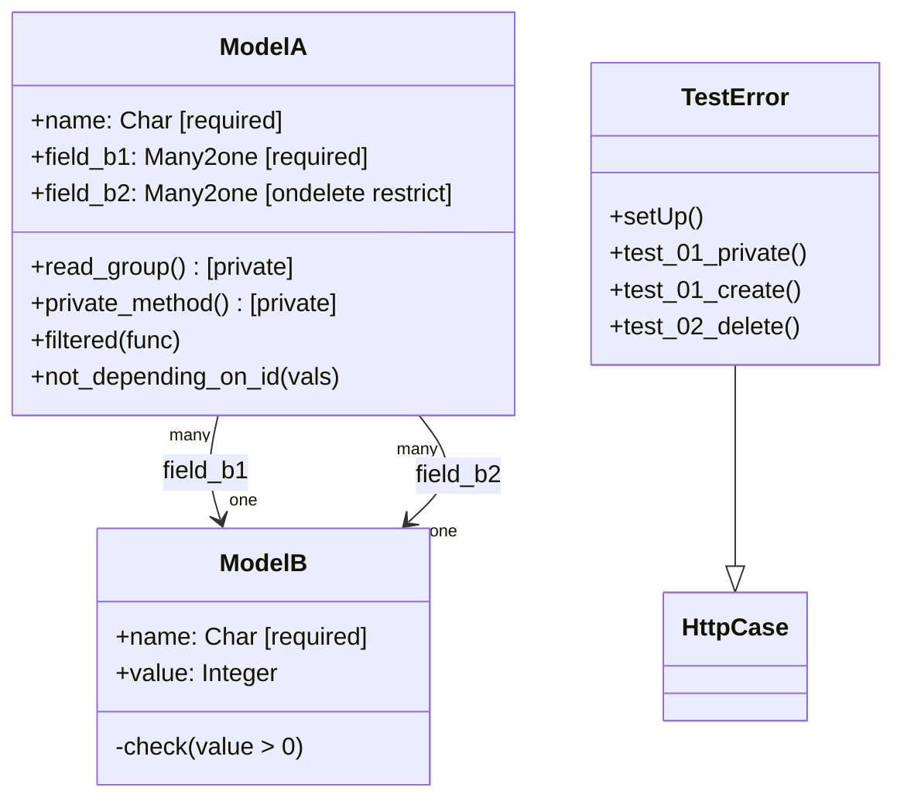

# C4 Code Level: Odoo test_rpc Addon

<!--
  Auto-generated by the c4-code agent. One file per source directory.
  Refreshed on /banyan-c4 reruns whenever the directory's content hash changes.
  Do NOT hand-edit; edits will be overwritten on next refresh.
-->

## Generated By

- **Agent**: c4-code (Haiku)
- **Run ID**: banyan-c4-20260701-init
- **Generated**: 2026-07-01T00:00:00Z
- **Source Directory**: `odoo/addons/test_rpc`
- **Content Hash**: odoo-addons-test_rpc

## Overview

- **Name**: RPC API Testing Addon
- **Description**: Addon testing XML-RPC and JSON-RPC endpoint behavior, including authentication, error handling, private method access control, and constraint validation across the RPC boundary.
- **Location**: `odoo/addons/test_rpc` — 5 files, ~200 lines
- **Language**: Python
- **Purpose**: Regression testing of RPC API surface, security (private method filtering), constraint error propagation, and data validation at the RPC layer.

## Code Elements

### Models (in `models.py`)

- **`ModelA`** — RPC endpoint testing fixture with access control
  - **Location**: `models.py:7`
  - **Model Name**: `test_rpc.model_a`
  - **Fields**:
    - `name: Char(required=True)` — Name field
    - `field_b1: Many2one('test_rpc.model_b', required=True)` — Mandatory Many2one reference
    - `field_b2: Many2one('test_rpc.model_b', ondelete='restrict')` — Restricted delete reference
  - **Methods**:
    - `read_group()` — Overridden read_group with @api.private decorator (`models.py:15`)
      - **Purpose**: Tests that private methods are not callable via RPC
      - **Visibility**: private (@api.private)
    - `private_method()` — Test private method (`models.py:20`)
      - **Purpose**: Validates private method access control
      - **Visibility**: private (@api.private)
      - **Returns**: "private" string
    - `filtered(func)` — Overridden filtered method (`models.py:24`)
      - **Purpose**: Tests built-in method filtering through RPC
      - **Visibility**: public (inherited, can be called via RPC)
    - `not_depending_on_id(vals=None)` — Model-level method (no self.id required) (`models.py:27`)
      - **Purpose**: Tests @api.model decorator and methods not requiring record ID
      - **Visibility**: public (@api.model)
      - **Returns**: f"got {vals}"

- **`ModelB`** — Simple fixture model with SQL constraints
  - **Location**: `models.py:31`
  - **Model Name**: `test_rpc.model_b`
  - **Fields**:
    - `name: Char(required=True)` — Required name field
    - `value: Integer` — Numeric value
  - **Constraints**:
    - `_sql_constraints = [('qty_positive', 'check (value > 0)', 'The value must be positive')]`
      - **Purpose**: Database-level check constraint testing via RPC
      - **Location**: `models.py:38`

### Test Classes (in `tests/test_error.py`)

- **`TestError`** — RPC error handling and access control tests
  - **Location**: `tests/test_error.py:12`
  - **Decorators**: `@tagged('-at_install', 'post_install')`
  - **Base Class**: `common.HttpCase` — HTTP-based test (required for XML-RPC/JSON-RPC testing)
  - **Methods**:
    - `setUp()` — Initializes RPC client and resets admin user language (`tests/test_error.py:13`)
      - **Setup**: Creates xmlrpc object reference, resets admin lang to avoid i18n issues
    - `test_01_private()` — Tests that private methods raise "Private method" error via RPC (`tests/test_error.py:21`)
      - **Tests**: `_create`, `private_method`, `init` (all should error)
      - **Validation**: Methods decorated @api.private throw FaultString exception when called via RPC
      - **Uses**: `mute_logger('odoo.http')` to suppress expected log noise
    - `test_01_create()` — Tests mandatory field validation error handling in RPC responses (`tests/test_error.py:31`)
      - **Tests**: Creating ModelB without required field
      - **Validation**: Error message contains field name, model name, and constraint description
    - `test_02_delete()` — Tests NOT NULL and ON DELETE RESTRICT constraint errors (`tests/test_error.py:48`)
      - **Tests**: Attempting to delete a ModelB record that is referenced by ModelA.field_b1 (NOT NULL, ondelete='restrict')
      - **Validation**: Error message explains the constraint violation and suggests archiving as alternative

## Dependencies

### Internal

- **`test_rpc.model_a`** — Primary test model for RPC access control
- **`test_rpc.model_b`** — Fixture model for constraint testing
- **Cross-model references** — ModelA.field_b1 and field_b2 reference ModelB (one2many inverse relationship)

### External

- **`odoo.models.Model`** — Base class for models
- **`odoo.fields`** — Field definitions (Char, Integer, Many2one)
- **`odoo.api`** — Decorators (@api.private, @api.model)
- **`odoo.http`** — HTTP request/response handling
- **`odoo.tests.common.HttpCase`** — HTTP test base class with XML-RPC/JSON-RPC support
- **`odoo.tests.common`** — Utility: get_db_name()
- **Standard library** — functools.partial, xmlrpc.client.Fault (exception type), logging

## Relationships

## Notes for Higher-Level Synthesis

- **Pure RPC testing framework** — These models and tests exist solely to validate RPC endpoint behavior; no business logic or domain meaning. Should map to "Framework Testing / RPC Testing" component.
- **Security-focused** — Primary concern is access control (@api.private filtering) and constraint error propagation; validates that the RPC boundary correctly blocks private methods.
- **Error message validation** — Tests validate that error responses include field names, model names, and user-friendly constraint descriptions, confirming proper UX handling at the RPC layer.
- **Minimal fixture models** — ModelA and ModelB are intentionally simple, exercising only the ORM features needed to test RPC behavior (Many2one relationships, required fields, SQL constraints).
- **Tight coupling to RPC layer** — Tests depend on xmlrpc endpoint availability and error serialization format; changes to RPC error handling may require test updates.
