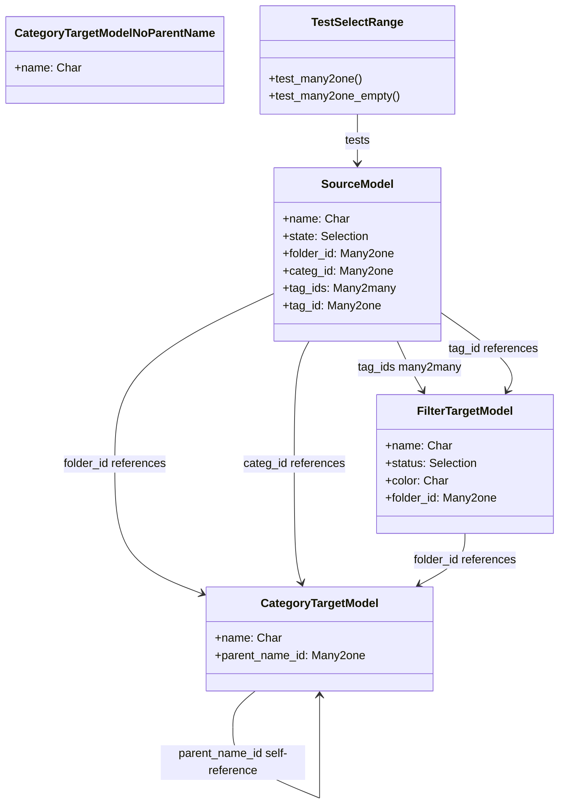

# C4 Code Level: test_search_panel

<!--
  Auto-generated by the c4-code agent. One file per source directory.
  Refreshed on /banyan-c4 reruns whenever the directory's content hash changes.
  Do NOT hand-edit; edits will be overwritten on next refresh.
-->

## Generated By

- **Agent**: c4-code (Haiku)
- **Run ID**: banyan-c4-20260701-init
- **Generated**: 2026-07-01T00:00:00Z
- **Source Directory**: odoo/addons/test_search_panel
- **Content Hash**: [computed-at-runtime]

## Overview

- **Name**: test_search_panel
- **Description**: Tests the search panel (filters/groupby side panel) UI and ORM read_group integration
- **Location**: odoo/addons/test_search_panel — 7 files
- **Language**: Python
- **Purpose**: Framework test addon validating search panel functionality for categorical filters, hierarchical grouping, counters, and range filters

## Code Elements

### Classes / Modules

- **`SourceModel`** (test_search_panel.source_model) — Test record with various field types for search panel testing
  - **Location**: `models/models.py:5`
  - **Fields**: name (Char), state (Selection), folder_id (Many2one), categ_id (Many2one), tag_ids (Many2many), tag_id (Many2one)
  - **Extends**: odoo.models.Model
  - **Dependencies**: odoo.fields, odoo.models

- **`CategoryTargetModel`** (test_search_panel.category_target_model) — Hierarchical category model with parent references
  - **Location**: `models/models.py:19`
  - **Fields**: name (Char), parent_name_id (Many2one to self)
  - **Extends**: odoo.models.Model
  - **Config**: _parent_name = 'parent_name_id', _order = 'name'
  - **Dependencies**: odoo.fields, odoo.models

- **`CategoryTargetModelNoParentName`** (test_search_panel.category_target_model_no_parent_name) — Category model without parent field
  - **Location**: `models/models.py:29`
  - **Fields**: name (Char)
  - **Extends**: odoo.models.Model
  - **Config**: _order = 'id desc'
  - **Dependencies**: odoo.fields, odoo.models

- **`FilterTargetModel`** (test_search_panel.filter_target_model) — Filter-type model with status and color fields
  - **Location**: `models/models.py:37`
  - **Fields**: name (Char), status (Selection), color (Char), folder_id (Many2one)
  - **Extends**: odoo.models.Model
  - **Config**: _order = 'name'
  - **Dependencies**: odoo.fields, odoo.models

- **`TestSelectRange`** — Tests search_panel_select_range() ORM method on Many2one and category models
  - **Location**: `tests/test_search_panel_select_range.py:8`
  - **Methods**: `setUp()`, `test_many2one_empty()`, `test_many2one()`, [hierarchization, counters, limits, search domain filtering tests]
  - **Extends**: odoo.tests.TransactionCase
  - **Dependencies**: odoo.tests, test_search_panel models
  - **Tags**: 'post_install', '-at_install'

- **`TestSelectMultiRange`** — Tests search_panel_select_multi_range() for multi-select filter categories
  - **Location**: `tests/test_search_panel_select_multi_range.py`
  - **Extends**: odoo.tests.TransactionCase
  - **Dependencies**: odoo.tests, test_search_panel models

### Constants / Configuration

- `SEARCH_PANEL_ERROR` — Error response dict when item limit exceeded
  - **Value**: `{'error_msg': "Too many items to display."}`
  - **Location**: `tests/test_search_panel_select_range.py:4`

## Dependencies

### Internal

- `odoo.fields` — Field type definitions
- `odoo.models` — Model base class
- `odoo.tests` — Test framework classes and decorators
- Test models reference each other (SourceModel → CategoryTargetModel, FilterTargetModel)

### External

- None (uses only Odoo framework)

## Relationships

## Notes for Higher-Level Synthesis

- Pure test utility — validates ORM search_panel_select_range/search_panel_select_multi_range methods
- Tests hierarchical categories, multi-select filters, and counters with domain filtering
- Models are not part of business domain; used solely for method testing
- Boundary test: validates ORM method contract for web search panel UI integration
- No external integrations; all testing within Odoo framework

