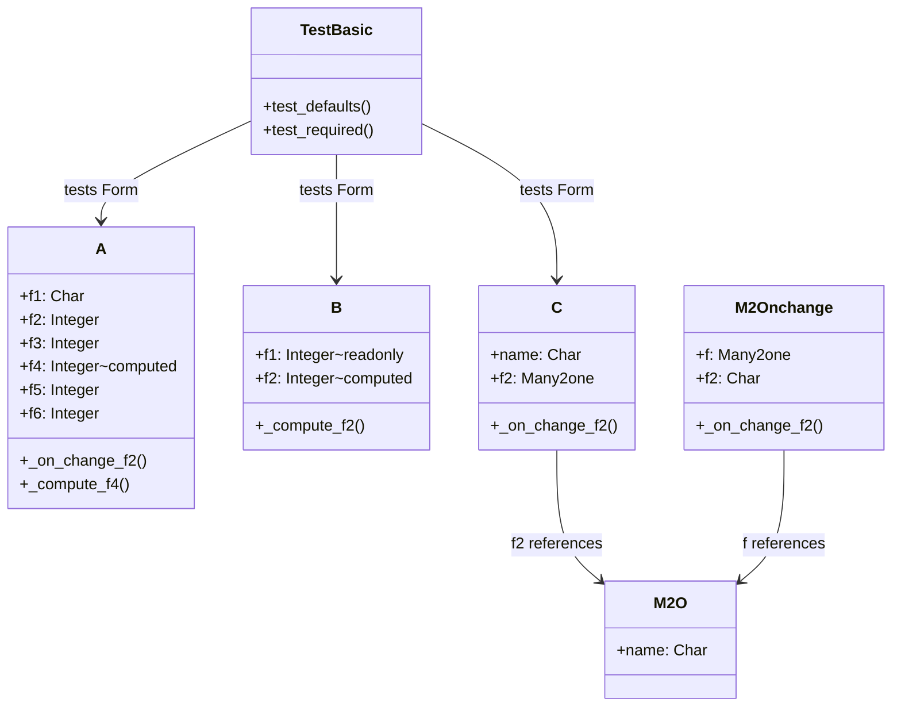

# C4 Code Level: test_testing_utilities

<!--
  Auto-generated by the c4-code agent. One file per source directory.
  Refreshed on /banyan-c4 reruns whenever the directory's content hash changes.
  Do NOT hand-edit; edits will be overwritten on next refresh.
-->

## Generated By

- **Agent**: c4-code (Haiku)
- **Run ID**: banyan-c4-20260701-init
- **Generated**: 2026-07-01T00:00:00Z
- **Source Directory**: odoo/addons/test_testing_utilities
- **Content Hash**: [computed-at-runtime]

## Overview

- **Name**: test_testing_utilities
- **Description**: Tests Odoo's test framework utilities themselves (Form helper, tagged tests, HttpCase, freeze_time)
- **Location**: odoo/addons/test_testing_utilities — 12 files
- **Language**: Python
- **Purpose**: Framework test addon providing models and test cases to validate the test framework helpers (Form, TransactionCase, command helpers, field defaults, onchanges, computed fields, readonly fields)

## Code Elements

### Classes / Modules

- **`A`** (test_testing_utilities.a) — Test model with required, default, computed, and onchange fields
  - **Location**: `models.py:8`
  - **Fields**: f1 (Char, required), f2 (Integer, default=42), f3 (Integer, onchange), f4 (Integer, computed), f5 (Integer), f6 (Integer)
  - **Methods**: `_on_change_f2()`, `_compute_f4()`
  - **Extends**: odoo.models.Model
  - **Dependencies**: odoo.fields, odoo.api, odoo.models

- **`B`** (test_testing_utilities.readonly) — Test model with readonly fields
  - **Location**: `models.py:30`
  - **Fields**: f1 (Integer, readonly, default=1), f2 (Integer, computed)
  - **Methods**: `_compute_f2()`
  - **Extends**: odoo.models.Model
  - **Dependencies**: odoo.fields, odoo.api, odoo.models

- **`C`** (test_testing_utilities.c) — Test model with Many2one and onchange cascading
  - **Location**: `models.py:42`
  - **Fields**: name (Char, required), f2 (Many2one)
  - **Methods**: `_on_change_f2()`
  - **Extends**: odoo.models.Model
  - **Dependencies**: odoo.fields, odoo.api, odoo.models

- **`M2O`** (test_testing_utilities.m2o) — Target model for Many2one field testing
  - **Location**: `models.py:53`
  - **Fields**: name (Char, required)
  - **Extends**: odoo.models.Model
  - **Dependencies**: odoo.fields, odoo.models

- **`M2Onchange`** (test_testing_utilities.d) — Test model with Many2one default lambda and search onchange
  - **Location**: `models.py:59`
  - **Fields**: f (Many2one, required, default=lambda), f2 (Char)
  - **Methods**: `_on_change_f2()`
  - **Extends**: odoo.models.Model
  - **Dependencies**: odoo.fields, odoo.api, odoo.models

- **`M2MChange`** (test_testing_utilities.e) — Test model with Many2many field [details in file beyond read limit]
  - **Location**: `models.py:79`
  - **Extends**: odoo.models.Model
  - **Dependencies**: odoo.fields, odoo.api, odoo.models

- **`TestBasic`** — Tests Form helper with defaults, onchanges, computed fields, required validation
  - **Location**: `tests/test_form_impl.py:16`
  - **Methods**: `test_defaults()`, `test_required()`, `test_required_bool()`, `test_readonly()`, `test_readonly_save()`, `test_attrs()`
  - **Extends**: odoo.tests.TransactionCase
  - **Dependencies**: odoo.tests.Form, lxml.etree, odoo.models.Command, test_testing_utilities models

### Functions / Methods

- `_on_change_f2(self) → None`
  - **Description**: Compute f3, f5, f6 from f2 value
  - **Location**: `models.py:19`
  - **Visibility**: private
  - **Dependencies**: odoo.api.onchange

- `_compute_f4(self) → None`
  - **Description**: Compute f4 = f2 / (int(f1) or 1)
  - **Location**: `models.py:25`
  - **Visibility**: private
  - **Dependencies**: odoo.api.depends

- `_compute_f2(self) → None`
  - **Description**: Compute f2 = 2 * f1
  - **Location**: `models.py:37`
  - **Visibility**: private
  - **Dependencies**: odoo.api.depends

## Dependencies

### Internal

- `odoo.models` — Model base class
- `odoo.fields` — Field type definitions
- `odoo.api` — Decorators (onchange, depends, model)
- `odoo.tests` — Test framework classes and Form helper
- `odoo.models.Command` — ORM command helpers for M2M/O2M operations
- Test models cross-reference each other (M2O, Many2one fields, inheritance)

### External

- `lxml.etree` — XML/form view parsing for attribute/modifier testing
- `itertools` — count, zip_longest utilities (imported in models.py)

## Relationships

## Notes for Higher-Level Synthesis

- Pure test infrastructure — validates Odoo's Form helper and related testing utilities
- Models are synthetic fixtures for testing field interactions (defaults, onchanges, computed, readonly, required validation)
- No business domain; all models are testing-only with no reference in production code
- Covers Form helper contract including: defaults, onchanges, computed fields, readonly enforcement, required validation, domain modifiers, attribute logic
- Tests both happy path (valid state progression) and error cases (readonly/required violations)

