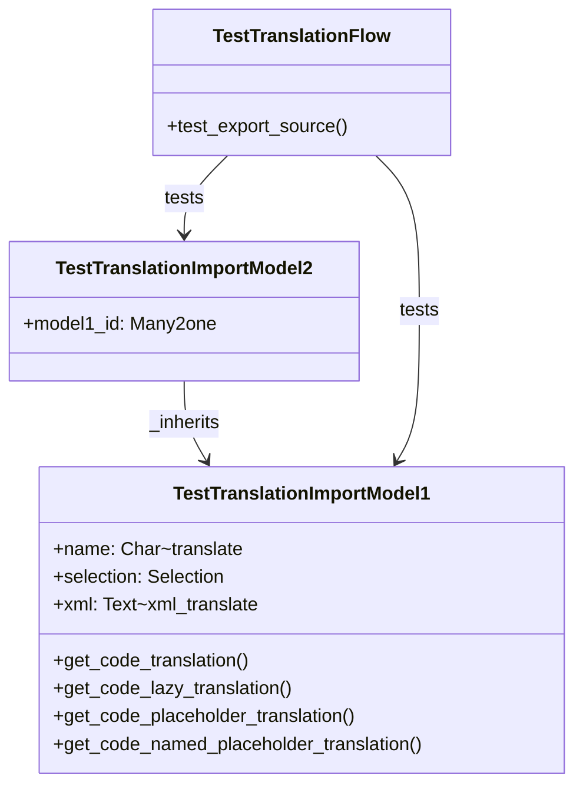

# C4 Code Level: test_translation_import

<!--
  Auto-generated by the c4-code agent. One file per source directory.
  Refreshed on /banyan-c4 reruns whenever the directory's content hash changes.
  Do NOT hand-edit; edits will be overwritten on next refresh.
-->

## Generated By

- **Agent**: c4-code (Haiku)
- **Run ID**: banyan-c4-20260701-init
- **Generated**: 2026-07-01T00:00:00Z
- **Source Directory**: odoo/addons/test_translation_import
- **Content Hash**: [computed-at-runtime]

## Overview

- **Name**: test_translation_import
- **Description**: Tests PO/POT file import and translation loading pipeline
- **Location**: odoo/addons/test_translation_import — 7 files
- **Language**: Python
- **Purpose**: Framework test addon validating translation extraction, export, and import for models, fields, and inline code translations

## Code Elements

### Classes / Modules

- **`TestTranslationImportModel1`** (test.translation.import.model1) — Model with multiple translation sources for testing extraction
  - **Location**: `models/models.py:8`
  - **Fields**: name (Char, translate=True), selection (Selection, export_string_translation=False), xml (Text, translate=xml_translate)
  - **Methods**: `get_code_translation()`, `get_code_lazy_translation()`, `get_code_placeholder_translation(*args, **kwargs)`, `get_code_named_placeholder_translation(*args, **kwargs)`
  - **Extends**: odoo.models.Model
  - **Dependencies**: odoo.fields, odoo.models, odoo.tools.translate

- **`TestTranslationImportModel2`** (test.translation.import.model2) — Model inheriting from Model1 via _inherits
  - **Location**: `models/models.py:33`
  - **Fields**: model1_id (Many2one to Model1, required, ondelete='cascade')
  - **Extends**: odoo.models.Model (inherits Model1 via _inherits)
  - **Dependencies**: odoo.fields, odoo.models

- **`TestTranslationFlow`** — Tests translation export pipeline (PO/POT generation)
  - **Location**: `tests/test_export_wizard.py:6`
  - **Methods**: `test_export_source()`
  - **Extends**: odoo.tests.common.TransactionCase
  - **Decorators**: @tagged('post_install', '-at_install', '-standard', 'nightly_export')
  - **Dependencies**: odoo.tests.common, base64, base.language.export model

### Functions / Methods

- `get_code_translation() → str`
  - **Description**: Return hardcoded English string wrapped in _() for translation extraction
  - **Location**: `models/models.py:19`
  - **Visibility**: public
  - **Dependencies**: odoo.tools.translate._

- `get_code_lazy_translation() → str`
  - **Description**: Return lazy-translated string using _lt() wrapper
  - **Location**: `models/models.py:23`
  - **Visibility**: public
  - **Dependencies**: _lt (LazyTranslate instance)

- `get_code_placeholder_translation(*args, **kwargs) → str`
  - **Description**: Return _() string with positional placeholders (%s)
  - **Location**: `models/models.py:26`
  - **Visibility**: public
  - **Dependencies**: odoo.tools.translate._

- `get_code_named_placeholder_translation(*args, **kwargs) → str`
  - **Description**: Return _() string with named placeholders (%(name)s format)
  - **Location**: `models/models.py:29`
  - **Visibility**: public
  - **Dependencies**: odoo.tools.translate._

- `test_export_source() → None`
  - **Description**: Export PO/POT source terms for all installed modules; save to test file directory
  - **Location**: `tests/test_export_wizard.py:9`
  - **Visibility**: public
  - **Dependencies**: base.language.export wizard, base64, odoo.tests.common.save_test_file

### Constants / Configuration

- `_lt` — LazyTranslate instance for lazy translation loading
  - **Value**: `LazyTranslate(__name__)`
  - **Location**: `models/models.py:5`
  - **Purpose**: Enable translation extraction on module attributes

## Dependencies

### Internal

- `odoo.models` — Model base class
- `odoo.fields` — Field type definitions
- `odoo.api` — ORM API
- `odoo.tools.translate` — Translation utilities (_, _lt, xml_translate, LazyTranslate)
- `base.language.export` — Wizard model for PO/POT export
- `odoo.tests.common` — Test framework

### External

- `base64` — Encoding/decoding for export file handling

## Relationships

## Notes for Higher-Level Synthesis

- Pure test infrastructure — validates translation extraction and export pipeline
- Models are synthetic fixtures designed to exercise multiple translation sources: field translate flag, lazy translations, code _() calls, xml_translate, placeholder variants
- Tests focus on PO/POT export workflow; import testing appears to be data-driven via fixture XML files
- Covers translation edge cases: placeholder formats (%s vs %(name)s), lazy loading, XML field translation, selection field export flags
- No business domain; all models are testing-only
- Supports both Python code translation extraction and form/view XML translation
- External asset (JavaScript XML template) included for translation testing

