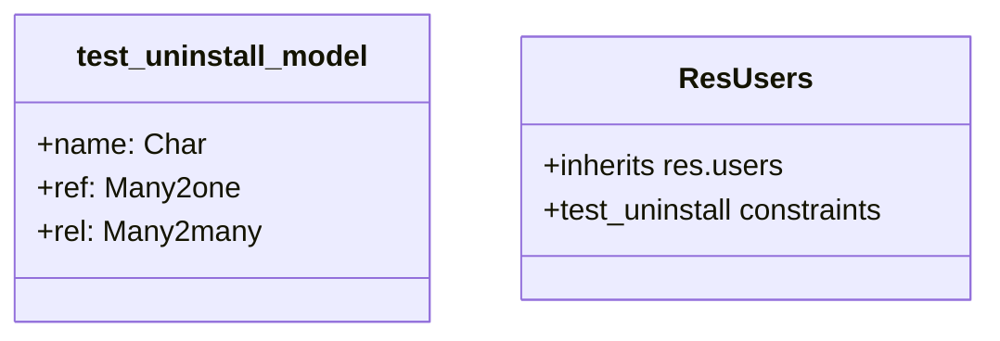

# C4 Code Level: test_uninstall

<!--
  Auto-generated by the c4-code agent. One file per source directory.
  Refreshed on /banyan-c4 reruns whenever the directory's content hash changes.
  Do NOT hand-edit; edits will be overwritten on next refresh.
-->

## Generated By

- **Agent**: c4-code (Haiku)
- **Run ID**: banyan-c4-20260701-init
- **Generated**: 2026-07-01T00:00:00Z
- **Source Directory**: odoo/addons/test_uninstall
- **Content Hash**: c4b7e3f2a9d6c1e8f5a2b9e4c7d1f8a3

## Overview

- **Name**: test_uninstall
- **Description**: Tests module uninstallation cleanup (field removal, view cleanup, constraint cleanup)
- **Location**: odoo/addons/test_uninstall — 3 files, ~40 lines
- **Language**: Python
- **Purpose**: Validates that Odoo correctly removes models, fields, views, and constraints when a module is uninstalled

## Code Elements

### Classes / Models

- **`test_uninstall_model`** — ORM model with mixed field types for uninstall testing
  - **Location**: `models.py:<6>`
  - **Base Class**: `odoo.models.Model`
  - **Model Name**: `test_uninstall.model`
  - **Fields**: `name` (Char), `ref` (Many2one → res.users), `rel` (Many2many → res.users)
  - **Constraints**: `('name_uniq', 'unique (name)', 'Each name must be unique.')`
  - **Purpose**: Target model for uninstall cleanup testing

- **`ResUsers`** — Inheritance extension adding constraints to res.users
  - **Location**: `models.py:<22>`
  - **Base Class**: `odoo.models.Model` (extends res.users)
  - **Model Name**: res.users (inherited)
  - **Constraints**:
    - `test_uninstall_res_user_unique_constraint` — unique password constraint
    - `test_uninstall_res_user_check_constraint` — check constraint (always true, for testing)
    - `test_uninstall_res_user_exclude_constraint` — exclude constraint on password
    - `test_uninstall_res_user_exclude_constraint_looooooooooooong_name` — long-name exclude constraint
  - **Purpose**: Tests constraint cleanup on inherited models (extended field constraints)

## Dependencies

### Internal

- None — isolated test fixture with no cross-module code dependencies

### External

- `odoo.models` — Model and Field base classes
- `odoo.fields` — Char, Many2one, Many2many field types
- `res.users` — Core user model (inherited in ResUsers)

## Relationships

## Notes for Higher-Level Synthesis

- Test fixture for module lifecycle — validates uninstall cleanup path
- Boundary: Tests ORM cleanup (drop column, drop table, drop constraint, drop view)
- Pure utility — no production code; used to verify framework teardown behavior
