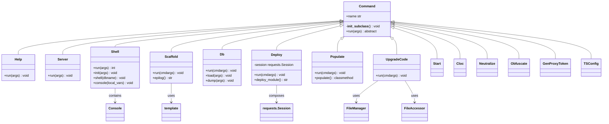

# C4 Code Level: odoo/cli/

<!--
  Auto-generated by the c4-code agent. One file per source directory.
  Refreshed on /banyan-c4 reruns whenever the directory's content hash changes.
  Do NOT hand-edit; edits will be overwritten on next refresh.
-->

## Generated By

- **Agent**: c4-code (Haiku 4.5)
- **Run ID**: banyan-c4-20260701-init
- **Generated**: 2026-07-01T00:00:00Z
- **Source Directory**: odoo/cli
- **Content Hash**: computed-on-refresh

## Overview

- **Name**: Odoo CLI Command Framework
- **Description**: CLI command dispatcher and executor framework for Odoo 18.0 with built-in commands for server, shell, database, module scaffolding, deployment, and utilities.
- **Location**: odoo/cli — 15 files, ~2200 lines
- **Language**: Python 3
- **Purpose**: Entry points and command routing for all Odoo CLI operations including server start, interactive shell, database operations, module scaffolding, code generation/upgrade, and data utilities.

## Code Elements

### Classes / Modules

- **`Command`** — Base class for all CLI commands; auto-registers subclasses in global commands registry
  - **Location**: `command.py:11`
  - **Methods**: `__init_subclass__()`, `run(args)` (abstract)
  - **Key subclasses**: `Server`, `Shell`, `Scaffold`, `Db`, `Deploy`, `Populate`, `Start`, `Cloc`, `Neutralize`, `Obfuscate`, `GenProxyToken`, `UpgradeCode`, `TSConfig`
  - **Dependencies**: odoo.modules, odoo.tools.config

- **`Help`** — Display available CLI commands with descriptions
  - **Location**: `command.py:28`
  - **Methods**: `run(args)`
  - **Visibility**: internal (system command)

- **`Server`** — Start the Odoo server (default command)
  - **Location**: `server.py:178`
  - **Methods**: `run(args)`
  - **Key functions**: `check_root_user()`, `check_postgres_user()`, `report_configuration()`, `setup_pid_file()`, `export_translation()`, `import_translation()`, `main(args)`
  - **Dependencies**: odoo.service.server, odoo.modules.registry, psycopg2

- **`Shell`** — Interactive REPL for Odoo with environment and database access
  - **Location**: `shell.py:54`
  - **Methods**: `init(args)`, `console(local_vars)`, `shell(dbname)`, `run(args)`, `ipython()`, `ptpython()`, `bpython()`, `python()`
  - **Supported shells**: ipython, ptpython, bpython, standard python
  - **Key class**: `Console` (extends code.InteractiveConsole)
  - **Dependencies**: odoo.modules.registry, odoo.api.Environment, readline/rlcompleter

- **`Scaffold`** — Generate Odoo module skeleton from templates
  - **Location**: `scaffold.py:12`
  - **Methods**: `run(cmdargs)`, `epilog()`
  - **Helper class**: `template` — manages template discovery and Jinja2 rendering
  - **Helper functions**: `snake(s)`, `pascal(s)`, `directory(p, create=False)`, `die(message, code=1)`
  - **Dependencies**: jinja2, pathlib, os.walk
  - **Supported templates**: default, l10n_payroll (special handling for country-specific payroll modules)

- **`Db`** — Database management (create, drop, dump, load, duplicate, rename)
  - **Location**: `db.py:19`
  - **Methods**: `run(cmdargs)`, `load(args)`, `dump(args)`, `duplicate(args)`, `rename(args)`, `drop(args)`, `_check_target(target, *, delete_if_exists)`
  - **Subcommands**: load, dump, duplicate, rename, drop
  - **Key features**: filestore-aware operations, URL support for dump loading, force/neutralize options
  - **Dependencies**: odoo.service.db (dump_db, restore_db, exp_drop, exp_duplicate_database, exp_rename), requests, zipfile, urllib.parse

- **`Deploy`** — Deploy modules to running Odoo instances
  - **Location**: `deploy.py:12`
  - **Methods**: `run(cmdargs)`, `deploy_module(module_path, url, login, password, db, force)`, `login_upload_module()`, `zip_module(path)`
  - **Dependencies**: requests.Session, base_import_module HTTP endpoint
  - **Key features**: SSL verification toggle, module zipping, force update of noupdate="1" records

- **`Populate`** — Generate test/demo data by duplicating existing models
  - **Location**: `populate.py:21`
  - **Methods**: `run(cmdargs)`, `populate(env, modelname_factors, separator_code)` (classmethod)
  - **Config options**: --factors (duplication multiplier), --models (comma-separated list), --sep (text field separator)
  - **Dependencies**: odoo.tools.populate.populate_models, odoo.modules.registry.Registry
  - **Default models**: res.partner, product.template, account.move, sale.order, crm.lead, stock.picking, project.task

- **`Start`** — Quick-start server with auto-detection of module paths and database names
  - **Location**: `start.py:16`
  - **Methods**: `run(cmdargs)`, `get_module_list(path)`
  - **Features**: auto-detects module root, auto-creates database, respects VIRTUAL_ENV
  - **Dependencies**: odoo.service.db._create_empty_database, odoo.modules.module.get_module_root

- **`Cloc`** — Count lines of code per module (Python, JavaScript, XML)
  - **Location**: `cloc.py:11`
  - **Methods**: `run(args)`
  - **Modes**: by-path mode or by-database mode (custom code only)
  - **Dependencies**: odoo.tools.cloc.Cloc, odoo.tools.config

- **`Neutralize`** — Neutralize production database for testing (disables emails, etc.)
  - **Location**: `neutralize.py:14`
  - **Methods**: `run(args)`
  - **Options**: --stdout (output SQL instead of executing), -d dbname
  - **Dependencies**: odoo.modules.neutralize.neutralize_database, odoo.sql_db.db_connect

- **`Obfuscate`** — Encrypt/obfuscate sensitive data in database
  - **Location**: `obfuscate.py:16`
  - **Methods**: `run(cmdargs)`, `begin()`, `commit()`, `rollback()`, `set_pwd(pwd)`, `check_pwd(pwd)`, `clear_pwd()`, `cypher_string()`, `uncypher_string()`, `check_field()`, `get_all_fields()`, `convert_table()`, `confirm_not_secure()`
  - **Options**: --pwd (cipher password), --fields, --exclude, --file, --unobfuscate, --allfields, --vacuum, --pertablecommit, -y/--yes
  - **Default fields**: res_partner (name, email, phone, etc.), mail_message, crm_lead, mail_tracking_value, res_country
  - **Dependencies**: odoo.modules.registry.Registry, odoo.tools.SQL, pgcrypto PostgreSQL extension
  - **Security note**: method not considered safe for third-party data transfer; requires explicit confirmation

- **`GenProxyToken`** — Generate and store proxy access token in config file
  - **Location**: `genproxytoken.py:15`
  - **Methods**: `run(cmdargs)`, `generate_token(length=16)`
  - **Features**: generates hex token, splits with dashes, hashes with pbkdf2_sha512
  - **Dependencies**: secrets, passlib.hash.pbkdf2_sha512, odoo.tools.config

- **`UpgradeCode`** — Bulk-rewrite source code using version-specific upgrade scripts
  - **Location**: `upgrade_code.py:168`
  - **Methods**: `run(cmdargs)`, `migrate()`, helper classes `FileAccessor`, `FileManager`
  - **Options**: --script NAME (single script), --from VERSION, --to VERSION, --glob PATTERN, --dry-run, --addons-path
  - **Architecture**: loads upgrade scripts from /odoo/upgrade_code/{version}-{name}.py, each exposes upgrade(file_manager) function
  - **File formats supported**: .py, .js, .css, .scss, .xml, .csv
  - **Key classes**: 
    - `FileAccessor` — lazy-load file content, track dirty state
    - `FileManager` — iterate over files, provide print_progress() utility
  - **Dependency discovery**: parse_version, SourceFileLoader, ModuleType

- **`TSConfig`** — Generate TypeScript configuration for Odoo JavaScript modules
  - **Location**: `tsconfig.py:14`
  - **Methods**: `run(cmdargs)`, `get_module_list(path)`, `clean_path()`, `prefix_suffix_path()`, `generate_imports()`, `generate_file_content()`, `generate_excludes()`
  - **Output**: JSON tsconfig with module paths, Owl type roots, extensive exclude patterns
  - **Dependencies**: glob, json, odoo.modules.module.MANIFEST_NAMES

### Functions / Methods (Top-level)

- `main()` — CLI command dispatcher; discovers and routes to appropriate command handler
  - **Location**: `command.py:42`
  - **Logic**: parses --addons-path if present, discovers addon CLI subcommands, routes to registered command or default "server"
  - **Key discovery**: scans all modules in addon paths for cli/ subdirectories
  - **Returns**: delegates to Command.run(args) which may call sys.exit()

- `die(message, code=1)` — Print error to stderr and exit
  - **Location**: `scaffold.py:144`, `start.py:82` (two implementations)
  - **Visibility**: internal utility

- `warn(message)` — Print warning message to stdout
  - **Location**: `scaffold.py:148`
  - **Visibility**: internal utility

- `raise_keyboard_interrupt(*a)` — Signal handler for SIGINT
  - **Location**: `shell.py:37`
  - **Visibility**: internal

### Constants / Configuration

- `COMMAND` — Global variable storing current command name
  - **Location**: `__init__.py:23`
  - **Set by**: `command.py:75` after command dispatch

- `commands` — Global registry of all Command subclasses (name → class mapping)
  - **Location**: `command.py:10`
  - **Populated by**: `Command.__init_subclass__()` metaclass hook
  - **Used by**: `main()` for routing, `Help.run()` for listing

- `DEFAULT_FACTOR`, `DEFAULT_SEPARATOR`, `DEFAULT_MODELS` — Populate command defaults
  - **Location**: `populate.py:14-16`
  - **Values**: '10000', '_', 'res.partner,product.template,...'

- `UPGRADE`, `AVAILABLE_EXT` — UpgradeCode paths and file extensions
  - **Location**: `upgrade_code.py:62-63`
  - **AVAILABLE_EXT**: ('.py', '.js', '.css', '.scss', '.xml', '.csv')

- `__author__`, `__version__` — Server module metadata
  - **Location**: `server.py:27-28`
  - **Source**: odoo.release

## Dependencies

### Internal

- `odoo.tools.config` — configuration parser and management
- `odoo.modules.registry.Registry` — database registry for accessing ORM models
- `odoo.modules.module` — module discovery (get_module_path, get_modules, MANIFEST_NAMES)
- `odoo.modules.initialize_sys_path` — initialize addon paths
- `odoo.api.Environment` — ORM environment for database access
- `odoo.service.server.start()` — main server loop
- `odoo.service.db` — database operations (dump, restore, create, drop, etc.)
- `odoo.modules.neutralize` — database neutralization utilities
- `odoo.tools.populate` — data population/duplication utilities
- `odoo.tools.cloc` — line-of-code counting
- `odoo.tools.translate` — translation import/export
- `odoo.sql_db.db_connect()` — direct database connections
- `odoo.tools.SQL` — safe SQL construction with parameterization

### External

- `requests@*` — HTTP client for Deploy command (module uploads, URL downloads)
- `jinja2@*` — template rendering for Scaffold (module generation)
- `passlib@*` — password hashing (pbkdf2_sha512) for GenProxyToken
- `psycopg2@*` — PostgreSQL driver exceptions (InsufficientPrivilege)
- `code` (stdlib) — InteractiveConsole for Shell REPL
- `argparse` (stdlib) — argument parsing (all commands)
- `optparse` (stdlib) — legacy option parsing (Populate, Neutralize, Obfuscate)
- `zipfile` (stdlib) — database dump/load zipping (Db, Deploy)
- `readline`, `rlcompleter` (stdlib, optional) — shell autocomplete
- `ipython`, `ptpython`, `bpython` (optional) — advanced REPL shells

## Relationships

## Architecture Patterns

### Command Dispatch Pattern
All CLI commands inherit from `Command` base class. The `__init_subclass__()` hook auto-registers subclasses in a global `commands` registry by their lowercased class name. The `main()` dispatcher discovers addon-provided CLI commands by scanning addon paths for `cli/` subdirectories, then routes to the registered command handler or defaults to "server".

### Database Access Pattern
Commands that need database access (Shell, Populate, Neutralize, Obfuscate) use `Registry(dbname)` to obtain the ORM registry and open cursors for SQL or model-level operations. The Environment and SUPERUSER_ID pattern is used for privileged operations.

### Argument Parsing Pattern
Commands use either `argparse.ArgumentParser` (newer: Db, Deploy, Scaffold, Cloc, Start, GenProxyToken) or extend `odoo.tools.config.parser` with option groups (legacy: Server, Shell, Populate, Neutralize, Obfuscate). The shared `--addons-path` is parsed specially in `main()` before logging setup.

### Template/Plugin Pattern
Scaffold discovers templates from a built-in templates/ subdirectory or from user-provided paths. Jinja2 rendering with custom filters (snake_case, PascalCase) enables parameterized module generation.

### File Manager Pattern
UpgradeCode uses a lazy-loading FileManager/FileAccessor pattern to efficiently manage modifications across many files, tracking dirty state and progress reporting without loading all file contents upfront.

## Notes for Higher-Level Synthesis

- **Core entry point**: `main()` function in command.py; all CLI routing originates here
- **Belongs to**: Infrastructure/DevOps layer — provides command-line interface for system administration, module development, and database operations
- **Boundary code**: Translates CLI arguments to ORM/database operations; handles user I/O and error reporting
- **Key responsibilities**:
  - Server lifecycle management (start, configure, translate, pid file)
  - Database operations (dump/restore/duplicate/neutralize/obfuscate)
  - Interactive debugging (shell/REPL)
  - Development workflows (scaffold/deploy/populate/upgrade_code)
  - Code metrics and TypeScript tooling support
- **Security considerations**: Obfuscate command requires explicit user confirmation; GenProxyToken stores pbkdf2_sha512 hashes; Neutralize alters production data; root/postgres user checks in Server
- **Extension point**: Addon modules can provide custom CLI commands by implementing cli/ subdirectory with Command subclasses
- **Design philosophy**: Functional, loosely coupled commands; minimal shared state (only global `COMMAND` and `commands` registry); configuration managed centrally via odoo.tools.config
