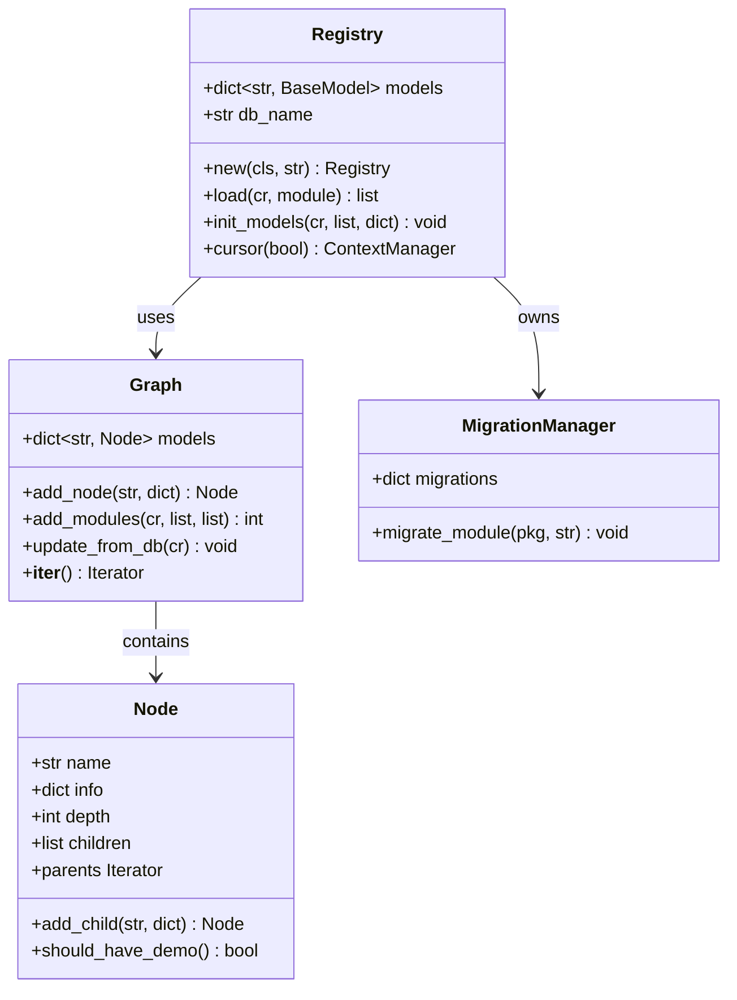

# C4 Code Level: odoo/modules

<!--
  Auto-generated by the c4-code agent. One file per source directory.
  Refreshed on /banyan-c4 reruns whenever the directory's content hash changes.
  Do NOT hand-edit; edits will be overwritten on next refresh.
-->

## Generated By

- **Agent**: c4-code (Haiku)
- **Run ID**: banyan-c4-20260701-init
- **Generated**: 2026-07-01T00:00:00Z
- **Source Directory**: odoo/modules/
- **Content Hash**: ea8aa7aff1971bd6

## Overview

- **Name**: Odoo Module System
- **Description**: Core module discovery, dependency graph resolution, loading, initialization, registry management, and migration infrastructure for Odoo 18.0
- **Location**: odoo/modules/ — 8 files, ~1,200 LOC
- **Language**: Python
- **Purpose**: Implements the complete module lifecycle: manifest parsing, dependency resolution, model registration, database initialization, incremental updates, and upgrade script execution

## Code Elements

### Functions / Methods

#### Module Discovery & Manifest Handling

- `get_modules() → list[str]`
  - **Description**: Returns sorted list of available module names from all registered addons paths
  - **Location**: `module.py:415`
  - **Visibility**: public
  - **Dependencies**: `odoo.addons.__path__`, `os`

- `get_modules_with_version() → dict[str, str]`
  - **Description**: Returns module names mapped to their manifest versions
  - **Location**: `module.py:443`
  - **Visibility**: public
  - **Dependencies**: `get_modules()`, `get_manifest()`, `adapt_version()`

- `get_manifest(module: str, mod_path: Optional[str]) → dict`
  - **Description**: Retrieves module manifest (cached deep copy) with defaults applied
  - **Location**: `module.py:351`
  - **Visibility**: public
  - **Dependencies**: `_get_manifest_cached()`, `copy.deepcopy()`

- `_get_manifest_cached(module: str, mod_path: Optional[str]) → dict`
  - **Description**: LRU-cached manifest loader (internal cache, returns original dict)
  - **Location**: `module.py:366` (decorated with `@functools.lru_cache`)
  - **Visibility**: internal
  - **Dependencies**: `load_manifest()`

- `load_manifest(module: str, mod_path: Optional[str]) → dict`
  - **Description**: Loads manifest file, applies defaults, parses README if description missing, validates license, handles auto_install logic
  - **Location**: `module.py:297`
  - **Visibility**: internal
  - **Dependencies**: `get_module_path()`, `module_manifest()`, `ast.literal_eval()`, `tools.file_open()`

- `module_manifest(path: str) → Optional[str]`
  - **Description**: Returns path to manifest file (`__manifest__.py` or deprecated `__openerp__.py`), None if not found
  - **Location**: `module.py:254`
  - **Visibility**: internal
  - **Dependencies**: `os.path.isfile()`

- `get_module_path(module: str, downloaded: bool, display_warning: bool) → str | bool`
  - **Description**: Locates module directory in addons paths or downloads directory; False if not found
  - **Location**: `module.py:163`
  - **Visibility**: public
  - **Dependencies**: `odoo.addons.__path__`, `tools.config.addons_data_dir`

- `get_module_root(path: str) → Optional[str]`
  - **Description**: Walks up directory tree from given path until finding module root (dir containing manifest), None if not found
  - **Location**: `module.py:270`
  - **Visibility**: public
  - **Dependencies**: `module_manifest()`

- `get_resource_path(module: str, *args) → str | bool`
  - **Description**: [Deprecated since 17.0] Returns absolute path to module resource; use `tools.misc.file_path()` instead
  - **Location**: `module.py:185`
  - **Visibility**: public (deprecated)
  - **Dependencies**: `file_path()`

- `get_resource_from_path(path: str) → Optional[tuple]`
  - **Description**: Reverse lookup: extracts module name and relative resource path from absolute filesystem path
  - **Location**: `module.py:208`
  - **Visibility**: public
  - **Dependencies**: `odoo.addons.__path__`, `os.path.commonprefix()`

- `get_module_icon(module: str) → str`
  - **Description**: Returns icon URL path for module (`/module/static/description/icon.png` or base default)
  - **Location**: `module.py:240`
  - **Visibility**: public
  - **Dependencies**: `file_path()`

- `get_module_icon_path(module: str) → str`
  - **Description**: Returns absolute filesystem path to module icon
  - **Location**: `module.py:248`
  - **Visibility**: public
  - **Dependencies**: `file_path()`

- `initialize_sys_path() → None`
  - **Description**: Configures `odoo.addons.__path__`, `odoo.upgrade.__path__` from config; installs legacy module alias hooks
  - **Location**: `module.py:121`
  - **Visibility**: public
  - **Dependencies**: `tools.config`, `os.path`, `sys.meta_path`

- `load_openerp_module(module_name: str) → None`
  - **Description**: Dynamically imports `odoo.addons.<module_name>` and executes post-load hook if defined in manifest
  - **Location**: `module.py:370`
  - **Visibility**: public
  - **Dependencies**: `__import__()`, `get_manifest()`, `sys.modules`

#### Database Initialization & Setup

- `is_initialized(cr) → bool`
  - **Description**: Checks if database has ORM-initialized tables (tests for `ir_module_module`)
  - **Location**: `db.py:12`
  - **Visibility**: public
  - **Dependencies**: `odoo.tools.sql.table_exists()`

- `initialize(cr) → None`
  - **Description**: One-time database initialization: loads base SQL schema, creates module categories and `ir_module_module` records, marks auto-install modules for installation
  - **Location**: `db.py:20`
  - **Visibility**: public
  - **Dependencies**: `odoo.tools.misc.file_path()`, `odoo.modules.get_manifest()`, `create_categories()`, `psycopg2.extras.Json`

- `create_categories(cr, categories: list[str]) → int`
  - **Description**: Creates nested `ir_module_category` hierarchy from category path list; returns final category DB ID
  - **Location**: `db.py:115`
  - **Visibility**: internal
  - **Dependencies**: `cr.execute()` (PostgreSQL)

- `has_unaccent(cr) → FunctionStatus`
  - **Description**: Tests whether database has PostgreSQL `unaccent()` function and whether it's indexable (immutable); returns enum
  - **Location**: `db.py:152`
  - **Visibility**: public
  - **Dependencies**: PostgreSQL catalog tables

- `has_trigram(cr) → bool`
  - **Description**: Tests whether database has PostgreSQL `pg_trgm` extension (word_similarity function)
  - **Location**: `db.py:176`
  - **Visibility**: public
  - **Dependencies**: PostgreSQL catalog tables

#### Dependency Graph

- `Graph.add_node(name: str, info: dict) → Node`
  - **Description**: Adds single module to graph with dependency resolution; creates lazy parent nodes for missing deps; returns Node
  - **Location**: `graph.py:31`
  - **Visibility**: public
  - **Dependencies**: `Node.__new__()`, `Node.add_child()`

- `Graph.add_modules(cr, module_list: list[str], force: list[str]) → int`
  - **Description**: Adds multiple modules and their unmet dependencies; resolves dependency order; updates from DB; returns count of newly added modules
  - **Location**: `graph.py:65`
  - **Visibility**: public
  - **Dependencies**: `odoo.modules.module.get_manifest()`, `Node.add_node()`, `Graph.update_from_db()`

- `Graph.add_module(cr, module: str, force: list[str]) → None`
  - **Description**: Convenience wrapper for single-module add
  - **Location**: `graph.py:62`
  - **Visibility**: public
  - **Dependencies**: `Graph.add_modules()`

- `Graph.update_from_db(cr) → None`
  - **Description**: Enriches graph nodes with DB state (`id`, `state`, `demo`, `installed_version`) from `ir_module_module`
  - **Location**: `graph.py:43`
  - **Visibility**: internal
  - **Dependencies**: `cr.dictfetchall()`

- `Graph.__iter__() → Iterator[Node]`
  - **Description**: Yields nodes in breadth-first order by depth (dependency-first iteration)
  - **Location**: `graph.py:109`
  - **Visibility**: public
  - **Dependencies**: `Node.depth`

- `Node.add_child(name: str, info: dict) → Node`
  - **Description**: Creates child node with depth = parent.depth + 1; propagates parent's init/update/demo flags to child
  - **Location**: `graph.py:151`
  - **Visibility**: public
  - **Dependencies**: `Node.__new__()`

- `Node.should_have_demo() → bool`
  - **Description**: Determines if demo data should be loaded for this module based on demo flag and parent demo status
  - **Location**: `graph.py:187`
  - **Visibility**: public
  - **Dependencies**: `Node.parents`

- `Node.parents` (property)
  - **Description**: Generator yielding all ancestor nodes in the dependency graph
  - **Location**: `graph.py:191`
  - **Visibility**: public
  - **Dependencies**: `Node.depth`, `Node.graph`

#### Module Loading & Initialization

- `load_modules(registry, force_demo: bool, status, update_module: bool) → None`
  - **Description**: Main entry point (called from Registry.new()): orchestrates 6-step module loading
  - **Location**: `loading.py:375`
  - **Visibility**: public
  - **Dependencies**: `initialize_sys_path()`, `odoo.modules.graph.Graph`, `load_module_graph()`

- `load_module_graph(env, graph, status, perform_checks: bool, skip_modules, report, models_to_check) → tuple`
  - **Description**: Loads all modules in dependency graph: registers models, runs migrations, loads data, runs tests, returns (loaded, processed) module names
  - **Location**: `loading.py:125`
  - **Visibility**: public
  - **Dependencies**: `odoo.modules.migration.MigrationManager`, `load_openerp_module()`, `load_data()`, `load_demo()`

- `load_marked_modules(env, graph, states: list, force: list, progressdict, report, loaded_modules: list, perform_checks, models_to_check) → list`
  - **Description**: Iteratively loads modules with specified state(s) from database until no new modules added; returns processed module names
  - **Location**: `loading.py:349`
  - **Visibility**: internal
  - **Dependencies**: `load_module_graph()`

- `_check_module_names(cr, module_names: list[str]) → None`
  - **Description**: Validates that all module names exist in `ir_module_module`; logs warning for invalid names
  - **Location**: `loading.py:335`
  - **Visibility**: internal
  - **Dependencies**: `cr.execute()`, `cr.dictfetchall()`

- `load_data(env, idref: dict, mode: str, kind: str, package) → bool`
  - **Description**: Loads XML/CSV data files for a module; handles noupdate flags; supports init_xml, update_xml, demo, data, demo_xml, test files
  - **Location**: `loading.py:27`
  - **Visibility**: internal
  - **Dependencies**: `tools.convert_file()`, `threading.current_thread().testing`

- `load_demo(env, package, idref: dict, mode: str) → bool`
  - **Description**: Loads demo data if module qualifies; catches exceptions and logs via ir.demo_failure; returns success
  - **Location**: `loading.py:79`
  - **Visibility**: internal
  - **Dependencies**: `load_data()`, `package.should_have_demo()`

- `force_demo(env) → None`
  - **Description**: Sets demo=True on all modules and loads demo data for installed modules
  - **Location**: `loading.py:106`
  - **Visibility**: public
  - **Dependencies**: `odoo.modules.graph.Graph`, `load_demo()`

#### Migration Management

- `MigrationManager.__init__(cr, graph) → None`
  - **Description**: Initializes migration manager; scans module migrations/ and upgrades/ directories
  - **Location**: `migration.py:90`
  - **Visibility**: public
  - **Dependencies**: `_get_files()`

- `MigrationManager.migrate_module(pkg, stage: str) → None`
  - **Description**: Executes migration scripts for one module in stage (pre/post/end); resolves version-specific scripts
  - **Location**: `migration.py:149`
  - **Visibility**: public
  - **Dependencies**: `parse_version()`, `exec_script()`

- `exec_script(cr, installed_version: str, pyfile: str, addon: str, stage: str, version: str) → None`
  - **Description**: Loads Python migration script, validates migrate(cr, version) function signature, executes migration
  - **Location**: `migration.py:226`
  - **Visibility**: public
  - **Dependencies**: `load_script()`, `inspect.signature()`, `importlib.util`

- `load_script(path: str, module_name: str) → module`
  - **Description**: Loads Python module from file path using importlib
  - **Location**: `migration.py:50`
  - **Visibility**: internal
  - **Dependencies**: `importlib.util.spec_from_file_location()`

#### Model Registry

- `Registry.__new__(cls, db_name: str) → Registry`
  - **Description**: Returns existing registry for db_name or creates new one; thread-safe singleton per database
  - **Location**: `registry.py:101`
  - **Visibility**: public
  - **Dependencies**: `Registry._lock`, `Registry.new()`

- `Registry.new(cls, db_name: str, force_demo: bool, status, update_module: bool) → Registry`
  - **Description**: Factory method (class-level locked): initializes registry, loads modules, sets up signaling; returns ready registry
  - **Location**: `registry.py:112`
  - **Visibility**: public
  - **Dependencies**: `load_modules()`, `setup_signaling()`

- `Registry.init(self, db_name: str) → None`
  - **Description**: Initializes all registry state: models dict, caches, DB connections (main + readonly replica), signaling
  - **Location**: `registry.py:151`
  - **Visibility**: internal
  - **Dependencies**: `odoo.sql_db.db_connect()`, `LRU()`

- `Registry.load(self, cr, module) → list[str]`
  - **Description**: Loads models from single module: scans module files, instantiates model classes, returns list of registered model names
  - **Location**: `registry.py:277`
  - **Visibility**: public
  - **Dependencies**: `load_openerp_module()`, `MetaModel`

- `Registry.setup_models(self, cr) → None`
  - **Description**: Executes deferred model setup: field computation, triggers, index checks
  - **Location**: `registry.py:308`
  - **Visibility**: public
  - **Dependencies**: `_field_triggers`, `check_indexes()`

- `Registry.init_models(self, cr, model_names: list, context: dict, install: bool) → None`
  - **Description**: Initializes model schemas (create/alter tables, fields); runs constraints
  - **Location**: `registry.py:579`
  - **Visibility**: public
  - **Dependencies**: `check_foreign_keys()`, `check_tables_exist()`

- `Registry.finalize_constraints(self) → None`
  - **Description**: Drains constraint queue and applies all deferred SQL constraints
  - **Location**: `registry.py:568`
  - **Visibility**: public
  - **Dependencies**: `_constraint_queue`

- `Registry.cursor(self, readonly: bool) → context_manager`
  - **Description**: Context manager yielding database cursor; handles test mode, readonly replicas, connection pooling
  - **Location**: `registry.py:987`
  - **Visibility**: public
  - **Dependencies**: `odoo.sql_db`, `test_cr`, `_db`

#### Neutralization

- `get_installed_modules(cursor) → list[str]`
  - **Description**: Fetches list of module names in states: installed, to upgrade, to remove
  - **Location**: `neutralize.py:11`
  - **Visibility**: public
  - **Dependencies**: `cursor.execute()`

- `get_neutralization_queries(modules: list[str]) → Generator[str]`
  - **Description**: Yields SQL query strings from `<module>/data/neutralize.sql` files
  - **Location**: `neutralize.py:19`
  - **Visibility**: public
  - **Dependencies**: `odoo.tools.misc.file_open()`

- `neutralize_database(cursor) → None`
  - **Description**: Executes all module neutralization SQL queries
  - **Location**: `neutralize.py:27`
  - **Visibility**: public
  - **Dependencies**: `get_installed_modules()`, `get_neutralization_queries()`

### Classes / Modules

- **`Graph`** — Dependency graph for modules; lazy-loads unmet dependencies; provides breadth-first iteration
  - **Location**: `graph.py:24`
  - **Methods**: `add_node()`, `add_modules()`, `add_module()`, `update_from_db()`, `__iter__()`
  - **Inheritance**: `dict`
  - **Dependencies**: `Node`, `odoo.modules.module.get_manifest()`, `odoo.tools.config`

- **`Node`** — Single module vertex in dependency graph; implements singleton-per-graph-per-name
  - **Location**: `graph.py:122`
  - **Methods**: `add_child()`, `should_have_demo()`, `parents` (property), `__iter__()`, `__str__()`
  - **Attributes**: `name`, `graph`, `info`, `children`, `depth`, `id`, `state`, `dbdemo`, `installed_version`
  - **Dependencies**: `itertools`, `odoo.tools.config`

- **`Registry`** — Database-specific model registry (mapping model_name → model_class)
  - **Location**: `registry.py:75`
  - **Methods**: `__new__()`, `new()`, `init()`, `load()`, `setup_models()`, `init_models()`, `finalize_constraints()`, `cursor()`
  - **Inheritance**: `collections.abc.Mapping`
  - **Attributes**: `models`, `db_name`, `_db`, `_db_readonly`, `_init`, `ready`, `loaded`, `test_cr`
  - **Dependencies**: `odoo.modules.db`, `odoo.modules.graph`, `odoo.modules.migration`, `odoo.models`, `odoo.sql_db`

- **`MigrationManager`** — Discovers and executes module upgrade/migration scripts
  - **Location**: `migration.py:58`
  - **Methods**: `__init__()`, `migrate_module()`, `_get_files()`
  - **Attributes**: `cr`, `graph`, `migrations`
  - **Dependencies**: `glob`, `importlib.util`, `os.path`, `parse_version()`

- **`FunctionStatus`** — Enum for PostgreSQL function availability
  - **Location**: `db.py:147`
  - **Values**: `MISSING=0`, `PRESENT=1`, `INDEXABLE=2`

### Constants / Configuration

- `MANIFEST_NAMES` — Tuple of valid module manifest filenames
  - **Value**: `('__manifest__.py', '__openerp__.py')`
  - **Location**: `module.py:39`

- `README` — List of possible README files to scan for module description
  - **Value**: `['README.rst', 'README.md', 'README.txt']`
  - **Location**: `module.py:40`

- `_DEFAULT_MANIFEST` — Default values for all manifest keys
  - **Location**: `module.py:42`

- `_REGISTRY_CACHES` — Configuration for registry LRU cache sizes
  - **Location**: `registry.py:45`

- `_CACHES_BY_KEY` — Cache invalidation dependency graph
  - **Location**: `registry.py:57`

- `VERSION_RE` — Regex pattern for valid module version strings
  - **Location**: `migration.py:23`

- `VALID_MIGRATE_PARAMS` — Valid function signatures for migrate() in upgrade scripts
  - **Location**: `migration.py:221`

## Dependencies

### Internal

- **`odoo.tools`** — Configuration, file I/O, SQL utilities, data conversion
- **`odoo.api`** — Environment, record context management
- **`odoo.models`** — Base model classes and metaclass
- **`odoo.sql_db`** — Database connection pooling, cursor management
- **`odoo.release`** — Odoo version constants
- **`odoo.upgrade`** — Module upgrade script packages

### External

- **`psycopg2`** — PostgreSQL adapter for database connections
- **`packaging`** — Package version parsing and requirement specification (optional)
- **`importlib`** (stdlib) — Dynamic module loading
- **`ast`** (stdlib) — Safe literal evaluation for manifests
- **`threading`** (stdlib) — Thread safety primitives
- **`glob`** (stdlib) — Directory scanning for migration scripts
- **`re`** (stdlib) — Regular expression patterns for validation

## Relationships

## Notes for Higher-Level Synthesis

- **Core system component**: This directory implements the entire Odoo module lifecycle. It is foundational to the ORM and should be grouped with the Registry component and core Models infrastructure.

- **Boundary between addons and core**: Serves as the contract boundary between core Odoo engine and user-installed modules. Module loaders dynamically import addon code; the registry then instantiates models.

- **State machine for modules**: The `Graph` + `Node` classes implement a dependency-aware state machine for module installation. Module states (uninstalled, to install, installed, to upgrade, to remove) flow through this system.

- **Migration system is self-contained**: Migration/upgrade script discovery and execution is modular but tightly coupled to loading. Upgrade scripts are expected to have `migrate(cr, version)` signature; executed in pre/post/end stages.

- **Registry is database-scoped singleton**: Each database has exactly one `Registry` instance. The registry holds all model classes, caches, and DB connections. It is created once per database and reused for the lifetime of the process.
