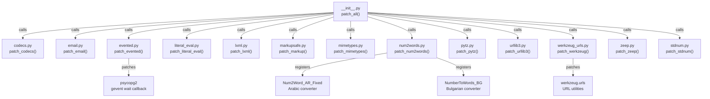

# C4 Code Level: odoo/_monkeypatches

<!--
  Auto-generated by the c4-code agent. One file per source directory.
  Refreshed on /banyan-c4 reruns whenever the directory's content hash changes.
  Do NOT hand-edit; edits will be overwritten on next refresh.
-->

## Generated By

- **Agent**: c4-code (Haiku)
- **Run ID**: banyan-c4-20260701-init
- **Generated**: 2026-07-01T00:00:00Z
- **Source Directory**: odoo/_monkeypatches
- **Content Hash**: computed-at-runtime

## Overview

- **Name**: Odoo Runtime Monkey Patches
- **Description**: Runtime patches applied at startup to fix third-party library compatibility issues (Werkzeug, psycopg2, lxml, MarkupSafe, num2words, pytz, stdnum, zeep, urllib3, email, codecs, mimetypes, literal_eval).
- **Location**: odoo/_monkeypatches — 14 files, ~2300 lines
- **Language**: Python
- **Purpose**: Patch third-party libraries at Odoo startup to work around version mismatches, deprecated code, performance regressions, and compatibility issues. All patches are applied centrally via `patch_all()` during application initialization.

## Code Elements

### Functions / Methods

- `patch_all() → None`
  - **Description**: Main entry point that applies all monkey patches in sequence.
  - **Location**: `__init__.py:14`
  - **Visibility**: public
  - **Dependencies**: All other patch modules in the directory; `os`, `time`

- `set_timezone_utc() → None`
  - **Description**: Set system timezone to UTC and call `time.tzset()` if available.
  - **Location**: `__init__.py:8`
  - **Visibility**: internal
  - **Dependencies**: `os`, `time`

- `patch_codecs() → None`
  - **Description**: Register codec aliases for charset encoding (cp874, iso-8859-8 variants) and fix Babel locale alias for Norwegian.
  - **Location**: `codecs.py:8`
  - **Visibility**: public
  - **Dependencies**: `codecs`, `encodings.aliases`, `re`, `babel.core`

- `patch_email() → None`
  - **Description**: Patch `email._policybase._PolicyBase` to add security checks to `clone()` and implement `__add__()` method.
  - **Location**: `email.py:4`
  - **Visibility**: public
  - **Dependencies**: `email._policybase`

- `patch_evented() → None`
  - **Description**: Detect gevent mode from command-line args and patch psycopg2 with gevent-compatible wait callback; set `odoo.evented` flag.
  - **Location**: `evented.py:13`
  - **Visibility**: public
  - **Dependencies**: `odoo`, `sys`, `gevent.monkey`, `gevent.socket`, `psycopg2`

- `gevent_wait_callback(conn, timeout=None) → None`
  - **Description**: Gevent-compatible wait callback for psycopg2 async connection polling.
  - **Location**: `evented.py:22`
  - **Visibility**: internal
  - **Dependencies**: `psycopg2.extensions`

- `literal_eval(expr) → Any`
  - **Description**: Wrapper around `ast.literal_eval()` that enforces a configurable buffer-size limit (default 100KiB) to prevent segmentation faults on huge expressions.
  - **Location**: `literal_eval.py:11`
  - **Visibility**: public
  - **Dependencies**: `ast`, `os`, `logging`

- `patch_literal_eval() → None`
  - **Description**: Replace `ast.literal_eval` with the size-limited wrapper.
  - **Location**: `literal_eval.py:31`
  - **Visibility**: public
  - **Dependencies**: `ast`

- `patch_lxml() → None`
  - **Description**: Fix lxml data-URL regex in versions 4.6.0 to 5.2.0 for improved style attribute handling.
  - **Location**: `lxml.py:9`
  - **Visibility**: public
  - **Dependencies**: `lxml.html.clean`, `re`, `importlib.metadata`, `odoo.tools`

- `patch_markup() → None`
  - **Description**: Revert MarkupSafe `striptags()` implementation from v2.1.3 for large-input performance in versions >= 2.1.4.
  - **Location**: `markupsafe.py:9`
  - **Visibility**: public
  - **Dependencies**: `re`, `importlib.metadata`, `markupsafe`, `odoo.tools`

- `striptags(self) → str`
  - **Description**: Optimized MarkupSafe striptags method that uses two-regex approach instead of single-regex (v2.1.3 implementation).
  - **Location**: `markupsafe.py:26`
  - **Visibility**: internal
  - **Dependencies**: `markupsafe.Markup`

- `patch_mimetypes() → None`
  - **Description**: Register missing or incorrect MIME types for fonts (woff, eot, ttf), images (webp, svg), and JavaScript.
  - **Location**: `mimetypes.py:4`
  - **Visibility**: public
  - **Dependencies**: `mimetypes`

- `patch_num2words() → None`
  - **Description**: Patch num2words converters: register fixed Arabic class and Bulgarian number-to-words class; map Czech locale if needed.
  - **Location**: `num2words.py:974`
  - **Visibility**: public
  - **Dependencies**: `num2words`, `odoo.MIN_PY_VERSION`

- `patch_pytz() → None`
  - **Description**: Wrapper around `pytz.timezone()` that maps deprecated/removed timezone names to modern canonical alternatives (e.g., `Asia/Calcutta` → `Asia/Kolkata`).
  - **Location**: `pytz.py:125`
  - **Visibility**: public
  - **Dependencies**: `pytz`

- `timezone(name) → pytz.tzinfo`
  - **Description**: Drop-in replacement for `pytz.timezone()` that automatically remaps obsolete timezone identifiers.
  - **Location**: `pytz.py:126`
  - **Visibility**: internal
  - **Dependencies**: `pytz`

- `patch_urllib3() → None`
  - **Description**: Copy `PoolManager.pool_classes_by_scheme` dict to prevent shared-state mutation across instances.
  - **Location**: `urllib3.py:11`
  - **Visibility**: public
  - **Dependencies**: `urllib3`

- `pool_init(self, *args, **kwargs) → None`
  - **Description**: Wrapper around `PoolManager.__init__()` that creates a shallow copy of pool_classes_by_scheme to avoid dict mutation issues.
  - **Location**: `urllib3.py:6`
  - **Visibility**: internal
  - **Dependencies**: `urllib3.PoolManager`

- `new_get_soap_client(wsdlurl, timeout=30) → Any`
  - **Description**: Drop-in replacement for stdnum's `util.get_soap_client()` that correctly passes both `timeout` and `operation_timeout` to zeep Transport, with fallback to suds/pysimplesoap if zeep unavailable.
  - **Location**: `stdnum.py:6`
  - **Visibility**: public
  - **Dependencies**: `zeep.transports.Transport`, `zeep.CachingClient`, `zeep.Client`, `suds`, `pysimplesoap`, `urllib`

- `patch_stdnum() → None`
  - **Description**: Patch stdnum's SOAP client factory with the corrected version that handles zeep Transport timeouts.
  - **Location**: `stdnum.py:51`
  - **Visibility**: public
  - **Dependencies**: `stdnum.util`

- `patch_werkzeug() → None`
  - **Description**: Patch Werkzeug request/response JSON handlers, FileStorage.save(), MultiDict.deepcopy(), Rule routing, and URL utilities to match Odoo's expectations and work around API changes between versions.
  - **Location**: `werkzeug_urls.py:1025`
  - **Visibility**: public
  - **Dependencies**: `werkzeug.tools.json.scriptsafe`, `werkzeug.wrappers.Request`, `werkzeug.wrappers.Response`, `werkzeug.datastructures.FileStorage`, `werkzeug.datastructures.MultiDict`, `werkzeug.routing.Rule`, `werkzeug.urls`

- `patch_zeep() → None`
  - **Description**: Fix zeep XSD visitor tag registration for 'notation' to match expected namespace.
  - **Location**: `zeep.py:5`
  - **Visibility**: public
  - **Dependencies**: `zeep.xsd.visitor`, `zeep.xsd.const`

### Classes / Modules

- **`Num2Word_Base`** — Base converter class for number-to-word transformations (backported from num2words to fix Arabic support).
  - **Location**: `num2words.py:35`
  - **Methods**: `__init__()`, `set_numwords()`, `set_high_numwords()`, `set_mid_numwords()`, `set_low_numwords()`, `splitnum()`, `parse_minus()`, `str_to_number()`, `to_cardinal()`, `float2tuple()`, `to_cardinal_float()`, `merge()`, `clean()`, `title()`, `verify_ordinal()`, `to_ordinal()`, `to_ordinal_num()`, `inflect()`, `to_splitnum()`, `to_year()`, `pluralize()`, `_money_verbose()`, `_cents_verbose()`, `_cents_terse()`, `to_currency()`, `setup()`
  - **Implements / Extends**: Base class for locale-specific converters
  - **Dependencies**: `decimal`, `collections.OrderedDict`

- **`Num2Word_AR_Fixed`** — Fixed Arabic number-to-words converter (replaces buggy num2words.ar implementation for Python < 3.13).
  - **Location**: `num2words.py:320`
  - **Methods**: `__init__()`, `number_to_arabic()`, `extract_integer_and_decimal_parts()`, `decimal_value()`, `digit_feminine_status()`, `process_arabic_group()`, `absolute()`, `to_str()`, `convert()`, `convert_to_arabic()`, `validate_number()`, `set_currency_prefer()`, `to_currency()`, `to_ordinal()`, `to_year()`, `to_ordinal_num()`, `to_cardinal()`
  - **Implements / Extends**: `Num2Word_Base`
  - **Dependencies**: `decimal`, `math`, `re`

- **`NumberToWords_BG`** — Bulgarian number-to-words converter (replaces missing num2words.bg for Python < 3.12).
  - **Location**: `num2words.py:721`
  - **Methods**: `to_cardinal()`, `to_ordinal()`, `to_ordinal_num()`, `to_year()`, `to_currency()`, `_split_number()`, `_discard_empties()`, `_show_digits_group()`, `_to_words()`
  - **Implements / Extends**: `Num2Word_Base`
  - **Dependencies**: None (self-contained)

- **`BaseURL`** — Base class for URL parsing/unparsing with common properties (deprecated Werkzeug class; backported for 2.3 compatibility).
  - **Location**: `werkzeug_urls.py:97`
  - **Methods**: `__new__()`, `__str__()`, `replace()`, `host` (property), `ascii_host` (property), `port` (property), `auth` (property), `username` (property), `raw_username` (property), `password` (property), `raw_password` (property), `decode_query()`, `join()`, `to_url()`, `encode_netloc()`, `decode_netloc()`, `get_file_location()`, `_split_netloc()`, `_split_auth()`, `_split_host()`
  - **Implements / Extends**: `NamedTuple` (_URLTuple)
  - **Dependencies**: `werkzeug.urls`, `werkzeug.datastructures`

- **`URL`** — String-based URL representation (inherits from BaseURL).
  - **Location**: `werkzeug_urls.py:365`
  - **Methods**: `encode()`
  - **Implements / Extends**: `BaseURL`
  - **Dependencies**: None

- **`BytesURL`** — Bytes-based URL representation (inherits from BaseURL).
  - **Location**: `werkzeug_urls.py:393`
  - **Methods**: `__str__()`, `encode_netloc()`, `decode()`
  - **Implements / Extends**: `BaseURL`
  - **Dependencies**: None

### Constants / Configuration

- `_tz_mapping` (dict) — Mapping of obsolete timezone names to canonical modern equivalents (`pytz.py:20`)
- `CURRENCY_SR` (list) — Saudi Riyal currency forms in Arabic (`num2words.py:19`)
- `CURRENCY_EGP` (list) — Egyptian Pound currency forms in Arabic (`num2words.py:21`)
- `CURRENCY_KWD` (list) — Kuwaiti Dinar currency forms in Arabic (`num2words.py:23`)
- `ARABIC_ONES` (list) — Arabic digit names 0–19 (`num2words.py:26`)
- `_always_safe_chars` (str) — URL-safe character set (`werkzeug_urls.py:72`)
- `_always_safe` (frozenset) — Frozenset of ASCII bytes for safe URL chars (`werkzeug_urls.py:78`)
- `_hexdigits` (str) — Hexadecimal digits 0–9, A–F, a–f (`werkzeug_urls.py:80`)
- `_hextobyte` (dict) — Mapping hex pairs to byte values (`werkzeug_urls.py:81`)
- `_bytetohex` (list) — Mapping bytes to percent-encoded hex (`werkzeug_urls.py:86`)
- `_scheme_re` (re.Pattern) — Regex for valid URL schemes (`werkzeug_urls.py:69`)

## Dependencies

### Internal

- `odoo` — Application-level module export (odoo.evented flag, odoo.MIN_PY_VERSION); imported from parent package
- `odoo.tools` — Utility functions for parse_version() and JSON handling (scriptsafe)

### External

- `codecs` (Python stdlib) — Character encoding codec registration
- `email._policybase` (Python stdlib) — Email message policy base class
- `gevent` (when mode='gevent') — Async I/O framework; monkey-patches socket operations
- `psycopg2` (PostgreSQL driver) — Database connection; patched for gevent compatibility when mode='gevent'
- `lxml` (XML library) — HTML/XML parsing; version-specific fix for data-URL regex in style attributes
- `markupsafe` (HTML escaping) — Templating safety; version-specific optimization for striptags()
- `mimetypes` (Python stdlib) — MIME type registration
- `num2words` (number-to-words) — Converts numbers to written words; patched with fixed Arabic & Bulgarian converters
- `pytz` (timezone) — Timezone database; patched to remap deprecated timezone names
- `urllib3` (HTTP client) — Connection pooling; patched to prevent dict mutation
- `stdnum` (validation) — VAT/ID validation; SOAP client patched for zeep timeout handling
- `zeep` (SOAP client, optional) — Web services; XSD notation tag fix
- `werkzeug` (Web framework toolkit) — URL routing, request/response; major compatibility layer for v2.3→3.0 migration
- `ast` (Python stdlib) — Abstract syntax tree; literal_eval patched with size limits
- `importlib.metadata` (Python stdlib) — Package version lookup (for conditional patches)

## Relationships

## Notes for Higher-Level Synthesis

- **Pure Utility — Cross-Domain**: This directory is a low-level infrastructure/initialization module that patches third-party libraries. It does not belong to any business component; rather, it serves the entire application. Should be documented at the Application/Startup layer.
- **Bootstrap Dependency**: `patch_all()` must be called early in Odoo's startup sequence (before database operations if gevent is used). The `__init__.py` module is typically imported in the Odoo bootstrap to ensure patches apply before any third-party code is exercised.
- **Version-Conditional Patches**: Many patches (lxml, markupsafe, num2words, werkzeug, urllib3) use runtime version checks to apply only when needed, ensuring compatibility across library versions without forcing specific version pins.
- **Gevent Integration Point**: The evented module is the critical integration point for async mode (gevent). When `sys.argv[1] == 'gevent'`, it patches psycopg2's connection polling, enabling concurrent database operations.
