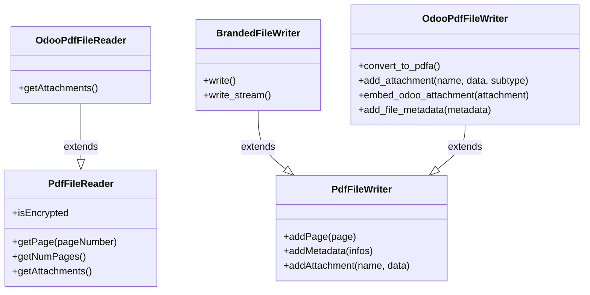

# C4 Code Level: odoo/tools/pdf

<!--
  Auto-generated by the c4-code agent. One file per source directory.
  Refreshed on /banyan-c4 reruns whenever the directory's content hash changes.
  Do NOT hand-edit; edits will be overwritten on next refresh.
-->

## Generated By

- **Agent**: c4-code (Haiku)
- **Run ID**: banyan-c4-20260701-init
- **Generated**: 2026-07-01T00:00:00Z
- **Source Directory**: odoo/tools/pdf
- **Content Hash**: [vendored-pypdf-version-adapters]

## Overview

- **Name**: PDF Generation & Manipulation Toolkit
- **Description**: Unified wrapper over multiple PyPDF library versions (PyPDF 4.x, PyPDF2 2.x, PyPDF2 1.x) with Odoo-specific PDF operations (merging, stamping, form-filling, PDF/A compliance, attachment embedding)
- **Location**: odoo/tools/pdf — 4 files, ~670 lines
- **Language**: Python
- **Purpose**: Abstracts version-specific PyPDF APIs to support older OS distributions; adds Odoo-specific PDF features including watermarking, RTL text reshaping, font embedding for PDF/A, and attachment management

## Code Elements

### Functions / Methods

- `merge_pdf(pdf_data: list[bytes]) → bytes`
  - **Description**: Merge multiple PDF documents into a single PDF, concatenating pages without preserving attachments
  - **Location**: `__init__.py:152`
  - **Visibility**: public
  - **Dependencies**: PdfFileReader, PdfFileWriter

- `fill_form_fields_pdf(writer: PdfFileWriter, form_fields: dict[str, Any]) → None`
  - **Description**: Fill in PDF form fields with provided values, handling version-specific API differences and known PyPDF2 bugs
  - **Location**: `__init__.py:169`
  - **Visibility**: public
  - **Dependencies**: PdfFileWriter, parse_version

- `rotate_pdf(pdf: bytes) → bytes`
  - **Description**: Rotate PDF pages 90 degrees clockwise, returning new PDF without attachments
  - **Location**: `__init__.py:222`
  - **Visibility**: public
  - **Dependencies**: PdfFileReader, PdfFileWriter

- `to_pdf_stream(attachment) → io.BytesIO`
  - **Description**: Convert attachment (PDF or image) to PDF BytesIO stream
  - **Location**: `__init__.py:239`
  - **Visibility**: public
  - **Dependencies**: PIL (Image), stdlib (io)

- `add_banner(pdf_stream: io.BytesIO, text: str = None, logo: bool = False, thickness: float = 2cm) → io.BytesIO`
  - **Description**: Add a rotated banner with optional Odoo logo to upper right corner of all PDF pages
  - **Location**: `__init__.py:251`
  - **Visibility**: public
  - **Dependencies**: PdfFileReader, PdfFileWriter, reportlab, PIL, file_open

- `reshape_text(text: str) → str`
  - **Description**: Apply bidirectional text shaping for RTL languages (Arabic, Hebrew, Farsi) using unicode bidirectional algorithm
  - **Location**: `__init__.py:314`
  - **Visibility**: public
  - **Dependencies**: unicodedata, internal (reshape from arabic_reshaper)

### Classes / Modules

- **`BrandedFileWriter`** — PdfFileWriter subclass that automatically adds Odoo metadata to PDF documents
  - **Location**: `__init__.py:131` (2.x variant) or `__init__.py:140` (1.x variant)
  - **Methods**: `write_stream(...)` (2.x) or `write(...)` (1.x)
  - **Implements / Extends**: PdfFileWriter
  - **Dependencies**: PdfFileWriter

- **`PdfReader`** — Compatibility wrapper over version-specific PyPDF readers
  - **Location**: `_pypdf.py:28` (pypdf 4.x) or `_pypdf2_1.py:17` (PyPDF2 1.x) or `_pypdf2_2.py` (PyPDF2 2.x)
  - **Methods**: `isEncrypted` (property), `getPage(pageNumber)`, `getNumPages()`, `numPages` (property), `getDocumentInfo()`, `getFormTextFields()`
  - **Implements / Extends**: version-specific PdfReader base
  - **Dependencies**: PyPDF or PyPDF2

- **`PdfWriter`** — Compatibility wrapper over version-specific PyPDF writers
  - **Location**: `_pypdf.py:50` (pypdf 4.x) or `_pypdf2_1.py:28` (PyPDF2 1.x) or `_pypdf2_2.py:15` (PyPDF2 2.x)
  - **Methods**: `addPage(page)`, `addMetadata(infos)`, `getFields(...)`, `_addObject(...)`
  - **Implements / Extends**: version-specific PdfWriter base
  - **Dependencies**: PyPDF or PyPDF2

- **`OdooPdfFileReader`** — Extended PdfFileReader with support for extracting embedded PDF attachments
  - **Location**: `__init__.py:346`
  - **Methods**: `getAttachments() → list[tuple[str, bytes]]` (yields filename, file data pairs)
  - **Implements / Extends**: PdfFileReader
  - **Dependencies**: PdfFileReader, internal traversal logic

- **`OdooPdfFileWriter`** — Extended PdfFileWriter with PDF/A compliance, XMP metadata, and attachment support
  - **Location**: `__init__.py:381`
  - **Methods**: `__init__(...)`, `format_subtype(subtype: str) → str`, `add_attachment(name: str, data: bytes, subtype: str = None)`, `embed_odoo_attachment(attachment, subtype=None)`, `cloneReaderDocumentRoot(reader)`, `_set_id(pdf_id)`, `convert_to_pdfa()`, `add_file_metadata(metadata_content: bytes)`, `_create_attachment_object(attachment: dict) → IndirectObject`
  - **Implements / Extends**: PdfFileWriter
  - **Dependencies**: PdfFileWriter, fontTools, reportlab, PIL, MD5, datetime

### Constants / Configuration

- `DEFAULT_PDF_DATETIME_FORMAT` = "D:%Y%m%d%H%M%S+00'00'" — ISO 8601 PDF timestamp format — `__init__.py:99`
- `TIMEOUT` = 30 (seconds) — default zeep client timeouts for WSDL/XSD loading and operations — `client.py:9`
- `SERIALIZABLE_TYPES` — tuple of JSON-serializable types allowed in zeep responses — `client.py:10`
- `REGEX_SUBTYPE_UNFORMATED` — matches unformatted MIME-type strings (e.g., `text/xml`) — `__init__.py:100`
- `REGEX_SUBTYPE_FORMATED` — matches correctly formatted PDF attachment subtypes (e.g., `/text#2Fxml`) — `__init__.py:101`

## Module-Level Initialization

- **PyPDF version selection** — `__init__.py:50` attempts to import `_pypdf2_2`, `_pypdf`, `_pypdf2_1` in order, re-exporting the first successful import's classes
- **Zlib decompression patch** — `__init__.py:35` monkey-patches PyPDF2.filters.decompress to handle memory-error conditions gracefully
- **DictionaryObject unwrapping patch** — `__init__.py:116` monkey-patches werkzeug.datastructures.DictionaryObject.get() to unwrap indirect object references
- **NameObject renumber_table update** — `__init__.py:119` ensures correct PDF name delimiters are encoded

## Dependencies

### Internal

- `odoo.tools.parse_version` — version string comparison
- `odoo.tools.misc.file_open()` — safe file resource access
- `odoo.tools.arabic_reshaper.reshape()` — Arabic character shaping for RTL text

### External

- `PyPDF` (4.x) OR `PyPDF2` (2.x OR 1.x) — PDF read/write; version auto-selected
- `reportlab >= 3.0` — PDF canvas operations, colors, drawing primitives for banners and watermarks
- `PIL / Pillow` — image conversion to PDF, image embedding in canvas
- `fontTools >= 4.0` — TrueType font glyph introspection for PDF/A compliance
- `stdlib (io, re, unicodedata, zlib, hashlib, datetime)` — core utilities

## Relationships

## Notes for Higher-Level Synthesis

- **Document generation boundary** — All PDF operations happen here; called by report generators, invoicing, document signing, and EDI modules in Odoo's backend.
- **Version abstraction layer** — Shields the rest of Odoo from PyPDF API churn across versions 1.x, 2.x, and 4.x; future version upgrades only require changes here.
- **PDF/A compliance engine** — OdooPdfFileWriter.convert_to_pdfa() is specialized for archival-quality PDF generation (required for e-invoicing compliance in Europe, PEPPOL standard).
- **RTL text support** — Integrates with arabic_reshaper and bidirectional text algorithms to support non-Latin document generation.
