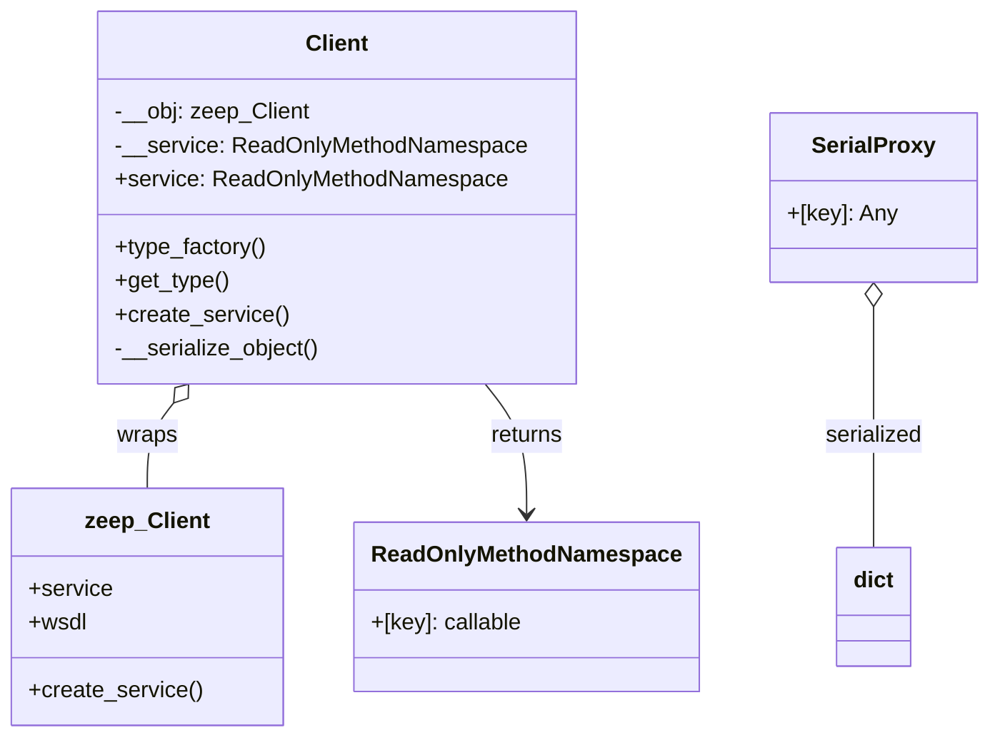

# C4 Code Level: odoo/tools/zeep

<!--
  Auto-generated by the c4-code agent. One file per source directory.
  Refreshed on /banyan-c4 reruns whenever the directory's content hash changes.
  Do NOT hand-edit; edits will be overwritten on next refresh.
-->

## Generated By

- **Agent**: c4-code (Haiku)
- **Run ID**: banyan-c4-20260701-init
- **Generated**: 2026-07-01T00:00:00Z
- **Source Directory**: odoo/tools/zeep
- **Content Hash**: [vendored-zeep-wrapper-edi-soap]

## Overview

- **Name**: Vendored Zeep SOAP/WSDL Client Wrapper
- **Description**: Wrapper layer over zeep SOAP client with simplified API, automatic serialization, timeouts, and session management for EDI/e-invoicing integrations
- **Location**: odoo/tools/zeep — 10 files, ~200 lines
- **Language**: Python
- **Purpose**: Provides a minimal, serialization-safe SOAP client interface for EDI integrations (e-invoicing, PEPPOL) that abstracts zeep's complex API and enforces timeout/session configuration

## Code Elements

### Functions / Methods

- `Client.__init__(*args, **kwargs)`
  - **Description**: Initialize Odoo SOAP client with automatic transport setup, timeout configuration, and session binding
  - **Location**: `client.py:22`
  - **Visibility**: public
  - **Dependencies**: zeep.Transport, zeep.Client

- `Client.service` (property)
  - **Description**: Lazy-loaded service proxy with automatic serialization of SOAP responses to dicts/primitives
  - **Location**: `client.py:54`
  - **Visibility**: public
  - **Dependencies**: internal (ReadOnlyMethodNamespace, __serialize_object_wrapper)

- `Client.type_factory(namespace: str) → ReadOnlyMethodNamespace`
  - **Description**: Construct a namespace of SOAP types for the given namespace, with automatic serialization
  - **Location**: `client.py:62`
  - **Visibility**: public
  - **Dependencies**: zeep WSDL type system

- `Client.get_type(name: str) → callable`
  - **Description**: Retrieve a serialized WSDL type by name
  - **Location**: `client.py:73`
  - **Visibility**: public
  - **Dependencies**: zeep WSDL type system

- `Client.create_service(binding_name: str, address: str) → ReadOnlyMethodNamespace`
  - **Description**: Create a custom service binding at a specific address with serialized operations
  - **Location**: `client.py:76`
  - **Visibility**: public
  - **Dependencies**: zeep service creation

- `Client.__serialize_object(obj) → Union[dict, primitive]` (classmethod)
  - **Description**: Recursively convert zeep compound objects to dicts, or primitives to themselves; raise ValueError if unsupported type
  - **Location**: `client.py:37`
  - **Visibility**: internal
  - **Dependencies**: zeep.xsd.valueobjects.CompoundValue

- `Client.__serialize_object_wrapper(method) → callable` (classmethod)
  - **Description**: Wrap SOAP method to automatically serialize its return value
  - **Location**: `client.py:48`
  - **Visibility**: internal
  - **Dependencies**: internal (__serialize_object)

### Classes / Modules

- **`Client`** — Odoo wrapper for zeep.Client with simplified API and automatic serialization
  - **Location**: `client.py:15`
  - **Methods**: `__init__(...)`, `service` (property), `type_factory(namespace)`, `get_type(name)`, `create_service(binding_name, address)`
  - **Implements / Extends**: wrapper (not inheritance)
  - **Attributes**: `__obj` (underlying zeep.Client), `__service` (cached service proxy)
  - **Dependencies**: zeep, internal (ReadOnlyMethodNamespace, SerialProxy, __serialize_object)

- **`ReadOnlyMethodNamespace`** — [purpose unclear from signature] — `client.py:[unknown line]`
  - **Location**: `client.py:[unknown line — appears to be SimpleNamespace subclass or similar]`
  - **Visibility**: internal
  - **Dependencies**: [unclear]

- **`SerialProxy`** — Dict-like object for holding serialized SOAP compound values
  - **Location**: `client.py:[unknown line]`
  - **Visibility**: internal
  - **Dependencies**: [unclear]

### Constants / Configuration

- `TIMEOUT` = 30 (seconds) — default timeout for WSDL/XSD document loading and SOAP operations — `client.py:9`
- `SERIALIZABLE_TYPES` — tuple of allowed types: `(type(None), bool, int, float, str, bytes, tuple, list, dict, Decimal, date, datetime, timedelta, Response)` — `client.py:10`

### Re-Exports (Zeep Passthrough)

The module re-exports zeep's public APIs from `exceptions.py`, `helpers.py`, `ns.py`, `wsa.py`, and `wsdl.*` submodules:

- `zeep.exceptions.*` — SOAP/WSDL exception types
- `zeep.ns.*` — XML namespace constants
- `zeep.wsa.*` — WS-Addressing (SOAP routing) utilities
- `zeep.wsdl.utils.etree_to_string()`, `get_or_create_header()` — WSDL/XML utilities
- `zeep.wsse.username.UsernameToken` — WS-Security username authentication
- `zeep.wsse.Signature`, `BinarySignature`, `MemorySignature` — XML digital signature

## Module-Level Exports

- `__init__.py` exposes: `Transport`, `Plugin`, `Settings`, `Client`, `exceptions`, `ns`, `wsdl`

## Dependencies

### Internal

- None — pure wrapper with no Odoo domain imports (file_open, etc.)

### External

- `zeep >= 1.0` — SOAP/WSDL client library, fault handling, transport, plugins
- `requests >= 2.0` — HTTP session for SOAP transport (re-exported in Response type)
- `stdlib (decimal, datetime, types)` — numeric and temporal types for serialization

## Relationships

## Notes for Higher-Level Synthesis

- **EDI integration boundary** — Only entry point for SOAP/WSDL communication in Odoo; used exclusively by e-invoicing, PEPPOL, and legacy EDI connector modules.
- **Serialization contract** — Enforces that all SOAP responses are converted to Python primitives (dict, list, str, int, float, Decimal, date, datetime, timedelta, Response). Unsupported zeep types raise ValueError immediately rather than leaking into Odoo domain logic.
- **Timeouts hardcoded** — Both WSDL loading and SOAP operations use a fixed 30-second timeout. Can be overridden per-client via `timeout=` and `operation_timeout=` kwargs.
- **Session binding** — Transport layer binds a `requests.Session` object to allow connection pooling and cookie persistence across SOAP calls (useful for stateful EDI services).
