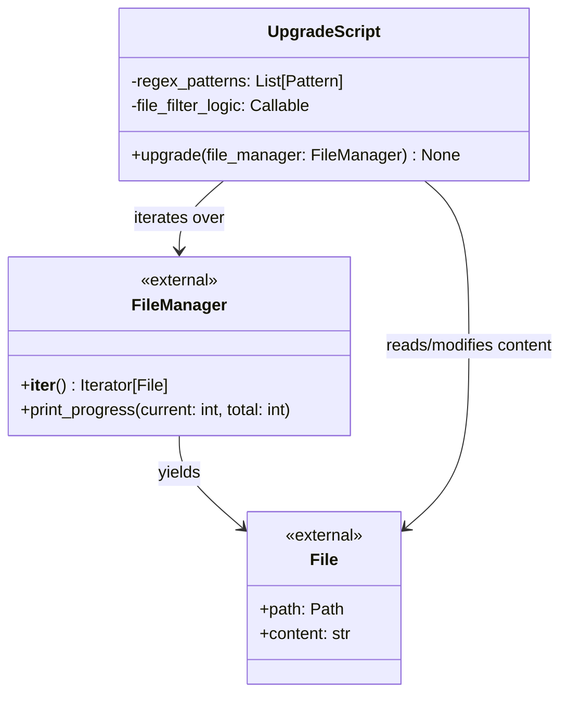

# C4 Code Level: Odoo Upgrade Code

<!--
  Auto-generated by the c4-code agent. One file per source directory.
  Refreshed on /banyan-c4 reruns whenever the directory's content hash changes.
  Do NOT hand-edit; edits will be overwritten on next refresh.
-->

## Generated By

- **Agent**: c4-code (Haiku)
- **Run ID**: banyan-c4-20260701-init
- **Generated**: 2026-07-01T00:00:00Z
- **Source Directory**: odoo/upgrade_code
- **Content Hash**: 059868F548798B30E7CF115FFB6F363F12EACEC448697734638D89EA6FB3716E

## Overview

- **Name**: Odoo Upgrade Code Utilities
- **Description**: Python scripts that implement version upgrade migrations, transforming code artifacts during Odoo version transitions using regex-based pattern matching and file manipulation.
- **Location**: odoo/upgrade_code — 2 files, 77 lines
- **Language**: Python
- **Purpose**: Provides example and production upgrade migration scripts that automatically refactor Odoo model files and configuration (XML, JS, PY) during major version upgrades.

## Code Elements

### Functions / Methods

- `upgrade(file_manager: FileManager) → None`
  - **Description**: Main entry point for upgrade migration; iterates over filtered files and applies regex transformations to their content.
  - **Location**: `17.5-00-example.py:4` and `17.5-01-tree-to-list.py:4`
  - **Visibility**: public
  - **Dependencies**: `re` (standard library), file_manager parameter (Odoo upgrade framework)

### Modules / Scripts

- **`17.5-00-example.py`** — Example upgrade script demonstrating regex-based string and quote transformation in model files
  - **Location**: `17.5-00-example.py:1`
  - **Functions**: `upgrade(file_manager)`
  - **Key Logic**:
    - File filtering: selects Python files in `models/` subdirectories excluding `__init__.py` (lines 11–16)
    - Regex compilation: defines redacted_text_re (uppercase-starting, multi-word, dot-ending patterns in single quotes) and strings_re (lowercase single-word patterns in double quotes) (lines 46–61)
    - Content transformation: replaces matched patterns, swapping quote styles (lines 69–70)
    - Progress tracking: reports completion via file_manager.print_progress (line 76)
  - **Status**: Example only — marked as broken in production (line 6)

- **`17.5-01-tree-to-list.py`** — Production upgrade script for converting tree view references to list view references
  - **Location**: `17.5-01-tree-to-list.py:1`
  - **Functions**: `upgrade(file_manager)`
  - **Key Logic**:
    - File filtering: selects XML, JS, and PY files (line 5)
    - Regex compilation: nine regex patterns to match tree view references in various contexts (XML attributes, tags, XPath expressions, string literals, mode attributes, env.ref() calls) (lines 9–18)
    - Content transformation: applies nine sequential substitutions, replacing `tree` with `list` in all matched contexts (lines 22–32)
    - String replacement: handles natural language replacements like `' tree view '` → `' list view '` (line 22)
    - Progress tracking: reports completion via file_manager.print_progress (line 35)
  - **Dependencies**: `re` (standard library), file_manager parameter (Odoo upgrade framework)

### Constants / Configuration

- `redacted_text_re` — Compiled regex pattern matching quoted redacted text with uppercase start, multiple words, and terminal dot (`17.5-00-example.py:46`)
- `strings_re` — Compiled regex pattern matching quoted lowercase single-word strings (`17.5-00-example.py:61`)
- `reg_tree_to_list_*` (9 patterns) — Compiled regex patterns for matching tree view references in XML attributes, tags, XPath expressions, and string literals (`17.5-01-tree-to-list.py:9–18`)

## Dependencies

### Internal

- None — these upgrade scripts are self-contained utilities with no intra-project imports.

### External

- `re` — Python standard library module for regular expression compilation and pattern matching. Used for complex string transformations across multiple file types during version migration.

## Relationships

## Notes for Higher-Level Synthesis

- **Boundary code**: These scripts act as the integration point between Odoo's upgrade framework (file_manager parameter) and the domain transformation logic (regex patterns and file manipulations). They are entry-point handlers.
- **Pattern library**: The nine tree-to-list regex patterns (17.5-01-tree-to-list.py) are reusable transformation templates. If additional upgrade scripts follow similar multi-pattern strategies, this file could be factored into a shared pattern library.
- **Pure transformation utility**: This directory does not depend on other odoo modules and should not be grouped with domain-bearing components. It is a standalone infrastructure tool for supporting version migrations.
