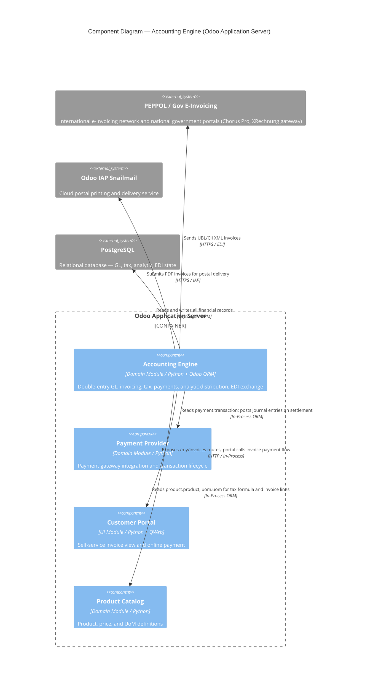

# C4 Component Level: Accounting Engine

<!--
  Auto-generated by the c4-component agent. One file per logical component.
  Refreshed on /banyan-c4 reruns when constituent code docs change.
-->

## Generated By

- **Agent**: c4-component (Sonnet)
- **Run ID**: banyan-c4-20260701-init
- **Generated**: 2026-07-01T00:00:00Z
- **Constituent Code Docs**: 9 files (of 12 assigned; 3 not yet present) — see [Code Elements](#code-elements)

## Overview

- **Name**: Accounting Engine
- **Description**: Double-entry bookkeeping, invoicing, tax computation, accounts payable/receivable, multi-currency, payment reconciliation, analytic cost tracking, EDI/e-invoicing, and outbound invoice delivery
- **Type**: Domain Module
- **Technology**: Python 3, Odoo 18.0 ORM (PostgreSQL), lxml, safe_eval, Werkzeug/WSGI HTTP layer

## Purpose

The Accounting Engine owns the complete financial transaction lifecycle for an Odoo company: from initial journal entry creation through invoice sending, payment matching, tax reporting, and cost center allocation. It is the authoritative system of record for the general ledger (`account.move` / `account.move.line`). Tax computation, multi-currency revaluation, analytic distribution, and electronic invoice exchange (PEPPOL, Factur-X, XRechnung) are all part of this component. Outbound delivery channels — EDI transmission, snailmail postal — are the component's external boundary. This component does not own payment gateway integration (that is the payment provider domain) but it does reconcile gateway settlements into journal entries.

## Software Features

- **General Ledger and Journal Entries**: Double-entry bookkeeping via `account.move` / `account.move.line`; supports journals, fiscal periods, multi-currency, and sequence-controlled numbering
- **Invoicing and Credit Notes**: Customer invoices, vendor bills, credit notes, and refund workflows with portal payment support and bulk-send wizard
- **Tax Engine**: Configurable tax rules (percentage, fixed, Python formula) with `account.tax`; EU OSS fiscal position automation; US chart-of-accounts and sales-tax support
- **Payment Reconciliation**: Bridges payment gateway transactions (`payment.transaction`) to accounting journal entries; tracks refund chains, tokenized payments, and available-for-refund balances
- **Analytic Cost Tracking**: Multi-dimensional cost/revenue allocation via `analytic.mixin` JSON distribution across projects, departments, and cost centers; mandatory/optional plan rules per company
- **Electronic Invoice Exchange (EDI)**: Generates and parses UBL 2.0/2.1, CII/Factur-X, PEPPOL BIS 3, XRechnung, NLCIUS, E-FFF, and Singapore UBL; routes documents through PEPPOL networks and government portals
- **Outbound Invoice Delivery**: Unified send wizard (`account.move.send`) orchestrating email, PDF download, EDI submission, and physical postal mail (via IAP snailmail service)

## Code Elements

This component is composed of the following code-level docs:

| Code Doc | Coverage |
|---|---|
| [`code/c4-code-addons-account.md`](../code/c4-code-addons-account.md) | Core module: GL, invoices, taxes, payments, bank statements, reports, wizards |
| [`code/c4-code-addons-account_payment.md`](../code/c4-code-addons-account_payment.md) | Payment-to-accounting bridge: journal posting, refund traceability, portal payment |
| [`code/c4-code-addons-analytic.md`](../code/c4-code-addons-analytic.md) | Analytic plans, accounts, distribution mixin, distribution models |
| [`code/c4-code-addons-account_edi.md`](../code/c4-code-addons-account_edi.md) | EDI base framework: `account.edi.document`, `account.edi.format`, cron-driven retry |
| [`code/c4-code-addons-account_edi_ubl_cii.md`](../code/c4-code-addons-account_edi_ubl_cii.md) | UBL/CII format generators and parsers (8+ international standards) |
| [`code/c4-code-addons-account_tax_python.md`](../code/c4-code-addons-account_tax_python.md) | Python-formula tax extension for `account.tax` |
| [`code/c4-code-addons-snailmail_account.md`](../code/c4-code-addons-snailmail_account.md) | Snailmail postal delivery boundary adapter for `account.move.send` |
| [`code/c4-code-addons-l10n_us.md`](../code/c4-code-addons-l10n_us.md) | US chart of accounts, sales-tax configuration, ABA routing number support |
| [`code/c4-code-addons-l10n_eu_oss.md`](../code/c4-code-addons-l10n_eu_oss.md) | EU OSS VAT fiscal positions and cross-border tax automation |

**Not yet present** (3 docs assigned but files absent at run time — will be included on next `/banyan-c4` refresh):

- `c4-code-addons-account_intrastat.md` — EU Intrastat statistical reporting
- `c4-code-addons-account_move_send.md` — Unified send wizard core (`account.move.send`)
- `c4-code-addons-account_check_printing.md` — Physical check generation and printing

## Interfaces

### Odoo JSON-RPC / ORM — Journal Entry API

- **Protocol**: In-Process Function (Odoo ORM, called by other addons and via JSON-RPC `/web/dataset/call_kw`)
- **Description**: CRUD and business-action methods on `account.move` (invoice/journal entry) and `account.move.line`
- **Operations**:
  - `account.move.create(vals_list) → recordset` — Create one or more journal entries or invoices
  - `account.move.action_post() → None` — Validate and post a draft invoice/bill, triggering EDI and payment workflows
  - `account.move.button_cancel() → None` — Cancel a posted entry; creates reversal when required
  - `account.move.action_reverse(vals) → dict` — Create a credit note or reversal journal entry
  - `account.move.read_group(domain, fields, groupby) → list` — Aggregated financial reporting queries
- **Contract**: In-process; field definitions in `addons/account/models/account_move.py`

### Tax Computation API

- **Protocol**: In-Process Function
- **Description**: Computes tax amounts from invoice lines; extended by `account_tax_python` for formula-based taxes
- **Operations**:
  - `account.tax._compute_amount(base_amount, price_unit, quantity, product, partner) → float` — Compute tax amount for one line
  - `account.tax._eval_tax_amount_formula(raw_base, evaluation_context) → float` — Evaluate Python formula for code-type taxes
  - `account.analytic.plan.get_relevant_plans(business_domain, company_id) → list` — Return applicable analytic plans for a document type
- **Contract**: In-process; `addons/account/models/account_tax.py`, `addons/account_tax_python/models/account_tax.py`

### EDI Document Exchange API

- **Protocol**: In-Process Function + Events (cron-driven async)
- **Description**: Generates and transmits electronic invoice documents; receives inbound EDI for import
- **Operations**:
  - `account.edi.format._get_move_applicability(move) → dict` — Determine if a format applies to a given invoice
  - `account.edi.format._post_invoice_edi(invoices) → dict` — Generate and transmit EDI documents for posted invoices
  - `account.edi.format._import_invoice_xml(invoice, file_data) → list` — Parse inbound XML into `account.move`
  - `account.edi.document` state lifecycle (`to_send → sent | error`) — Managed by cron retry job
- **Contract**: In-process extension registry; `addons/account_edi/models/account_edi_format.py`; XML schemas in `addons/account_edi_ubl_cii/data/`

### Analytic Distribution Mixin

- **Protocol**: In-Process Function (mixin inherited by transactional models)
- **Description**: Provides analytic cost allocation fields and validation to any transactional document
- **Operations**:
  - `analytic.mixin._get_analytic_distribution() → dict` — Return `{account_id_csv: percentage}` for a record
  - `analytic.mixin._check_account_id() → None` — Validate mandatory plan coverage; raises `ValidationError`
  - `analytic.mixin._query_analytic_accounts(table) → SQL` — Build sub-query for analytic filtering
- **Contract**: In-process abstract mixin; `addons/analytic/models/analytic_mixin.py`

### Customer Portal — Invoice Payment

- **Protocol**: REST (Odoo `@http.route`, type='http' / type='json')
- **Description**: Allows authenticated portal users to view and pay their invoices online
- **Operations**:
  - `GET /my/invoices` — List customer invoices
  - `GET /my/invoices/<int:invoice_id>` — Invoice detail with pay button
  - `POST /payment/pay` — Submit payment (delegates to payment provider)
- **Contract**: Route definitions in `addons/account_payment/controllers/portal.py`

### Invoice Send Wizard (account.move.send)

- **Protocol**: In-Process Function + HTTP (wizard form action)
- **Description**: Unified dispatch for invoice delivery: email, PDF, EDI, snailmail
- **Operations**:
  - `account.move.send._get_alerts(moves, moves_data) → dict` — Pre-send validation; returns channel-specific alerts
  - `account.move.send._hook_if_success(moves_data) → None` — Post-send hooks (snailmail letter creation, etc.)
  - `account.move.send.batch.wizard` (TransientModel) — Bulk send workflow for multi-invoice batches
- **Contract**: In-process; `addons/snailmail_account/models/account_move_send.py`; snailmail boundary at `snailmail.letter._snailmail_print()`

## Dependencies

### Components Used (in-process or in-system)

- **Payment Provider** — `account_payment` reconciles `payment.transaction` records (created by payment gateway flows) into `account.payment` journal entries; accounting reads `payment.provider`, `payment.token`, `payment.method` models. Cross-component refs verified by master-index pass.
- **Product Catalog** — `account.tax` formula evaluation and invoice lines reference `product.product` and `uom.uom` for quantity-based tax calculation and line item detail.
- **Contact / Partner** — `res.partner` is enriched with EDI fields (PEPPOL ID, bank IBAN/BIC) and invoice sending method (snailmail, email); address quality gates control snailmail dispatch.
- **Company / Multi-Tenant Base** — `res.company` carries fiscal country, currency, and analytic plan applicability rules consumed throughout this component.

### External Systems

- **PEPPOL Network / Government E-Invoicing Portals** — Receives UBL/CII XML invoices generated by `account_edi_ubl_cii`; specific portals include Chorus Pro (France), e-ESSENTIALS (Belgium), and national XRechnung gateway (Germany)
- **IAP Snailmail Service** — Odoo In-App Purchase postal printing service; `snailmail.letter._snailmail_print()` submits PDF invoices for physical mailing via HTTP to Odoo IAP endpoint
- **Payment Gateway (external)** — Payment gateway transactions settle into `payment.transaction`; `account_payment` bridges these into GL entries (read dependency, not a direct outbound call from this component)
- **PostgreSQL** — All journal entries, analytic lines, and EDI document state stored in ORM-managed tables; raw SQL used in `_compute_invoices_count()` for performance-sensitive aggregation

## Component Diagram

## Notes for Higher-Level Synthesis

- **Likely deployment**: Same container as all other Odoo addons — the single **Odoo Application Server** (Python/Werkzeug WSGI process). There is no separate microservice; accounting runs in-process alongside CRM, Sales, HR, etc. The `analytic` addon is a shared library deployed inside this same container and imported by accounting, HR Timesheet, Expenses, Purchase, and Sales simultaneously.
- **Cross-container traffic**:
  - Outbound HTTPS to **PEPPOL / government e-invoicing networks** (UBL/CII XML documents via `account_edi_ubl_cii`)
  - Outbound HTTPS to **Odoo IAP Snailmail** endpoint (PDF invoice payload via `snailmail.letter._snailmail_print()`)
  - All other communication is in-process ORM within the same container
- **Cron workers**: EDI document retry (`account_edi` cron) runs as a scheduled Odoo server action — same process, different thread/worker; not a separate container
- **EDI boundary note**: `account_edi` + `account_edi_ubl_cii` together form a plugin-registry pattern; new format handlers can be added without modifying the base — this is the primary extension point for future country-specific e-invoicing mandates
- **Analytic as cross-cutting infrastructure**: `analytic.mixin` is inherited by `account.move.line`, `hr.timesheet.line`, `hr.expense`, `sale.order.line`, and `purchase.order.line`; the c4-container agent should represent `analytic` as a shared library dependency, not a standalone component in the accounting boundary exclusively
