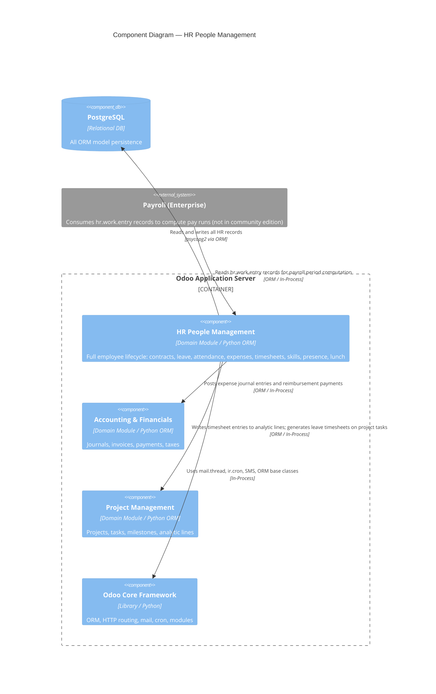

# C4 Component Level: HR People Management

<!--
  Auto-generated by the c4-component agent. One file per logical component.
  Refreshed on /banyan-c4 reruns when constituent code docs change.
-->

## Generated By

- **Agent**: c4-component (Sonnet)
- **Run ID**: banyan-c4-20260701-init
- **Generated**: 2026-07-01T00:00:00Z
- **Constituent Code Docs**: 15 files — see [Code Elements](#code-elements)

## Overview

- **Name**: HR People Management
- **Description**: Manages the complete employee lifecycle — from recruitment through onboarding, daily work tracking (attendance, time off, expenses, timesheets), skills development, and offboarding — with the resource calendar as the canonical scheduling backbone.
- **Type**: Domain Module
- **Technology**: Python 3.10+, Odoo ORM 18.0, PostgreSQL (via Odoo ORM), pytz, python-dateutil

## Purpose

HR People Management owns every HR domain concept that touches an employee's working life: the employee master record, employment contracts, leave requests and allocations, attendance clock-in/out, expense reports, timesheets, work entry records, skills and resume tracking, work location / remote-work scheduling, presence detection, lunch ordering, and the cross-cutting bridge that synchronises approved leave into analytic timesheets. The `resource.calendar` model is the canonical source of truth for scheduled working hours; all leave, attendance, and work-entry calculations respect it. This component explicitly does not own payroll computation (enterprise-only) — it produces the `hr.work.entry` records that payroll consumes but does not perform payroll runs.

## Software Features

- **Employee master and org chart**: Create and maintain employee profiles, departments, jobs, work locations, and company-level localization hooks (auto-install of regional HR modules).
- **Contract lifecycle management**: Draft, activate, and close employment contracts with wage, work schedule, and payroll structure type; detect calendar drift between contract and employee calendars.
- **Leave and allocation management**: Request, approve (one- or two-level), and accrue time off; configure leave types with allocation policies, accrual plans, and calendar event creation.
- **Attendance and overtime tracking**: Record clock-in/clock-out via kiosk, RFID, or manual entry; compute worked hours and overtime against the resource calendar; capture geolocation and browser context.
- **Expense report workflow**: Submit, approve, and post employee expenses to accounting journals; handle multi-currency, tax computation, receipt attachments, duplicate detection, and reimbursement payments.
- **Timesheet and project time logging**: Log employee hours against project tasks; bridge approved leave and public holidays into analytic timesheet lines automatically.
- **Skills, competency, and resume tracking**: Maintain employee skill matrices with hierarchical skill types and proficiency levels; log skill progression history; manage CV/resume timeline entries.
- **Work location and presence monitoring**: Schedule per-employee weekly office/home/other locations with daily exceptional overrides; detect presence via IP, email activity, and manual flags; send absence notifications.
- **Lunch ordering and prepaid wallet**: Allow employees to order from scheduled suppliers with toppings and location routing; manage a per-employee prepaid wallet ledger; automate supplier notifications via cron.

## Code Elements

This component is composed of the following code-level docs:

- [`code/c4-code-addons-hr.md`](../code/c4-code-addons-hr.md) — Employee master, departments, jobs, work locations, localization hooks
- [`code/c4-code-addons-hr_contract.md`](../code/c4-code-addons-hr_contract.md) — Employment contracts, wage, state machine, payroll structure type linkage
- [`code/c4-code-addons-hr_holidays.md`](../code/c4-code-addons-hr_holidays.md) — Time off requests, allocations, leave types, accrual plans
- [`code/c4-code-addons-hr_attendance.md`](../code/c4-code-addons-hr_attendance.md) — Clock-in/out records, overtime computation, kiosk integration
- [`code/c4-code-addons-hr_expense.md`](../code/c4-code-addons-hr_expense.md) — Expense lines, expense sheets, accounting journal posting, reimbursements
- [`code/c4-code-addons-hr_timesheet.md`](../code/c4-code-addons-hr_timesheet.md) — Timesheet entries on analytic lines, project/task linkage, portal access
- [`code/c4-code-addons-hr_recruitment.md`](../code/c4-code-addons-hr_recruitment.md) — Applicants, job postings, recruitment pipeline stages, candidate management
- [`code/c4-code-addons-hr_work_entry.md`](../code/c4-code-addons-hr_work_entry.md) — Work entry records (foundational type definitions and views)
- [`code/c4-code-addons-hr_work_entry_contract.md`](../code/c4-code-addons-hr_work_entry_contract.md) — Contract-driven work entry computation, cron regeneration, regeneration wizard
- [`code/c4-code-addons-resource.md`](../code/c4-code-addons-resource.md) — Resource calendar, weekly attendance lines, leave exceptions, interval utilities
- [`code/c4-code-addons-hr_skills.md`](../code/c4-code-addons-hr_skills.md) — Skill types, skills, proficiency levels, employee skill assessments, skill log history, resume lines
- [`code/c4-code-addons-hr_homeworking.md`](../code/c4-code-addons-hr_homeworking.md) — Per-day work location schedule, exceptional location overrides, presence icon
- [`code/c4-code-addons-hr_presence.md`](../code/c4-code-addons-hr_presence.md) — Presence detection via IP/email/session, manual override, SMS absence notifications
- [`code/c4-code-addons-lunch.md`](../code/c4-code-addons-lunch.md) — Lunch orders, suppliers, products, prepaid wallet transactions, kiosk HTTP API
- [`code/c4-code-addons-project_timesheet_holidays.md`](../code/c4-code-addons-project_timesheet_holidays.md) — Bridge: auto-generates analytic timesheet lines from approved leave and public holidays

## Interfaces

### Odoo ORM Public Models (In-Process Function)

- **Protocol**: In-Process Function (Odoo ORM method calls and JSON-RPC `call_kw`)
- **Description**: All HR models are accessible to other addons and the web client via the standard Odoo ORM public API.
- **Operations**:
  - `hr.employee.search/read/write/create/unlink(...)` — CRUD on employee master records
  - `hr.contract._check_current_contract()` — Validate no overlapping active contracts for an employee
  - `hr.leave.action_validate()` / `action_refuse()` — Approve or reject a time-off request; triggers timesheet generation (via project_timesheet_holidays bridge)
  - `hr.leave.allocation.action_validate()` — Approve a leave allocation grant
  - `hr.attendance._compute_worked_hours()` / `_compute_overtime_hours()` — Recompute attendance analytics
  - `hr.expense.sheet.action_submit_sheet()` / `action_approve_expense_sheets()` / `action_post_journal_entries()` — Expense workflow transitions
  - `hr.work.entry` (generate) — Contract-driven work entry records produced by `hr_work_entry_contract` cron
  - `resource.calendar._get_work_hours_data(start, end, resource)` — Work hours in a period for a resource
  - `hr.employee.skill` create/write — Employee skill assessments with automatic history log
  - `lunch.cashmove.get_wallet_balance(user)` — Query employee prepaid lunch balance
- **Contract**: In-process; see model field definitions in each constituent code-level doc.

### Lunch Kiosk HTTP API (REST/JSON)

- **Protocol**: REST (JSON, `auth='user'`)
- **Description**: JSON endpoints consumed by the lunch kiosk frontend for session-scoped ordering.
- **Operations**:
  - `GET /lunch/infos` — Current orders, wallet balance, pending amounts for a user
  - `GET /lunch/pay` — Transition new orders to "ordered" state
  - `GET /lunch/trash` — Cancel and delete uncommitted orders
  - `GET /lunch/payment_message` — Render payment dialog template
  - `GET /lunch/user_location_set` — Persist user's preferred delivery location
  - `GET /lunch/user_location_get` — Retrieve user's preferred delivery location
- **Contract**: In-code (`addons/lunch/controllers/main.py`); no separate OpenAPI spec.

### Timesheet Portal HTTP Interface (REST/HTML)

- **Protocol**: REST (HTML/JSON, `auth='public'` or `auth='user'` with portal group)
- **Description**: Portal-facing timesheet views for employees and external project collaborators.
- **Operations**:
  - Portal timesheet list/form views via `controllers/portal.py` (hr_timesheet)
  - Project timesheet portal integration via `controllers/project.py` (hr_timesheet)
- **Contract**: In-code (`addons/hr_timesheet/controllers/`); standard Odoo portal template rendering.

## Dependencies

### Components Used (in-process or in-system)

- **AccountingFinancials component** — `hr_expense` posts approved expense sheets as `account.move` journal entries and creates `account.payment` records for reimbursements; uses `account.journal` and `account.tax` models. Cross-component refs verified by master-index pass.
- **ProjectManagement component** — `hr_timesheet` extends `project.project` and `project.task`; `project_timesheet_holidays` creates `account.analytic.line` records against project tasks for approved leave periods. Cross-component refs verified by master-index pass.
- **AnalyticAccounting component** — All timesheet entries write to `account.analytic.line` (the cost-accounting bridge model). Cross-component refs verified by master-index pass.

### External Systems

- **PostgreSQL** — All model persistence via Odoo ORM (psycopg2); attendance overtime uses raw SQL window functions for performance.
- **pytz timezone database** — Used across attendance, leave, resource calendar, lunch, and timesheet modules for timezone-aware work hour arithmetic.
- **python-dateutil** — Relative date arithmetic for contract durations, trial periods, leave accrual rolling dates, and timesheet period filtering.
- **Mail / Chatter subsystem (Odoo internal)** — `mail.thread` mixin on contracts, leave requests, expense sheets, attendance records, and lunch suppliers provides approval notifications, chatter history, and activity tracking.
- **SMS subsystem (Odoo internal)** — `hr_presence` uses `sms.composer` to send absence notification messages.
- **ir.cron (Odoo internal scheduler)** — Used by: `hr_work_entry_contract` for periodic work entry regeneration; `hr_presence` for daily presence computation; `lunch` for automated supplier order emails.
- **Google Maps API (client-side URL only)** — `get_google_maps_url()` in `hr_attendance` generates a static URL from captured geolocation coordinates; no server-side API call is made.

## Component Diagram

## Notes for Higher-Level Synthesis

- **Likely deployment**: Same container as all other Odoo addon modules — the Odoo Application Server. This component is a collection of standard Odoo addons deployed together in a single Python process; there is no separate HR microservice.
- **Cross-container traffic**: None identified within community edition. All inter-component calls are in-process ORM calls within the same Odoo worker process. The `hr_expense` → accounting boundary and `hr_timesheet` → analytic boundary are in-process within the same container.
- **Payroll boundary note**: `hr_work_entry` and `hr_work_entry_contract` produce `hr.work.entry` records that are the atomic time units consumed by `hr_payroll` (enterprise edition). In community deployments, work entries are generated but not consumed by payroll.
- **Resource calendar is the scheduling spine**: Every leave duration, overtime calculation, attendance expected-hours comparison, and work entry generation reads `resource.calendar` and its `attendance_ids` / `leave_ids`. Changes to a calendar affect all downstream HR calculations.
- **project_timesheet_holidays straddles two components**: Its primary logic belongs here (it triggers on HR leave validation and writes HR-attributed timesheets), but its `project.task.is_timeoff_task` extension is also meaningful to the Project Management component. The master-index pass should verify the final grouping decision.
