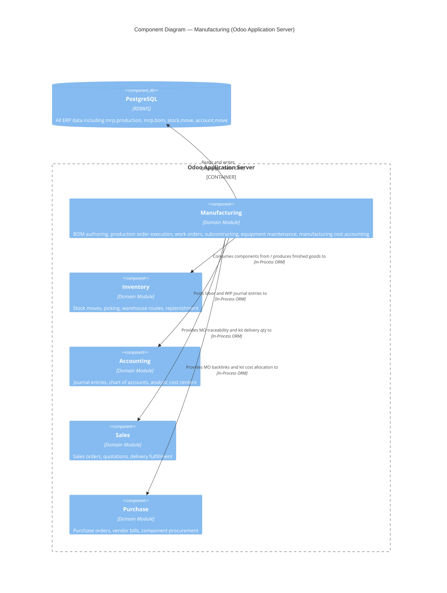

# C4 Component Level: Manufacturing

<!--
  Auto-generated by the c4-component agent. One file per logical component.
  Refreshed on /banyan-c4 reruns when constituent code docs change.
-->

## Generated By

- **Agent**: c4-component (Sonnet)
- **Run ID**: banyan-c4-20260701-init
- **Generated**: 2026-07-01T00:00:00Z
- **Constituent Code Docs**: 7 files — see [Code Elements](#code-elements)

## Overview

- **Name**: Manufacturing
- **Description**: Owns the full manufacturing execution domain: bill of materials authoring, production order lifecycle, work order execution, workcenter capacity, subcontracting, equipment maintenance, and manufacturing cost accounting.
- **Type**: Domain Module
- **Technology**: Python 18.0 (Odoo ORM); XML/Owl frontend for production UI and supplier portal

## Purpose

The Manufacturing component manages the end-to-end production lifecycle inside an Odoo instance — from recipe definition (Bill of Materials) through production order execution (component consumption, work order tracking, finished goods production) to cost finalization (labor accounting, WIP valuation). It extends the Inventory domain for stock movements and the Accounting domain for journal entries, while keeping the production planning model (mrp.bom, mrp.production, mrp.workorder) as its authoritative core.

Out of scope for this component: raw inventory replenishment rules (owned by the Inventory component), general procurement flows (owned by Purchase), and general sales fulfillment (owned by Sales). This component owns the manufacturing-specific projections and constraints layered on top of those domains.

## Software Features

- **Bill of Materials management**: Authors and versions manufacturing recipes; supports normal, kit (phantom), and subcontracting BOM types; enforces cost-share allocation across BOM lines.
- **Production order execution**: Creates, confirms, and closes manufacturing orders; manages component consumption moves, backorders, scrap, and finished goods production to stock.
- **Work order and workcenter scheduling**: Breaks production orders into discrete work operations on named workcenters; tracks actual vs. planned durations, OEE, and workcenter availability calendars.
- **Subcontracting workflow**: Routes outsourced production through a subcontractor BOM type; ships components, receives finished goods, and exposes a supplier-facing portal for status tracking.
- **Kit (phantom BOM) explosion on sale and purchase**: Expands kit products into their component lines at sales order and purchase order line level; traces delivery quantities and cost allocation per component.
- **Manufacturing cost accounting**: Computes cost of goods manufactured from raw material valuations and work order labor; posts labor and WIP journal entries; allocates landed costs across kit components via cost_share percentages.
- **Equipment and maintenance tracking**: Registers production equipment assets, schedules preventive maintenance requests, and tracks corrective maintenance through configurable workflow stages.

## Code Elements

This component is composed of the following code-level docs:

- [`code/c4-code-addons-mrp.md`](../code/c4-code-addons-mrp.md) — Core MRP module: lifecycle hooks, warehouse integration, stock.move schema extensions
- [`code/c4-code-addons-mrp_account.md`](../code/c4-code-addons-mrp_account.md) — Manufacturing cost accounting: WIP valuation, labor posting, COGS computation
- [`code/c4-code-addons-mrp_subcontracting.md`](../code/c4-code-addons-mrp_subcontracting.md) — Subcontracting workflows: subcontractor BOM type, component shipping, finished goods receipt, supplier portal
- [`code/c4-code-addons-sale_mrp.md`](../code/c4-code-addons-sale_mrp.md) — Sale-MRP bridge: kit explosion on sale order lines, MO-to-sale traceability, phantom BOM protection
- [`code/c4-code-addons-purchase_mrp.md`](../code/c4-code-addons-purchase_mrp.md) — Purchase-MRP bridge: component replenishment from POs, kit qty received, cost-share landed costs
- [`code/c4-code-addons-maintenance.md`](../code/c4-code-addons-maintenance.md) — Maintenance module: equipment asset lifecycle, maintenance requests, team and stage management
- `code/c4-code-addons-mrp_workcenter.md` — Not present in repository (standalone mrp_workcenter addon not found; workcenter models reside in the core mrp addon)

## Interfaces

### Production Order Actions (In-Process ORM)

- **Protocol**: In-Process Function (Odoo ORM model methods)
- **Description**: Lifecycle actions on mrp.production records called from UI buttons or external modules
- **Operations**:
  - `mrp.production.button_mark_done() → bool` — Finalizes production order; triggers component move validation and labor cost posting
  - `mrp.production.action_confirm() → bool` — Confirms draft MO; reserves components from stock
  - `mrp.production._cal_price(consumed_moves) → bool` — Computes finished good cost from raw material valuations and work order labor
  - `mrp.production._post_labour() → None` — Creates debit/credit journal entries for labor costs against WIP account
  - `mrp.production.get_linked_sale_orders() → sale.order recordset` — Returns all sales orders that originated this MO
  - `mrp.production._get_purchase_orders() → purchase.order recordset` — Returns purchase orders linked to this MO via procurement chain
- **Contract**: In-process; see mrp_account models/mrp_production.py and sale_mrp models/mrp_production.py

### Bill of Materials Query (In-Process ORM)

- **Protocol**: In-Process Function
- **Description**: BOM lookup and explosion used by sales, purchase, and stock rule modules
- **Operations**:
  - `mrp.bom._bom_find(product, picking_type, company_id, bom_type) → mrp.bom` — Finds the applicable BOM for a product given context
  - `mrp.bom.explode(product, quantity) → (bom_lines, by_products)` — Recursively explodes a BOM into flat component list with quantities
  - `mrp.bom._ensure_bom_is_free() → None or raises UserError` — Guards phantom BOM modification when active sales lines exist
- **Contract**: In-process; see addons/mrp/models/mrp_bom.py

### WIP Accounting Wizard (In-Process ORM)

- **Protocol**: In-Process Function (Odoo transient model / wizard)
- **Description**: Bulk WIP adjustment entries for pending production orders
- **Operations**:
  - `mrp.wip.accounting.action_create_wip_entries() → None` — Creates batch WIP adjustment journal entries for open MOs
- **Contract**: In-process; see mrp_account/wizard/mrp_wip_accounting.py

### Subcontractor Supplier Portal (HTTP / Web)

- **Protocol**: REST (Odoo portal controller, `type='http'`)
- **Description**: Supplier-facing web portal allowing subcontractors to view component receipts and finished goods shipment status
- **Operations**:
  - `GET /subcontracting/portal/...` — View subcontracting order details, component status
- **Contract**: See mrp_subcontracting/controllers/ and mrp_subcontracting/views/subcontracting_portal_templates.xml

### Maintenance Request Actions (In-Process ORM)

- **Protocol**: In-Process Function
- **Description**: Equipment lifecycle and maintenance request management
- **Operations**:
  - `maintenance.equipment` CRUD — Create/update/delete equipment assets
  - `maintenance.request` state transitions — Open, assign, close maintenance requests
- **Contract**: In-process; see addons/maintenance/models/

## Dependencies

### Components Used (in-process or in-system)

- **Inventory (Stock)** — Manufacturing component consumption and finished goods production generate stock.move records; stock.rule and stock.warehouse extended for manufacturing routes and pull replenishment. Cross-component refs verified by master-index pass.
- **Accounting** — mrp_account posts account.move journal entries for labor costs and WIP; reads account.account (expense and WIP accounts); writes account.analytic.line for cost center tracking. Cross-component refs verified by master-index pass.
- **Sales** — sale_mrp bridge adds computed fields to sale.order and sale.order.line for MO traceability and kit delivery quantity; protects phantom BOMs used on active sales orders. Cross-component refs verified by master-index pass.
- **Purchase** — purchase_mrp bridge adds computed fields to purchase.order and purchase.order.line for MO backlinks and kit quantity received; allocates purchase cost per component via cost_share. Cross-component refs verified by master-index pass.
- **Product Catalog** — mrp.bom and mrp.production reference product.product and product.template for variant selection, UOM, and standard/average/FIFO cost methods.

### External Systems

- **PostgreSQL (via Odoo ORM)** — All manufacturing domain data persisted in PostgreSQL; pre-init hooks perform DDL (ALTER TABLE) directly on stock.move for large-dataset performance.
- **Odoo Resource / Calendar** — Work center capacity planning uses the resource.calendar model for available_time and scheduling work orders.
- **Odoo Mail** — Maintenance module depends on mail for equipment activity tracking, maintenance request notifications, and chatter on production orders (inherited from mrp.production via mail.thread).

## Component Diagram

## Notes for Higher-Level Synthesis

- **Likely deployment**: Same container as all other Odoo business modules — the Odoo Application Server (single Python process per worker). Manufacturing is not a microservice; it is a set of installed addons within the monolithic Odoo instance. Co-located with Inventory, Accounting, Sales, Purchase, and all other enabled addons.
- **Cross-container traffic**: None detected. All interactions between manufacturing and other Odoo modules are in-process ORM calls within the same application server. The subcontractor supplier portal is served by the same Odoo HTTP stack (Werkzeug/WSGI) as the rest of the application — no separate container required.
- **Schema coupling note**: The mrp pre-init hook directly alters the `stock.move` PostgreSQL table with DDL before ORM initialization, indicating a tight schema dependency with the Inventory domain that cannot be decoupled without migration work.
- **mrp_workcenter addon absent**: The standalone `mrp_workcenter` addon listed in the orchestrator's constituent docs does not exist in this repository. Workcenter models (mrp.workcenter, capacity, OEE) are implemented inside the core `mrp` addon.
- **mrp_maintenance addon absent**: The `c4-code-addons-mrp_maintenance.md` file was not found. The `maintenance` module (standalone equipment/maintenance domain) is documented via `c4-code-addons-maintenance.md` and included in this component's scope based on the orchestrator context.
