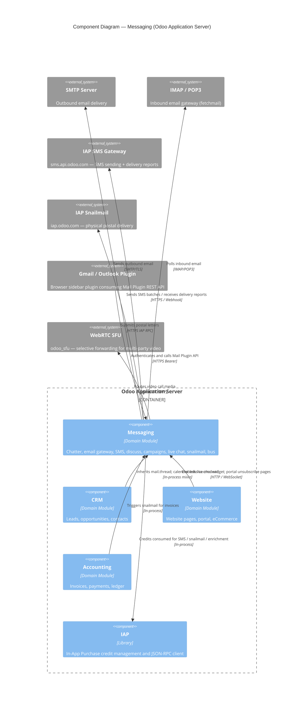

# C4 Component Level: Messaging

<!--
  Auto-generated by the c4-component agent. One file per logical component.
  Refreshed on /banyan-c4 reruns when constituent code docs change.
-->

## Generated By

- **Agent**: c4-component (Sonnet)
- **Run ID**: banyan-c4-20260701-init
- **Generated**: 2026-07-01T00:00:00Z
- **Constituent Code Docs**: 13 files — see [Code Elements](#code-elements)

## Overview

- **Name**: Messaging
- **Description**: All inter-user, user-to-document, and cross-system communication — chatter threading, email gateway (in/out), SMS, postal mail, real-time bus, mass campaigns, live chat, and external mail-client integration
- **Type**: Domain Module
- **Technology**: Python 3 / Odoo ORM 18.0, OWL (JS frontend), gevent (longpolling), WebSocket, Jinja2 template rendering

## Purpose

The Messaging component is the communication backbone of the Odoo platform. It provides three foundational primitives — `mail.thread` (document chatter mixin), `mail.message` (universal message store), and `bus.bus` (real-time event bus) — that virtually every other Odoo module inherits or subscribes to. On top of these primitives it delivers a complete multi-channel outreach stack: inbound/outbound email via SMTP/IMAP, SMS via the IAP gateway, physical postal letters via IAP Snailmail, bulk email/SMS marketing campaigns with link tracking, live chat with chatbot scripting, and sidebar integration with Gmail/Outlook clients. The component is explicitly out of scope for sales, accounting, or HR domain logic; it is a horizontal infrastructure layer.

## Software Features

- **Document Chatter and Activity Tracking**: Any ORM model can inherit `mail.thread` and `mail.activity.mixin` to gain a threaded conversation panel, change-tracking log, and scheduled task (activity) management — used by 50+ models across the codebase.
- **Email Gateway (Inbound and Outbound)**: Outbound emails flow through `mail.mail` → `ir.mail_server` (SMTP); inbound emails arrive via fetchmail (POP3/IMAP) or aliased SMTP routes, are parsed, and converted to `mail.message` records on the target document.
- **Real-Time Notification Bus**: `bus.bus` (gevent longpolling on port 8072 + WebSocket) delivers presence updates, channel messages, and domain-change notifications to connected browser clients with sub-second latency.
- **Discuss Channels and Direct Messages**: Persistent team chat rooms (`discuss.channel`) with emoji reactions, voice/video calls (WebRTC with SFU), link previews, canned responses, and OdooBot automated onboarding interactions.
- **SMS Delivery via IAP**: Single and bulk SMS sending through the Odoo IAP gateway (`SmsApi`), with delivery state tracking, opt-out management, phone blacklist enforcement, and pluggable provider support (`SmsApiBase`).
- **Mass Email and SMS Campaign Engine**: Audience segmentation, A/B testing, scheduled delivery, unsubscribe/opt-out flows, and per-recipient click tracking via shortened links (`link.tracker`) with UTM attribution.
- **Live Chat and Chatbot**: Embeddable website chat widget with multi-origin deployment variants, operator assignment, chatbot script engine (scripted decision trees), CSAT rating, and session analytics.
- **Postal Letter Delivery (Snailmail)**: PDF generation from QWeb templates and submission to the IAP Snailmail service for physical postal delivery, with address validation and error-recovery wizards.
- **Gmail/Outlook Sidebar Integration**: OAuth-like API key authentication and REST endpoints that allow the Odoo for Gmail/Outlook plugin to log emails, create CRM contacts, and enrich company data via IAP.
- **Calendar Scheduling and Reminders**: Meeting management with RRULE recurrence, attendee RSVP flow, email/popup alarm delivery, Discuss video-call integration, and iCal export for Google Calendar/Outlook sync.
- **Periodic KPI Digest Emails**: Configurable scheduled digest emails summarising business KPIs (revenue, leads, support tickets) for manager subscriptions.

## Code Elements

This component is composed of the following code-level docs:

- [`code/c4-code-addons-mail.md`](../code/c4-code-addons-mail.md) — Core mail/discuss infrastructure: chatter mixin, email gateway, discuss channels, activities, presence, WebRTC
- [`code/c4-code-addons-mail_bot.md`](../code/c4-code-addons-mail_bot.md) — OdooBot: automated welcome messages and keyword-based bot responses in Discuss
- [`code/c4-code-addons-bus.md`](../code/c4-code-addons-bus.md) — IM Bus: gevent longpolling and WebSocket real-time event delivery backbone
- [`code/c4-code-addons-sms.md`](../code/c4-code-addons-sms.md) — SMS gateway: IAP-backed sending, delivery state machine, webhook receiver, template rendering
- [`code/c4-code-addons-mass_mailing.md`](../code/c4-code-addons-mass_mailing.md) — Email Marketing: mailing lists, campaigns, A/B testing, unsubscribe workflows, delivery analytics
- [`code/c4-code-addons-mass_mailing_sms.md`](../code/c4-code-addons-mass_mailing_sms.md) — SMS Marketing: extends mass_mailing with SMS as a campaign channel, opt-out tracking, click tracing
- [`code/c4-code-addons-link_tracker.md`](../code/c4-code-addons-link_tracker.md) — Link Tracker: URL shortener with click analytics and UTM attribution for campaign emails/SMS
- [`code/c4-code-addons-snailmail.md`](../code/c4-code-addons-snailmail.md) — Snailmail: IAP-backed physical postal letter generation and delivery with address validation
- [`code/c4-code-addons-im_livechat.md`](../code/c4-code-addons-im_livechat.md) — Live Chat: embeddable website chat widget, chatbot scripting, operator assignment, CSAT analytics
- [`code/c4-code-addons-mail_plugin.md`](../code/c4-code-addons-mail_plugin.md) — Mail Plugin: Gmail/Outlook sidebar API (OAuth-like auth, IAP enrichment, email logging)
- [`code/c4-code-addons-calendar.md`](../code/c4-code-addons-calendar.md) — Calendar: meeting scheduling, RRULE recurrence, attendee RSVP, alarm delivery, iCal export
- [`code/c4-code-addons-digest.md`](../code/c4-code-addons-digest.md) — KPI Digest: cron-driven periodic KPI summary emails for manager subscriptions
- [`code/c4-code-addons-contacts.md`](../code/c4-code-addons-contacts.md) — Contacts: UI-layer address book over res.partner, with chatter and activity integration

## Interfaces

### mail.thread Mixin (In-Process)

- **Protocol**: In-Process Function
- **Description**: Horizontal mixin that any ORM model inherits to gain chatter, change tracking, followers, and activities. The primary extension point for the entire component.
- **Operations**:
  - `message_post(body, message_type, subtype_xmlid, partner_ids, ...) → mail.message` — Post a message or note to a document thread; notifies followers
  - `message_subscribe(partner_ids, subtype_ids) → bool` — Add followers to a document
  - `message_unsubscribe(partner_ids) → bool` — Remove followers
  - `activity_schedule(act_type_xmlid, date_deadline, summary, user_id) → mail.activity` — Create a scheduled activity on the document
  - `_message_log(body) → mail.message` — Write a silent internal log entry (no notification)
  - `_track_set_log_message(message)` — Append field-change tracking values to a chatter entry
- **Contract**: In-process; see `addons/mail/models/mail_thread.py` and `addons/mail/models/mail_activity_mixin.py`

### Discuss Channel HTTP API

- **Protocol**: REST (JSON-RPC style, `type='json'`)
- **Description**: Backend HTTP endpoints for Discuss channel operations used by the OWL frontend.
- **Operations**:
  - `POST /discuss/channel/messages` — Fetch paginated message history for a channel
  - `POST /discuss/channel/message_post` — Post a new message to a channel
  - `POST /discuss/channel/members` — Add/remove channel members
  - `POST /discuss/channel/rtc/join_call` — Join/leave a WebRTC call session
  - `POST /mail/attachment/upload` — Upload a file attachment
  - `POST /mail/link_preview` — Fetch Open Graph metadata for a URL
- **Contract**: In-process JSON-RPC; see `addons/mail/controllers/discuss/` and `addons/mail/controllers/thread.py`

### WebSocket / Longpolling Bus

- **Protocol**: WebSocket (upgrade from HTTP); longpolling fallback on `GET /longpolling/poll`
- **Description**: Real-time bidirectional channel delivering domain notifications, presence updates, and chat messages to browser clients. Served on the gevent worker (port 8072).
- **Operations**:
  - `bus.bus._sendone(channel, notification_type, message)` — Server pushes a typed notification to a named channel
  - `bus.bus._sendmany(notifications)` — Batched push of multiple notifications
  - `GET /websocket` — WebSocket upgrade endpoint (auth: user or guest)
  - `GET /longpolling/poll?last=N` — Longpolling fallback for older clients
- **Contract**: In-process for server-side send; wire format is JSON over WebSocket frames; see `addons/bus/websocket.py` and `addons/bus/controllers/`

### SMS Delivery API

- **Protocol**: In-Process Function (public API on `sms.sms`)
- **Description**: Enqueue and send outgoing SMS messages through the IAP gateway or a custom provider.
- **Operations**:
  - `SmsSms.send(unlink_failed, unlink_sent, auto_commit) → None` — Send all queued `sms.sms` records
  - `SmsSms.resend_failed() → dict` — Reset failed SMS to outgoing and retry
  - `SmsController.update_sms_status(message_statuses) → 'OK'` — Inbound IAP delivery webhook
- **Contract**: In-process; see `addons/sms/models/sms_sms.py`; webhook route `POST /sms/status` (public auth)

### Mass Mailing HTTP Endpoints

- **Protocol**: REST (public + portal auth)
- **Description**: Public-facing endpoints for mailing campaign interactions.
- **Operations**:
  - `GET /unsubscribe_from_list` — Email campaign unsubscribe landing page
  - `GET /sms/<mailing_id>/<trace_code>` — SMS opt-out landing page
  - `POST /sms/<mailing_id>/unsubscribe/<trace_code>` — Process SMS opt-out
  - `GET /r/<code>/s/<sms_id_int>` — SMS short link redirect with click tracing
  - `GET /r/<code>` — Email campaign short link redirect
- **Contract**: HTTP; see `addons/mass_mailing/controllers/` and `addons/mass_mailing_sms/controllers/main.py`

### Live Chat Widget API

- **Protocol**: REST + WebSocket (CORS-enabled)
- **Description**: Embeddable JavaScript widget bootstrap and chat session management used by external websites.
- **Operations**:
  - `GET /im_livechat/loader/<int:id>` — Serve the chat widget JS bundle for a given channel
  - `POST /im_livechat/get_session` — Create or resume a visitor chat session
  - `POST /im_livechat/chatbot/message/post` — Post a message to the chatbot script engine
  - `WebSocket /websocket` — Real-time message exchange during active chat session (shared bus WebSocket)
- **Contract**: HTTP + WebSocket; see `addons/im_livechat/controllers/`; CORS headers enabled for cross-origin embed

### Mail Plugin (Gmail/Outlook) REST API

- **Protocol**: REST (Bearer token auth, CORS-enabled)
- **Description**: API consumed by the Odoo for Gmail and Odoo for Outlook browser plugins.
- **Operations**:
  - `GET /mail_plugin/auth` — Render OAuth-like consent form for plugin authorization
  - `POST /mail_plugin/auth/confirm` — Issue temporary auth code on user consent
  - `POST /mail_plugin/auth/access_token` — Exchange auth code for persistent API key (1-day TTL)
  - `POST /mail_plugin/partner/enrich_and_create_company` — Create and IAP-enrich a company contact
  - `POST /mail_plugin/partner/enrich_and_update_company` — Enrich an existing company with IAP data
- **Contract**: REST/JSON; see `addons/mail_plugin/controllers/`; auth scope `odoo.plugin.outlook`

### Snailmail Letter API (In-Process)

- **Protocol**: In-Process Function
- **Description**: Submit a document (invoice, letter) for physical postal delivery via the IAP Snailmail service.
- **Operations**:
  - `SnailmailLetter.send() → None` — Generate PDF, validate address, submit to IAP postal service
  - `SnailmailLetter.handle_error(error_code) → None` — Record delivery failure and surface wizard
- **Contract**: In-process; see `addons/snailmail/models/snailmail_letter.py`

## Dependencies

### Components Used (in-process or in-system)

- **CRM / Sales** — mail_plugin enriches res.partner used by CRM; calendar events link polymorphically to crm.lead records; mass mailing recipient lists frequently target CRM contacts. Cross-component refs verified by master-index pass.
- **Website / Portal** — im_livechat embeds on website pages; mass mailing unsubscribe and SMS opt-out pages use the portal framework. Cross-component refs verified by master-index pass.
- **Accounting** — snailmail is commonly triggered from account.move (invoices) for formal postal delivery. Cross-component refs verified by master-index pass.
- **IAP (In-App Purchase)** — sms, snailmail, and mail_plugin all consume `iap.account` credits; `iap_tools.iap_jsonrpc` is the shared RPC client used for all three IAP calls.

### External Systems

- **SMTP Server** — Outbound email delivery; configured in `ir.mail_server` (host, port, TLS, credentials)
- **IMAP/POP3 Server (fetchmail)** — Inbound email polling; configured in `fetchmail.server` model
- **Odoo IAP SMS Gateway** (`https://sms.api.odoo.com`) — SMS sending and delivery reporting; authenticated via `iap.account` token + database UUID
- **Odoo IAP Snailmail Service** (`iap.odoo.com`) — Physical postal letter submission; authenticated via IAP account
- **Odoo IAP Company Enrichment Service** — Email-domain-based company data enrichment called by mail_plugin
- **Gmail / Outlook Browser Plugin** — External client that calls the Mail Plugin REST API via CORS
- **Google Calendar / Outlook Calendar** — iCal feed export and sync (vObject / `.ics` format)
- **WebRTC SFU (odoo_sfu)** — Selective Forwarding Unit for multi-party video calls in Discuss

## Component Diagram

## Notes for Higher-Level Synthesis

- **Likely deployment**: Same container as the core Odoo Application Server — all addons run inside a single Odoo Python process. The bus longpolling worker (`bus.bus`, gevent) runs in a separate worker process on **port 8072** (the `--gevent` worker), but it still shares the same database and Python environment; it is a process variant of the same container, not a separate container. The im_livechat embed assets are served from the same Odoo process but can be proxied to external origins via CORS headers.
- **Cross-container traffic**:
  - **SMTP** — outbound TCP/TLS from the app server to the configured mail relay (port 25/465/587); this is a container egress call.
  - **IMAP/POP3** — outbound TCP from app server to the mail server, polled by an `ir.cron` job every N minutes.
  - **IAP endpoints** (SMS, Snailmail, Enrichment) — outbound HTTPS from the app server to `sms.api.odoo.com` / `iap.odoo.com`; initiated by the IAP RPC client.
  - **WebRTC SFU** — browser clients connect directly to `odoo_sfu` (external service); the Odoo server only provides ICE server configuration (`mail.ice_server`).
  - **Gmail/Outlook Plugin** — inbound CORS HTTPS to `/mail_plugin/*` and `/im_livechat/*` routes from the browser plugin runtime.
- **Scale note**: `bus.bus` is the highest-frequency write path in the system; every user keystroke in Discuss, every record save in a model with `tracking=True`, and every livechat message generates a bus event. The gevent longpolling worker must be scaled independently from the main WSGI workers at medium-to-large deployments.
- **Mixin blast radius**: `mail.thread` is inherited by 50+ models. Any breaking change to this mixin affects every document type in the system. The component boundary here is deliberately wide to capture this cross-cutting reality.
