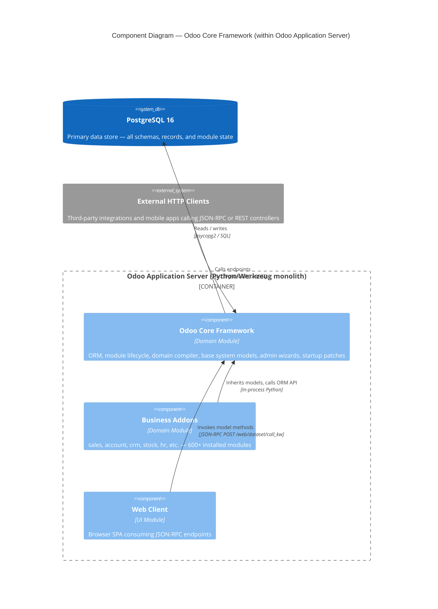

# C4 Component Level: Odoo Core Framework

<!--
  Auto-generated by the c4-component agent. One file per logical component.
  Refreshed on /banyan-c4 reruns when constituent code docs change.
-->

## Generated By

- **Agent**: c4-component (Sonnet)
- **Run ID**: banyan-c4-20260701-init
- **Generated**: 2026-07-01T00:00:00Z
- **Constituent Code Docs**: 11 files — see [Code Elements](#code-elements)

## Overview

- **Name**: Odoo Core Framework
- **Description**: The ORM engine, module lifecycle system, domain query compiler, and foundational base addon that all other Odoo modules depend on
- **Type**: Domain Module
- **Technology**: Python 3.12, PostgreSQL 16 (psycopg2), Werkzeug 3.x

## Purpose

Odoo Core Framework is the mandatory kernel layer of the Odoo application server. It provides the object-relational mapper (`BaseModel`, `Field`, `Environment`), the module registry (`Registry`, `Graph`, `MigrationManager`), the domain expression compiler (`expression`), and the base system models (`ir.*`, `res.*`) that every addon depends on. It also handles database connection pooling, transaction management, WSGI request dispatch, and startup-time compatibility patching of third-party libraries.

Out of scope for this component: business-domain logic (sales, accounting, HR), frontend JavaScript, and deployment topology (those belong to the Container and Context levels).

## Software Features

- **ORM with full CRUD**: Provides `BaseModel.create`, `read`, `write`, `unlink`, and `search` as the universal data access API across all 600+ addons; enforces field-level validation, `@api.depends` computed fields, and `@api.constrains` rules automatically.
- **Module lifecycle management**: Discovers addon manifests, resolves dependency graphs, loads Python modules in topological order, executes pre/post/end migration scripts, and initializes or alters database schemas without manual DDL.
- **Per-database model registry**: Maintains a singleton `Registry` per PostgreSQL database containing all active model classes, LRU field-value caches, and connection pools; rebuilt on module install/upgrade without server restart.
- **Domain query compilation**: Translates Odoo domain filter syntax (list-of-tuples) into parameterized SQL WHERE clauses with JOIN resolution, trigram pre-filtering, and `any`/`not any` subquery optimization.
- **Core system models**: Ships `ir.model`, `ir.rule`, `ir.http`, `ir.actions.*`, `res.partner`, `res.users`, `res.lang`, and 40+ companion models that underpin multi-company security, action dispatch, HTTP routing, and internationalization.
- **Administrative wizards**: Provides transient-model wizards for module install/upgrade/uninstall, language import/export/install, and contact deduplication — covering the full system administration surface.
- **Startup compatibility layer**: Applies targeted monkey-patches to Werkzeug, psycopg2, lxml, MarkupSafe, pytz, num2words, and stdlib modules at boot time to guarantee cross-version compatibility without requiring specific library pins.

## Code Elements

This component is composed of the following code-level docs:

- [`code/c4-code-odoo.md`](../code/c4-code-odoo.md) — Core ORM (`models.py`, `fields.py`, `api.py`), WSGI layer (`http.py`), DB cursors (`sql_db.py`), exception hierarchy, and structured logging
- [`code/c4-code-odoo-modules.md`](../code/c4-code-odoo-modules.md) — Module discovery, dependency graph, registry singleton, migration manager, and database initialization
- [`code/c4-code-odoo-osv.md`](../code/c4-code-odoo-osv.md) — Domain expression compiler and SQL WHERE-clause generator (`osv/expression.py`)
- [`code/c4-code-odoo-monkeypatches.md`](../code/c4-code-odoo-monkeypatches.md) — Startup-time third-party library patches applied via `patch_all()`
- [`code/c4-code-odoo-conf.md`](../code/c4-code-odoo-conf.md) — Module-level configuration state (`addons_paths`, `server_wide_modules`)
- [`code/c4-code-odoo-upgrade.md`](../code/c4-code-odoo-upgrade.md) — `odoo.upgrade` namespace package root for version-upgrade script trees
- [`code/c4-code-odoo-upgrade-code.md`](../code/c4-code-odoo-upgrade-code.md) — Code-transformation upgrade scripts (tree→list view rename, example refactors)
- [`code/c4-code-odoo-addons-base.md`](../code/c4-code-odoo-addons-base.md) — Base addon root: sub-package wiring, `post_init` hook, manifest declaration
- [`code/c4-code-odoo-addons-base-models.md`](../code/c4-code-odoo-addons-base-models.md) — `ir.*` and `res.*` model definitions (~45 files, 27,650 lines)
- [`code/c4-code-odoo-addons-base-wizard.md`](../code/c4-code-odoo-addons-base-wizard.md) — System administration transient wizards (language, module, partner merge)
- [`code/c4-code-odoo-addons-base-report.md`](../code/c4-code-odoo-addons-base-report.md) — Module Reference Report (`IrModelReferenceReport`) for admin introspection

## Interfaces

### JSON-RPC Model Dispatch

- **Protocol**: REST (JSON over HTTP POST)
- **Description**: Exposes every ORM model method to authenticated clients via a single endpoint; the primary interface consumed by the Odoo web client and external integrations.
- **Operations**:
  - `POST /web/dataset/call_kw` — `call_kw(model, name, args, kwargs) → Any`: invokes any public model method by name with access-control enforcement
- **Contract**: In-process; method signatures and return types are defined on `BaseModel` subclasses in each addon. See `odoo/api.py:514` (`call_kw`).

### ORM In-Process API

- **Protocol**: In-Process Function
- **Description**: Python API consumed by every addon's models and controllers via the `Environment` object. This is the dominant internal call surface of the entire Odoo codebase.
- **Operations**:
  - `env[model_name] → BaseModel` — access model bound to current user/cursor/company
  - `BaseModel.create(vals_list) → BaseModel` — insert one or more records
  - `BaseModel.read(fields, load) → list[dict]` — fetch field values
  - `BaseModel.write(vals) → bool` — update fields on a recordset
  - `BaseModel.unlink() → bool` — delete records
  - `BaseModel.search(domain, offset, limit, order) → BaseModel` — query records
  - `BaseModel.browse(ids) → BaseModel` — fetch by primary key
- **Contract**: In-process; see `odoo/models.py` (`BaseModel`) and `odoo/api.py` (`Environment`).

### Domain Expression API

- **Protocol**: In-Process Function
- **Description**: Utility API for composing, normalizing, and compiling domain filter expressions; consumed by `BaseModel.search`, `IrRule`, and any addon that builds dynamic search filters.
- **Operations**:
  - `AND(domains) → domain` — intersect domain list
  - `OR(domains) → domain` — union domain list
  - `normalize_domain(domain) → domain` — make implicit `&` explicit
  - `expression(domain, model, alias, query) → expression` — compile to SQL
- **Contract**: In-process; see `odoo/osv/expression.py`.

### HTTP Controller Routing

- **Protocol**: REST (HTTP/WSGI)
- **Description**: WSGI entry point that routes inbound HTTP requests to registered `Controller` subclasses; manages session, authentication, and ORM Environment setup per request.
- **Operations**:
  - `Application.__call__(environ, start_response)` — WSGI dispatch entry point
  - `@http.route(path, auth, type)` — registers a controller method as an HTTP endpoint
  - `Request.env → Environment` — ORM environment bound to the current authenticated user
- **Contract**: In-process; see `odoo/http.py` (`Application`, `Controller`, `Request`).

### Module Lifecycle API

- **Protocol**: In-Process Function
- **Description**: Administrative API for module install, upgrade, and uninstall; consumed by wizards and the `ir.module.module` model.
- **Operations**:
  - `Registry.new(db_name, force_demo, status, update_module) → Registry` — (re)build registry for a database, running pending module operations
  - `load_modules(registry, force_demo, status, update_module) → None` — orchestrate 6-step module loading
  - `MigrationManager.migrate_module(pkg, stage) → None` — execute migration scripts for a module
  - `neutralize_database(cursor) → None` — sanitize a copy of a production database
- **Contract**: In-process; see `odoo/modules/registry.py`, `odoo/modules/loading.py`, `odoo/modules/migration.py`.

## Dependencies

### Components Used (in-process or in-system)

No other Odoo-level components are upstream dependencies of this component — it is the foundational layer. All other components depend on it. Cross-component refs verified by master-index pass.

### External Systems

- **PostgreSQL 16** — All persistent data, schema management, and query execution via `psycopg2`. Direct SQL is used for schema DDL (table creation, index management, FK constraints) and for the domain-expression compiler's output.
- **psycopg2 3.x** — PostgreSQL adapter; patched at startup for gevent compatibility when running in evented mode.
- **Werkzeug 3.x** — WSGI toolkit providing HTTP routing (`Rule`, `Map`), request/response wrappers, URL utilities; patched at startup for Odoo-specific compatibility.
- **passlib 1.7+** — PBKDF2 password hashing for `res.users` (MIN_ROUNDS=600,000).
- **lxml** — XML processing for QWeb report templates and data file loading.
- **babel 2.x** — Date/number/currency locale formatting in field types and translations.
- **markupsafe 2.x** — HTML escaping in QWeb templates; performance patch applied at startup.
- **pytz** — Timezone database for `Datetime` field handling; deprecated timezone name mapping applied at startup.
- **num2words** — Number-to-words conversion (monetary amounts); Arabic and Bulgarian converters patched at startup.
- **requests** — Outbound HTTP for webhook execution in `IrActionsServer`.
- **zeep / stdnum** (optional) — SOAP client for VAT validation; patched for timeout handling.

## Component Diagram

## Notes for Higher-Level Synthesis

- **Likely deployment**: Core deployment unit of the Odoo Application Server container. There is a single Python process (or gevent worker pool) per Odoo instance; this component ships inside it. It is not separable — all addons are loaded into the same process via the module loader.
- **Cross-container traffic**: The only outbound cross-container calls from this component are:
  - `sql_db.Cursor` → PostgreSQL (TCP port 5432) for all persistence
  - `IrActionsServer._run_action_webhook` → arbitrary external HTTPS URLs for server actions configured as webhooks
  - `ir.mail_server` (base models) → SMTP relay for outbound email (documented at container level)
- **Registry rebuild pattern**: Module install/upgrade triggers `Registry.new(..., update_module=True)` which rebuilds the entire in-memory model registry in place; no server restart required. The container agent should note this as a stateful hot-reload capability.
- **Gevent mode**: When launched with `gevent` as the first CLI argument, `_monkeypatches/evented.py` patches psycopg2 and the application runs in an async worker model. The container definition should capture this as an alternative deployment mode.
