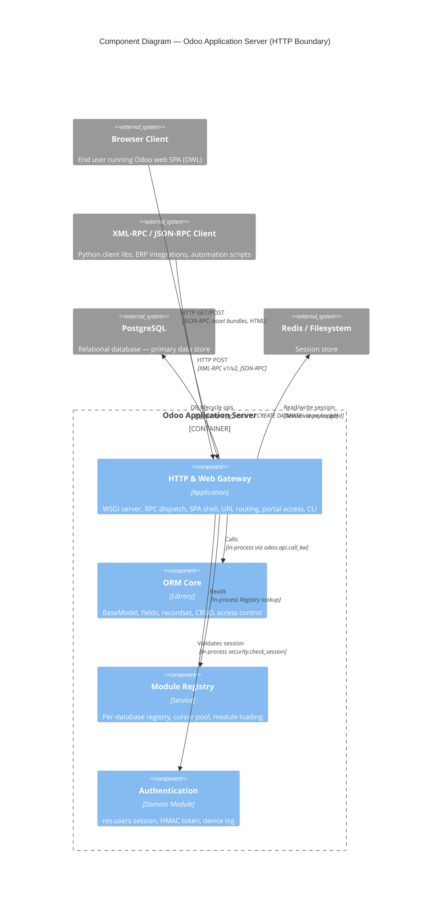

# C4 Component Level: Odoo HTTP & Web Gateway

<!--
  Auto-generated by the c4-component agent. One file per logical component.
  Refreshed on /banyan-c4 reruns when constituent code docs change.
-->

## Generated By

- **Agent**: c4-component (Sonnet)
- **Run ID**: banyan-c4-20260701-init
- **Generated**: 2026-07-01T00:00:00Z
- **Constituent Code Docs**: 6 files — see [Code Elements](#code-elements)

## Overview

- **Name**: Odoo HTTP & Web Gateway
- **Description**: The complete HTTP boundary of Odoo: WSGI server lifecycle, multi-process worker management, RPC protocol translation (XML-RPC v1/v2 and JSON-RPC), web SPA framework, multi-language URL routing, customer portal access, and the CLI entry point that boots the server.
- **Type**: Application
- **Technology**: Python 3 / Werkzeug WSGI, OWL (JavaScript SPA), psycopg2, gevent (optional)

## Purpose

This component owns every request that crosses the network boundary into Odoo. It starts the server (single-process threaded, gevent async, or prefork multi-process), accepts inbound HTTP/WebSocket connections, translates XML-RPC and JSON-RPC wire protocols into internal ORM dispatch calls, serves the single-page application shell and its static assets, enforces multi-language URL rewriting, and provides the customer portal access-token infrastructure for external document sharing. Business logic, ORM execution, and data persistence are explicitly out of scope — those live in the ORM and domain addon layers.

## Software Features

- **Multi-mode HTTP server**: Boots Odoo in threaded, gevent, or prefork mode; manages worker process pools, memory/time limits, cron workers, and graceful shutdown via POSIX signals.
- **XML-RPC gateway**: Exposes `/xmlrpc/<service>` (v1, string faults) and `/xmlrpc/2/<service>` (v2, integer fault codes) for Python client libraries, ERP integrations, and legacy automation.
- **JSON-RPC gateway**: Exposes `/jsonrpc` and the SPA's `/web/dataset/call_kw` family for the web client and third-party integrations.
- **Web SPA framework**: Delivers the OWL-based single-page application shell including session bootstrap, action dispatcher, view rendering (form, list, kanban, calendar, pivot, graph), and frontend asset bundles.
- **Multi-language URL routing**: Transparent language detection and URL rewriting (`/{lang}/path`), SEO-friendly slug generation and resolution, bot detection, and 301 redirects for canonical URLs.
- **Customer portal access**: UUID access-token generation for portal-enabled records, public document sharing without login, and `CustomerPortal` base controller for customer-facing document pages.
- **CLI & server administration**: `odoo-bin` entry point for server start, interactive shell, database dump/restore/create/drop, module scaffolding, data population, code upgrade scripting, and proxy-token generation.

## Code Elements

This component is composed of the following code-level docs:

- [`code/c4-code-odoo-service.md`](../code/c4-code-odoo-service.md) — RPC dispatchers (common/model/db/security), ORM retry logic, and the HTTP/WebSocket server + worker pool (ThreadedServer, GeventServer, PreforkServer, WorkerHTTP, WorkerCron)
- [`code/c4-code-odoo-cli.md`](../code/c4-code-odoo-cli.md) — `odoo-bin` CLI dispatcher and all built-in commands (Server, Shell, Db, Deploy, Scaffold, Populate, UpgradeCode, Neutralize, Obfuscate, GenProxyToken, TSConfig)
- [`code/c4-code-odoo-addons-base-controllers.md`](../code/c4-code-odoo-addons-base-controllers.md) — `RPC` controller (HTTP boundary entry points `/xmlrpc/<service>`, `/xmlrpc/2/<service>`, `/jsonrpc`) and `OdooMarshaller` for Odoo-type XML serialization
- [`code/c4-code-addons-web.md`](../code/c4-code-addons-web.md) — Web SPA framework: session, action dispatcher, all view renderers, OWL component integration, frontend asset bundles, and web-layer ORM extensions (`ir.http`, `ir.ui.view`, `ir.ui.menu`, `res.users`)
- [`code/c4-code-addons-http_routing.md`](../code/c4-code-addons-http_routing.md) — Multi-language URL routing (`IrHttp._match` 9-case decision tree), slug generation/resolution, `ModelConverter`, `IrQweb` template URL helpers, and frontend error handling
- [`code/c4-code-addons-portal.md`](../code/c4-code-addons-portal.md) — `PortalMixin` (access-token fields, share URL builder), `CustomerPortal` base controller, pagination utilities, and portal-safe chatter/message filtering

## Interfaces

### XML-RPC v1 — Legacy RPC Endpoint

- **Protocol**: XML-RPC over HTTP POST
- **Description**: Legacy RPC endpoint using string fault codes; consumed by Python `xmlrpc.client`, older ERP connectors, and automation scripts.
- **Operations**:
  - `POST /xmlrpc/<service>` — Dispatches to `common`, `db`, or `object` service; routes to `odoo.service.common.dispatch()`, `odoo.service.db.dispatch()`, or `odoo.service.model.dispatch()` respectively
  - `exp_login(db, login, password) → uid` — Authenticate a user
  - `exp_version() → dict` — Return server version metadata
  - `execute_kw(db, uid, passwd, model, method, args, kwargs) → Any` — Invoke any public ORM method
- **Contract**: In-process; fault structure defined in `odoo/addons/base/controllers/rpc.py:23-68`; ORM methods at `odoo/service/model.py`

### XML-RPC v2 — Compliant RPC Endpoint

- **Protocol**: XML-RPC over HTTP POST (integer fault codes per XML-RPC specification)
- **Description**: Standards-compliant XML-RPC endpoint; same service dispatch as v1 but fault codes are integers (`XMLRPC_FAULT_CODE_APPLICATION_ERROR = 1`, etc.).
- **Operations**:
  - `POST /xmlrpc/2/<service>` — Same service routing as v1 with integer-keyed faults
- **Contract**: In-process; fault code constants at `odoo/addons/base/controllers/rpc.py:1-22`

### JSON-RPC — Modern RPC Endpoint

- **Protocol**: JSON-RPC 2.0 over HTTP POST
- **Description**: Primary API for the Odoo web client and modern third-party integrations. The SPA calls this directly for every data operation.
- **Operations**:
  - `POST /jsonrpc` — Low-level JSON-RPC dispatch to `common`, `db`, or `object`
  - `POST /web/dataset/call_kw` — High-level SPA ORM call (model, method, args, kwargs)
  - `POST /web/dataset/search_read` — Combined search + read for list views
  - `GET /web/session/info` — Return user session, company, and menu tree
  - `POST /web/action/load` — Load and return client/window/server action
  - `GET /web/binary/image`, `GET /web/binary/download` — Serve files and images
- **Contract**: In-process; SPA endpoints documented in `addons/web/controllers/`

### Web SPA Shell — Browser Entry Point

- **Protocol**: HTTP GET (HTML/JS/CSS)
- **Description**: Serves the OWL single-page application bootstrap, asset bundles, and view templates to browser clients.
- **Operations**:
  - `GET /odoo` (or `/web`) — Serve SPA shell HTML (`webclient_templates.xml`)
  - `GET /web/assets/<bundle>` — Serve compiled JS/CSS asset bundles
  - `GET /website/translations/<unique>` — Serve frontend translation bundles for the active language
- **Contract**: Asset bundle definitions in `addons/web/__manifest__.py`; session bootstrap via `ir.http`

### Multi-Language URL Routing — Transparent Middleware

- **Protocol**: In-Process Function (Werkzeug routing middleware)
- **Description**: Intercepts all HTTP requests; rewrites language-prefixed URLs, resolves slug-based record references, sets `request.lang`, and redirects canonical URLs. Not a client-facing interface — operates transparently on every request.
- **Operations**:
  - `IrHttp._match(path) → (Rule, args)` — 9-case routing decision for all frontend routes
  - `IrHttp._slug(record) → str` — Convert ORM record to SEO slug
  - `IrHttp._url_localized(url, lang_code) → str` — Rewrite URL for target language
- **Contract**: In-process; `addons/http_routing/models/ir_http.py`

### Customer Portal — Tokenized Document Access

- **Protocol**: HTTP GET / POST (HTML pages)
- **Description**: Customer-facing portal pages served under `/my/`; access is controlled by either portal-user login or UUID access tokens embedded in URLs.
- **Operations**:
  - `GET /my/` — Portal home page
  - `PortalMixin._portal_ensure_token() → str` — Ensure record has a UUID access token
  - `PortalMixin._get_share_url(redirect, pid, share_token) → str` — Build shareable URL
  - `pager(url, total, page, step) → dict` — Pagination metadata for portal templates
- **Contract**: In-process; `addons/portal/controllers/portal.py`, `addons/portal/models/portal_mixin.py`

### CLI — Administrative Command Interface

- **Protocol**: CLI
- **Description**: `odoo-bin` entry point providing server start, database lifecycle, module development, and data utilities. Used by system administrators, CI/CD pipelines, and developers.
- **Operations**:
  - `odoo-bin server [options]` — Start the Odoo HTTP server (delegates to `odoo.service.server`)
  - `odoo-bin shell -d <db>` — Open interactive Python REPL with ORM access
  - `odoo-bin db dump|load|duplicate|drop|rename` — Database operations
  - `odoo-bin scaffold <module>` — Generate new addon skeleton
  - `odoo-bin deploy <path> --url <url>` — Deploy module to running server
  - `odoo-bin neutralize -d <db>` — Neutralize production DB for test use
- **Contract**: CLI arguments; `odoo/cli/command.py` (command registry), individual command files

## Dependencies

### Components Used (in-process or in-system)

- **Odoo ORM Core** — All RPC and web requests ultimately resolve to ORM calls (`odoo.api.call_kw`, `Registry`, `Environment`); model dispatch in `odoo/service/model.py` calls the ORM layer directly. Cross-component refs verified by master-index pass.
- **Odoo Module Registry** — `odoo.modules.registry.Registry` is used by server workers, RPC dispatchers, the cron worker, and CLI commands for cursor management and database-to-registry mapping. Cross-component refs verified by master-index pass.
- **Authentication & Session** — `res.users.authenticate()`, `res.users._compute_session_token()`, and `res.device.log._update_device()` are called by the `odoo.service.security` module on every RPC request. Cross-component refs verified by master-index pass.
- **Mail & Chatter** — Portal uses `mail.thread` and `mail.message` to filter portal-safe content for external users. Cross-component refs verified by master-index pass.

### External Systems

- **PostgreSQL** — Database connections via `psycopg2`; used by `odoo.service.db` for lifecycle operations (`pg_dump`, `pg_restore`, `CREATE DATABASE`) and by `odoo.service.model` for cursor management and concurrency-error retry logic.
- **Redis / Filesystem (Session Store)** — Session objects are persisted to Redis (production) or the local filesystem (development); the session backend is configured via `odoo.tools.config`.
- **Werkzeug WSGI** — Foundation HTTP server (`werkzeug.serving.BaseWSGIServer`, `ThreadedWSGIServer`); all request parsing, routing rule compilation, and response generation delegate to Werkzeug.
- **gevent** (optional) — Provides async HTTP serving via `GeventServer` and WebSocket support via `gevent-websocket`.
- **inotify / watchdog** (optional) — Filesystem watchers for development-mode autoreload (`FSWatcherInotify` on Linux, `FSWatcherWatchdog` cross-platform).
- **psutil** — Process memory monitoring for worker limit enforcement in `PreforkServer` and `ThreadedServer`.
- **Browser Client** — The OWL SPA is served to and executes in the user's browser; all view rendering, field widgets, and action dispatch happen client-side after initial asset delivery.

## Component Diagram

## Notes for Higher-Level Synthesis

- **Likely deployment**: Single container — the Odoo Application Server (Python/Werkzeug monolith). All six constituent code directories are part of the same Python process. The CLI (`odoo-bin`) is the entry point that launches this container in server mode. The worker classes (`WorkerHTTP`, `WorkerCron`) are forked child processes of the same container image in prefork mode.
- **Cross-container traffic**: The `Deploy` CLI command makes outbound HTTP calls to a *running* Odoo instance (`/base_import_module` endpoint) — this is a container-to-container call used in development/CI workflows, not a production runtime dependency.
- **Three concurrency modes in one container**: ThreadedServer (default dev), GeventServer (async/WebSocket), and PreforkServer (production) are mutually exclusive runtime choices within the same codebase. Container-level documentation should surface these as deployment variants, not separate containers.
- **Session store is an external dependency**: Redis (production) vs filesystem (dev) is configured via `session_store` config key. The c4-container agent should model this as an optional external system with an environment-variable selector.
- **XML-RPC v1/v2 dual support**: Both fault-code styles must remain permanently supported. Any refactor of the RPC boundary must preserve both `/xmlrpc/<service>` and `/xmlrpc/2/<service>` routes.
- **Portal is infrastructure, not a domain component**: `addons/portal` provides mixin scaffolding consumed by sale, purchase, account, and support addons. It belongs in the HTTP & Web Gateway component rather than a business domain component.
