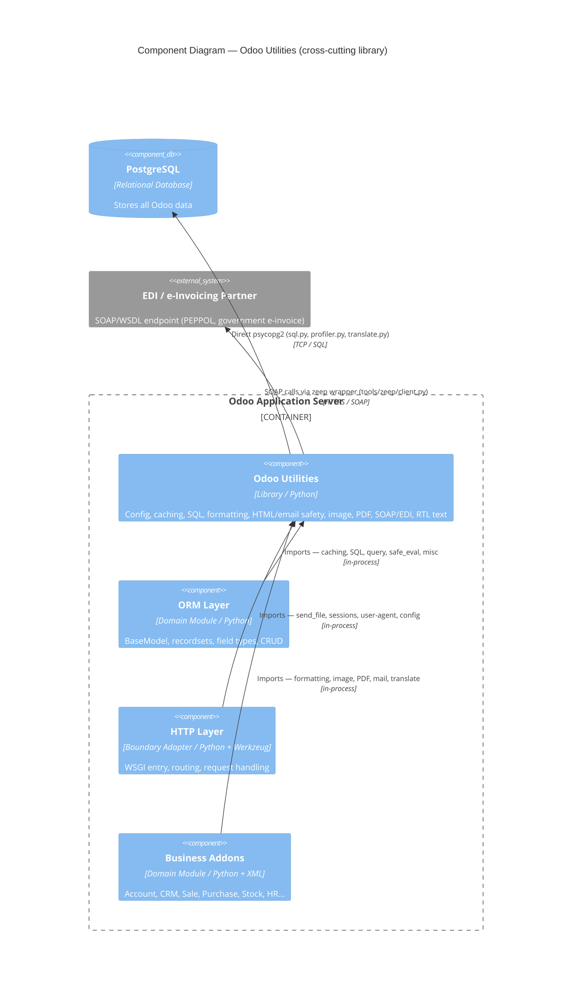

# C4 Component Level: Odoo Utilities

<!--
  Auto-generated by the c4-component agent. One file per logical component.
  Refreshed on /banyan-c4 reruns when constituent code docs change.
-->

## Generated By

- **Agent**: c4-component (Sonnet)
- **Run ID**: banyan-c4-20260701-init
- **Generated**: 2026-07-01T00:00:00Z
- **Constituent Code Docs**: 5 files — see [Code Elements](#code-elements)

## Overview

- **Name**: Odoo Utilities
- **Description**: Cross-cutting shared library providing configuration, caching, SQL construction, localization formatting, email/HTML sanitization, image processing, safe expression evaluation, PDF manipulation, SOAP/EDI integration, and RTL text support to every layer of the Odoo framework.
- **Type**: Library
- **Technology**: Python 3; lxml, Pillow, babel, passlib, psycopg2, zeep (vendored), PyPDF/PyPDF2 (vendored), arabic-reshaper (vendored)

## Purpose

Odoo Utilities is the framework-wide shared library that underpins every other Odoo component: the ORM, HTTP layer, addons, CLI tools, and tests all import from it. It carries no business logic of its own — its responsibility is to provide reliable, security-hardened, and version-insulated building blocks so that each consuming layer can focus on domain concerns. Explicitly out of scope: any ORM model definitions, HTTP routing, controller logic, or business-domain workflows.

## Software Features

- **Parameterized SQL Construction**: Composable `SQL` class and `Query` builder prevent injection by keeping SQL code and parameters separate at all times.
- **ORM-Level LRU Caching**: `ormcache` decorator family provides hit/miss-tracked LRU caches for model methods, with context-key variants for multi-tenant isolation.
- **Locale-Aware Formatting**: Full suite of float rounding (IEEE-754), date/time, fiscal-year, currency, and list formatting functions backed by Babel and pytz.
- **Security-Hardened HTML and Email Processing**: `html_sanitize()` strips XSS vectors via an lxml whitelist cleaner; `email_normalize()` validates and canonicalizes addresses; `safe_eval()` evaluates expressions against an opcode whitelist to prevent code injection.
- **Image Processing Pipeline**: Resize, crop, rotate, format-convert, and optimize images through a chainable `ImageProcess` API backed by Pillow; EXIF orientation correction included.
- **PDF Generation and Compliance**: Merge, stamp, fill forms, embed attachments, and produce PDF/A-compliant archival documents; version-adapts across PyPDF 1.x / 2.x / 4.x automatically.
- **SOAP/EDI Client Abstraction**: Vendored zeep wrapper serializes SOAP responses to Python primitives, enforces timeouts, and pools connections for e-invoicing and PEPPOL integrations.

## Code Elements

This component is composed of the following code-level docs:

- [`code/c4-code-odoo-tools.md`](../code/c4-code-odoo-tools.md) — Core utilities: config, caching, SQL/query building, data conversion, float/date/i18n formatting, HTML/email sanitization, image processing, safe expression evaluation, profiling, and code metrics (~39 modules)
- [`code/c4-code-odoo-tools-vendor.md`](../code/c4-code-odoo-tools-vendor.md) — Vendored Werkzeug compatibility shims: WSGI file streaming (`send_file`), session management, and user-agent parsing for older OS distributions
- [`code/c4-code-odoo-tools-zeep.md`](../code/c4-code-odoo-tools-zeep.md) — Vendored zeep SOAP/WSDL client wrapper: simplified API, automatic serialization to primitives, session/transport management for EDI integrations
- [`code/c4-code-odoo-tools-pdf.md`](../code/c4-code-odoo-tools-pdf.md) — Vendored PyPDF abstraction: merge, rotate, form-fill, banner stamping, PDF/A compliance, attachment embedding, RTL text reshaping via arabic_reshaper
- [`code/c4-code-odoo-tools-arabic-reshaper.md`](../code/c4-code-odoo-tools-arabic-reshaper.md) — Vendored Arabic character reshaper (v3.0.0): contextual glyph substitution and ligature handling for RTL text in PDFs and reports

## Interfaces

### ORM Support — In-Process Function

- **Protocol**: In-Process Function
- **Description**: Database-access support consumed by the ORM layer (`odoo/models.py`) and addon models. Not exposed over the network.
- **Operations**:
  - `SQL(code, *params) → SQL` — Build a parameterized SQL fragment; combine with `+` or format strings
  - `Query.add_where(domain) → None` — Append a filter to the in-flight SELECT query
  - `ormcache(*keys)(method) → method` — Decorate a model method with an LRU cache keyed on provided arguments
  - `ormcache_context(*keys)(method) → method` — Variant that includes selected context-dict keys in the cache key
- **Contract**: In-process; see `odoo/tools/sql.py`, `odoo/tools/query.py`, `odoo/tools/cache.py`

### Localization and Formatting — In-Process Function

- **Protocol**: In-Process Function
- **Description**: Locale-aware formatting primitives consumed by views, reports, and addon business logic.
- **Operations**:
  - `float_round(value, precision_digits, rounding_method) → float` — IEEE-754 aware rounding with configurable method (HALF-UP, UP, DOWN, etc.)
  - `format_date(env, value, lang_code, date_format) → str` — Locale-aware date string
  - `format_amount(env, amount, currency) → str` — Locale-aware currency string
  - `format_list(env, lst, style, lang_code) → str` — Locale-aware list with conjunction (e.g., "a, b, and c")
  - `py_to_js_locale(locale) → str` — Convert Python locale tag to JavaScript BCP 47 format
- **Contract**: In-process; see `odoo/tools/float_utils.py`, `odoo/tools/date_utils.py`, `odoo/tools/misc.py`, `odoo/tools/i18n.py`

### HTML and Email Safety — In-Process Function

- **Protocol**: In-Process Function
- **Description**: XSS-safe HTML sanitization and email address normalization consumed by the mail, website, and report components.
- **Operations**:
  - `html_sanitize(src, strip_style, strip_classes, sanitize_tags, sanitize_attributes) → Markup` — Whitelist-clean HTML; returns markupsafe.Markup
  - `html2plaintext(html) → str` — Strip tags and decode entities
  - `email_normalize(email) → str | False` — Lowercase and validate a single address
  - `email_split(text) → list[str]` — Extract RFC 2822 addresses from a header string
  - `encapsulate_email(email, name) → str` — Wrap address with display name
- **Contract**: In-process; see `odoo/tools/mail.py`

### Safe Expression Evaluation — In-Process Function

- **Protocol**: In-Process Function
- **Description**: Restricted Python expression evaluator used for computed domain filters, field defaults, and server actions. Security-critical: blocks all imports and dangerous opcodes.
- **Operations**:
  - `safe_eval(expr, context, mode, nocopy, filename) → Any` — Evaluate expression against opcode whitelist
  - `test_expr(expr, allowed_codes, mode) → None` — Validate expression before evaluation; raises ValueError on policy violation
  - `const_eval(expr) → Any` — Evaluate constant-only expressions (no variable references)
- **Contract**: In-process; see `odoo/tools/safe_eval.py`

### Image Processing — In-Process Function

- **Protocol**: In-Process Function
- **Description**: Image manipulation pipeline for binary/attachment fields and avatar handling across the application.
- **Operations**:
  - `image_process(base64_source, size, quality, crop_type, colorize, output_format) → bytes` — Main entry: resize, crop, and convert an image
  - `ImageProcess.resize(max_width, max_height) → ImageProcess` — Constrain image dimensions
  - `ImageProcess.crop(width, height, center_x, center_y) → ImageProcess` — Crop to exact dimensions
  - `ImageProcess.save(output_format, quality) → bytes` — Finalize and return bytes
- **Contract**: In-process; see `odoo/tools/image.py`

### PDF Operations — In-Process Function

- **Protocol**: In-Process Function
- **Description**: PDF manipulation for report generation, e-invoicing, and document archival consumed by report engines and EDI modules.
- **Operations**:
  - `merge_pdf(pdf_data: list[bytes]) → bytes` — Concatenate multiple PDFs into one
  - `rotate_pdf(pdf: bytes) → bytes` — Rotate all pages 90 degrees clockwise
  - `OdooPdfFileWriter.convert_to_pdfa() → None` — Add XMP metadata and font embedding for PDF/A archival compliance
  - `OdooPdfFileWriter.add_attachment(name, data, subtype) → None` — Embed a file attachment inside the PDF envelope
  - `OdooPdfFileReader.getAttachments() → list[tuple[str, bytes]]` — Extract embedded file attachments
  - `add_banner(pdf_stream, text, logo, thickness) → BytesIO` — Stamp a rotated banner with optional Odoo logo
  - `reshape_text(text) → str` — Apply bidirectional shaping for Arabic/Hebrew/Farsi RTL display
- **Contract**: In-process; see `odoo/tools/pdf/__init__.py`

### SOAP/EDI Client — In-Process Function

- **Protocol**: In-Process Function (returns zeep `Client` instance; calls made by callers over HTTPS/SOAP)
- **Description**: Simplified SOAP client factory for EDI integrations; serializes all responses to Python primitives.
- **Operations**:
  - `Client(wsdl_url, *args, **kwargs) → Client` — Initialize SOAP client with transport, 30-second timeouts, and session pooling
  - `Client.service.<operation>(*args) → dict | primitive` — Invoke a WSDL operation; response automatically serialized
  - `Client.type_factory(namespace) → ReadOnlyMethodNamespace` — Access WSDL type constructors for a given namespace
- **Contract**: In-process; see `odoo/tools/zeep/client.py`. Outbound protocol: HTTPS/SOAP 1.1/1.2 as defined by the partner WSDL.

## Dependencies

### Components Used (in-process or in-system)

- None — Odoo Utilities is the lowest-level shared library in the framework. It does not call any other Odoo component. It imports only from `odoo.exceptions`, `odoo.release`, `odoo.loglevels`, and `odoo.api` (lightweight framework primitives that carry no business logic themselves).

  Cross-component refs verified by master-index pass.

### External Systems

- **PostgreSQL** — `psycopg2` used directly in `sql.py`, `profiler.py`, and `translate.py` for parameterized query execution, profiling stack trace capture, and translation string persistence
- **PyPDF / PyPDF2** (vendored) — PDF read/write; version auto-selected from the three bundled adapters (_pypdf.py, _pypdf2_1.py, _pypdf2_2.py)
- **zeep** (vendored) — SOAP/WSDL protocol engine; wrapped by `odoo/tools/zeep/client.py`
- **lxml** — XML/HTML parsing and XSD validation in `mail.py`, `translate.py`, `xml_utils.py`, `template_inheritance.py`, `convert.py`
- **PIL / Pillow** — Image decode, resize, crop, and format conversion in `image.py` and `pdf/__init__.py`
- **Babel** — Locale-aware formatting and PO file extraction in `misc.py`, `date_utils.py`, `i18n.py`, `translate.py`
- **passlib** — PBKDF2-SHA512 password hashing context in `config.py`
- **markupsafe** — HTML-safe string type used throughout `mail.py`, `misc.py`, `json.py`, `translate.py`
- **reportlab** — PDF canvas drawing for banners and watermarks in `pdf/__init__.py`
- **fontTools** — TrueType glyph introspection for PDF/A font embedding in `pdf/__init__.py`
- **pytz** — Timezone resolution in `misc.py`, `date_utils.py`, `safe_eval.py`, `convert.py`
- **requests** — HTTP client for XSD fetching in `xml_utils.py`; re-exported by zeep wrapper as `Response` type
- **Werkzeug** — URL and WSGI utilities in `mail.py`, `safe_eval.py`; vendored shims in `_vendor/` backport file streaming and session management

## Component Diagram

## Notes for Higher-Level Synthesis

- **Likely deployment**: Library — deployed inside every container that runs Python code. There is no standalone Odoo Utilities process; it is always imported by the hosting container (Odoo Application Server, CLI worker, test runner, etc.). There is no single container affinity.
- **Cross-container traffic**: None initiated by this component. The zeep SOAP client makes outbound HTTPS calls to external EDI/e-invoicing partners, but those calls originate from whichever container invokes the client — not from a separate utilities container.
- **Security surface**: Three modules require special attention in security reviews: `safe_eval.py` (opcode whitelist — bypass here enables remote code execution), `mail.py` (XSS sanitize — failure here enables stored XSS), `config.py` (passlib PBKDF2-SHA512 — password storage correctness).
- **Vendored dependency management**: `zeep/`, `pdf/` (PyPDF adapters), `arabic_reshaper/`, and `_vendor/` (Werkzeug shims) are frozen copies. Upstream security patches must be manually backported. They should be treated as black-box external boundaries for dependency scanning purposes.
- **Dev-only concerns**: `populate.py`, `cloc.py`, and `profiler.py` are non-production utilities (test data generation, line-count metrics, performance profiling) bundled in the same package for convenience. They do not affect the production call graph.
