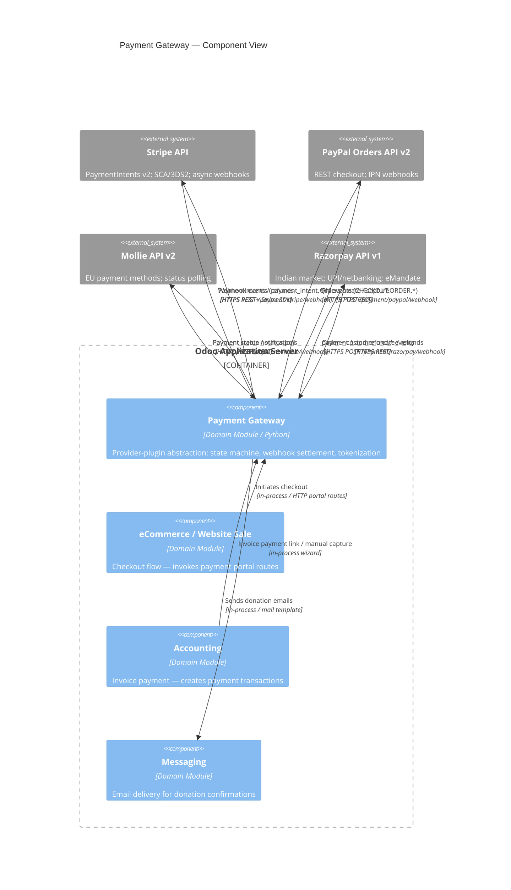

# C4 Component Level: Payment Gateway

<!--
  Auto-generated by the c4-component agent. One file per logical component.
  Refreshed on /banyan-c4 reruns when constituent code docs change.
-->

## Generated By

- **Agent**: c4-component (Sonnet)
- **Run ID**: banyan-c4-20260701-init
- **Generated**: 2026-07-01T00:00:00Z
- **Constituent Code Docs**: 7 files — see [Code Elements](#code-elements)

## Overview

- **Name**: Payment Gateway
- **Description**: Provider-plugin payment abstraction managing gateway configuration, transaction lifecycle, tokenization, and webhook-driven settlement across Stripe, PayPal, Mollie, Razorpay, and manual (Custom) providers.
- **Type**: Domain Module
- **Technology**: Python 3.x, Odoo ORM (models.Model), Werkzeug/HTTP controllers, provider-specific REST SDKs (Stripe Python SDK, `requests` for Mollie/Razorpay/PayPal)

## Purpose

The Payment Gateway component owns the complete payment processing domain in Odoo: it defines the abstract provider interface (`payment.provider`), the transaction state machine (`payment.transaction`: draft → pending → authorized → done/cancel/error), and saved card tokenization (`payment.token`). Each provider plugin (Stripe, PayPal, Mollie, Razorpay, Custom) extends these base models with provider-specific API calls, webhook handlers, and status mappings — all without touching the abstract core. The `website_payment` layer further extends provider and transaction models to add per-website isolation and donation workflows. Deployment-topology concerns (which container hosts this) and external persona identification are out of scope here.

## Software Features

- **Transaction State Machine**: Drives every payment from creation through authorization, capture, and settlement (or cancellation/error) via a single, audited lifecycle on `payment.transaction`.
- **Provider Plugin Architecture**: Each gateway (Stripe, PayPal, Mollie, Razorpay, Custom) registers as an installable addon that overrides `_get_specific_processing_values()` and `_process_notification_data()` without modifying the core models.
- **Webhook-Driven Async Settlement**: Inbound webhooks from Stripe, PayPal, Mollie, and Razorpay are received at per-provider HTTP routes and processed idempotently to advance transaction state.
- **Card Tokenization and Saved Payments**: Customers can store payment methods as `payment.token` vault references; providers extend `_get_specific_create_values()` for provider-specific token metadata. Razorpay additionally supports eMandate recurring payments with per-method INR amount limits.
- **Manual (Wire Transfer) Payment Flow**: The Custom provider enables human-verified offline payments (bank transfers, in-person receipts) with no external API dependency; a client-side JS post-processor completes the flow in the browser.
- **Multi-Website Provider Filtering**: `website_payment` scopes available providers per website instance and exposes donation transaction endpoints with email confirmation.
- **Access-Token and Idempotency Safety**: HMAC-based access tokens gate all payment form submissions; SHA1 idempotency keys per transaction prevent duplicate API calls to upstream gateways.

## Code Elements

This component is composed of the following code-level docs:

- [`code/c4-code-addons-payment.md`](../code/c4-code-addons-payment.md) — Core framework: `payment.provider`, `payment.transaction`, `payment.token` base models, utils, constants
- [`code/c4-code-addons-payment_stripe.md`](../code/c4-code-addons-payment_stripe.md) — Stripe PaymentIntents API integration with SCA/3DS2 and async webhook confirmation
- [`code/c4-code-addons-payment_paypal.md`](../code/c4-code-addons-payment_paypal.md) — PayPal Orders API v2 integration with IPN webhook handling
- [`code/c4-code-addons-payment_custom.md`](../code/c4-code-addons-payment_custom.md) — Manual payment provider (wire transfer) with client-side post-processing
- [`code/c4-code-addons-payment_mollie.md`](../code/c4-code-addons-payment_mollie.md) — Mollie API v2 integration for European payment methods (iDEAL, Bancontact, cards)
- [`code/c4-code-addons-payment_razorpay.md`](../code/c4-code-addons-payment_razorpay.md) — Razorpay API v1 integration for Indian market (UPI, netbanking, cards, eMandate)
- [`code/c4-code-addons-website_payment.md`](../code/c4-code-addons-website_payment.md) — Website-scoped provider filtering, donation transaction endpoints, and donation email notifications

## Interfaces

### Payment Portal — Customer-Facing Payment Pages

- **Protocol**: In-Process Function (HTTP routes served by Werkzeug/Odoo HTTP)
- **Description**: Portal entry points for paying invoices, managing saved payment methods, and making donations. These routes serve QWeb-rendered HTML pages or JSON responses consumed by the frontend payment widget.
- **Operations**:
  - `GET /payment/pay` — Render payment form for a given invoice or order; returns provider list filtered by website, currency, and country
  - `GET/POST /payment/method` — Manage saved payment methods (list, add, delete)
  - `GET /donation/pay` — Render donation payment form with pre-filled amount and currency
  - `POST /donation/transaction/<minimum_amount>` — Create donation transaction; returns JSON with access token and landing route
- **Contract**: In-process; see `addons/account_payment/controllers/`, `addons/website_payment/controllers/`

### Webhook Reception — Per-Provider Inbound Notifications

- **Protocol**: REST (HTTP POST, public auth, CSRF-disabled, signature-verified)
- **Description**: Each provider exposes a dedicated inbound webhook endpoint. Handlers validate the provider's signature, locate the matching `payment.transaction` by reference, and call `_process_notification_data()` to advance state.
- **Operations**:
  - `POST /payment/stripe/webhook` — Receives Stripe events (payment_intent.*, setup_intent.*, charge.*); processes 8 handled event types
  - `POST /payment/paypal/webhook` — Receives PayPal IPN events (CHECKOUT.ORDER.COMPLETED, CHECKOUT.ORDER.APPROVED, CHECKOUT.PAYMENT-APPROVAL.REVERSED)
  - `POST /payment/mollie/webhook` — Receives Mollie payment status notifications; controller polls Mollie API for final status
  - `GET/POST /payment/mollie/return` — Customer return URL after Mollie checkout redirect
  - `POST /payment/razorpay/webhook` — Receives Razorpay payment.* and refund.* events; validates HMAC-SHA256 signature before processing
- **Contract**: In-process; see `addons/payment_*/controllers/main.py` for each provider's route definitions

### Payment Capture Wizard — Manual Capture UI

- **Protocol**: In-Process Function (Odoo wizard/transient model)
- **Description**: Allows backend users to manually capture an authorized (but not yet settled) transaction.
- **Operations**:
  - `payment.capture.wizard.action_capture()` — Triggers capture API call on provider; advances transaction from `authorized` to `done`
- **Contract**: In-process; see `addons/payment/wizards/payment_capture_wizard.py`

### Payment Link Wizard — Invoice Payment Links

- **Protocol**: In-Process Function (Odoo wizard/transient model)
- **Description**: Generates a shareable URL pre-loaded with invoice amount and partner details so customers can pay without logging into the portal.
- **Operations**:
  - `payment.link.wizard.action_send()` → str — Returns a signed payment link URL
- **Contract**: In-process; see `addons/payment/wizards/payment_link_wizard.py`

### Provider Registration Hooks

- **Protocol**: In-Process Function (Odoo module hooks)
- **Description**: Each provider addon registers and deregisters itself in `payment.provider` during install/uninstall lifecycle.
- **Operations**:
  - `post_init_hook(env)` — Calls `payment.setup_provider(env, code)` to insert provider record
  - `uninstall_hook(env)` — Calls `payment.reset_payment_provider(env, code)` to remove provider record
- **Contract**: In-process; see `addons/payment_*/\_\_init\_\_.py`

## Dependencies

### Components Used (in-process or in-system)

- **Sales/CRM** — `include_shipping_address()` reads `sale.order` for shipping address in Stripe/PayPal payloads. Cross-component refs verified by master-index pass.
- **Accounting** — `payment.transaction` links to `account.move` (invoices) and `account.payment`; `website_payment` extends `account.payment`. Cross-component refs verified by master-index pass.
- **Odoo HTTP/Web** — All payment controllers extend `http.Controller`; request context (`odoo.http.request`) is used for IP extraction, session, and user resolution. Cross-component refs verified by master-index pass.
- **Messaging** — `website_payment` uses `mail.mail_notification_light` template and `ir.qweb` to render and send donation confirmation emails. Cross-component refs verified by master-index pass.

### External Systems

- **Stripe API** (`https://stripe.api.odoo.com/api/stripe/` proxy + direct Stripe SDK) — PaymentIntents v2019-05-16; 8 webhook event types; 45 supported countries; SCA/3DS2 handled natively by Stripe
- **PayPal Orders API v2** — REST Checkout; 3 IPN webhook events; 33 supported currencies
- **Mollie API v2** (`https://api.mollie.com/v2/`) — Payment creation and status polling; EU-focused (iDEAL, Bancontact); webhook async + synchronous status poll
- **Razorpay API v1** (`https://api.razorpay.com/v1/`) — Orders, Customers, Refunds; Indian market (UPI, netbanking, eMandate); HMAC-SHA256 webhook signature validation
- **PostgreSQL** (via Odoo ORM/psycopg2) — Persistent storage for `payment.provider`, `payment.transaction`, `payment.token`; heavily indexed on `company_id`, `state`, `reference`

## Component Diagram

## Notes for Higher-Level Synthesis

- **Likely deployment**: Same container as the Odoo Application Server — all provider addons are Python packages loaded into the single Odoo process alongside `website_sale`, `account`, and `website`. No standalone worker; webhook endpoints are Werkzeug HTTP routes served by the same WSGI process.
- **Cross-container traffic**: Outbound HTTPS to four external payment APIs (Stripe, PayPal, Mollie, Razorpay). The Stripe integration routes through an Odoo-hosted proxy (`https://stripe.api.odoo.com/api/stripe/`) before hitting Stripe directly. Inbound HTTPS webhooks from all four providers require the application server to be publicly reachable (or fronted by a reverse proxy that forwards `POST /payment/*/webhook`).
- **Idempotency requirement**: All four async webhook handlers must be replay-safe; `generate_idempotency_key()` in utils.py and state-machine guard checks on `payment.transaction.state` enforce this. The c4-container agent should note that the load balancer (if any) should use sticky sessions or that webhook handlers must be stateless (they are — they re-query transaction by reference on every call).
- **Security boundary**: Webhook endpoints are `auth=public, csrf=False`; signature verification (HMAC-SHA256 for Razorpay/Stripe webhook secret; PayPal IPN validation; Mollie order ID lookup) is the sole trust gate. This should be highlighted in the container-level security notes.
