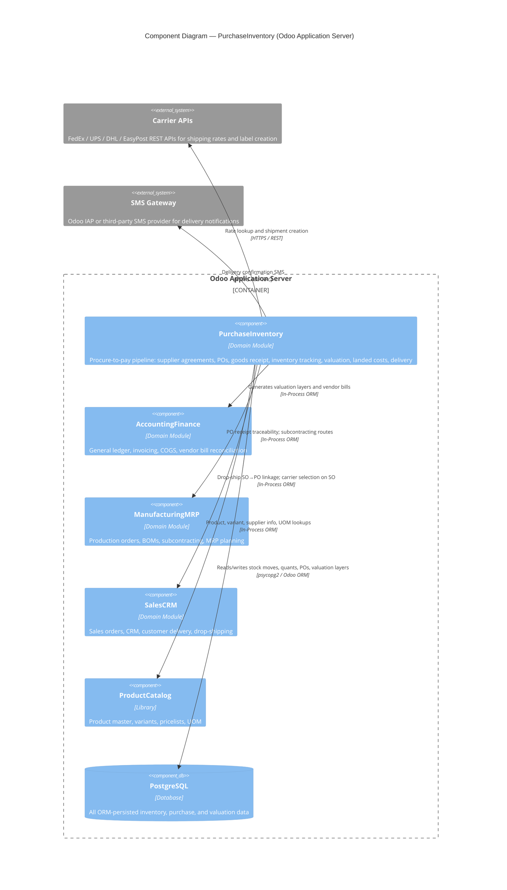

# C4 Component Level: PurchaseInventory

<!--
  Auto-generated by the c4-component agent. One file per logical component.
  Refreshed on /banyan-c4 reruns when constituent code docs change.
-->

## Generated By

- **Agent**: c4-component (Sonnet)
- **Run ID**: banyan-c4-20260701-init
- **Generated**: 2026-07-01T00:00:00Z
- **Constituent Code Docs**: 14 files — see [Code Elements](#code-elements)

## Overview

- **Name**: PurchaseInventory
- **Description**: Owns the full procure-to-pay pipeline and physical inventory management: supplier agreements → purchase orders → goods receipt → inventory tracking → supplier invoice matching → inventory valuation.
- **Type**: Domain Module
- **Technology**: Python 3.10+ / Odoo 18.0 ORM; JavaScript (Owl/OWL frontend for matrix grid and batch UI); PostgreSQL (via Odoo psycopg2 connection pool)

## Purpose

PurchaseInventory manages everything from the moment a procurement need is identified through the physical movement of goods into the warehouse and the resulting financial entries. It controls reordering rules, supplier agreements (blanket orders and tenders), purchase order creation and approval, multi-step goods receipt (pick → receive), real-time quantity tracking via stock.quant, and the generation of inventory valuation journal entries. Out of scope: customer-facing sales order management, manufacturing execution (MRP), and general ledger chart-of-accounts configuration — those belong to adjacent components that this component integrates with at well-defined seams.

## Software Features

- **Procurement agreement management**: Buyers create blanket orders and calls for tender (purchase_requisition) to establish volume pricing commitments with suppliers before issuing purchase orders.
- **Purchase order lifecycle**: Full request-for-quotation → confirmed order → receipt tracking workflow, including product-variant matrix entry for rapid bulk ordering (purchase_product_matrix).
- **Automated replenishment**: Stock reorder rules and the StockRule "buy" action (purchase_stock) automatically generate purchase orders when on-hand quantities drop below minimum thresholds.
- **Multi-step goods receipt and warehouse routing**: Configurable per-warehouse receive routes (single-step, two-step, three-step); batch transfer grouping for warehouse efficiency (stock_picking_batch); drop-shipping route for vendor-direct customer delivery (stock_dropshipping).
- **Real-time inventory quantification**: stock.quant records live on-hand quantities per location/lot/package; stock.move is the atomic unit of every physical movement.
- **Inventory valuation and landed costs**: stock_account generates FIFO/AVCO/standard-cost valuation layers on every stock move; stock_landed_costs distributes freight, customs, and insurance charges across incoming shipments using configurable split methods.
- **Subcontracting and repair integration**: Special stock routes send components to subcontractors for finished-good receipt (mrp_subcontracting); repair orders consume stock moves for parts tracking (repair).
- **Delivery notification**: SMS confirmation to customers on delivery validation (stock_sms); carrier rate lookup and shipment label integration via the extensible delivery.carrier framework (delivery).

## Code Elements

This component is composed of the following code-level docs:

- [`code/c4-code-addons-purchase.md`](../code/c4-code-addons-purchase.md) — Core purchase domain: purchase.order, purchase.order.line, RFQ, vendor bill matching, purchase portal
- [`code/c4-code-addons-purchase_stock.md`](../code/c4-code-addons-purchase_stock.md) — Purchase-to-stock bridge: StockRule "buy" action, PO → stock.picking creation, replenishment wizard, vendor performance tracking
- [`code/c4-code-addons-purchase_product_matrix.md`](../code/c4-code-addons-purchase_product_matrix.md) — Matrix grid UI for purchasing product variants in bulk from a single order form
- [`code/c4-code-addons-purchase_requisition.md`](../code/c4-code-addons-purchase_requisition.md) — Purchase agreements: blanket orders and calls for tender (purchase_requisition model, state machine, duplicate detection)
- [`code/c4-code-addons-purchase_mrp.md`](../code/c4-code-addons-purchase_mrp.md) — Purchase-MRP bridge: kit BOM quantity receipt, cost_share% allocation to components, PO↔MO traceability
- [`code/c4-code-addons-stock.md`](../code/c4-code-addons-stock.md) — Core inventory domain: stock.move, stock.picking, stock.quant, stock.lot, stock.warehouse, multi-step routes
- [`code/c4-code-addons-stock_account.md`](../code/c4-code-addons-stock_account.md) — Inventory valuation: StockValuationLayer (FIFO/AVCO/standard), automatic journal entry generation, anglo-saxon COGS
- [`code/c4-code-addons-stock_picking_batch.md`](../code/c4-code-addons-stock_picking_batch.md) — Batch and wave picking: groups multiple stock pickings for efficient warehouse operations
- [`code/c4-code-addons-stock_landed_costs.md`](../code/c4-code-addons-stock_landed_costs.md) — Landed cost distribution: allocates freight/customs/insurance across incoming shipments using split methods
- [`code/c4-code-addons-delivery.md`](../code/c4-code-addons-delivery.md) — Shipping carrier framework: delivery.carrier, rate lookup, shipment creation, tracking, extensible provider pattern (FedEx/UPS/DHL)
- [`code/c4-code-addons-stock_dropshipping.md`](../code/c4-code-addons-stock_dropshipping.md) — Drop-shipping route: SO triggers PO, vendor ships direct to customer; separate dropship picking type and lot attribution
- [`code/c4-code-addons-stock_sms.md`](../code/c4-code-addons-stock_sms.md) — SMS delivery notifications: intercepts picking validation to send confirmation SMS to customer via configurable template
- [`code/c4-code-addons-mrp_subcontracting.md`](../code/c4-code-addons-mrp_subcontracting.md) — Subcontracting route: component shipment to subcontractor, finished-good receipt, resupply automation, supplier portal
- [`code/c4-code-addons-repair.md`](../code/c4-code-addons-repair.md) — Repair orders: after-sales parts consumption via stock moves, warranty tracking, parts availability, repair picking types

## Interfaces

### Purchase Order ORM API (In-Process)

- **Protocol**: In-Process Function (Odoo ORM model methods)
- **Description**: The primary public API surface consumed by other Odoo modules. All inter-module calls go through ORM recordset methods on the purchase.order and stock.picking models.
- **Operations**:
  - `purchase.order.button_approve(force=False) → None` — Confirms a PO and auto-creates the stock.picking receipt
  - `StockRule._run_buy(procurements) → None` — Core procurement execution: selects supplier, groups procurements, creates/updates POs
  - `purchase.order._compute_receipt_status() → Selection` — Computes pending/partial/full receipt state from linked pickings
  - `stock.picking.action_done() → bool | dict` — Validates a picking, triggers valuation layers and SMS hook
  - `StockLandedCost.button_validate() → None` — Distributes landed costs across stock valuation layers
  - `DeliveryCarrier.rate_shipment(order) → dict` — Returns shipping rate (success, price, error) for a sale order
  - `DeliveryCarrier.send_shipping(pickings) → list` — Creates shipment with carrier API and returns tracking data
- **Contract**: In-process; see constituent code docs and Odoo ORM model definitions in addons/purchase/models/, addons/stock/models/, addons/delivery/models/

### Purchase Portal (HTTP)

- **Protocol**: REST (Odoo HTTP controller, JSON-RPC via `/web/dataset/call_kw`)
- **Description**: Vendor-facing web portal for viewing RFQs and confirming purchase orders; supplier portal for subcontracting status tracking.
- **Operations**:
  - `GET /my/purchase` — Vendor portal: list of purchase orders for authenticated partner
  - `GET /my/purchase/<int:order_id>` — Vendor portal: single purchase order detail
  - Subcontracting supplier portal routes — component receipt and finished-good status (mrp_subcontracting/controllers/)
- **Contract**: Odoo portal framework; views in addons/purchase/views/purchase_portal_templates.xml, addons/mrp_subcontracting/views/subcontracting_portal_templates.xml

### Stock JSON-RPC API (Internal Web)

- **Protocol**: REST / JSON-RPC (`/web/dataset/call_kw`)
- **Description**: Browser-facing ORM bridge used by the Odoo web client for all inventory and purchasing UI operations (kanban, list, form, batch wizards).
- **Operations**: Standard Odoo ORM calls — `search_read`, `write`, `create`, `action_*` methods on stock.picking, purchase.order, stock.quant, stock.landed.cost, etc.
- **Contract**: Odoo JSON-RPC protocol; no separate OpenAPI schema — governed by ORM field definitions and access control rules in security/ir.model.access.csv

## Dependencies

### Components Used

- **AccountingFinance** (Odoo account module) — purchase.order extends account.move for vendor bill matching; stock_account generates GL journal entries on every valued stock move; stock_landed_costs posts freight cost journal entries. Cross-component refs verified by master-index pass.
- **ManufacturingMRP** (Odoo mrp module) — purchase_mrp bridges PO receipt to manufacturing order traceability; mrp_subcontracting extends MRP BOMs and production with subcontracting routes; purchase_stock's replenishment wizard optionally forecasts against MO demand. Cross-component refs verified by master-index pass.
- **SalesCRM** (Odoo sale module) — stock_dropshipping links sale.order lines to purchase orders for vendor-direct fulfilment; delivery module extends sale.order with carrier selection. Cross-component refs verified by master-index pass.
- **ProductCatalog** (Odoo product module) — All purchase order lines, stock moves, and quants reference product.product/product.template; supplier price lists and UOM conversions come from product models.

### External Systems

- **Shipping Carrier APIs** (FedEx, UPS, DHL, EasyPost) — delivery.carrier extensible framework makes outbound HTTP calls to carrier REST APIs for rate lookup (`rate_shipment`) and shipment creation (`send_shipping`); provider-specific subclasses implement the integration.
- **SMS Gateway** (Odoo SMS module / external SMS provider) — stock_sms calls `_message_sms_with_template()` on delivery confirmation; the SMS module abstracts the outbound gateway (IAP or third-party).
- **PostgreSQL** — All ORM models persist to PostgreSQL via Odoo's psycopg2 connection pool; stock_account creates database indexes on stock.valuation.layer for FIFO/AVCO performance.
- **Odoo IAP (In-App Purchase) / Mail Server** — Delivery confirmation emails dispatched via Odoo mail framework; SMS credits consumed via IAP when using Odoo's hosted SMS gateway.

## Component Diagram

## Notes for Higher-Level Synthesis

- **Likely deployment**: Same container as all other Odoo application addons — the single Odoo Application Server process. PurchaseInventory is a set of co-installed addon modules, not a separate process or microservice. It shares the Odoo worker pool and PostgreSQL connection pool with AccountingFinance, ManufacturingMRP, SalesCRM, and all other installed addons.
- **Cross-container traffic**: The only cross-container calls originate from this component outbound: HTTPS to external carrier APIs (FedEx, UPS, DHL) and HTTPS/IAP to the SMS gateway. All intra-Odoo module calls are in-process ORM method calls within the same container.
- **Key data model boundaries**: `stock.move` is the atomic unit of all physical inventory movement; `stock.quant` is computed real-time on-hand state. `stock.valuation.layer` is the immutable audit trail of every inventory cost change. `purchase.order` → `stock.picking` linkage is created by `button_approve()` and managed by `StockRule._run_buy()`.
- **Performance-sensitive paths**: FIFO/AVCO valuation candidate selection on `stock.valuation.layer` uses database indexes (created in `stock_account StockValuationLayer.init()`); landed cost distribution iterates all move lines for each picking in a cost record — batch size matters for large receipts.
- **Subcontracting seam**: `mrp_subcontracting` depends on `mrp` (not on `purchase_stock` directly) but is grouped here because it configures a stock route that routes component movements through the purchase/inventory pipeline. The container agent should note this cross-component route dependency.
