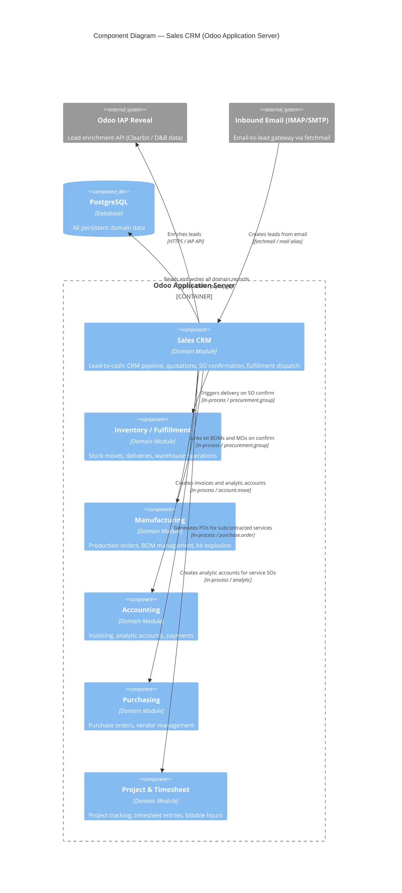

# C4 Component Level: Sales CRM

<!--
  Auto-generated by the c4-component agent. One file per logical component.
  Refreshed on /banyan-c4 reruns when constituent code docs change.
-->

## Generated By

- **Agent**: c4-component (Sonnet)
- **Run ID**: banyan-c4-20260701-init
- **Generated**: 2026-07-01T00:00:00Z
- **Constituent Code Docs**: 12 files — see [Code Elements](#code-elements)

## Overview

- **Name**: Sales CRM
- **Description**: End-to-end lead-to-cash pipeline: CRM opportunity management, quotation authoring, sales order confirmation, and downstream fulfillment triggers for stock, manufacturing, services, and purchasing.
- **Type**: Domain Module
- **Technology**: Python 3.x / Odoo 18.0 ORM; PostgreSQL via Odoo ORM; JavaScript (Odoo web client assets for Kanban pipeline, product configurator, and combo builder)

## Purpose

This component owns the complete commercial lifecycle from initial prospect contact through confirmed sale and fulfillment hand-off. It manages the CRM pipeline (lead → opportunity → won/lost) with Kanban probability forecasting, converts opportunities into structured quotations using reusable templates and optional product lines, confirms sales orders and triggers downstream stock movements, manufacturing orders, timesheet-linked service billing, purchase order generation for subcontracted services, and loyalty/coupon redemption on orders. Attribution tracking (UTM campaign, source, medium) is applied cross-cuttingly from first web touch through the won order.

Out of scope: accounting and invoicing beyond the trigger point (account component), warehouse operations beyond the linking layer (inventory/fulfillment component), and manufacturing scheduling beyond kit-explosion traceability (MRP component).

## Software Features

- **CRM Pipeline Management**: Manages leads and opportunities through configurable Kanban stages with probability-weighted revenue forecasting and predictive lead scoring (PLS).
- **Lead Enrichment via IAP**: Automatically or manually enriches lead records (company name, location, phone, country) by calling the Odoo IAP Reveal service using the lead's email domain.
- **Opportunity-to-Quotation Conversion**: Converts a CRM opportunity into a sale order via a guided wizard, maintaining revenue attribution back to the originating lead and sales team.
- **Template-Based Quotation Authoring**: Applies reusable quotation templates (standard lines, optional products, payment terms, validity dates) to streamline quote creation and enforce company-level defaults.
- **Sales Order Confirmation and Downstream Dispatch**: Confirms sale orders and synchronously triggers: stock delivery creation (`sale_stock`), manufacturing order linkage for kits (`sale_mrp`), analytic account creation for service projects (`sale_timesheet`), and purchase order generation for subcontracted services (`sale_purchase`).
- **Loyalty and Coupon Redemption**: Applies coupon codes and loyalty program rewards to orders, tracks points issued/redeemed per order, and integrates with gift card and discount product generation.
- **UTM Attribution Tracking**: Propagates UTM campaign, source, and medium parameters from inbound web links through CRM leads to confirmed orders, enabling marketing ROI reporting.

## Code Elements

This component is composed of the following code-level docs:

- [`code/c4-code-addons-crm.md`](../code/c4-code-addons-crm.md) — CRM pipeline core: `crm.lead`, `crm.stage`, `crm.team`, lead scoring, email-to-lead gateway, and merge/split wizards
- [`code/c4-code-addons-crm_iap_enrich.md`](../code/c4-code-addons-crm_iap_enrich.md) — IAP-based lead enrichment: cron batch and manual entry points calling the Odoo Reveal API
- [`code/c4-code-addons-sale.md`](../code/c4-code-addons-sale.md) — Sales module root: `sale.order`, portal controllers, product/combo configurators, down-payment account setup, auto-invoice cron
- [`code/c4-code-addons-sale_management.md`](../code/c4-code-addons-sale_management.md) — Quotation templates (`sale.order.template`), optional product lines, prepayment configuration, and sales digest reporting
- [`code/c4-code-addons-sale_crm.md`](../code/c4-code-addons-sale_crm.md) — Bridge module: extends `crm.lead` and `crm.team` with quotation counts and conversion tracking; wizard for opportunity → quotation
- [`code/c4-code-addons-sale_stock.md`](../code/c4-code-addons-sale_stock.md) — Sales-to-inventory bridge: links `sale.order` → `stock.picking` via `procurement.group`, delivery status tracking, picking policy, portal delivery slip access
- [`code/c4-code-addons-sale_purchase.md`](../code/c4-code-addons-sale_purchase.md) — Sales-to-purchasing bridge: generates purchase orders for services marked `service_to_purchase` on SO confirmation; synchronises quantities bidirectionally
- [`code/c4-code-addons-sale_timesheet.md`](../code/c4-code-addons-sale_timesheet.md) — Sales-to-timesheet bridge: creates analytic accounts per SO; enables timesheet-based (milestone, percent-complete, or prepaid-hours) invoicing for service products
- [`code/c4-code-addons-sale_mrp.md`](../code/c4-code-addons-sale_mrp.md) — Sales-to-manufacturing bridge: kit BOM explosion on SO lines, `mrp.production` linkage via `procurement.group`, Anglo-Saxon kit cost allocation on invoices
- [`code/c4-code-addons-sale_loyalty.md`](../code/c4-code-addons-sale_loyalty.md) — Loyalty program integration: coupon code redemption wizard, points ledger (`sale.order.coupon.points`), reward/discount product line generation on orders
- [`code/c4-code-addons-utm.md`](../code/c4-code-addons-utm.md) — UTM infrastructure: `utm.campaign`, `utm.source`, `utm.medium`, `utm.mixin` for cross-model attribution tagging
- [`code/c4-code-addons-link_tracker.md`](../code/c4-code-addons-link_tracker.md) — URL shortener with click tracking; maps inbound link clicks to UTM campaigns and feeds attribution into leads

## Interfaces

### JSON-RPC Sales Order API

- **Protocol**: JSON-RPC (Odoo standard `POST /web/dataset/call_kw`)
- **Description**: All `sale.order` and `crm.lead` model operations (create, read, write, action methods) are accessible via Odoo's standard RPC surface. This is the primary interface consumed by the Odoo web client and any API integrations.
- **Operations**:
  - `sale.order.action_confirm() → dict` — Confirms a draft/sent quotation as a sale order; triggers stock, manufacturing, purchase, and timesheet downstream actions
  - `sale.order.action_cancel() → dict` — Cancels a confirmed SO; schedules activities on linked purchase orders
  - `crm.lead.iap_enrich(from_cron: bool) → None` — Triggers IAP enrichment on selected leads
  - `sale.order._try_apply_code(code: str) → dict` — Applies a coupon/loyalty code to an order
- **Contract**: In-process; Odoo ORM model methods. RPC signature follows Odoo `call_kw` envelope convention.

### HTTP Portal — Customer Quotation and Delivery Access

- **Protocol**: REST / HTTP (Odoo `@http.route`)
- **Description**: Customer-facing portal pages for viewing and accepting quotations, selecting optional products, and downloading delivery slips. Authenticated via portal token or session.
- **Operations**:
  - `GET /my/quotes/<id>` — View quotation; supports optional product selection
  - `POST /my/quotes/<id>/accept` — Customer e-signature acceptance of quotation
  - `GET /my/delivery/<picking_id>/report` — Download delivery slip PDF (access-token gated)
  - `GET /my/delivery/<picking_id>/return-report` — Download return label PDF
- **Contract**: HTML responses; PDF served via Odoo report engine. Token validation via `consteq`.

### HTTP Email-to-Lead Gateway

- **Protocol**: HTTP / Odoo mail gateway (`fetchmail` → `mail.thread` → `crm.lead`)
- **Description**: Inbound email routed by the fetchmail cron creates or updates `crm.lead` records via `crm/controllers/main.py`. Supports alias-based lead assignment to teams.
- **Operations**:
  - `POST /mail/action-..` (alias handler) — Creates `crm.lead` from inbound email
- **Contract**: Standard Odoo mail alias routing; see `addons/crm/controllers/main.py`.

### In-Process Fulfillment Trigger (sale.order.action_confirm)

- **Protocol**: In-Process Function
- **Description**: SO confirmation is the internal dispatch point that synchronously creates downstream records across component boundaries.
- **Operations**:
  - `sale.order._action_confirm() → bool` — Called internally on confirmation; calls `_purchase_service_generation()` (sale_purchase), registers procurement group entries for `stock.picking` creation (sale_stock), links analytic account for timesheet (sale_timesheet), and resolves kit BOMs for MO linking (sale_mrp)
- **Contract**: In-process; see `addons/sale/models/sale_order.py`.

## Dependencies

### Components Used (in-process or in-system)

- **Inventory / Fulfillment Component** — `sale_stock` writes `procurement.group.sale_id` and creates `stock.picking` on SO confirmation; delivery status is read back via `picking_ids`. Cross-component refs verified by master-index pass.
- **Manufacturing Component** — `sale_mrp` links `mrp.production` records via `procurement.group`; kit BOM explosion is delegated to `mrp.bom.explode()`. Cross-component refs verified by master-index pass.
- **Accounting Component** — Down-payment invoices and automatic invoice scheduling read/write `account.move`; analytic account creation for timesheet billing uses `account.analytic.account`. Cross-component refs verified by master-index pass.
- **Purchasing Component** — `sale_purchase` creates and synchronises `purchase.order` records for `service_to_purchase` products on SO confirmation. Cross-component refs verified by master-index pass.
- **Project / Timesheet Component** — `sale_timesheet` creates analytic accounts per SO and links `hr.timesheet` entries to SO lines for billing computation. Cross-component refs verified by master-index pass.
- **Loyalty Programs Component** — `sale_loyalty` extends `loyalty.program`, `loyalty.card`, and `loyalty.reward` with sales-order-level point tracking and coupon redemption. Cross-component refs verified by master-index pass.

### External Systems

- **Odoo IAP Reveal Service (Clearbit / D&B)** — Called by `crm_iap_enrich` via `iap.enrich.api._request_enrich(lead_emails)` to fetch company data for lead enrichment. Uses IAP credit system (`iap.account`). HTTP/HTTPS outbound.
- **Inbound Email (Fetchmail / IMAP)** — External email sources deliver messages to configured aliases; the CRM email gateway converts them to `crm.lead` records.
- **PostgreSQL** — Persistent store for all domain models (`crm.lead`, `sale.order`, `sale.order.line`, `stock.picking`, etc.) via Odoo ORM.
- **Odoo IAP Credit System** — Manages credit balance for Reveal enrichment calls; surfaces insufficient-credit warnings to users.

## Component Diagram

## Notes for Higher-Level Synthesis

- **Likely deployment**: Same container as all other Odoo addon modules — the single **Odoo Application Server** container (Python/WSGI process). All constituent addons (`crm`, `sale`, `sale_crm`, `sale_stock`, `sale_purchase`, `sale_timesheet`, `sale_mrp`, `sale_loyalty`, `utm`, `link_tracker`, `crm_iap_enrich`) are loaded into the same Python process. There is no separate microservice or worker for this component; long-running enrichment is handled by an Odoo `ir.cron` job within the same process.
- **Cross-container traffic**: The only cross-network call originating from this component is outbound HTTPS to the Odoo IAP Reveal endpoint from `crm_iap_enrich`. All other integration (stock, account, manufacturing, timesheet) is in-process ORM method calls within the same container.
- **SO confirmation as integration seam**: `sale.order._action_confirm()` is the highest-traffic integration point in this component — it is the synchronous trigger for all downstream module actions. Any latency or failure in stock, purchase, or MRP modules surfaces as SO confirmation errors. This is the critical path to monitor.
- **UTM as a cross-cutting concern**: `utm.mixin` is mixed into `crm.lead` and `sale.order`; `link_tracker` feeds attribution data into leads. The UTM and link_tracker addons are infrastructure shared with the Marketing/Email component — they should be documented as a shared utility at the container level.
- **Auto-install bridge modules**: `sale_crm`, `sale_stock`, `sale_mrp`, `sale_timesheet`, and `sale_purchase` all declare `auto_install: True` — they activate automatically when their parent modules are co-installed. This means the component's full feature surface is determined by which sibling modules are present, not by explicit configuration.
