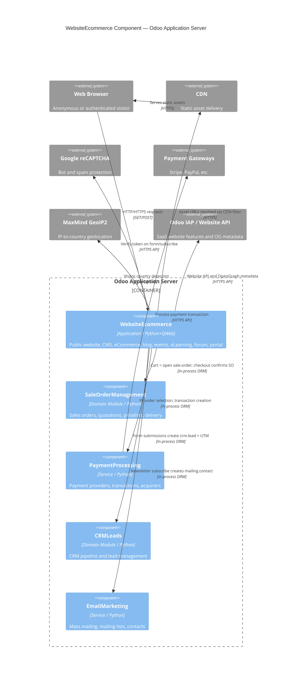

# C4 Component Level: WebsiteEcommerce

<!--
  Auto-generated by the c4-component agent. One file per logical component.
  Refreshed on /banyan-c4 reruns when constituent code docs change.
-->

## Generated By

- **Agent**: c4-component (Sonnet)
- **Run ID**: banyan-c4-20260701-init
- **Generated**: 2026-07-01T00:00:00Z
- **Constituent Code Docs**: 13 files — see [Code Elements](#code-elements)

## Overview

- **Name**: WebsiteEcommerce
- **Description**: Odoo's public-facing website platform: CMS, eCommerce storefront, blog, events, eLearning, community forum, customer portal, and supporting engagement features (wishlist, comparison, newsletter, live payment).
- **Type**: Application
- **Technology**: Python 3 / Odoo ORM, QWeb server-side templates, OWL (client-side), SCSS/Bootstrap, Werkzeug/WSGI

## Purpose

WebsiteEcommerce owns everything a browser (anonymous or authenticated) sees when it reaches an Odoo-hosted domain. It handles multi-website hosting (one Odoo instance, many domains), CMS page management with a drag-and-drop snippet editor, a full B2C eCommerce storefront where a customer's cart is an open `sale.order`, public content channels (blog, events, eLearning courses, Q&A forum), and authenticated customer portal pages for self-service access to orders and invoices.

Multi-language URL routing, SEO slug generation, and CDN asset delivery are also owned here, as they are prerequisites for every public HTTP request this component handles. Out of scope: backend CRM pipeline management, inventory and warehouse operations, accounting ledger, and employee-facing HR flows — those are separate components.

## Software Features

- **Multi-Website CMS**: Host multiple independent websites from one Odoo instance, each with its own domain, language set, navigation menu, and published pages managed through a drag-and-drop snippet editor.
- **eCommerce Storefront**: Product catalog with faceted search, per-website pricelists, product variant configurator, shopping cart (open `sale.order`), checkout, delivery carrier selection, and post-purchase order tracking.
- **Customer Wishlist and Comparison**: Shoppers can save products to a personal wishlist for later purchase and compare up to N products side-by-side using attribute-category comparison tables.
- **Content Publishing (Blog)**: Multi-blog publishing platform with categories, tags, comments, social sharing widgets, SEO sitemap entries, and email notifications for new posts.
- **Events and Ticketing**: Public event listings with free or paid ticket registration, attendee portal, countdown timers, speaker/sponsor display, and post-event analytics.
- **eLearning Courses**: Online course catalog with lesson player (PDF, video, image), quizzes, completion tracking, student progress gamification, and certification workflows.
- **Community Forum**: Q&A forum engine with voting, tag-based organisation, reputation/karma scoring, and moderation tools.
- **Customer Portal**: Token-secured portal pages at `/my/*` giving customers self-service access to their sales orders, invoices, and other shared documents; includes document-sharing via UUID access tokens and chatter commenting.
- **Multi-Language Routing and SEO**: Transparent `/en/`, `/fr/` URL prefixing, slug-based record URLs (e.g., `/shop/my-product-42`), automatic 301 redirects for canonical slugs, bot-aware language detection, and sitemap generation.
- **Newsletter Subscription**: Drag-and-drop subscription snippets wired to Email Marketing mailing lists, with reCAPTCHA protection and opt-in/opt-out management.
- **Website-Scoped Payment**: Payment provider filtering per website; donation payment workflow with email notifications; Stripe Connect onboarding support.

## Code Elements

This component is composed of the following code-level docs:

- [`code/c4-code-addons-website.md`](../code/c4-code-addons-website.md) — Core multi-website CMS engine: `website` model, pages, menus, visitor tracking, snippet filters, URL rewrites, sitemap, SEO metadata mixin
- [`code/c4-code-addons-website_sale.md`](../code/c4-code-addons-website_sale.md) — eCommerce storefront: product catalog, cart, checkout, pricelist overrides, product configurator, delivery integration, ratings
- [`code/c4-code-addons-website_sale_wishlist.md`](../code/c4-code-addons-website_sale_wishlist.md) — Customer wishlist: `product.wishlist` model, add/remove/view controllers, abandoned-item reminder hooks
- [`code/c4-code-addons-website_sale_comparison.md`](../code/c4-code-addons-website_sale_comparison.md) — Product comparison: session-managed comparison list, attribute-category rendering, `/shop/compare` controller
- [`code/c4-code-addons-website_blog.md`](../code/c4-code-addons-website_blog.md) — Blog/content publishing: `blog.post`, categories, tags, comments via `mail.thread`, social sharing, RSS
- [`code/c4-code-addons-website_event.md`](../code/c4-code-addons-website_event.md) — Public event pages: event listing, registration form, ticket purchase, attendee portal, countdown widgets
- [`code/c4-code-addons-website_slides.md`](../code/c4-code-addons-website_slides.md) — eLearning: course/lesson management (`slide_channel`, `slide_slide`), quiz player, completion tracking, gamification karma, certification
- [`code/c4-code-addons-website_forum.md`](../code/c4-code-addons-website_forum.md) — Community forum: `forum.forum`, `forum.post`, `forum.tag`, karma/reputation system, moderation
- [`code/c4-code-addons-website_crm.md`](../code/c4-code-addons-website_crm.md) — Contact-form-to-CRM bridge: web form submissions → `crm.lead` creation, UTM attribution, duplicate-lead merging
- [`code/c4-code-addons-website_mass_mailing.md`](../code/c4-code-addons-website_mass_mailing.md) — Newsletter subscription: `MassMailController`, `/website_mass_mailing/subscribe` endpoint, reCAPTCHA, mailing list management
- [`code/c4-code-addons-website_payment.md`](../code/c4-code-addons-website_payment.md) — Website payment bridge: per-site `payment.provider` filtering, donation transaction workflow, donation confirmation emails
- [`code/c4-code-addons-http_routing.md`](../code/c4-code-addons-http_routing.md) — Multi-lang HTTP routing foundation: `IrHttp` with 9-step language resolution, `_slug()`/`_unslug()`, URL rewriting cache, frontend error pages
- [`code/c4-code-addons-portal.md`](../code/c4-code-addons-portal.md) — Customer portal infrastructure: `PortalMixin` (UUID access tokens, shareable URLs), `CustomerPortal` base controller, pagination utilities

## Interfaces

### Public HTTP — CMS and Content Pages

- **Protocol**: HTTP/HTTPS (QWeb server-side rendering)
- **Description**: All publicly browsable pages — CMS pages, blog posts, event listings, course catalog, forum threads
- **Operations**:
  - `GET /<lang>/<page-slug>` — Serve a CMS page or snippet-based landing page
  - `GET /blog`, `GET /blog/<blog>/<slug>` — Blog listing and post detail
  - `GET /event`, `GET /event/<slug>/register` — Event listing, detail, and registration form
  - `GET /slides`, `GET /slides/<channel>` — eLearning course catalog and channel page
  - `GET /forum`, `GET /forum/<slug>/<post-slug>` — Forum listing and post detail
- **Contract**: QWeb templates in each addon's `views/` directory; no OpenAPI schema (HTML rendering)

### Public HTTP — eCommerce Shop

- **Protocol**: HTTP/HTTPS + JSON (cart mutations, comparison, wishlist)
- **Description**: Product catalog, cart interactions, checkout flow, and conversion utilities
- **Operations**:
  - `GET /shop`, `GET /shop/<product-slug>` — Product listing and product detail
  - `POST /shop/cart/update` — Add/remove product from cart (JSON)
  - `GET /shop/checkout` — Checkout page (address, delivery, payment)
  - `GET /shop/compare` — Side-by-side product comparison page
  - `POST /shop/get_product_data` — Product card data for comparison table (JSON)
  - `POST /shop/wishlist/add`, `POST /shop/wishlist/remove` — Wishlist management (JSON)
- **Contract**: QWeb templates + `website_sale` JS frontend assets; no OpenAPI schema

### Public HTTP — Newsletter Subscription

- **Protocol**: HTTP/JSON
- **Description**: Visitor newsletter subscription endpoints consumed by inline snippet forms
- **Operations**:
  - `POST /website_mass_mailing/is_subscriber` — Check if email/phone is already subscribed → `dict`
  - `POST /website_mass_mailing/subscribe` — Subscribe to a mailing list with reCAPTCHA verification → `dict`
- **Contract**: In-process; see `addons/website_mass_mailing/controllers/main.py`

### Public HTTP — Payment and Donations

- **Protocol**: HTTP/JSON
- **Description**: Website-scoped payment method selection and donation transaction creation
- **Operations**:
  - `GET /payment/pay` — Payment portal with website-filtered providers
  - `GET /payment/method` — Payment method management for current website
  - `GET /donation/pay` — Donation payment form
  - `POST /donation/transaction/<minimum_amount>` — Create donation transaction → `dict`
- **Contract**: Extends `account_payment.PaymentPortal`; see `addons/website_payment/controllers/`

### Authenticated HTTP — Customer Portal

- **Protocol**: HTTP/HTTPS (QWeb rendering, token-validated)
- **Description**: Authenticated and token-shared self-service portal for customers to view their documents
- **Operations**:
  - `GET /my` — Portal home (orders, invoices, events summary)
  - `GET /my/orders`, `GET /my/orders/<id>` — Sales order list and detail (extended by `sale` module)
  - `GET /my/invoices`, `GET /my/invoices/<id>` — Invoice list and detail (extended by `account` module)
  - Shareable URL pattern: `GET /my/<document>?access_token=<uuid>` — public link sharing without login
- **Contract**: `PortalMixin._get_share_url()` / `CustomerPortal`; see `addons/portal/`

### Multi-Language Routing (HTTP Infrastructure)

- **Protocol**: HTTP (transparent redirect / URL rewrite layer)
- **Description**: Language prefix handling, slug generation, and translation bundle serving — invoked on every request before controllers dispatch
- **Operations**:
  - `GET /website/translations/<unique>` — Translation bundle for active frontend modules
  - Automatic: lang-prefix redirect, slug canonicalization 301 redirects
- **Contract**: `IrHttp._match()` 9-step routing logic; see `addons/http_routing/models/ir_http.py`

### In-Process — Portal Mixin API

- **Protocol**: In-Process Function
- **Description**: Mixin API for any Odoo model that needs customer-facing portal access
- **Operations**:
  - `PortalMixin._portal_ensure_token() → str` — Get/create UUID access token
  - `PortalMixin._get_share_url(...) → str` — Build shareable external URL
  - `PortalMixin.get_portal_url(...) → str` — Build portal URL with optional parameters
  - `PortalMixin._get_access_action(...) → dict` — Determine form vs. portal action based on user type
  - `pager(url, total, page, step, scope, url_args) → dict` — Template pagination utility
- **Contract**: In-process; see `addons/portal/controllers/portal.py` and `addons/portal/models/portal_mixin.py`

### In-Process — Slug / URL Template Helpers

- **Protocol**: In-Process Function
- **Description**: QWeb template context helpers injected by `IrQweb` for URL generation in all frontend templates
- **Operations**:
  - `slug(record) → str` — Generate SEO-friendly slug for a record
  - `url_for(url, lang_code) → str` — Adapt URL for a target language
  - `url_localized(url, lang_code, ...) → str` — Fully qualified localized URL
- **Contract**: In-process; injected by `IrQweb._prepare_frontend_environment()`; see `addons/http_routing/models/ir_qweb.py`

## Dependencies

### Components Used (in-process or in-system)

- **SaleOrderManagement** — Cart = open `sale.order`; checkout converts to confirmed SO; pricelist engine and delivery carrier selection delegate to this component. Cross-component refs verified by master-index pass.
- **PaymentProcessing** — `website_payment` filters `payment.provider` records by `website_id`; donation and checkout transactions pass through the payment provider abstraction. Cross-component refs verified by master-index pass.
- **EmailMarketing** — `website_mass_mailing` creates/updates `mailing.contact` and `mailing.subscription` records owned by the Email Marketing component. Cross-component refs verified by master-index pass.
- **CRMLeads** — `website_crm` creates `crm.lead` records and applies UTM attribution tracked by the CRM component. Cross-component refs verified by master-index pass.
- **EventManagement** — `website_event` extends `event.event` and `event.registration` models owned by the backend event component. Cross-component refs verified by master-index pass.
- **ProductCatalog** — Product template, variant, attribute, and pricelist models are defined in the `product` / `sale` addons and extended here for website display and comparison. Cross-component refs verified by master-index pass.
- **MailMessaging** — Blog comments, forum notifications, event confirmations, and portal chatter all delegate to `mail.thread` / `mail.message`. Cross-component refs verified by master-index pass.

### External Systems

- **PostgreSQL** — Primary data store for all models; accessed exclusively via Odoo ORM (psycopg2 adapter under the hood)
- **Google reCAPTCHA** — Spam protection for newsletter subscription forms and website contact forms (via `google_recaptcha` addon)
- **Payment Providers (Stripe, PayPal, etc.)** — External payment gateways invoked at checkout and for donations; provider identity is per-website (`website_id` on `payment.provider`)
- **Odoo IAP / Website API** (`https://website.api.odoo.com`) — External SaaS endpoint called for website-level features (e.g., translation updates, CDN helpers)
- **OpenGraph API** (`https://olg.api.odoo.com`) — External endpoint for OG metadata enrichment on shared content
- **MaxMind GeoIP2** — IP geolocation library used to detect visitor country for analytics and language hints
- **CDN (optional)** — Static assets served through CDN when `DEFAULT_CDN_FILTERS` patterns match; configured per website instance

## Component Diagram

## Notes for Higher-Level Synthesis

- **Likely deployment**: Same container as the Odoo Application Server. All `website_*` addons are standard Odoo modules loaded into the single Odoo worker process. There is no separate web-tier container — the same Odoo server that handles backend ERP requests also serves public website traffic. Gunicorn/gevent workers handle concurrent public requests. The component does not run as a standalone process.
- **Public traffic boundary**: This component is the first logical recipient of every inbound HTTP request from the internet. The Nginx/reverse-proxy layer in front passes requests to the Odoo WSGI app; `IrHttp._match()` (from `http_routing`) is the first Odoo code to execute on each request.
- **Cross-container traffic**: None detected. All inter-component calls are in-process ORM calls within the same Odoo application server container. Payment gateway calls (Stripe, PayPal) are outbound HTTPS from this container. CDN and GeoIP calls are also outbound HTTPS/library calls.
- **Multi-website isolation**: The `website_id` field on pages, menus, visitors, providers, and products is the primary multi-tenancy key at this level. A single Odoo instance can serve multiple distinct public websites with different domains, languages, and product catalogs.
- **Cart model**: The eCommerce shopping cart is not a dedicated model — it is an open `sale.order` with `website_id` set and `state = 'draft'`. Checkout transitions it to `state = 'sale'`. The c4-container agent should note this cross-component state coupling.
- **SEO and sitemap**: `WebsiteRewrite`, `website.seo.metadata` mixin, `_slug()`/`_unslug()` from `http_routing`, and per-module sitemap overrides together form the SEO infrastructure. Any refactor of URL patterns must account for all three layers.
